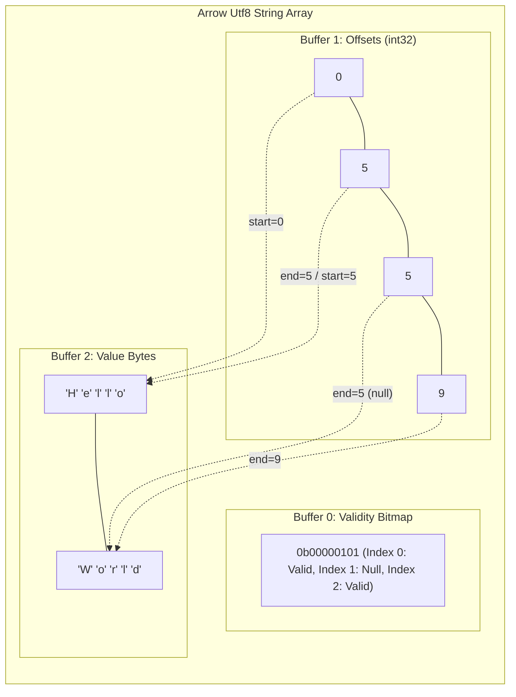
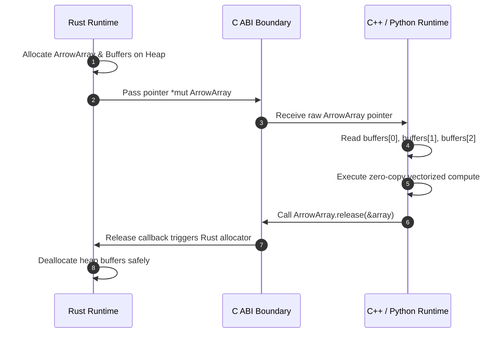

Data movement kills analytical performance. When Python calls a C++ extension, or when a Rust microservice passes columnar data to a C# process, developers spend vast amounts of time serializing memory formats. Row-oriented object representations like Python object pointers or C# class instances scatter data across the heap. Navigating pointers forces pointer chasing through CPU L1 and L2 caches, causing pipeline stalls and rendering SIMD vector processing impossible.

Traditional IPC formats like JSON, Protocol Buffers, or Apache Avro mandate parsing steps. Every single byte must be unpacked, field by field, and transformed into target runtime object allocations. Apache Arrow attacks this tax by standardizing how data lives inside physical RAM before any compute happens. By agreeing on a universal, flat, contiguous columnar memory spec, runtimes skip serialization altogether. Python, C++, Java, Rust, and .NET can read the exact same raw memory address without allocating dynamic wrappers or performing field copies.

Arrow arrays do not hold objects. They consist of raw, byte-aligned memory buffers. Every array requires two or three contiguous allocations depending on the underlying data type. Every single allocation is strictly aligned to 64-byte boundaries. Alignment ensures that CPU vector units like AVX-2, AVX-512, or ARM NEON load entire cache lines directly into SIMD registers without unaligned memory access penalties.

Primitive arrays like 64-bit integers use two buffers. The first buffer is a validity bitmap where each bit represents whether the corresponding array element is valid or null. A single byte holds validity bits for eight elements, ordered least significant bit first. If slot zero is valid and slot one is null, byte zero ends with binary patterns ending in one and zero. Arrow uses raw bit-masking operations to evaluate nulls rather than wasting full bytes or using sentinel values like NaN or negative integers that corrupt numerical processing.

Variable-length binary and string arrays require three buffers. The first buffer is the validity bitmap. The second buffer is an offset buffer storing 32-bit or 64-bit signed integers. The third buffer is a contiguous byte payload holding string bytes stacked back-to-back without null terminators or length prefixes. To read a string at index three, Arrow fetches offset three and offset four from the second buffer. The slice from offset three to offset four in the third buffer represents the exact string bytes. Slicing string data becomes a zero-copy pointer calculation rather than a heap allocation.

Nested data structures follow identical zero-allocation mechanics. A List array relies on an offset buffer pointing into a contiguous child array. A Struct array eliminates offset buffers completely, placing child arrays side-by-side while sharing a parent validity bitmap. Flattening complex domain models into modular memory buffers means nested analytical structures map cleanly into physical memory pages without deep pointer graph traversals.

Storing repetitive text strings across millions of rows destroys memory bandwidth. Arrow addresses string duplication through dictionary encoding without breaking its zero-copy layout guarantees. Dictionary arrays decouple physical byte values from structural index positions.

A dictionary-encoded field splits data into two distinct sub-arrays. The first sub-array is a dictionary containing unique distinct values stored as a standard Utf8 array. The second sub-array is an index array storing small unsigned integers like 8-bit or 16-bit integers referencing offset indexes within the dictionary array.

When analytical query engines execute operations like filtering or group-by aggregations on dictionary-encoded columns, SIMD instructions process tiny 8-bit index integers directly. The engine only resolves the actual string payloads when materializing final results. CPU cache locality improves dramatically because millions of row references fit inside L2 cache, eliminating dynamic memory lookups across scattered string payloads.

Prior to Arrow, cross-language interoperability required building complex C++ C-extensions or using socket-based IPC frameworks. The Arrow C Data Interface eliminates runtime coupling entirely by defining two simple, C-ABI compliant structs. Any runtime that can interact with standard C pointers can produce or consume Arrow memory buffers without linking against C++ libraries or using shared runtimes.

The primary structure is ArrowArray. It acts as an exported memory view containing raw pointer handles and execution metadata. The struct exposes explicit integer fields for length, null count, offset, buffer count, and child count. It includes a void double-pointer array pointing directly to physical buffer memory addresses in RAM.

Memory ownership across foreign language boundaries presents severe safety hazards. If C++ attempts to free heap memory allocated by Rust's allocator, allocator state corruption occurs immediately. Arrow solves cross-language memory ownership through the release callback field embedded within the ArrowArray struct itself.

When a producer runtime allocates memory and populates an ArrowArray, it attaches a custom release C function pointer to the struct. The consumer runtime processes the buffer pointers directly. Once the consumer finishes reading the array, it invokes array.release(&array). This transfers control back to the producer's native allocator code path, executing memory reclamation safely within the runtime that originally allocated the RAM.

Columns alone are insufficient for tabular pipelines. Real-world analytical applications deal with records containing multiple typed columns. Arrow introduces Record Batches to group equal-length arrays under a unified schema. A Record Batch represents a chunk of tabular data stored in contiguous columnar memory, designed for streaming execution pipelines.

Streaming data between processes requires minimal header overhead. Arrow uses FlatBuffers to encode schema metadata, dictionary batch metadata, and buffer offset locations. FlatBuffers schemas can be read directly from raw byte streams without unpack or decode steps.

To stream a Record Batch over a network or Unix domain socket, Arrow writes the FlatBuffer metadata header followed immediately by raw physical memory buffers padded to 64-byte boundaries. The receiver maps the byte stream directly using mmap or DMA ring buffers. Reading column zero requires taking the buffer address from the FlatBuffer message header and casting the pointer straight into a typed array wrapper. There are no row loops, zero field parsing routines, and zero runtime copy operations. Data moves at wire speed directly into CPU registers.
