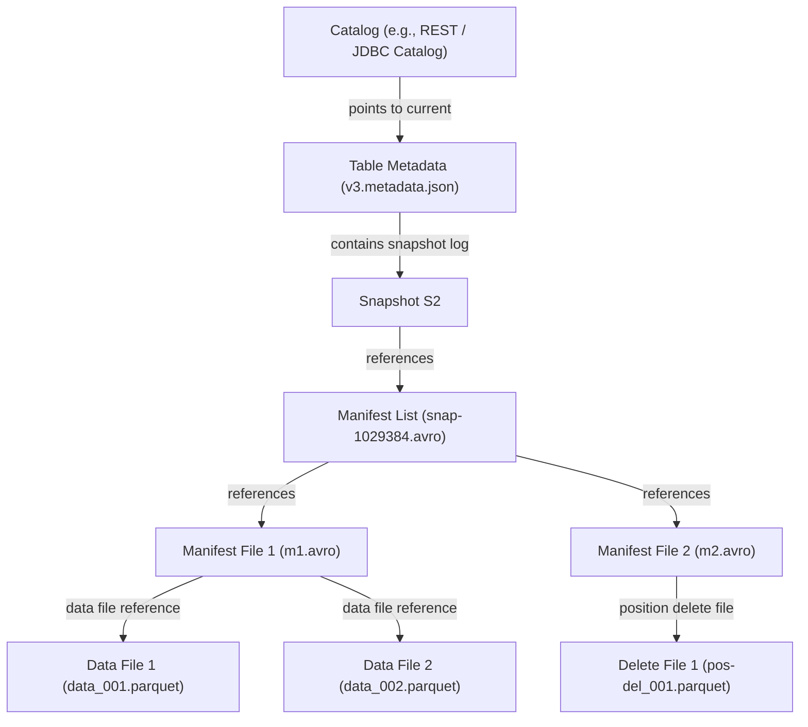
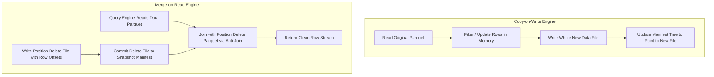

The early days of big data analytics relied on Hive metastore pattern layouts where physical object storage directories dictated table structure. In a Hive layout, partitioning by date meant placing data into nested folder hierarchies like `s3://bucket/table/year=2026/month=03/day=30/data.parquet`. Query engines answered queries by issuing S3 directory listing commands to discover which files lived inside target directories. This design worked acceptably when datasets were modest, but failed catastrophically at cloud scale.

Object storage services like AWS S3 do not have real filesystem directories. Directory listings are synthetic prefix scans that incur huge latency penalties as file counts grow into millions. Hive metastore state mutations required updating relational database records that tracked folder locations while mutating files in object storage, creating distributed systems nightmare scenarios where crashes led to data corruption, missing files, or uncommitted partial writes. Concurrent writes required coarse distributed locks, bottlenecking pipeline throughput.

Apache Iceberg was built to replace directory-based table tracking with explicit, immutable metadata trees stored directly in object storage. By shifting from physical directory layouts to manifest-driven metadata structures, Iceberg turned table commits into atomic pointer swaps, unlocked time-travel queries, and solved schema and partition evolution once and for all.

Iceberg isolates reading and writing through a four-tier hierarchical tree structure of metadata files stored alongside table data in object storage. At the top of this hierarchy sits the catalog pointer. The catalog can be backed by a relational database, an enterprise REST endpoint, or a cloud catalog like AWS Glue. The catalog holds a single reference: an atomic pointer to the current Table Metadata JSON file.

When a query engine opens an Iceberg table, it asks the catalog for the latest table metadata path. This metadata JSON file contains the complete historical lineage of the table, including current and past schemas, partition specifications, custom table properties, and a snapshot log tracking every commit in table history. Each snapshot entry in the metadata file points directly to a Manifest List file.

The Manifest List is an Avro-formatted file that encapsulates a snapshot. It enumerates all Manifest Files that comprise that specific state of the table. The Manifest List does not just list files. It stores critical summary stats for each manifest, including the partition spec ID, added file counts, deleted file counts, and lower and upper metric bounds for partition fields across all files governed by that manifest.

At the bottom layer of the metadata tree sit the Manifest Files themselves. Also encoded in Avro, a Manifest File contains individual entries for physical data files, typically Parquet or ORC, along with delete files. Each manifest entry details the file path, physical file size, record count, and per-column metric bounds including null counts, NaN counts, min values, and max values.

Snapshot isolation guarantees that readers always observe a completely isolated, consistent state of the table regardless of concurrent background writes or compaction operations. Writers never modify existing metadata or data files in place. Every mutation operation, whether an append, delete, overwrite, or rewrite, produces an entirely new immutable snapshot.

When a writer engine like Spark or Trino executes a write pipeline, it writes new data files directly to object storage. Once data files are staged, the engine creates new Manifest Files referencing those data files, packages those manifests into a new Manifest List, and generates a candidate Table Metadata JSON file.

The actual transaction commit occurs at the catalog level using an optimistic concurrency control mechanism. The catalog executes a compare-and-swap operation on the table pointer. If no other transaction updated the table pointer while the writer was working, the swap succeeds, and the new snapshot becomes instantly visible to new readers. Existing readers holding older metadata JSON references continue scanning historical snapshots uninterrupted without holding table locks.

If two writers attempt to commit concurrently, the second transaction fails its initial compare-and-swap check. Iceberg does not simply crash and abort the failed operation. Instead, the engine inspects the operational dependencies of the winning transaction against the losing transaction. If the losing transaction appended data that does not conflict with data files modified or deleted by the winning transaction, the engine re-bases its commit on top of the newly committed snapshot, regenerates the metadata JSON file, and attempts the compare-and-swap pointer swap again.

In legacy Hive architectures, table partition layouts were exposed directly to end users as physical folder structures. If users queried a table partitioned by day, they had to explicitly include partition filters like `WHERE year = 2026 AND month = 3 AND day = 30` alongside their logical filters like `WHERE event_timestamp >= '2026-03-30 00:00:00'`. If engineers later decided daily partitioning created too many tiny files and wanted to switch to monthly partitioning, every past data file had to be rewritten into new directory paths, breaking existing user queries.

Iceberg solves this problem through hidden partitioning and partition transforms. Users write queries using logical business fields, such as `WHERE event_timestamp >= '2026-03-30 00:00:00'`, and Iceberg transforms those timestamps into partition buckets automatically during query planning using explicit functions like `day(event_timestamp)`, `hour(event_timestamp)`, or `bucket(16, user_id)`.

Because partition metadata is stored explicitly inside Manifest List and Manifest File Avro headers rather than inferred from folder names, an Iceberg table can evolve its partition layout without rewriting historical data. Old data files remain referenced by manifests that record partition spec ID zero, while new data files created after a partition migration carry partition spec ID one. When query engines process a table scan, they evaluate predicate bounds against each file using its corresponding partition spec, completely shielding end users from physical storage organization changes.

Query planning in Iceberg converts incoming SQL predicates into aggressive metadata filtering before reading data bytes from storage. The planning engine evaluates filtering conditions across a multi-stage pipeline.

First, the engine parses the current Table Metadata file to locate the active Manifest List. It iterates over manifest metadata entries in the Manifest List, evaluating predicate expressions against the aggregate partition bounds stored inside the manifest summary. If a manifest covers partition ranges that fall outside the query predicate boundaries, the entire manifest file is pruned from execution, preventing thousands of S3 HTTP requests.

Second, for all manifests that pass the manifest-level pruning phase, the engine opens the Avro Manifest Files in parallel. It checks column-level summary statistics stored for each data file entry. Iceberg records per-column lower and upper boundaries, null counts, and NaN counts inside the manifest entry. If a query filters for `user_id = 89123`, and a data file's manifest entry indicates the minimum `user_id` in that Parquet file is `100000` and the maximum is `200000`, the engine drops that data file path from the execution scan list.

By performing these two metadata pruning passes in memory using compact Avro metadata, Iceberg reduces millions of potential S3 object reads down to exact Parquet file byte ranges, bypassing the overhead of S3 prefix listings entirely.

Deleting or updating rows in immutable columnar formats like Parquet presents a fundamental trade-off between write amplification and read amplification. Object storage systems do not support updating individual bytes within an existing file. To modify or delete a row, an engine must handle immutable files via one of two strategies: Copy-on-Write or Merge-on-Read.

Copy-on-Write favors read efficiency at the expense of write throughput. When an engine receives a delete or update request under Copy-on-Write mode, it identifies all Parquet files containing target rows, reads those entire files into memory, removes or updates matching records, and writes brand-new Parquet files containing the updated state. The engine then commits a new snapshot whose manifest swaps references from the old data files to the newly written data files. Copy-on-Write yields zero overhead at query time because data files contain only valid, active records. Modifying a single row inside a multi-gigabyte Parquet file forces the writer to rewrite gigabytes of unaffected data, creating massive write amplification.

Merge-on-Read prioritizes fast write ingestion by shifting mutation work to the query engine. Instead of rewriting Parquet data files during mutation pipelines, Merge-on-Read writes small, specialized delete files alongside unchanged data files and commits them to the snapshot manifest.

Merge-on-Read supports two delete file formats: Position Delete Files and Equality Delete Files. Position Delete Files store explicit references containing target data file paths along with exact row offset ordinals where deleted records reside. During query execution, the engine opens data files and position delete files simultaneously, applying an anti-join or bitmap filter in memory to drop deleted rows at specified positions on the fly.

Equality Delete Files store attribute values rather than row positions, specifying conditions such as `status = 'DELETED'` or `user_id = 9012`. When executing reads, the query engine evaluates equality delete values against streams of incoming data rows using hash-join operators. While Equality Delete Files allow ultra-fast streaming ingestion without preliminary data scanning, they impose heavy read amplification because query engines must build large hash sets in memory to evaluate equality conditions across all scanned rows.

Allowing Merge-on-Read delete files to accumulate indefinitely degrades query performance, as engines spend increasing amounts of CPU time executing runtime anti-joins across hundreds of small delete files. Iceberg manages this operational debt through asynchronous compaction background jobs.

Compaction operations run as separate maintenance workloads using frameworks like Spark or Flink. A compaction job reads fragmented Parquet data files along with associated Position and Equality Delete Files, merges them into unified row streams in memory, and writes out fresh, optimized Parquet files free of deleted records. The job then issues an atomic snapshot commit that replaces old data files and delete files with new consolidated data files within table manifests.

Because snapshots are immutable and preserved for historical time-travel queries, old metadata JSON files, manifest files, and unreferenced Parquet files persist in storage long after new snapshots are committed. Iceberg provides automated garbage collection procedures to reclaim disk space. The metadata cleanup engine identifies expired snapshots based on retention policies, constructs bloom filters or hash sets of all active data and manifest files across surviving snapshots, and executes parallel delete calls against unreferenced physical objects in object storage, preventing orphan file accumulation.
