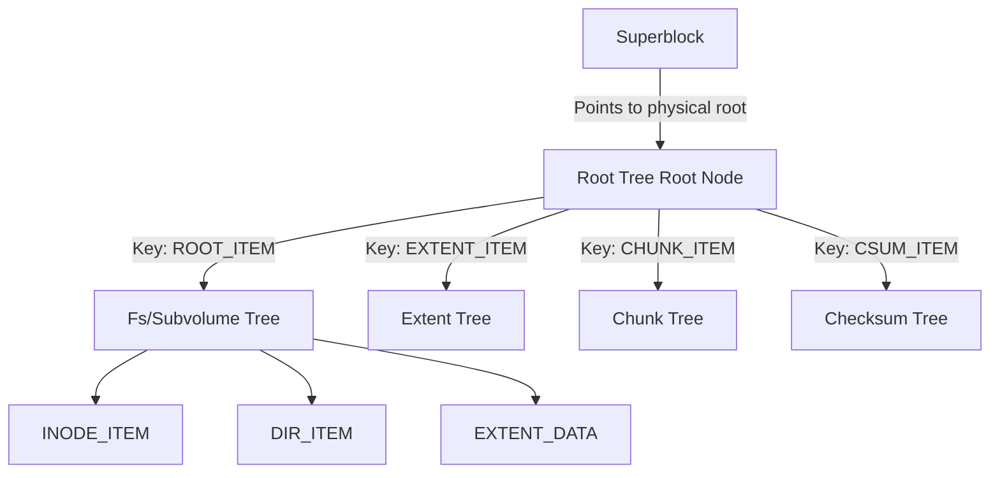
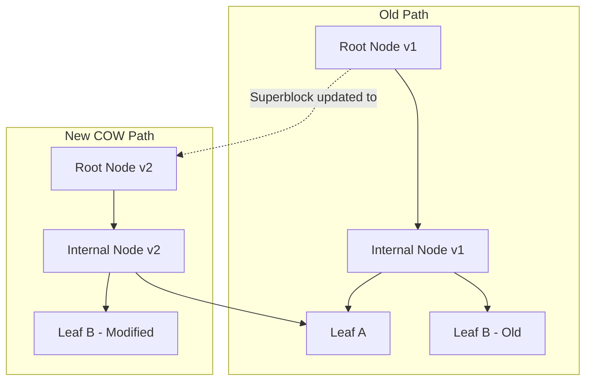
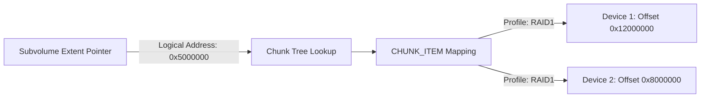

Most traditional filesystems organize disk storage using isolated data structures. Ext4 uses fixed inode tables, block allocation bitmaps, and extent trees patched together by a POSIX interface, backing changes with a distinct write-ahead journal. Btrfs takes a completely different architectural approach. It replaces disconnected allocation maps and metadata tables with a single generalized B-tree structure, recursively instantiating specialized trees inside a parent root tree to manage every aspect of the filesystem.

Understanding Btrfs requires abandoning the idea that file metadata and allocation accounting live in separate disk structures. In Btrfs, subvolume filesystems, free space tracking, physical allocation maps, extent refcounts, and data checksums are all just key-value instances inside distinct B-tree instances. Every state change in the filesystem flows through copy-on-write node mutations, eliminating the need for traditional block journaling while unlocking instant subvolume snapshotting.

### The Unified Tree-of-Trees Layout

At the foundation of Btrfs is the Superblock. Located at fixed physical offsets on disk (typically 64 KiB, 64 MiB, and 256 GiB for redundancy), the superblock contains filesystem UUIDs, block size declarations, and most importantly, the physical location of the Root Tree. The Root Tree acts as the master catalog for all other internal trees in the system.

Instead of hardcoding disk offsets for specialized features, Btrfs queries the Root Tree to find the root nodes of operational trees. The Subvolume Tree holds standard directory structures and inode entries for user data. The Extent Tree tracks physical block allocations, backreferences, and reference counts. The Chunk Tree translates 64-bit virtual logical addresses into physical device offsets across single or multi-device configurations. The Checksum Tree stores CRC32c or XXHASH64 hashes for data validation. Finally, the Free Space Tree tracks allocatable extent runs for physical block groups.

Because every operational tree uses the exact same B-tree implementation, the kernel code path for inserting, deleting, or searching keys remains identical regardless of whether the system is writing a file extent or registering a multi-disk RAID chunk allocation.

### Btrfs Disk Key Anatomy and Universal Search

Every item stored in any B-tree leaf node in Btrfs is indexed by a 17-byte key structure containing three fields: objectid, item type, and offset. This triplet establishes total ordering across all nodes in the filesystem.

The objectid is a 64-bit unsigned integer representing the logical entity being indexed. For file trees, the objectid is the inode number. For the Root Tree, the objectid identifies specific subvolumes or system trees. The item type is an 8-bit identifier defining what structural payload follows the key. Common types include INODE_ITEM (0x01) for POSIX inode attributes like permissions and modification times, DIR_ITEM (0x54) for directory entries, and EXTENT_DATA (0x6c) for file extent pointers.

The offset field is a 64-bit unsigned integer whose meaning changes depending on the item type. For an INODE_ITEM, offset is set to zero. For a DIR_ITEM, offset holds a hash of the filename for fast lookups. For an EXTENT_DATA item, offset represents the exact byte offset of the file payload within the file itself.

To read a specific block of a file at logical offset 4096, the kernel constructs a target key with the file inode number as objectid, EXTENT_DATA as type, and 4096 as offset. It passes this key to a single generic search function. The search algorithm descends the target subvolume tree, comparing keys at internal nodes until it lands on the leaf node containing the matching key-payload pair.

### Copy-on-Write Path Cloning Mechanics

Btrfs handles writes using pure Copy-on-Write (COW) path cloning. When a block of data or metadata changes, Btrfs never overwrites existing sectors on disk. Doing so would risk metadata corruption in the event of sudden power loss. Instead, it allocates a new physical block, writes the updated content, and updates the parent pointer.

When a leaf node in a subvolume tree requires an update, such as when appending data to a file, the allocation path reserves a new extent. The modified leaf content is written to this fresh extent. Because the leaf node now lives at a new disk location, its parent node inside the B-tree contains a stale pointer. The engine clones the parent internal node into another newly allocated block, updating the pointer to point to the newly written leaf node.

This path-cloning process cascades up the tree level by level until it hits the root node of that specific tree. Once the tree root is updated, Btrfs updates the corresponding entry in the Root Tree, triggering a similar COW cascade in the Root Tree itself. The operation completes atomically when the filesystem writes an updated Superblock pointing to the new Root Tree anchor point during a transaction commit.

Old nodes remain untouched on disk until reference counting confirms no snapshots or active read paths still depend on them. If power cuts out mid-transaction, the Superblock still references the previous uncorrupted Root Tree, making filesystem corruption impossible without requiring traditional log recovery phase passes.

### Logical to Physical Translation: The Chunk Tree

Btrfs decouples logical block addresses from physical block allocations on disk through a two-stage mapping architecture managed by the Chunk Tree. Internal tree nodes do not store physical device sector offsets. Instead, key offsets and extent pointers in subvolume trees use unified 64-bit logical virtual addresses.

When a B-tree search returns a file extent mapped to logical address 0x5000000, the kernel must translate this address into a concrete physical device and byte location. It performs a lookup in the Chunk Tree using the logical address as the key offset.

Chunk Tree entries map logical address ranges to Chunk Maps. A chunk represents a large block of contiguous space, typically 1 GiB for data or 256 MiB for metadata. The chunk mapping entry contains the chunk length, storage profile type such as Single, DUP, RAID0, RAID1, RAID5, or RAID6, and an array of physical stripe descriptors. Each stripe descriptor records the target storage device ID and the physical byte offset on that device.

This abstraction layer yields massive operational advantages. Rebalancing a multi-disk array, migrating data off a failing disk, or converting a live filesystem from RAID0 to RAID1 merely requires copying chunk physical backing blocks and updating the Chunk Tree entries. The logical addresses stored in millions of file metadata leaves across all subvolume trees remain completely unchanged.

### Subvolumes and Instant Snapshots

Subvolumes in Btrfs are independent filesystems residing within the master storage pool. Every subvolume is assigned its own unique 64-bit objectid inside the Root Tree. The entry in the Root Tree points directly to the root node block of the subvolume tree.

Creating a snapshot of a subvolume is a metadata-only operation that completes in O(1) time complexity. To snapshot Subvolume A into Subvolume B, the engine creates a new ROOT_ITEM entry in the Root Tree for Subvolume B. It copies the root node pointer from Subvolume A directly into the root entry for Subvolume B. At this exact instant, Subvolume A and Subvolume B share the exact same root node on disk.

No file extents, directory items, or leaf nodes are copied during snapshot creation. As users modify files inside Subvolume B, the COW engine allocates new leaf nodes along the modified path, breaking shared pointers node by node. Unmodified paths across both subvolumes continue sharing the exact same physical metadata and data extents infinitely without duplication.

### Extent Reference Accounting and Storage Reclaim

Because snapshots share extents across multiple tree roots, Btrfs cannot determine whether a block is free simply by deleting a reference in one subvolume. It tracks physical extent lifecycles via the Extent Tree.

For every contiguous run of logical bytes allocated on disk, the Extent Tree records an EXTENT_ITEM key. This item maintains an explicit 32-bit reference counter along with inline backreferences. Backreferences store the objectid of the owning tree, the inode number, and the offset of the parent node referencing the extent.

When a file is deleted in a subvolume, the engine traverses the file extent pointers and decrements the reference count inside the Extent Tree for each target logical range. The physical chunk space is not added to the free space tracking structures until the extent reference count reaches exactly zero.

If three snapshots point to the same 1 GiB video file, deleting the file in two of the snapshots decrements the refcount from 3 to 1. The underlying physical extent remains allocated and active. Only when the third snapshot deletes the file reference does the refcount drop to 0, triggering the Extent Tree to remove the EXTENT_ITEM and return the extent space to the Free Space Tree for future allocations.
