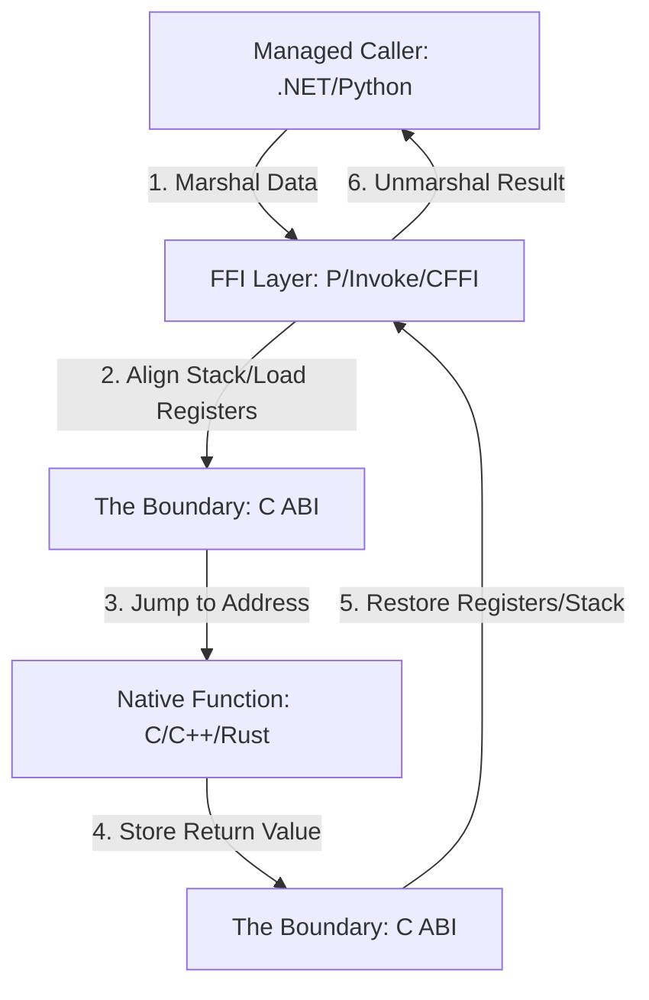

Every time you use a Python library like NumPy or a .NET package that wraps a high performance graphics engine, you are relying on a fragile but essential contract known as the C Application Binary Interface. High level runtimes are great for developer productivity, but they are essentially walled gardens with their own garbage collectors, object layouts, and memory management rules. To do anything truly fast or to talk to the operating system, they have to reach outside that wall. The C ABI is the only reason this works. It is the lowest common denominator that allows a Go program to talk to a Rust library or a .NET assembly to call into a Linux system library without the whole process crashing into a heap of segmentation faults.

At its core, an ABI is different from an API. An API tells the compiler what the code should look like, but the ABI tells the linker and the CPU how the data actually moves between functions. It defines the rules for who cleans up the stack, which CPU registers are used for which arguments, and how return values are passed back to the caller. Without a standardized ABI, two different compilers might produce binary code that interprets the same memory address in completely incompatible ways. 

The most important part of this contract is the calling convention. On x86_64 Linux, we mostly use the System V AMD64 ABI, while Windows uses its own Microsoft x64 calling convention. These rules dictate that the first few arguments to a function are not pushed onto the stack at all. Instead, they are placed directly into specific CPU registers like RDI, RSI, and RDX. This is an enormous performance win because it avoids slow memory writes. If your function has more than six arguments, the ABI mandates that the rest go onto the stack in a specific order. If the caller and the callee do not agree on which register holds the first argument, the program will read garbage data and likely crash.

Stack alignment is another silent killer in FFI. Most modern 64 bit systems require the stack pointer to be aligned to a 16 byte boundary before a function call. This is because modern CPU instructions, especially those used for SIMD or vector math, require data to be aligned in memory to work at full speed. If a .NET runtime jumps into a C function and the stack pointer is off by just 8 bytes, the first time that C function tries to use an SSE instruction, the hardware will throw a general protection fault and kill your process. The FFI layer in your runtime has to do the boring work of calculating the current stack depth and adding padding if necessary just to satisfy the CPU.

Beyond the stack, we have the problem of name mangling. C is a simple language that does not support function overloading. If you have a function named 'calculate', that is the symbol name the compiler puts in the binary. C++ and Rust are more complex. They allow you to have three different versions of 'calculate' for integers, floats, and strings. To make this work, the compiler generates mangled names that look like junk but encode the parameter types. This is why you often see 'extern C' blocks in native code. It tells the compiler to stop being fancy and just use the simple C naming convention so that the FFI layer in Python or .NET can actually find the function by its name.

Data marshalling is where the real overhead happens. When you pass a string from .NET to a C library, you aren't just passing a pointer. .NET strings are UTF-16 and managed by a garbage collector that likes to move things around in memory. C strings are typically null terminated UTF-8 arrays that never move. The FFI layer must allocate a new chunk of unmanaged memory, convert the string encoding, and pin that memory so the GC doesn't touch it while the native function is running. Once the call returns, it has to free that memory. If you do this in a tight loop, the overhead of marshalling will quickly outweigh the performance benefits of using a native library in the first place.

There is also the concept of callee saved versus caller saved registers. Some registers are considered volatile, meaning a function can overwrite them whenever it wants. Others are non-volatile, meaning if a function wants to use them, it must save the original value and restore it before returning. When you cross the FFI boundary, the runtime has to ensure that it has saved every single non-volatile register that the native code might touch. If it fails to do this, you end up with bugs where a variable in your Python script mysteriously changes its value just because you called a math library. These bugs are nightmares to debug because they don't show up in a stack trace. They just look like silent state corruption.

Modern runtimes are trying to make this faster. .NET's LibraryImport source generator now produces the marshalling code at compile time instead of using reflection at runtime. This removes a massive amount of overhead by generating the exact IL or machine code needed to prep the stack and registers. But no matter how much we optimize, we are still beholden to the C ABI. It is the universal language of the CPU, and understanding its rigid rules is the only way to build systems that bridge the gap between high level logic and raw hardware performance.
