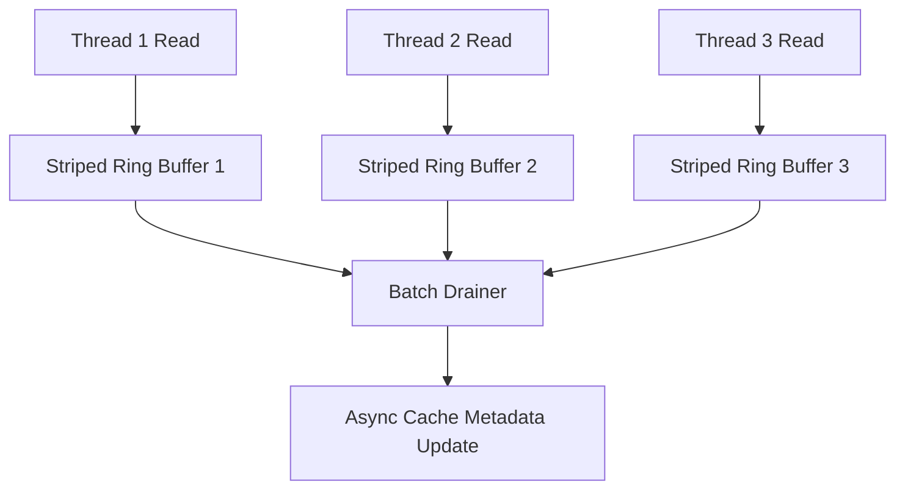
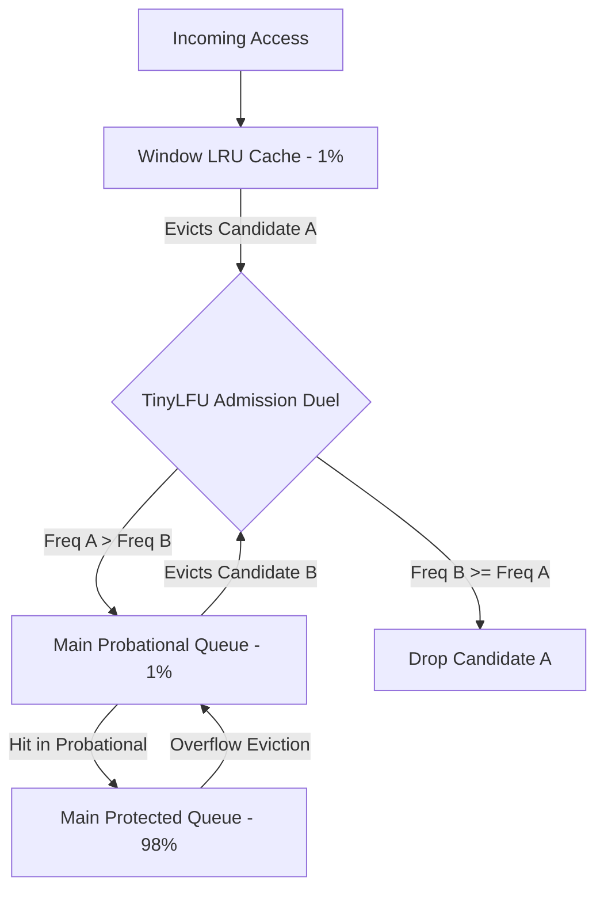
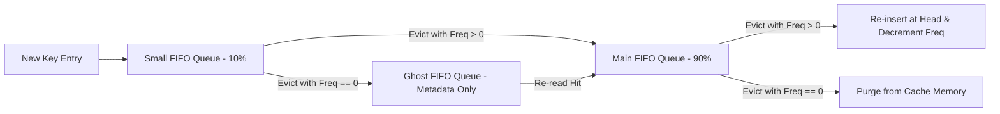

Traditional cache eviction mechanisms like Least Recently Used (LRU) and Least Frequently Used (LFU) look great on whiteboards, but they break down under production workloads. LRU suffers from severe weakness against sequential database scans and sudden traffic bursts. A simple table scan iterating across millions of rows will instantly purge high-value, hot keys from an LRU cache, filling memory with cold keys that will never be requested again. LFU attempts to fix this by tracking how many times an entry is accessed, but it suffers from frequency pollution. A key that receives a million hits during a flash sale will occupy memory forever, long after its popularity drops to zero, blocking newer, active keys from entering the cache.

Beyond the algorithmic flaws of hit ratios, classic cache designs fail on modern multi-core hardware due to lock contention. Standard LRU maintains a doubly linked list paired with a hash table. Every single read hit requires updating doubly linked list pointers to move the accessed node to the head. When dozens of CPU cores hit the same cache concurrently, updating those pointers requires acquire-release memory barriers or global mutex locks. The synchronization overhead quickly dominates execution time, making a naive LRU cache slower than reading from an fast SSD.

To solve read contention, modern cache engines shift maintenance operations away from the synchronous read path using asynchronous batch processing. Instead of mutating cache pointers on every hit, read threads append access events to thread-local, lossy ring buffers. These striped read buffers act as an event logging pipeline. When a buffer reaches capacity or a time threshold fires, a dedicated maintenance thread drains the buffer and applies access accounting in batches.

If a ring buffer becomes full before the drainer thread flushes it, incoming access events are intentionally dropped. Dropping read events introduces minor inaccuracies in access counts, but it ensures that read requests never block on eviction metadata updates. The cache trades absolute precision for lock-free, zero-allocation throughput.

W-TinyLFU solves both the scan resistance and frequency tracking problems by decoupling cache admission from eviction. Eviction asks which existing item should be thrown out when space is needed. Admission asks whether the new incoming item is actually worth keeping compared to the item slated for eviction. W-TinyLFU will refuse to store a newly fetched item if its estimated request frequency is lower than the candidate entry about to be evicted.

Storing exact frequency counters for millions of unique keys requires prohibitive memory. W-TinyLFU bypasses this using a 4-bit Count-Min Sketch. A Count-Min Sketch uses a fixed two-dimensional array of 4-bit counters across multiple independent hash functions. When a key access event drains from the read buffer, the engine hashes the key through four seed values, mapping to four specific counter indexes in the sketch array. Each corresponding counter is incremented by one up to a max value of 15. When estimating key frequency, the engine hashes the key through the same seed values and takes the minimum value among the four counters.

To prevent historical heavy keys from permanently poisoning the sketch, W-TinyLFU implements a halving decay mechanism. The cache maintains a global sample counter tracking total recorded accesses. Once this counter reaches the pre-configured sample size, the engine iterates through the entire Count-Min Sketch array and shifts every 4-bit counter right by one bit, effectively dividing every frequency counter by two. This simple bit-shift operation causes old frequency spikes to decay exponentially over time, allowing new traffic patterns to quickly overtake obsolete hot keys.

The physical structure of W-TinyLFU consists of two main memory regions divided into three logical queues. The Window LRU queue accounts for roughly 1 percent of total cache capacity. Incoming keys are always admitted into Window LRU regardless of their frequency score, protecting the cache against temporary access spikes. When the Window LRU queue reaches capacity, its victim entry faces eviction and is pushed toward the Main Space.

Main Space is split into a Probational queue (1 percent of capacity) and a Protected queue (98 percent of capacity). When an entry is evicted from Window LRU, it enters the TinyLFU admission duel against the candidate evicted from the Probational queue. The engine queries the Count-Min Sketch for both keys. If the Window LRU candidate has a higher frequency score, it wins admission into the Main Probational queue, and the Probational candidate is evicted from physical memory. If the Probational candidate scores equal or higher, the incoming Window candidate is dropped immediately. When an entry inside the Main Probational queue receives a hit, it gets promoted into the Main Protected queue. If the Protected queue fills up, its excess items drop back down to the Probational queue.

While W-TinyLFU achieves near-optimal hit ratios, maintaining a Count-Min Sketch still incurs CPU overhead due to multiple hash computations per read. S3-FIFO (Simple, Scalable, Static FIFO) approaches eviction from an entirely different angle, proving that multi-queue FIFO topologies can outperform LRU and match W-TinyLFU hit ratios without using probabilistic frequency sketches or dynamic hash tables.

S3-FIFO organizes cache items into three distinct FIFO queues: Small (S), Main (M), and Ghost (G). The Small FIFO queue occupies 10 percent of the total cache capacity, while the Main FIFO queue holds the remaining 90 percent. The Ghost FIFO queue stores no data values at all, only non-resident key hashes evicted from the Small queue, functioning as a lightweight history memory buffer.

Every cache entry in S3-FIFO tracks a 2-bit frequency counter embedded directly within its node metadata, capped at a maximum score of 3. When a thread reads an existing key in either the Small or Main queue, it increments that entry's 2-bit counter using an atomic fetch-and-add or simple memory write. No frequency sketches or global locks are involved during hit operations.

When a brand-new key enters the cache, it is placed at the head of the Small FIFO queue with a frequency counter of zero. When the Small queue exceeds its 10 percent memory budget, the engine pops the tail entry. If the tail entry's 2-bit frequency counter is greater than zero, the item has proven its utility and is promoted directly into the Main FIFO queue, resetting its frequency to zero. If the tail entry's frequency counter is zero, it gets evicted from memory, and its key hash is pushed into the Ghost FIFO queue.

If a read request misses the physical cache but matches a key hash stored inside the Ghost FIFO queue, S3-FIFO recognizes that the item was evicted too quickly from the Small queue. The newly re-fetched item bypasses the Small queue entirely and is inserted directly into the Main FIFO queue with a frequency counter of zero. The matching hash is then removed from the Ghost queue.

Eviction from the Main FIFO queue uses a second-chance FIFO re-insertion loop. When the Main queue exceeds its 90 percent capacity, the engine pops its tail item. If the tail item has a frequency counter greater than zero, the engine decrements its counter by one and re-inserts the node back at the head of the Main queue. The engine continues iterating down the Main queue until it encounters an item with a frequency counter of zero, which is then evicted from memory.

This simple FIFO re-insertion mechanic turns out to be extremely scan-resistant. Sequential table scans enter the Small queue with frequency zero and are evicted straight into the Ghost queue without polluting the Main queue where 90 percent of cached data resides. Flash bursts that repeat key requests increment counter bits, quickly pushing items into the Main queue where they rotate safely through second chances.

Choosing between W-TinyLFU and S3-FIFO comes down to target workload characteristics and computational budgets. W-TinyLFU shines in complex, power-law distributions where historical frequency signals over large sample windows provide maximum hit ratio efficiency. However, S3-FIFO delivers comparable hit ratios across real-world trace benchmarks while using significantly less CPU overhead and simpler lock-free queue primitives. By eliminating frequency sketch hash calculations, S3-FIFO offers an ideal architecture for high-throughput, latency-critical backends where every microsecond of CPU time counts.
