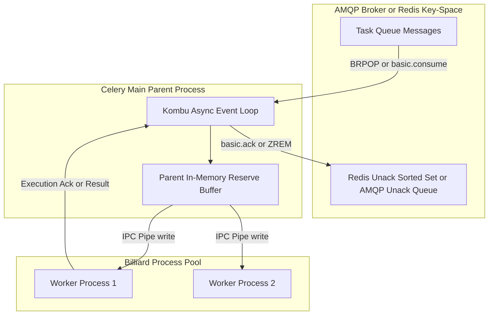
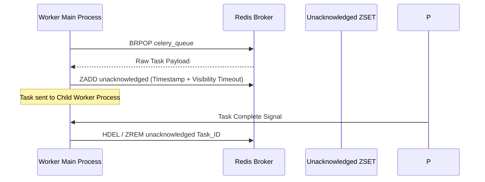
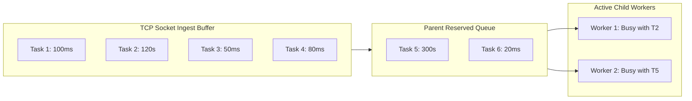
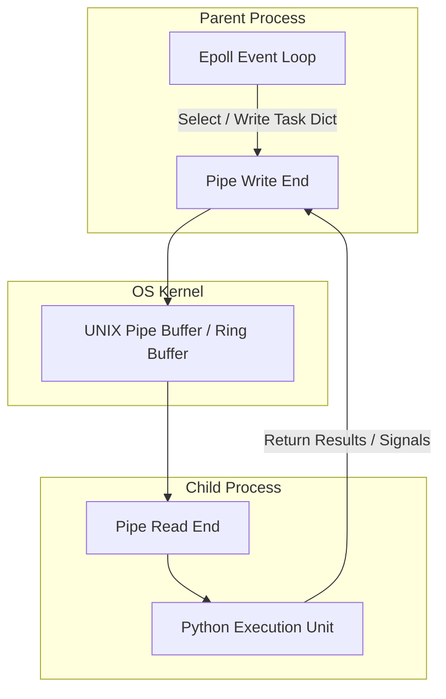
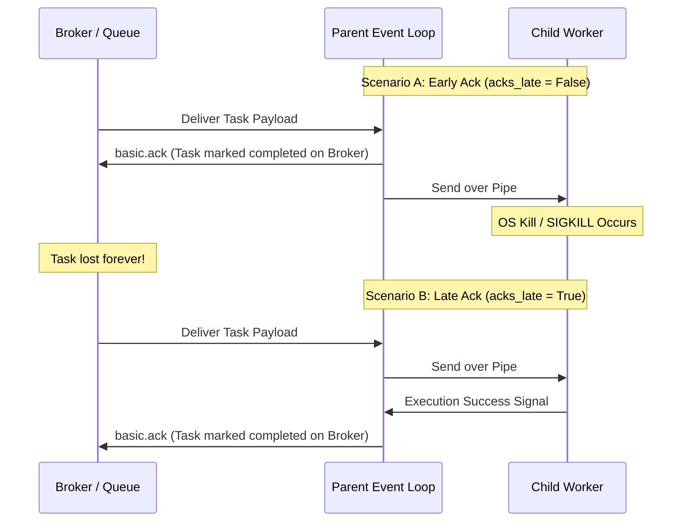

Python applications often rely on Celery for asynchronous background job execution. While firing off tasks with delay methods looks simple on the surface, the runtime machinery beneath Celery is a multi-layered distributed engine. It coordinates socket event loops, IPC channels, operating system signals, and transport-specific persistence engines. Understanding how tasks transition from a message transport into actual OS processes requires tracing the exact boundaries between Kombu, broker protocol guarantees, and process pool managers.

When a worker boots up, it does not immediately spawn a cluster of independent queue pollers. Instead, Celery uses a master-worker process topology managed by Billiard, a modified fork of Python's multiprocessing engine. The parent process runs an async I/O loop backed by epoll or kqueue via Kombu, consuming raw socket bytes from RabbitMQ or Redis. It buffers those messages in memory, schedules them according to prefetch rules, and dispatches task payloads over UNIX pipes to idle child processes.



## Transport Differences: AMQP vs Redis Storage Primitives

Celery abstracts message brokers through Kombu, but the underlying protocol guarantees vary wildly depending on whether you run RabbitMQ or Redis. Native AMQP brokers like RabbitMQ handle task state natively inside the server. When Celery issues a basic.consume call, RabbitMQ reserves state on the server broker for unacknowledged messages. If a worker disconnects without acknowledging a message tag, RabbitMQ re-queues the message at its original priority position.

Redis lacks native AMQP queue primitives like explicit frame-based acknowledgments and connection-bound unacknowledged queues. To simulate AMQP behavior over Redis, Kombu uses custom data structures inside the Redis key-space. When a task is published, Celery issues an LPUSH or RPUSH command to push the serialized task dictionary onto a Redis list corresponding to the destination queue.

Consuming from Redis requires a multi-step sequence. The main process issues a BRPOP command to pull task payloads off the list. To ensure messages aren't lost if the worker dies mid-execution, Kombu immediately moves the popped payload into a Redis sorted set called unacknowledged. The score given to the entry in this sorted set is a UNIX timestamp representing the current time plus the configured visibility timeout value.



If the worker completes the task within the visibility window, it executes a ZREM on the unacknowledged sorted set and removes the metadata. However, if a worker process crashes hard or suffers from memory exhaustion before acknowledging, the task entry remains trapped in the sorted set. Celery runs a periodic loop that scans the unacknowledged sorted set. Any item whose score timestamp is lower than the current timestamp is restored back into the primary queue list. This means setting an inappropriately short visibility timeout on Redis causes duplicate task executions, as the main process will restore and re-fetch tasks that are still actively running in worker child processes.

## The Prefetch Engine and Multiplier Controls

To maximize throughput, the master process avoids fetching tasks one at a time over network sockets. Instead, it maintains an internal reserve buffer fed by the transport protocol's prefetch engine. The capacity of this buffer is dictated by multiplying the worker concurrency value by the prefetch multiplier setting.

If a worker runs with eight concurrency child processes and a prefetch multiplier of four, the parent process attempts to hold up to thirty-two tasks in its internal pipeline simultaneously. In AMQP terminology, Kombu issues a basic.qos command with a prefetch count of thirty-two. RabbitMQ streams thirty-two messages over the TCP socket without waiting for individual processing acknowledgments.

While prefetch optimizations work exceptionally well for fast, sub-second jobs, they create severe head-of-line blocking problems when applied to long-running or heterogeneous task workloads. 



Consider a scenario where thirty short tasks and two long tasks sit in the broker queue. If Worker A prefetches twenty tasks, including both long-running tasks, those tasks are locked into Worker A's memory pipeline. If Worker A's child processes become occupied executing the long-running tasks, the remaining fast tasks sitting in Worker A's parent reserve buffer are trapped. Meanwhile, Worker B might finish its assigned tasks and sit completely idle because the broker has no remaining unacknowledged messages to distribute. Worker B cannot steal tasks from Worker A because those tasks have already been acknowledged at the TCP transport layer and moved into Worker A's private memory space.

To prevent worker starvation with mixed workloads, you must disable early prefetching. Setting the prefetch multiplier to one forces the worker to pull only a single task per worker process at a time. Disabling prefetching entirely ensures tasks remain in the central broker until a process is ready to execute them.

## Inter-Process Communication in the Prefork Pool

Once the parent process ingests a task payload, it must pass the message down to a child process in the pool for actual execution. In the prefork concurrency model, child processes are spawned during worker startup via fork system calls. Communication between the main process and child workers relies on unidirectional OS pipes or UNIX domain socket pairs created via socketpair calls.



The main process maintains an epoll instance monitoring read and write file descriptors. When a child process becomes idle, it writes a byte token down its dedicated control pipe back to the parent process. The parent's epoll loop intercepts this read event, marks that specific process slot as available, and serializes the pending task execution dictionary over the child's input pipe.

The task payload sent across the pipe contains the task function name, string UUID, args tuple, kwargs dictionary, execution options, and metadata context. Serializing these structures requires picking or json-encoding the Python dictionaries, incurring CPU and memory overhead during high-throughput execution.

Memory management inside the prefork pool is heavily influenced by Linux copy-on-write semantics. When the child process initially forks from the parent, both processes share the same physical memory pages. However, as the Python runtime executes code, instantiates framework objects, updates global dictionaries, and invokes garbage collection passes, the operating system marks dirty memory pages and creates dedicated physical copies for the child process. 

Over time, heavy memory allocations in long-lived child processes fragment memory and trigger massive Copy-on-Write bloat. To mitigate memory leaks and unbounded heap growth, production deployments use max-tasks-per-child settings. This instructs the parent process to forcefully terminate a child process via SIGTERM after it completes a fixed number of tasks, instantly releasing its process heap back to the OS, and replacing it with a fresh child process via fork.

## Acknowledgment Timings and Failure Domains

When a worker reads a task from the transport, it must decide when to report execution completion back to the broker. By default, Celery operates under an early acknowledgment strategy where acks_late is set to False.

Under early acknowledgment, the parent process issues a basic.ack to RabbitMQ or removes the key from Redis as soon as it pulls the message from the transport and hands it off to the child process IPC pipe, before execution even begins. 



If the child worker process is killed by the OS Out-Of-Memory killer, experiences a hardware reboot, or loses electrical power while executing an early-acknowledged task, the task is lost forever. The broker already deleted the task from its storage, thinking it was successfully consumed, while the child process died mid-execution.

Setting acks_late to True flips this safety threshold. The master process retains the message tag and unacknowledged status throughout the entire execution lifecycle. Only after the child process finishes executing the Python function, returns its output, and signals successful completion through the pipe does the parent dispatch the basic.ack frame back to the broker.

Late acknowledgments guarantee at-least-once execution semantics, but introduce strict requirements for task idempotency. If a child process finishes execution but dies right before sending the completion signal over the pipe, the parent process disconnects without issuing an acknowledgment. The broker detects the dropped TCP connection or expired visibility timeout and redelivers the task to another worker. If the task function modified database records or initiated external state transitions without built-in idempotency checks, running it a second time will corrupt application state.

Handling task execution bounds also requires distinguishing between soft and hard execution timeouts. Celery uses OS signal mechanisms to enforce these thresholds on Unix platforms.

```mermaid
flowchart TD
    Start[Child Starts Task Execution]
    SoftTimer{Soft Time Limit Exceeded?}
    CatchSignal{Python Catches SoftTimeLimitExceeded?}
    HardTimer{Hard Time Limit Exceeded?}

    Start --> SoftTimer
    SoftTimer -- Yes -->|Kernel sends SIGALRM| CatchSignal
    CatchSignal -- Handled --> CleanExit[Graceful Cleanup & Task Exit]
    CatchSignal -- Unhandled / Infinite Loop --> HardTimer
    SoftTimer -- No --> Complete[Task Complete]
    HardTimer -- Yes -->|Kernel sends SIGKILL| Dead[Process Forcefully Terminated]
    HardTimer -- No --> Complete
```

When a soft time limit expires, the parent process sets an OS alarm timer via SIGALRM directed at the child process. The Python runtime catches the alarm signal and raises a SoftTimeLimitExceeded exception inside the running task thread. This gives application code an opportunity to catch the exception, clean up external resources, write log context, and exit cleanly.

If the task code catches and ignores the exception, or remains locked in an un-interruptible C-extension call or blocked socket read, the soft limit handler fails to terminate the task. After the grace period passes, the hard time limit fires. The parent process bypasses Python exception handling entirely and sends a SIGKILL signal directly to the child process PID. The OS kernel immediately terminates the process, freeing its file descriptors and memory. The parent intercepts the child's exit status via waitpid, cleans up internal tracking maps, logs a worker process force-killed error, and spawns a new replacement process in the pool.
