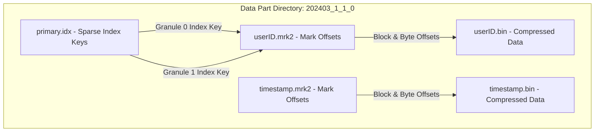
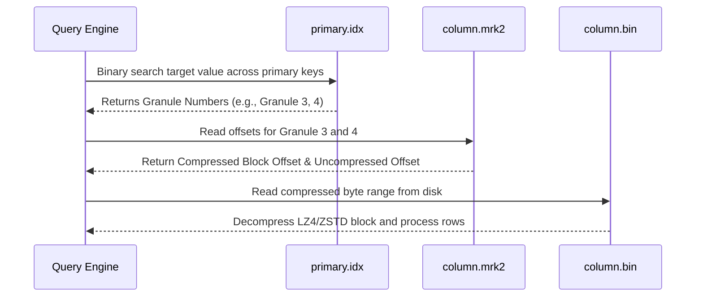

High-throughput analytical engines facing petabyte-scale telemetry queries cannot rely on traditional database indexing strategies. Relational databases like Postgres rely on B-Trees that map individual row keys to physical disk addresses. When inserting tens of millions of rows per second, maintaining B-Tree secondary indexes triggers massive write amplification, random disk writes, and CPU cache misses. ClickHouse solves this problem by taking a fundamentally different approach with its flagship storage architecture, the MergeTree engine.

MergeTree drops the assumption that point lookups need to be fast in exchange for blazing speed on bulk range scans and aggregations. It achieves this by writing data in immutable, physically sorted chunks called data parts, indexing those parts using sparse arrays rather than dense trees, and streaming compressed blocks straight into CPU SIMD registers.

To understand how MergeTree executes queries across billions of rows in milliseconds, we must inspect the physical file structure inside a table directory on disk. Every time a block of data gets inserted into a MergeTree table, ClickHouse writes that block out as a new, immutable directory called a data part. If you inspect a table partition directory on disk, you will see a collection of files ending in `.bin`, `.mrk2`, alongside a single `primary.idx` file and a `columns.txt` metadata manifest.

Each column in the table gets its own compressed binary data file, such as `userID.bin` or `timestamp.bin`. This column-oriented physical layout ensures that queries selecting only two columns out of fifty do not read unused column bytes off NVMe storage. However, reading columnar data fast requires knowing exactly where to seek inside those contiguous binary files without scanning every single byte.

This byte locator mechanism centers around the granule. A granule is the atomic, indivisible block of rows that ClickHouse processes at a time, defaulting to 8,192 rows per granule. ClickHouse never indexes individual rows. Instead, it extracts the primary key values for the very first row of each granule and appends those key values sequentially into `primary.idx`.

Because the entire data part is physically sorted on disk according to the table ORDER BY clause, `primary.idx` forms a sorted array of sparse boundary keys. If a table contains 81,920 rows, `primary.idx` stores only 10 index entries, each corresponding to the start of a 8,192 row granule. This sparse indexing strategy keeps the primary index so small that it stays entirely in RAM, even for multi-terabyte tables.

While `primary.idx` tells ClickHouse which granule contains the target rows, it does not contain file offsets for disk I/O. The bridge between the sparse index and the compressed column data files is the mark file, ending in `.mrk2`. Every column binary file has an accompanying mark file. For example, `userID.bin` pairs directly with `userID.mrk2`.

The mark file contains an array of mark structures. Each mark corresponds to a specific granule index in `primary.idx`. A single mark consists of two 64-bit unsigned integers. The first integer stores the byte offset where the compressed LZ4 or ZSTD block begins inside `column.bin`. The second integer stores the byte offset within that decompressed block where the granule data actually starts.

This double offset design accounts for the fact that compressed data blocks in ClickHouse do not map 1:1 with granules. An LZ4 block typically spans between 64 KB and 1 MB of uncompressed data, which might contain parts of multiple granules or only a fraction of a huge granule. When ClickHouse decides to read granule number 42, it opens `userID.mrk2`, seeks directly to entry 42, reads the block offset, seeks to that exact position in `userID.bin`, decompresses the LZ4 block, and uses the second offset to slice out the raw uncompressed column values.

When executing a query with a filtering clause, ClickHouse performs a binary search over the array of sparse keys loaded in RAM from `primary.idx`. It filters out entire granules whose boundary key values fall outside the query range condition. Once the engine identifies the candidate granule ranges, it aggregates the corresponding mark offsets across all required columns.

If a query requests three columns across granules 10 through 15, ClickHouse reads the mark files for those three columns, calculates the minimum compressed byte ranges needed to satisfy those granules, and issues parallel, aligned read requests to the underlying storage device. This completely skips unreferenced granules on disk, giving ClickHouse its characteristic sub-second execution times over massive telemetry datasets.

Because data parts are immutable, high-volume append traffic creates dozens of small data part directories every second. Allowing thousands of small disk parts to linger would degrade binary search performance across thousands of separate `primary.idx` files. To keep disk structures optimized, ClickHouse runs a continuous background merge process.

The background merge thread pool constantly evaluates unmerged data parts in each partition. It selects a group of small, contiguous parts and merges them into a single, larger part directory using a multiway merge sort algorithm. As rows stream from the source parts into the new merged part, ClickHouse writes out new sorted `.bin` files, generates fresh `.mrk2` mark entries, and builds a consolidated `primary.idx` index.

Once the new merged part finishes writing to disk, ClickHouse atomically swaps the active part state in memory. The old source parts are marked as inactive and eventually deleted by a background cleanup loop. This design makes inserts lockless and concurrent. Writes append new parts without blocking readers, while background merges incrementally consolidate parts in the background without holding global database locks.

Understanding these internal disk structures allows engineers to design optimal table schema definitions. Placing high-cardinality columns at the beginning of the ORDER BY key creates finer sparse index boundaries, but can degrade compression ratios across adjacent granules if row ordering becomes erratic. Striking the right balance between sorting key cardinality and granule alignment is the secret to extracting peak throughput from ClickHouse.
