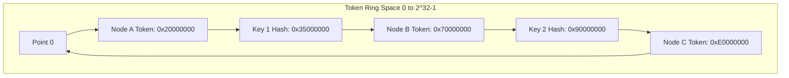
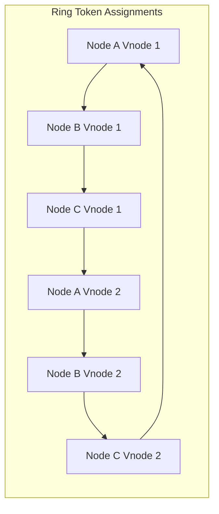
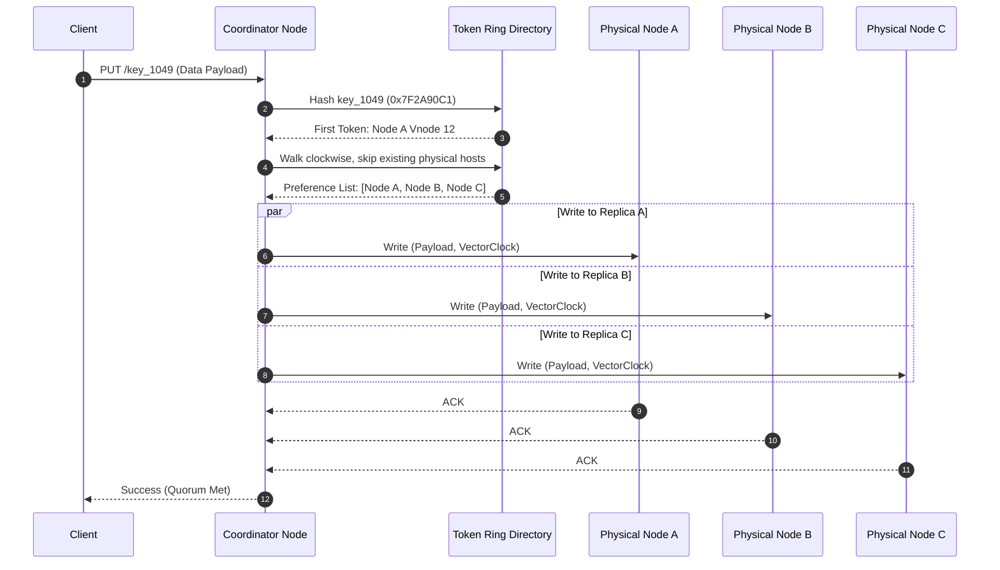

# Consistent Hashing Internals: Virtual Nodes, Token Rings, and Partition Rebalancing

Standard hash partitioning is fine until your infrastructure changes. When you compute `hash(key) % N` to assign keys across a cluster of database nodes, every single node addition or removal changes the value of `N`. Changing `N` invalidates the position of nearly every key in the entire cluster. In a stateful service like a distributed key-value store or distributed cache, throwing away ninety percent of key assignments simultaneously triggers catastrophic cache stampedes and saturates network pipes as gigabytes of data try to migrate across nodes at once. Consistent hashing eliminates this problem by decoupling key placement from the total node count. Instead of recalculating partition ownership across the entire cluster, adding or removing a node with consistent hashing only reallocates a fraction of the key space proportional to `1 / N`.

## The Geometry of the Token Ring

Consistent hashing maps both data keys and cluster nodes onto a continuous topological space, typically modeled as a mathematical circle or ring. The ring spans from zero to 2^32 - 1 when using a 32-bit hash function like MurmurHash3, or up to 2^128 - 1 when using MD5 or Murmur64. A hash function takes arbitrary input bytes, such as a user key or a server IP address, and projects it onto a point on this integer continuum.



When a write or read request arrives, the engine computes the key hash and finds its position on the ring. The key belongs to the first node whose position is greater than or equal to the key hash value, traversing clockwise. If the key hash lands beyond the highest token on the ring, it wraps around to the first physical node at the beginning of the integer space. Finding the owning node requires executing a binary search or using a skip list over a sorted array of node tokens, yielding O(log N) lookup time complexity.

The fundamental flaw in a naive token ring comes from random token distribution. If you assign a single token per physical server by hashing its IP address or host name, nodes will not be evenly distributed across the space. One physical server might end up owning seventy percent of the ring while another owns two percent. If a node fails, its entire key range spills directly onto its single clockwise neighbor, instantly overloading that neighboring server and cascading the failure down the cluster.

## Virtual Nodes and Uniform Key Distribution

To fix non-uniform distribution, systems like Cassandra and Dynamo abandon single-token assignments in favor of virtual nodes. A physical server no longer owns a single point on the ring. Instead, the storage layer assigns V discrete tokens to a single physical host, scattering virtual representations of that host across the token space. A physical node with V = 256 virtual nodes occupies 256 distinct points scattered across the integer ring.



Virtual nodes alter cluster behavior in two significant ways. They enforce uniform data distribution by applying the law of large numbers. As V increases, the standard deviation of key ownership across physical hardware drops drastically. With V = 256, variance in data distribution across physical hosts stays under five percent.

Virtual nodes also transform partition rebalancing. When a physical server drops out of the cluster, its 256 virtual nodes vanish simultaneously. Because those 256 tokens were interleaved between tokens belonging to all other physical servers, the lost key space is divided equally among every remaining machine in the cluster. Instead of a single server absorbing 100 percent of the failed node traffic, every host absorbs a negligible fraction of the missing range.

Hardware heterogeneity becomes easy to support under a virtual node scheme. If you deploy a mix of hardware where half the servers have 64 gigabytes of memory and the other half have 128 gigabytes, you assign 128 virtual nodes to the smaller boxes and 256 virtual nodes to the larger ones. The ring automatically allocates twice as much data to the beefier machines without changing the lookup algorithm.

## Replication Strategy and Preference List Traversal

For high availability, distributed storage engines must replicate keys across R distinct physical nodes. The coordinator node that receives a client request computes the key hash, locates the primary token on the ring, and then traverses the ring clockwise to collect R unique physical machines. Traversing the ring to select replicas requires filtering out virtual nodes that map back to physical hosts already selected in the current preference list.



Preference list assembly must respect rack awareness and data center topology. If all three top tokens clockwise on the ring happen to sit inside the same rack, a local rack switch failure takes down every replica simultaneously. Advanced topology-aware preference list strategies walk the ring until they find nodes across distinct fault domains, ensuring replicas are split across availability zones before completing the collection.

## Ring Rebalancing and Data Migration Mechanics

When a new physical server joins the cluster, it receives a set of V newly generated tokens from the ring authority or computes them locally using a deterministic hash function. The insertion of these virtual tokens splits existing token ranges owned by current nodes. The new node becomes the primary owner of these sub-ranges, and the former owners become predecessors for those token segments.

```
Token Ring Segment Rebalancing:

BEFORE JOIN:
[Node A Token: 1000] ---------------> [Node B Token: 5000]
Key Range: (1000, 5000] owned entirely by Node B

AFTER NEW NODE C JOIN (Token: 3000):
[Node A Token: 1000] ----> [Node C Token: 3000] ----> [Node B Token: 5000]
Key Range (1000, 3000] transferred from Node B to Node C
Key Range (3000, 5000] remains owned by Node B
```

The data migration pipeline works background stream operations to avoid blocking read or write queries. During the joining phase, the joining node registers its upcoming ring ownership state in a Pending status via gossip protocols like SWIM. Reads landing on the joining node while state streaming is underway proxy through to the old owner if the data key cannot be located locally. Writes received during migration are dual-written to both old and new owners to prevent dynamic state drift.

Once background migration streams complete SSTable or segment file transfers, the cluster gossip layer broadcasts an updated ring mapping across all nodes. The new node changes its status from Pending to Active, and the old nodes queue asynchronous garbage collection runs to drop key ranges they no longer own.

When a node experiences an ungraceful shutdown or network partition, hinted handoffs kick in. Neighboring replicas temporarily store writes intended for the dead node in a local log. When the dead node recovers or re-joins the ring, neighbors replay these hinted handoff logs back to the recovered host, restoring full data parity across the token space without triggering a full ring recalculation.
