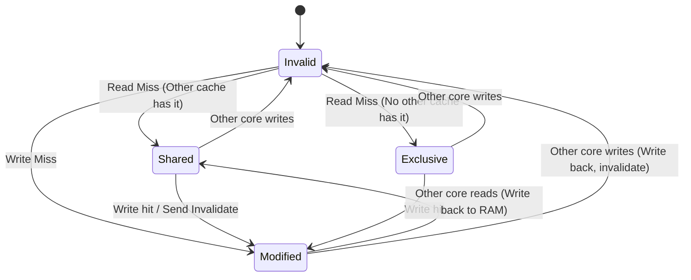

The memory wall is the defining constraint of modern computer architecture. While CPU execution speeds have scaled exponentially, the time required to fetch a byte from main memory has lagged behind, creating a massive latency gap. To keep execution pipelines fed, modern processors use a hierarchical caching topology, typically consisting of ultra-fast, private L1 and L2 caches, backed by a larger, shared L3 cache. This hierarchy introduces a brutal coordination challenge when multiple CPU cores execute code in parallel. If Core A writes to memory address `0x42`, how and when does Core B see that write?

The hardware must maintain the illusion of a single, unified memory store while running asynchronous, decoupled pipelines. This illusion relies on two distinct concepts: cache coherency and memory consistency. Cache coherency defines how individual memory locations are kept in sync across all private caches. Memory consistency defines the ordering of reads and writes across different memory locations as observed by different cores.

### Cache Coherency and the MESI Protocol

At the hardware level, caches do not operate on individual bytes. They operate on cache lines, which are typically 64-byte blocks of contiguous memory. To ensure that two cores do not hold conflicting values for the same cache line, processors use a hardware-level snooping protocol. The most fundamental of these is the MESI protocol, which coordinates state transitions across the system interconnect.



The MESI protocol categorizes every cache line into one of four states.

The Modified state indicates that the cache line is valid but dirty, meaning it is present only in the current core's cache and contains data that has been modified relative to main memory. The core has exclusive ownership of this line and must write the dirty data back to main memory or transfer it to another core before any other component can read it.

The Exclusive state means the cache line matches main memory and is present only in the current core's cache. If the core decides to write to this line, it can transition immediately to the Modified state without broadcasting an invalidation request, as no other core holds a copy.

The Shared state represents a condition where the cache line matches main memory and is present in other cores' caches as well. Cores can read from this line concurrently. If a core wants to write to it, it must first send an invalidation signal to all other sharing cores.

The Invalid state means the cache line contains no valid data. Any attempt to read or write to this line will result in a cache miss, forcing the core to query the interconnect or main memory to retrieve the current state of the data.

To coordinate these states, cores constantly snoop on the shared bus. When Core A wants to write to a cache line that is in the Shared state, it must broadcast an Invalidate message across the bus. Every other core holding that cache line must mark their copy as Invalid and send an Invalidate Acknowledge back to Core A. Only after receiving all acknowledgments can Core A transition its cache line to Modified and perform the write.

### The Performance Hack: Store Buffers

The raw MESI protocol is perfectly coherent, but it is also slow. If a core had to stall its execution pipeline every time it performed a write while waiting for invalidation acknowledgments from other cores across the bus, performance would collapse. A typical cross-core round trip can take dozens of clock cycles, which is an eternity for a CPU operating at several gigahertz.

To bypass this bottleneck, hardware engineers introduced a hardware structure called a store buffer.

```mermaid
graph TD
    subgraph CoreA [Core A]
        PipeA [Execution Pipeline] -->|Write| SB_A [Store Buffer]
        SB_A -->|Drain| L1_A [L1 Cache]
    end
    subgraph CoreB [Core B]
        PipeB [Execution Pipeline] -->|Read| L1_B [L1 Cache]
        IQ_B [Invalidate Queue] -->|Apply| L1_B
    end
    SB_A -->|Invalidate Broadcast| IQ_B
    L1_A <--> L2 [Shared L2/L3 Cache]
    L1_B <--> L2
```

When a core executes a write instruction, it does not wait for the cache line to be fetched and invalidated. Instead, it writes the data directly into its private, local store buffer and immediately issues the asynchronous Invalidate messages. The core then continues executing subsequent instructions as if the write had already completed.

To prevent the core from reading stale values of its own written data, the hardware implements store forwarding. When the execution pipeline performs a read, it queries both the local L1 cache and the local store buffer. If there is a pending write for that address in the store buffer, the core reads the value directly from the buffer.

However, the store buffer is strictly private to the core. Other cores cannot snoop the store buffer, they can only snoop the L1 cache. Consequently, from the perspective of the rest of the system, the write has not happened yet. It only becomes visible when the invalidation acknowledgments return, and the core drains the write from the store buffer into its L1 cache.

### The Second Hack: Invalidate Queues

While store buffers solve the write latency problem, they are relatively small. If a core performs a rapid sequence of writes, the store buffer can quickly fill up with pending writes waiting for acknowledgments. If the buffer fills, the core must stall anyway.

To prevent store buffers from filling up, hardware engineers added another optimization: invalidate queues. When Core B receives an Invalidate message from Core A, it does not actually invalidate its local cache line before responding. Forcing Core B to immediately modify its cache directory would interfere with Core B's own memory operations and potentially stall its pipeline.

Instead, Core B places the incoming Invalidate message into a hardware queue called the invalidate queue and immediately sends an Invalidate Acknowledge back to Core A. Core A receives this instant acknowledgment, believes the line has been cleared everywhere, and successfully drains its store buffer into its L1 cache, making the write visible to the bus.

Meanwhile, the invalidation message is still sitting unapplied in Core B's invalidate queue. Until Core B processes that queue and actually invalidates its local cache line, Core B will continue to read the stale value from its L1 cache. The system has traded sequential consistency for massive execution throughput.

### Memory Reordering and Consistency Models

These hardware optimizations break the intuitive sequential consistency model, where memory operations occur in the exact order written in the source code. Because of store buffers and invalidate queues, instructions appear to execute out of order.

A classic example is the Store-Load reordering scenario, often called the Dekker's algorithm hazard. Consider two variables, X and Y, both initialized to zero. Core A executes the write to X and then reads Y. Core B executes the write to Y and then reads X.

On Core A, the write to X goes straight into its store buffer. Core A then immediately reads Y. Since Y is not in Core A's store buffer, it reads Y from its L1 cache, which still contains zero. On Core B, the write to Y goes into its store buffer, and Core B immediately reads X from its cache, which also contains zero. Both cores then drain their store buffers to the cache. Both cores ended up reading zero, a result that is physically impossible under any sequential execution of those four instructions.

This is not a compiler optimization issue. This is hardware-level instruction reordering caused by the physical decoupling of the execution pipeline from the cache hierarchy.

The degree to which a CPU allows this reordering defines its memory model.

The x86-64 architecture implements a strongly-ordered memory model known as Total Store Order (TSO). In TSO, the hardware guarantees that stores from a single core are observed in the same order by all other cores. Writes cannot be reordered with other writes, and reads cannot be reordered with other reads. The only hardware-level reordering permitted on x86 is Store-Load reordering, where a read can bypass an earlier write to a different location because that write is still queued in the store buffer.

ARM64, by contrast, uses a weakly-ordered memory model. On ARM, the hardware does not guarantee the ordering of any memory operations unless explicit dependencies or barriers are introduced. Reads can bypass reads, writes can bypass writes, and reads and writes can bypass each other in almost any configuration. This weak ordering dramatically simplifies the hardware design, reducing transistor count and power consumption, which is why mobile and server-grade ARM chips are so efficient. But it shifts a massive synchronization burden onto the compiler and the software engineer.

### Taming the CPU: Memory Barriers

To restore sanity and enforce execution order when sharing data between threads, we must use memory barriers, also known as memory fences. A memory barrier is a hardware instruction that forces the processor to serialize memory operations around the barrier.

Hardware architectures expose specific instructions to enforce different ordering constraints. On x86, we have three primary fence instructions.

The SFENCE instruction, or Store Fence, guarantees that all store instructions preceding the fence in program order are committed to the cache hierarchy before any store instructions following the fence are executed. In practice, this instruction drains the local store buffer before allowing subsequent writes to proceed.

The LFENCE instruction, or Load Fence, ensures that all load instructions preceding the fence are completed before any subsequent load instructions can execute. This forces the processor to drain and apply all pending messages in its invalidate queue, ensuring that subsequent reads do not fetch stale data.

The MFENCE instruction, or Memory Fence, is a full barrier. It guarantees that all memory operations, both reads and writes, preceding the barrier are committed before any subsequent memory operations can execute. This drains both the store buffer and the invalidate queue, completely halting out-of-order memory operations.

On ARM64, the architecture provides more granular control through the DMB (Data Memory Barrier) and DSB (Data Synchronization Barrier) instructions, which take parameters defining the scope of the barrier, such as inner-shareable or outer-shareable domains. ARM64 also introduces one-way barriers embedded directly within load and store instructions. The LDAR (Load-Acquire) instruction ensures that no memory operations following the load can be reordered before it. The STLR (Store-Release) instruction ensures that no memory operations preceding the store can be reordered after it. This acquire-release pattern fits perfectly with lock acquisition and release semantics in high-level programming languages.

### Runtime and Compiler Interactions

High-level languages like C# and C++ abstract these hardware barriers behind language constructs and memory models. When writing multi-threaded code in .NET, you do not write assembly fences directly, you rely on the JIT compiler to emit them based on your C# code.

When you declare a field as volatile in C#, the compiler and JIT cooperate to enforce acquire-release semantics. A write to a volatile field has release semantics, while a read from a volatile field has acquire semantics.

Let us look at how the .NET JIT compiler translates these semantics depending on the target architecture. On an x86-64 system, because the hardware already guarantees Total Store Order, a volatile write does not require a costly MFENCE or SFENCE instruction. The JIT simply emits a standard store instruction like `MOV [address], value`. The release semantics are implicitly guaranteed by the CPU cache hierarchy.

On ARM64, however, the JIT cannot rely on hardware-level ordering. To prevent writes from migrating past each other, the JIT compiler must translate a volatile write into the ARM-specific `STLR` instruction. Similarly, a volatile read translates to a simple `MOV` on x86 but requires an `LDAR` instruction on ARM64.

If you need a full memory barrier in .NET, you call `Thread.MemoryBarrier`. On x86, the JIT translates this into a dummy instruction with a `LOCK` prefix, such as `LOCK OR [RSP], 0`, which acts as a full hardware fence without the specific performance penalties of the legacy `MFENCE` instruction on modern Intel and AMD chips. On ARM64, `Thread.MemoryBarrier` is compiled directly into a full data memory barrier instruction, `DMB ISHLD`.

Writing high-performance concurrent code requires a deep respect for these hardware mechanics. Lock-free data structures, ring buffers, and active spinning loops often look completely correct in high-level code, only to fail spectacularly in production on multi-core ARM64 servers because a developer assumed the hardware executed instructions in sequential order. Understanding the tension between the MESI protocol, store buffers, and invalidate queues is what separates developers who write correct concurrent software from those who merely hope it works.
