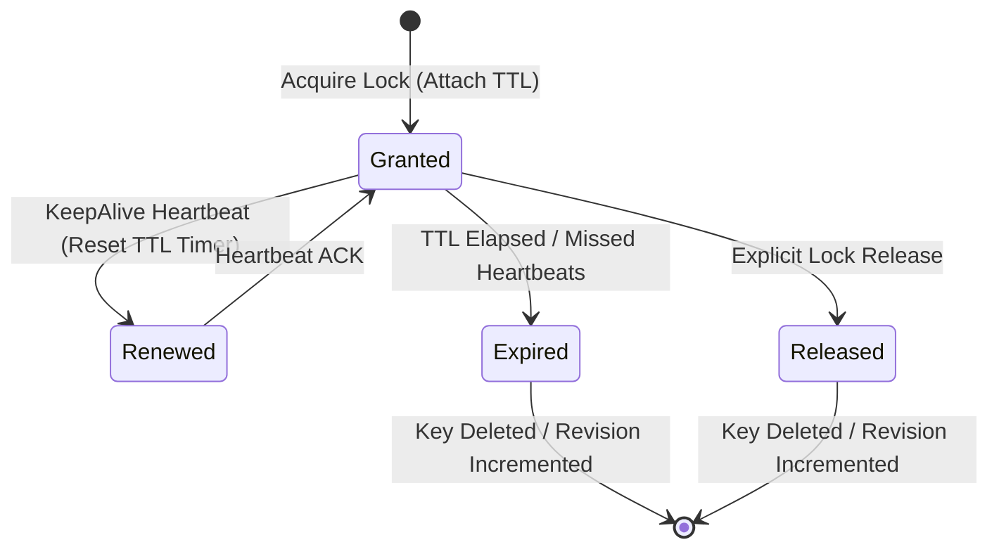
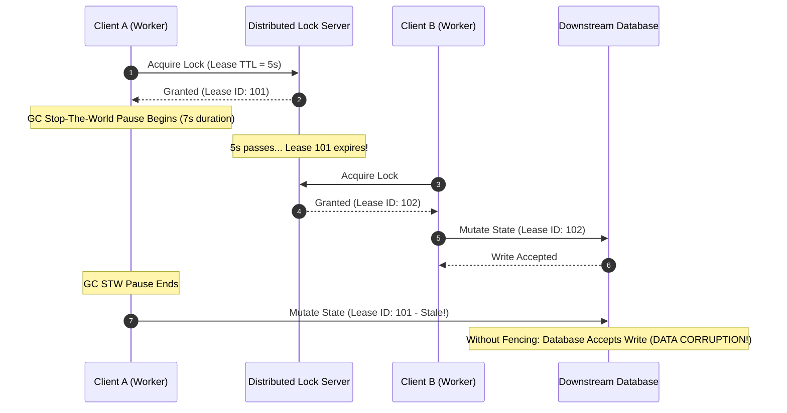
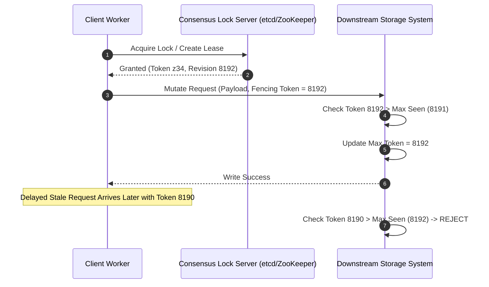

## The Fallacy of Distributed Mutual Exclusion

Software engineers coming from single-node concurrency primitives like mutexes, semaphores, or monitor locks often carry dangerous assumptions when moving to distributed systems. On a single machine, mutual exclusion is enforced by hardware memory boundaries, atomic CPU instructions like Compare-And-Swap, and a single system clock managed by a single operating system kernel. When thread A holds a lock, thread B literally cannot execute the protected critical section because the kernel scheduler and physical memory bus enforce that invariant.

Distributed locks operate in a completely different domain. In a distributed environment, the lock server, the client workers, and the downstream resource like a database or object store sit on distinct physical hardware connected by unreliable networks. There is no shared physical memory. There is no single global clock. Network packets can be delayed, reordered, or duplicated indefinitely. Most critically, execution environments on client nodes are prone to non-deterministic delays including garbage collection stop-the-world pauses, process preemption, page faults, and hypervisor stalls.

Because of these physical realities, a distributed lock cannot act as a physical barrier. A distributed lock server is merely an external metadata service that grants a client temporary permission to execute a task. If the client worker holding that permission gets paused by a long garbage collection phase, its lease will expire on the lock server. When the lock server grants the lock to a second client, both clients end up executing what was supposed to be a mutually exclusive critical section at the exact same time. Without downstream validation, distributed mutual exclusion is an illusion.

## Lease State Machines and Expiration Dynamics

To prevent deadlocks when worker nodes crash while holding locks, every distributed lock service relies on timed leases rather than explicit unbounded locks. When a client requests a lock, the lock manager creates an ephemeral key or session backed by a Time-To-Live duration. The client must continuously send heartbeat messages over an active TCP socket or gRPC stream to keep the lease active.

Under the hood, consensus services like etcd manage leases using a centralized state machine tied to consensus raft indexes. When a client registers a lease with a TTL of five seconds, etcd assigns a unique 64-bit Lease ID and registers it in an in-memory min-heap sorted by expiration time. A background grant loop periodically inspects the heap top to prune expired leases.



The client side runtime maintains its own background keep-alive loop. This loop calculates a refresh interval, typically set to one-third or half of the total lease TTL, to guarantee that network jitter or transient packet drop won't cause the lease to expire prematurely. If a lease duration is six seconds, the client sends a keep-alive request every two seconds.

This renewal model breaks down catastrophically when the worker thread executing the business logic shares an execution runtime with the keep-alive loop. If the runtime triggers a major garbage collection collection, all application threads pause, including the timer thread responsible for dispatching keep-alive heartbeats. On the lock server, the lease clock continues to tick. Once the five-second TTL passes without a keep-alive packet, the lock server marks the lease expired, deletes the associated lock key, and increments the cluster revision index. The lock is now freely available to any other requesting worker in the system.

## Anatomy of a Split-Brain Race Condition

Consider a scenario where Client A acquires a distributed lock to update a critical customer account balance in a PostgreSQL database. Client A obtains a lease with a five-second TTL. Immediately after receiving the lock confirmation from etcd, Client A triggers a heavy memory allocation that forces the language runtime into a multi-second stop-the-world garbage collection pause.

While Client A is frozen, the wall-clock time ticks forward. Three seconds pass, five seconds pass, six seconds pass. Etcd detects the missing heartbeats, expires Client A's lease, and purges the key. One second later, Client B requests the exact same lock. Etcd successfully grants the lock to Client B because the previous lease is dead. Client B fetches the current state from the database, performs its recalculations, and writes the updated balance back to the database.

Client A finally emerges from its garbage collection pause. Because thread execution resumes at the exact instruction following the pause, Client A has no built-in awareness that time has passed or that its lease was revoked. It proceeds directly to format its database mutation query and fires it off to PostgreSQL. Because the database engine has no intrinsic knowledge of the external lock manager, it accepts Client A's SQL write, overwriting the valid updates made moments earlier by Client B.



This sequence illustrates why client-side lease checking before writing to a storage system fails to solve the race. If Client A checks whether its lease is active before writing, a garbage collection pause or network delay can still occur immediately after the check but right before the write network packet leaves the network socket buffer. This window between checking state and applying state is a classic Time-of-Check to Time-of-Use bug.

## Monotonic Fencing Tokens

To guarantee safety in a distributed system where clients can pause arbitrarily, the downstream storage system must enforce mutual exclusion at the point of mutation. This is achieved using monotonic fencing tokens.

A fencing token is a strictly increasing integer generated by the lock server every time a lock is acquired. In etcd, the global 64-bit revision number acts as a natural fencing token. In ZooKeeper, the transaction zxid or node modification counter serves this role. When a client successfully acquires a lock, the lock server returns both the lease handle and the monotonic fencing token associated with that acquisition.



When the client sends a write operation to the downstream resource, it must include the fencing token alongside the payload. The downstream resource keeps track of the highest fencing token it has ever processed. When a write request arrives, the storage engine compares the request's token against its highest recorded token. If the incoming token is greater than the stored token, the storage engine accepts the write and updates its recorded token. If the incoming token is less than or equal to the stored token, the write is rejected as stale.

Revisiting the previous race condition with fencing tokens active demonstrates how safety is maintained. Client A acquires the lock and receives fencing token 8192. Client A enters a pause, causing its lease to expire. Client B acquires the lock and receives fencing token 8193. Client B sends its mutation with token 8193 to the database. The database verifies that 8193 is greater than the previously recorded highest token (8191), processes the write, and updates its high-water mark to 8193. When Client A wakes up and sends its write with stale token 8192, the database compares 8192 against its current high-water mark of 8193. The database rejects Client A's request, completely preventing data corruption.

Implementing fencing tokens requires that the target storage system supports conditional writes, optimistic concurrency checks, or atomic compare-and-swap operations. In SQL databases, this is easily implemented by adding a fencing token column to target tables and wrapping updates in conditional logic where the update only applies if the incoming token exceeds the stored token.

If the downstream storage service lacks support for conditional logic or cannot record token state, such as an immutable cloud blob storage bucket that only accepts raw overwrite operations, true distributed mutual exclusion becomes impossible under process pauses and network delays.

## Deconstructing Redlock and Clock Drift Hazards

A popular approach proposed for multi-master distributed locking without consensus is the Redlock algorithm, designed for Redis clusters. Redlock attempts to achieve fault tolerance by avoiding a single consensus leader. Instead, a client attempts to acquire locks on five independent Redis nodes sequentially using short timeouts. If the client succeeds in acquiring the lock on a majority of nodes within a specified time window, and the total acquisition time is less than the lock validity time, the lock is considered acquired.

The fundamental flaw in Redlock lies in its dependence on physical wall-clock time across independent machines to guarantee safety. Redlock relies on the assumption that time advances at roughly the same rate across all five Redis nodes and the client node. In real deployments, this assumption is frequently violated by Network Time Protocol synchronization jumps, hardware clock drift, and virtual machine clock skew during hypervisor migrations.

If Node 3 in a Redlock cluster experiences a forward NTP clock jump of several seconds while a client holds a lock, Node 3's internal timer for that lock instantly expires. Node 3 frees the lock key. A second client can now acquire locks on Node 3, Node 4, and Node 5, establishing a valid majority while the first client still believes it holds a valid lock on Node 1, Node 2, and Node 3. Both clients now operate under the belief that they possess exclusive rights to the system.

Redlock does not provide a mechanism to generate monotonic fencing tokens because there is no single point of consensus or unified revision log across the isolated Redis instances. Generating monotonic tokens requires a total ordering of state transitions, which can only be provided by consensus algorithms like Raft, Paxos, or Zab. Attempting to use local system timestamps as fencing tokens reintroduces clock skew vulnerabilities.

When absolute data correctness is required, consensus-backed systems like etcd, ZooKeeper, or Consul must be chosen over multi-node clock-dependent mechanisms. Consensus engines maintain a unified log ordering where every mutation increments an atomic cluster revision, producing deterministic fencing tokens that are completely immune to system clock jumps and process stalls.

## Building a Resilient Lease-Based Lock Client in C#

To see these concepts in action, let us implement a production-grade distributed lock client using C# and etcd's gRPC client libraries. This implementation manages lease creation, background heartbeat maintenance, automatic failure recovery, and explicit fencing token exposure.

```csharp
using System;
using System.Threading;
using System.Threading.Tasks;
using dotnet_etcd;
using Etcdserverpb;

public sealed class EtcdDistributedLock : IAsyncDisposable
{
    private readonly EtcdClient _etcdClient;
    private readonly string _lockPath;
    private readonly int _ttlSeconds;
    private long _leaseId;
    private long _fencingToken;
    private CancellationTokenSource _renewalCts;
    private Task _renewalTask;
    private bool _disposed;

    public long FencingToken => _fencingToken;

    public EtcdDistributedLock(EtcdClient etcdClient, string lockName, int ttlSeconds = 5)
    {
        _etcdClient = etcdClient ?? throw new ArgumentNullException(nameof(etcdClient));
        _lockPath = $"/locks/{lockName}";
        _ttlSeconds = ttlSeconds;
    }

    public async Task<bool> TryAcquireAsync(CancellationToken cancellationToken = default)
    {
        var leaseGrantResponse = await _etcdClient.LeaseGrantAsync(
            new LeaseGrantRequest { TTL = _ttlSeconds }, 
            cancellationToken: cancellationToken);
            
        _leaseId = leaseGrantResponse.ID;

        var txnRequest = new TxnRequest();
        txnRequest.Compare.Add(new Compare
        {
            Key = Google.Protobuf.ByteString.CopyFromUtf8(_lockPath),
            Result = Compare.Types.CompareResult.Equal,
            Target = Compare.Types.CompareTarget.Create,
            CreateRevision = 0
        });

        var putOp = new RequestOp
        {
            RequestPut = new PutRequest
            {
                Key = Google.Protobuf.ByteString.CopyFromUtf8(_lockPath),
                Value = Google.Protobuf.ByteString.CopyFromUtf8(_leaseId.ToString()),
                Lease = _leaseId
            }
        };

        txnRequest.Success.Add(putOp);

        var txnResponse = await _etcdClient.TransactionAsync(txnRequest, cancellationToken: cancellationToken);

        if (!txnResponse.Succeeded)
        {
            await _etcdClient.LeaseRevokeAsync(new LeaseRevokeRequest { ID = _leaseId });
            return false;
        }

        _fencingToken = txnResponse.Header.Revision;
        _renewalCts = new CancellationTokenSource();
        _renewalTask = MaintainLeaseAsync(_renewalCts.Token);

        return true;
    }

    private async Task MaintainLeaseAsync(CancellationToken token)
    {
        var refreshInterval = TimeSpan.FromSeconds(_ttlSeconds / 2.0);

        while (!token.IsCancellationRequested)
        {
            try
            {
                await Task.Delay(refreshInterval, token);
                await _etcdClient.LeaseKeepAliveAsync(
                    new LeaseKeepAliveRequest { ID = _leaseId }, 
                    cancellationToken: token);
            }
            catch (OperationCanceledException) when (token.IsCancellationRequested)
            {
                break;
            }
            catch (Exception ex)
            {
                Console.WriteLine($"Lease keep-alive heartbeat failed for Lease {_leaseId}: {ex.Message}");
                break;
            }
        }
    }

    public async ValueTask DisposeAsync()
    {
        if (_disposed) return;
        _disposed = true;

        if (_renewalCts != null)
        {
            _renewalCts.Cancel();
            if (_renewalTask != null)
            {
                try { await _renewalTask; } catch (Exception) { }
            }
            _renewalCts.Dispose();
        }

        if (_leaseId != 0)
        {
            try
            {
                await _etcdClient.LeaseRevokeAsync(new LeaseRevokeRequest { ID = _leaseId });
            }
            catch (Exception ex)
            {
                Console.WriteLine($"Error revoking lease {_leaseId} during disposal: {ex.Message}");
            }
        }
    }
}
```

The key mechanical detail in this code is how `_fencingToken` is captured. During transaction execution on etcd, the response header contains the global Raft cluster revision index. This revision is guaranteed by etcd's Raft engine to be strictly monotonic and unique across the lifetime of the cluster.

When passing this token to a repository or database service, the client includes the fencing token in the mutation context. The SQL persistence layer executes an update query that enforces monotonic versioning:

```csharp
public async Task<bool> UpdateAccountBalanceAsync(Guid accountId, decimal newBalance, long fencingToken)
{
    const string sql = @"
        UPDATE Accounts 
        SET Balance = @NewBalance, 
            LastFencingToken = @FencingToken 
        WHERE Id = @AccountId 
          AND LastFencingToken < @FencingToken;";

    using var connection = new SqlConnection(_connectionString);
    var rowsAffected = await connection.ExecuteAsync(sql, new 
    { 
        AccountId = accountId, 
        NewBalance = newBalance, 
        FencingToken = fencingToken 
    });

    return rowsAffected > 0;
}
```

If the rows affected count is zero, the application knows that another process acquired a lock with a higher fencing token while this worker was suspended or delayed. The application can cleanly abort, log a concurrency violation metric, and prevent invalid state updates from corrupting persistent storage.

## Designing Distributed Workflows for Non-Deterministic Environments

When building fault-tolerant architectures across cloud networks, trusting a lock alone to maintain correctness is a fundamental design flaw. Distributed locks provide optimization, not isolation. They reduce duplicate work in happy-path scenarios, preventing redundant computations or unnecessary background jobs. But when true data isolation and consistency are mandatory, safety must be enforced at the storage target using monotonic fencing tokens or atomic compare-and-swap primitives.

Every distributed lock implementation must be evaluated against the reality of asynchronous networks and non-deterministic process pauses. System clocks will drift, NTP servers will adjust time unexpectedly, and language runtimes will trigger garbage collection pauses. Building systems that remain safe under these constraints requires moving away from time-dependent lock guarantees and adopting strict monotonically ordered versioning across every state transition.
