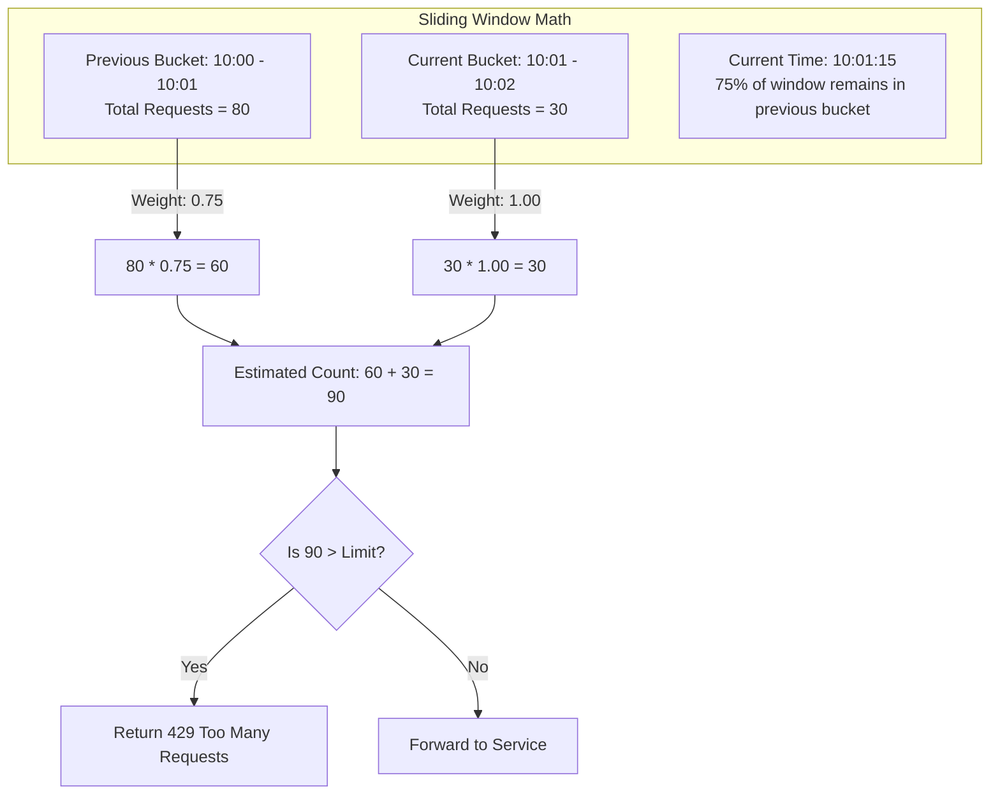
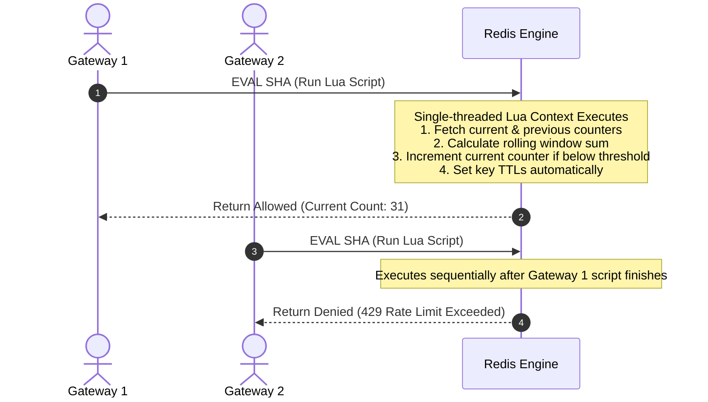

Rate limiting sounds deceptively simple when discussed in whiteboard interviews. You count how many times a user hits an endpoint over a minute, and if that count crosses a threshold, you return a 429 status code. When building a rate limiter that processes hundreds of thousands of requests per second across dozens of edge nodes, that simple counter explodes into a complex synchronization problem. Every naïve design breaks when pushed against edge cases like boundary burst spikes, distributed race conditions, atomic lock contention, and memory allocation bottlenecks.

The fundamental challenge comes down to tracking state over dynamic temporal windows without consuming infinite memory or turning your central cache into an execution bottleneck. A fixed window counter divides time into rigid intervals like 00:00 to 00:01. If a client sends 100 requests at 00:00:59 and another 100 requests at 00:01:01, the fixed window allows all 200 requests through because they fall into separate adjacent buckets. The system allowed double the intended capacity in a two second window. Token buckets avoid this boundary problem by continuously refilling tokens at a smooth rate, but updating a token count on every request requires an atomic read-modify-write cycle. If five edge nodes attempt to subtract a token simultaneously for the same API key, without strict synchronization, they overwrite each other's writes and allow unbounded traffic.

To solve the fixed window boundary spike while avoiding the continuous update overhead of token buckets, modern high throughput rate limiters rely on sliding window counters. Instead of storing every request timestamp in a sorted set, which burns memory linearly with traffic volume, sliding window counters approximate the request rate by interpolating values from the current bucket and the immediately preceding bucket.



Suppose a system enforces a limit of 100 requests per minute. The current clock time is 10:01:15, meaning we are 15 seconds into the current one minute window. The previous one minute bucket recorded 80 requests, and the current bucket has recorded 30 requests so far. The sliding window algorithm assumes request density across the previous bucket was evenly distributed. Because 15 seconds have passed in the current window, 75 percent of the previous window still overlaps our active rolling minute. We multiply the previous bucket's count by 0.75 to get 60, then add the 30 requests from the current bucket. The estimated count is 90. Since 90 is below 100, the request passes. If the client sends 11 more requests immediately, the total reaches 101, and the limiter begins dropping traffic. This sliding approximation keeps memory consumption down to just two counter keys per user while bounding the edge error rate to less than 5 percent across random traffic bursts.

Moving this math into a distributed topology introduces network latency and synchronization issues. If an application gateway reads the current counter from Redis, evaluates the sliding window formula in application code, and then increments the counter back in Redis, a race condition occurs under concurrent load. Two workers handling concurrent requests for the same client will both read count 30, both evaluate the limit as valid, and both increment the counter to 31. One request bypasses the rate limit check entirely.



To achieve linear serializability without distributed locks, rate limiters delegate the math directly to the storage engine using Redis Lua scripts. Redis processes commands and Lua scripts inside a single execution thread. When an application node sends an EVAL command, Redis locks the key workspace, executes the script steps completely to completion, and returns the evaluation outcome in a single network round trip.

```lua
local key_prev = KEYS[1]
local key_curr = KEYS[2]
local limit = tonumber(ARGV[1])
local current_time = tonumber(ARGV[2])
local window_size = tonumber(ARGV[3])

local time_into_current_bucket = current_time % window_size
local previous_weight = (window_size - time_into_current_bucket) / window_size

local prev_count = tonumber(redis.call('GET', key_prev) or "0")
local curr_count = tonumber(redis.call('GET', key_curr) or "0")

local estimated_count = (prev_count * previous_weight) + curr_count

if estimated_count < limit then
    redis.call('INCR', key_curr)
    if curr_count == 0 then
        redis.call('EXPIRE', key_curr, window_size * 2)
    end
    return 1
else
    return 0
end
```

The script fetches the previous and active counter keys atomically. It calculates the rolling window weight based on the time offset passed down from the application layer. If the estimated request volume sits beneath the configured limit, it increments the current bucket counter, configures a time to live expire policy on first write, and returns one. If the limit is crossed, it returns zero immediately. Because Redis executes this Lua script to total completion without interruption, concurrent incoming requests from dozens of app nodes queue behind the script execution context, preventing state drift.

Running every request through a central Redis cluster works up to a few hundred thousand requests per second. At global scale, the network round trip latency to Redis becomes a significant portion of overall request processing time. Edge gateways like Envoy solve this by implementing local token batching. Instead of querying Redis on every inbound packet, an edge gateway node requests a block of tokens in advance. An edge node might ask Redis for 500 tokens using an atomic decrement operation. The edge node then satisfies local request traffic out of its in-memory pool without network overhead. Once its local pool drops below a low watermark threshold, the gateway asynchronously sends a background batch request to top off its local store.

Batching introduces trade offs between speed and strictness. If an edge node fetches 500 tokens and then suffers a crash or network isolation event, those 500 tokens are effectively lost until their lease expires. The system enforces a stricter limit than configured, failing closed. Conversely, if multiple edge nodes pre-allocate tokens during a burst, one edge node might hold idle tokens while another node runs out and returns HTTP 429 to valid users.

Clock synchronization represents another dangerous point of failure in rate limiting engines. When calculating rolling windows, systems depend on epoch timestamps. If Application Gateway A relies on a clock that drifts 5 seconds behind Application Gateway B, Gateway A calculates incorrect weights for the previous bucket. Gateway A thinks it is earlier in the bucket window than it actually is, over-weighting stale counts and dropping legitimate client requests prematurely.

System designers must never pass system wall clock time into rate calculation scripts directly without protection against Network Time Protocol clock steps. NTP synchronization can adjust system clocks backward or forward unexpectedly to correct drift. If the system clock steps backward during a rate limit evaluation window, the calculated time offset becomes negative, resulting in corrupted weight multipliers. High performance edge proxies use monotonic clocks for local duration measurements, or fetch the authoritative current timestamp straight from Redis using the TIME command inside the execution context to force a single source of time truth.

Garbage collection in state storage must also be handled explicitly. In high traffic APIs with millions of unique client IP addresses, keys populate rapid memory footprints. If rate limiter keys rely purely on Redis passive key eviction, stale keys for inactive clients linger in memory for hours. Setting explicit TTLs during key creation is required. The TTL must span at least twice the window length. A two minute TTL on a one minute window guarantees that the previous bucket counter remains fully readable throughout the entire lifespan of the current window, but frees the memory allocations automatically shortly after the bucket shifts out of active relevance.

Architecting rate limiters requires choosing the right trade-off between absolute mathematical accuracy and computational throughput. Token buckets offer smooth execution for low throughput APIs where bursts are acceptable. Sliding window logs offer perfect precision at the cost of high memory overhead per request. Sliding window counters executed inside single-threaded atomic Lua environments deliver the optimal sweet spot for high volume infrastructure, keeping latency flat while preventing boundary spikes across distributed clusters.
