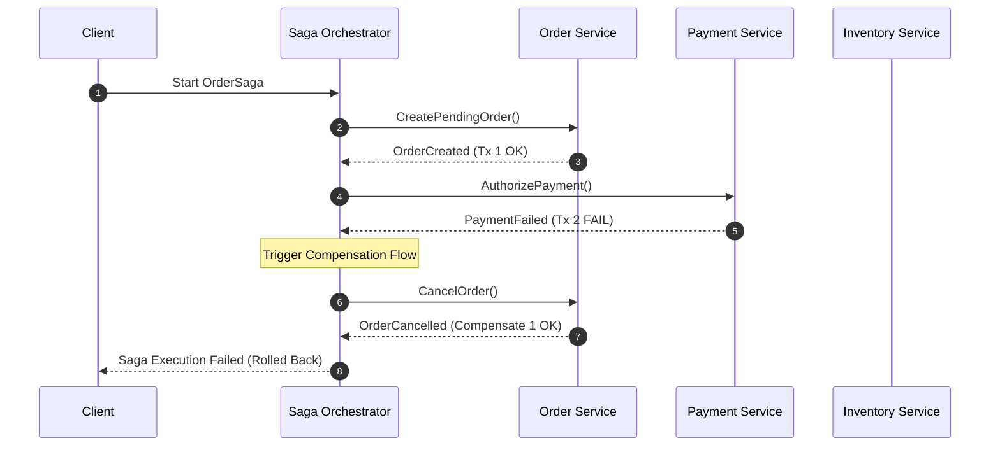
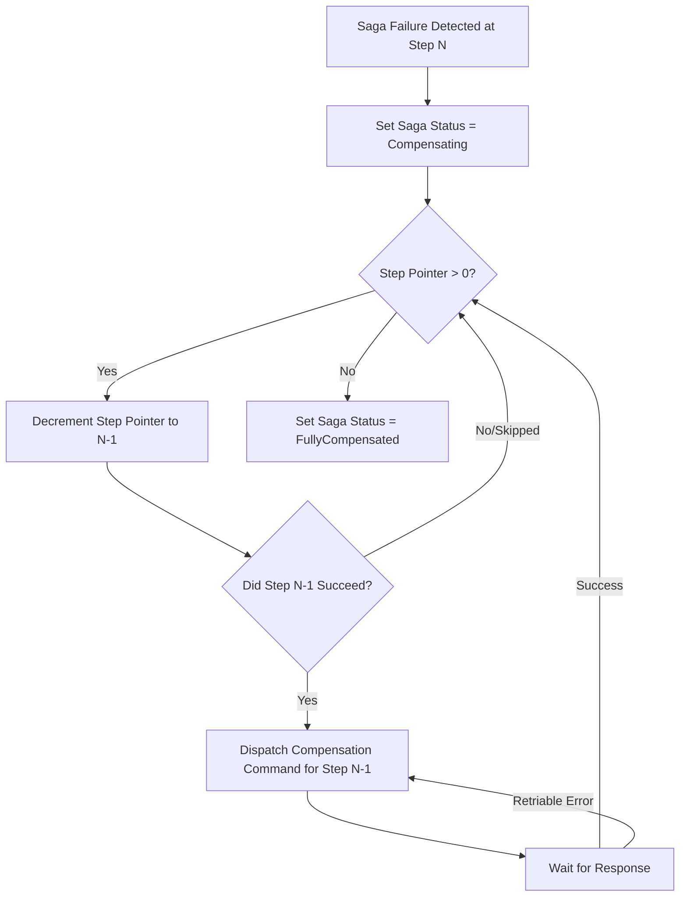

When decomposing monolithic applications into isolated microservices, managing transactions across independent database boundaries becomes a immediate challenge. Atomic cross-network transactions using Two-Phase Commit (2PC) protocols introduce distributed blocking, high latency, and severe availability locks. If a single database node becomes unresponsive during the commit phase, all participating resources remain locked. The Saga pattern eliminates distributed locking by breaking down a global transaction into a sequence of local transactions, where every forward step has a corresponding, idempotent compensating transaction.

Building an orchestration engine to execute these Sagas requires careful state machine design. When network partitions, service crashes, or domain validation failures occur mid-flight, the orchestrator must guarantee that system state eventually converges. This analysis examines the execution mechanics, state persistence, step stack unwinding, and outbox coupling required to construct a production-ready Saga engine.

### Choreography versus Orchestration: Structural Mechanics

Saga implementations fall into two paradigms: Choreography and Orchestration. In Choreography, services listen to domain events emitted by other services and execute local transactions autonomously. While conceptually decoupled, Choreography creates implicit execution dependency graphs across codebases. Debugging continuous event loops or determining the global state of a distributed operation quickly becomes intractable.



Orchestration centralizes execution logic into a dedicated state machine coordinator. The Orchestrator issues explicit command messages to worker services, awaits response events, updates its persistent state log, and determines the next forward step or compensation branch. The core advantage is state visibility: the complete context and execution trajectory of a transaction exist within a single deterministic log.

### The Internal State Machine and Execution Log

To withstand hard host crashes, a Saga orchestrator must persist state transitions atomically before triggering downstream network commands. The state engine relies on an execution log table stored in an ACID-compliant database. Every state change is recorded as an immutable log entry or appended to a state row using optimistic concurrency control.

Consider the operational state layout required to track an ongoing Saga:

```
+---------------------------------------------------------------------------------+
|                                 SAGA INSTANCE LOG                               |
+-----------------------+----------------------+---------------+------------------+
| SagaID (UUID)         | CurrentStep (Int)    | Status (Enum) | Payload (JSONB)  |
+-----------------------+----------------------+---------------+------------------+
| 9f3a1d20-4e...        | 2                    | Executing     | { "orderId": 42 }|
+-----------------------+----------------------+---------------+------------------+
                                   |
                                   v
+---------------------------------------------------------------------------------+
|                            STEP EXECUTION AUDIT STACK                           |
+--------+------------------+------------------+-----------------+----------------+
| StepID | StepName         | ForwardStatus    | CompensateStatus| CompensationData|
+--------+------------------+------------------+-----------------+----------------+
| 1      | ReserveInventory | Succeeded        | Pending         | { "sku": "X" } |
| 2      | ProcessPayment   | Failed           | NotRequired     | NULL           |
+--------+------------------+------------------+-----------------+----------------+
```

When processing a step, the engine performs the following execution pipeline:

1. Read the current execution context from the persistent store.
2. Determine the step definition corresponding to `CurrentStep`.
3. Transition state to `ExecutingStep` and record execution telemetry.
4. Dispatch the command payload via a reliable transport mechanism.
5. Wait for the asynchronous response or handle processing timeouts using an in-memory timing wheel.
6. Upon receiving a response, evaluate execution success. If successful, increment `CurrentStep` and loop forward. If failed, transition the Saga status to `Compensating` and begin stack unwinding.

### Solving Dual-Write Risks with Integrated Outbox Patterns

Updating the orchestrator's database state and publishing an execution command to a message broker (such as RabbitMQ or Kafka) represents a classic dual-write problem. If the orchestrator updates its database but crashes before emitting the message to the broker, the Saga stalls indefinitely. Conversely, emitting the message first risks notifying downstream services of a step that failed to persist locally.

To ensure transactional atomic updates, the Saga state update and message issuance must share a single local database transaction via the Transactional Outbox pattern.

```
+---------------------------------------------------------------------------+
|                       ORCHESTRATOR LOCAL DB TRANSACTION                   |
|                                                                           |
|  1. UPDATE saga_instances SET current_step = 2 WHERE id = '9f3a...';      |
|  2. INSERT INTO outbox_messages (id, payload, status) VALUES (...);       |
+---------------------------------------------------------------------------+
                                     |
                           Commit Transaction
                                     |
                                     v
+---------------------------------------------------------------------------+
|                    OUTBOX PROCESSOR (Background Worker)                  |
|                                                                           |
|  3. READ unprocessed messages FROM outbox_messages                        |
|  4. PUBLISH message to Message Broker (At-Least-Once Delivery)           |
|  5. MARK message as processed IN outbox_messages                         |
+---------------------------------------------------------------------------+
```

The orchestrator executes the state change and writes a serialised command frame into an `outbox_messages` table in the exact same database commit. An independent background processor tails the outbox table or uses Write-Ahead Log (WAL) logical decoding to dispatch messages to the transport layer with at-least-once delivery guarantees.

### Compensating Workflows and Unwinding Logic

Compensations are not simple database rollbacks; they are forward-recovering domain actions designed to semantic cancel previous operations. For example, reversing a payment transaction involves executing a refund API call. Reversing an inventory reservation involves executing a restock command.

When a step encounters an unrecoverable business failure or exhausts its operational retry policies, the orchestrator initiates the unwinding phase. The execution stack unwinds in strictly reverse chronological order (Last-In, First-Out).



During unwinding, the engine enforces critical execution invariant checks:

1. Steps that never completed forward execution are skipped during compensation.
2. A step whose compensation fails must be re-attempted indefinitely using exponential backoff strategies, or marked as halted for manual operator intervention. Abandoning a failed compensation mid-flight leaves the system in an inconsistent state.
3. Every compensation handler implemented in participant services must be strictly idempotent. Network retries will inevitably deliver duplicate compensation commands.

### Implementing an Idempotent Orchestration Engine Loop

Below is a conceptual execution engine in C# demonstrating how step execution, outbox persistence, state progression, and compensation unwinding operate synchronously over an abstract persistent repository.

```csharp
public class SagaExecutionEngine
{
    private readonly ISagaRepository _repository;
    private readonly IOutboxWriter _outbox;

    public SagaExecutionEngine(ISagaRepository repository, IOutboxWriter outbox)
    {
        _repository = repository;
        _outbox = outbox;
    }

    public async Task ProcessStepAsync(Guid sagaId, StepResult currentStepResult)
    {
        using var tx = await _repository.BeginTransactionAsync();
        var state = await _repository.GetForUpdateAsync(sagaId);

        if (state.Status == SagaStatus.Completed || state.Status == SagaStatus.FullyCompensated)
        {
            return; // Terminal state guard
        }

        if (currentStepResult.IsSuccess)
        {
            if (state.Status == SagaStatus.ExecutingForward)
            {
                state.RecordStepSuccess(state.CurrentStepIndex);
                
                if (state.CurrentStepIndex + 1 < state.TotalSteps)
                {
                    state.CurrentStepIndex++;
                    var nextStep = state.GetStep(state.CurrentStepIndex);
                    await _outbox.StageCommandAsync(tx, nextStep.CreateForwardCommand());
                }
                else
                {
                    state.Status = SagaStatus.Completed;
                }
            }
            else if (state.Status == SagaStatus.Compensating)
            {
                state.RecordCompensationSuccess(state.CurrentStepIndex);
                await AdvanceCompensationAsync(state, tx);
            }
        }
        else
        {
            // Step execution failed: initiate compensation
            state.Status = SagaStatus.Compensating;
            state.RecordStepFailure(state.CurrentStepIndex, currentStepResult.ErrorReason);
            await AdvanceCompensationAsync(state, tx);
        }

        await _repository.SaveStateAsync(state, tx);
        await tx.CommitAsync();
    }

    private async Task AdvanceCompensationAsync(SagaState state, IDbTransaction tx)
    {
        while (state.CurrentStepIndex >= 0)
        {
            var step = state.GetStep(state.CurrentStepIndex);
            if (step.ForwardExecutionStatus == StepStatus.Succeeded)
            {
                await _outbox.StageCommandAsync(tx, step.CreateCompensateCommand());
                return; // Wait for async response of compensation
            }
            
            state.CurrentStepIndex--;
        }

        state.Status = SagaStatus.FullyCompensated;
    }
}
```

### Handling Network Partition Anomalies and Non-Determinism

Orchestrators face real-world race conditions due to network delays. For instance, a command sent to a payment service might time out from the perspective of the orchestrator. The engine marks the step as timed-out and begins issuing compensation commands for earlier steps. Moments later, the delayed success response from the payment service arrives.

To resolve this split-brain execution scenario, every message sent by the orchestrator must carry the `SagaID`, the `StepIndex`, and an incremental `ExecutionEpoch`. Participant services must validate these tokens:

1. If a participant service receives a forward command for a Saga that has already received a compensation command for that step index, the forward command is dropped.
2. The orchestrator ignores execution responses whose `ExecutionEpoch` does not match the currently active epoch recorded in the persistent engine state.
3. Downstream services persist a local idempotency ledger containing processed execution IDs. If a duplicate command arrives due to transport retries, the service returns the previous response directly from its local ledger without executing business logic twice.

Building an orchestration engine requires prioritizing state durability and message order guarantees over immediate execution performance. By coupling local database state transitions with an integrated Outbox pattern and enforcing strict idempotency across step handlers, distributed systems can maintain strict operational consistency without relying on expensive resource locks.