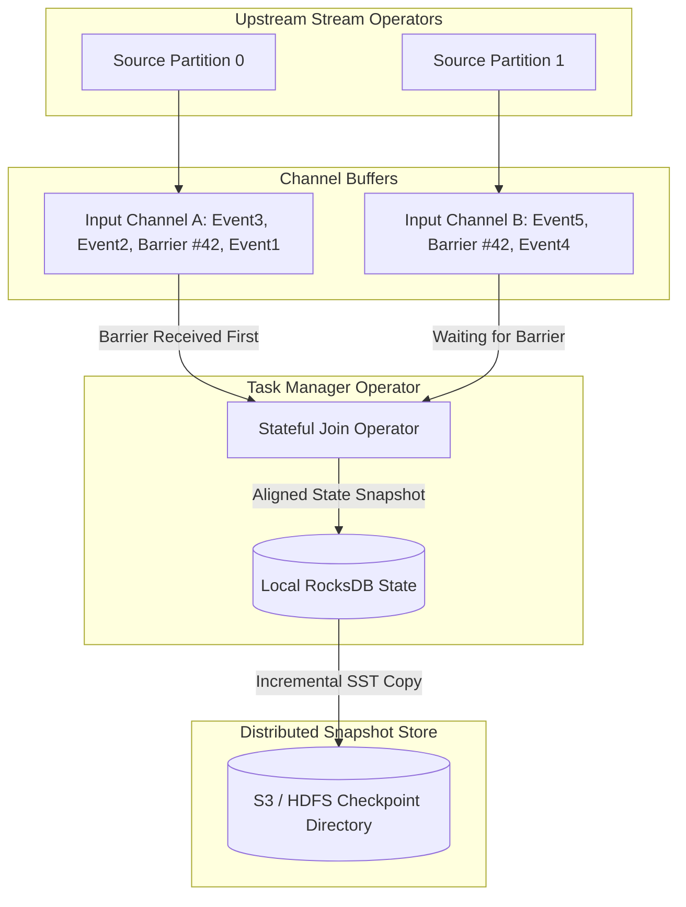

Building high-throughput stream processing engines requires maintaining rich, stateful contexts over infinite streams of data. Stream operators perform rolling window aggregations, stream-to-stream joins, and sessionization. If an execution node crashes, replaying an unbounded log like Kafka from offset zero is completely impractical. Traditional database checkpointing relies on global locks or two-phase commit protocols that pause writes, but pausing an streaming graph processing millions of events per second destroys real-time latency targets.

Modern streaming runtimes achieve fault tolerance without stopping message processing by leveraging asynchronous global state snapshots. The foundation of this design traces back to the Chandy-Lamport algorithm, adapted for directed acyclic execution graphs. Understanding how these snapshot engines maintain state across distributed workers requires looking directly at stream barrier propagation, network buffer alignment, unaligned checkpoint mechanics, and local RocksDB storage engines.

## The Async Snapshot Challenge

A stream processing topology consists of directed acyclic graphs where stateful operators process continuous streams of records passing through transport channels. State is held in local memory or local disk on each task executor. A consistent global snapshot represents a state configuration where the combined state of all operators, along with records in transit across networking channels, corresponds to a single logical point in the stream processing timeline.

Naive approaches attempt to synchronize all nodes using a central coordinator signal. In a distributed topology, pausing execution to snapshot state creates massive execution spikes and network congestion. If operator states are saved asynchronously while processing continues without channel tracking, non-deterministic state recovery occurs. Events processed after a snapshot start could modify state that gets saved alongside pre-snapshot records, creating duplicated or dropped event records upon restoration.

To capture a consistent global state without locking, the system must establish ordering semantics between data stream events and the state snapshot process itself.

## The Chandy-Lamport Algorithm in Stream Graphs

The Chandy-Lamport distributed snapshot algorithm solves this problem by injecting checkpoint barriers directly into data channels. Checkpoint barriers are distinct system control records inserted into input source channels alongside regular message tuples. Barriers stream along the execution graph together with regular records. A barrier divides the stream into two logical halves: records that preceded the snapshot, and records that follow it.



When a source operator receives a trigger signal from the central job coordinator, it pauses record ingestion briefly, logs its current partition offsets, emits a checkpoint barrier with sequence ID $N$ into all its output channels, and resumes record ingestion. Downstream operators receive these barriers interleaved among standard records. When an operator processes a barrier, it knows that all incoming records prior to that barrier have already been integrated into its current state.

## Barrier Alignment Mechanics and Upstream Backpressure

For operators with a single input channel, barrier processing is trivial. The operator receives barrier $N$, immediately freezes its local state, writes a snapshot pointer to the state store, and forwards barrier $N$ down its output channels. However, stateful operators frequently consume from multiple upstream channels, such as stream join operators or multi-partition shuffle channels.

When an operator receives barrier $N$ from input channel A, it cannot instantly trigger its snapshot if channels B and C have not delivered barrier $N$ yet. Doing so would capture state modifications driven by late-arriving pre-barrier records on channels B and C after the snapshot point.

To solve this, the operator executes barrier alignment. Upon receiving barrier $N$ from channel A, the operator pauses processing incoming events from channel A. It places channel A into a blocked status and buffers all subsequent incoming records from channel A into memory queues without executing state transitions on them. The operator continues consuming records from channels B and C, updating its active local state.

When barrier $N$ arrives from channel B, channel B is likewise blocked and buffered. Once barrier $N$ arrives from the final remaining channel C, alignment is complete. The operator takes a local state snapshot, emits barrier $N$ downstream into all output channels, unblocks channels A, B, and C, and begins processing all buffered events accumulated during the alignment phase.

```
[ Channel A ] ---> [ Barrier #42 ] --- (Arrives First) ---> [ Block & Buffer Channel A ]
[ Channel B ] ---> [ Event 109   ] --- (Processing)   ---> [ Updates Active State  ]
[ Channel B ] ---> [ Barrier #42 ] --- (Arrives Second) -> [ Alignment Complete! ]
                                                                    |
                                                                    v
                                                      [ Freeze Local State & Snapshot ]
```

While barrier alignment preserves absolute strictness, it introduces performance challenges under high load. If channel C suffers from network degradation, CPU starvation, or upstream data skew, barrier $N$ on channel C delays. Channels A and B remain blocked, buffering incoming traffic in memory. If alignment takes too long, memory buffers fill up, triggering network stack backpressure that propagates upstream all the way to source connectors. The entire processing graph suffers throughput collapse while waiting for a single slow partition to align.

## Unaligned Checkpoints: Swapping Latency for In-Flight State

To eliminate alignment-induced backpressure, modern stream processing runtimes provide unaligned checkpoints. Unaligned checkpoints bypass channel blocking entirely by treating in-flight network buffer content as part of the persistent checkpoint state.

In an unaligned checkpoint workflow, as soon as barrier $N$ arrives on the *first* input channel (channel A), the operator immediately reacts. It takes barrier $N$ and moves it directly to the head of its output queues, out-of-order, bypassing all pending records in downstream output buffers. 

Simultaneously, the operator captures a snapshot consisting of three distinct items: the current local state, the contents of input buffers from all other channels (channels B and C) that have not yet delivered barrier $N$, and any unsent records stored inside output network buffers that were overtaken by barrier $N$.

Because the operator does not block channels or wait for late barriers, execution runs at full speed without backpressure spikes. The trade-off shifts to network and storage I/O. Snapshot payloads increase because they now include serialized in-flight network buffers alongside operator state. During crash recovery, the recovery engine reinstates the operator state and injects these saved channel buffers back into the channel queues, replaying the exact in-flight network state present at the instant the first barrier arrived.

## State Engine Architecture: Local RocksDB Tiers

Operators holding gigabytes or terabytes of state cannot serialize their entire in-memory heap to remote object storage on every checkpoint cycle. Processing engines use embedded key-value storage engines, primarily RocksDB, running inside the task executor process to manage large-scale state locally.

RocksDB operates as a Log-Structured Merge-tree (LSM) engine. Writes append to an in-memory MemTable and a local Write-Ahead Log (WAL). When the MemTable fills up, it flushes to an immutable Sorted String Table (SSTable) file located on local storage. Background compaction threads merge overlapping SSTable files across hierarchical levels to optimize read performance and purge deleted or overwritten keys.

Using RocksDB as a state backend allows asynchronous incremental checkpointing. Instead of dumping the full key-value store during a snapshot, the streaming engine coordinates directly with RocksDB SSTable immutability.

When a checkpoint triggers, the streaming engine requests a native snapshot from RocksDB. RocksDB flushes its active MemTable to disk, creating new SSTables, and hard-links all current SSTable files. Because existing SSTable files on disk are immutable, any SSTable that was already uploaded to distributed storage (S3 or HDFS) during a previous checkpoint does not need to be re-uploaded.

```
Checkpoint #10 Manifest:
  - sstable_001.sst (Uploaded at Checkpoint 8)
  - sstable_002.sst (Uploaded at Checkpoint 9)
  - sstable_003.sst (NEW -> Uploaded at Checkpoint 10)
```

The local task manager only copies newly generated SSTables to remote storage. The global checkpoint metadata manifest records references to existing remote SSTables alongside the newly uploaded files. This transforms what would be multi-gigabyte state copies into small incremental file transfers taking milliseconds.

Managing remote SSTable references introduces garbage collection complexity. As RocksDB compactions execute on local workers, old SSTable files are merged into new ones, rendering the old local SSTables obsolete. However, remote object store copies of those old SSTables cannot be deleted immediately if previous checkpoint metadata files still reference them. 

The central checkpoint coordinator manages an asynchronous reference counting state engine for remote SSTables. A remote SSTable file is safely deleted from object storage only when all historical checkpoint manifests referencing that file fall outside the configured state retention window.

## Crash Recovery Execution Pipeline

When a worker task manager crashes or loses heartbeat communication with the job coordinator, the system initiates recovery through a deterministic pipeline.

The job coordinator cancels active execution across all remaining graph nodes. It consults the metadata store to locate the highest successfully acknowledged global checkpoint ID $N$. It then redistributes the graph tasks across available workers, passing each task manager the state manifest associated with checkpoint $N$.

Each task worker parses its task manifest, identifying required RocksDB SSTable files. It downloads missing SSTable files directly from distributed object storage into local SSD storage directories, instantiating local RocksDB instances pointing to those downloaded SSTables.

If unaligned checkpoints were enabled, the worker extracts the captured in-flight channel buffers from the metadata manifest and populates its local channel input and output memory structures.

Finally, the job coordinator signals source connectors to reset their read positions. Source partitions seek back to the precise log offsets logged in checkpoint $N$. The topology unpauses execution. Records flow through restored state nodes, and in-flight records read from recovery buffers seamlessly execute ahead of newly ingested source events, providing exact-once processing guarantees across the system.
