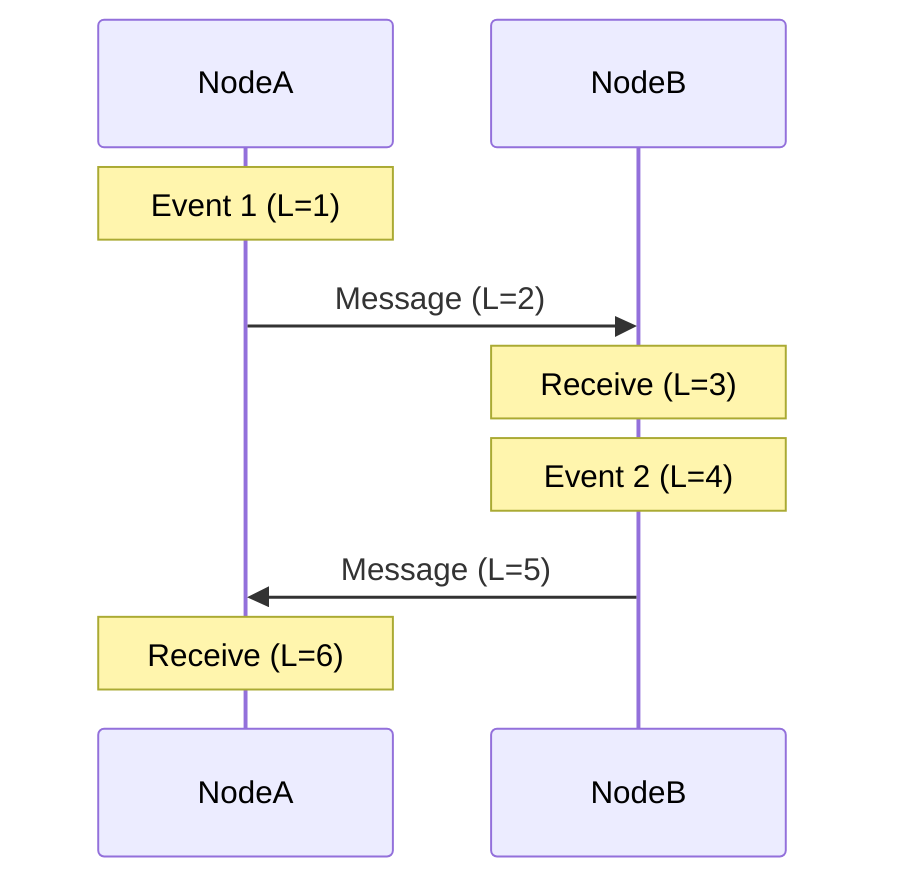
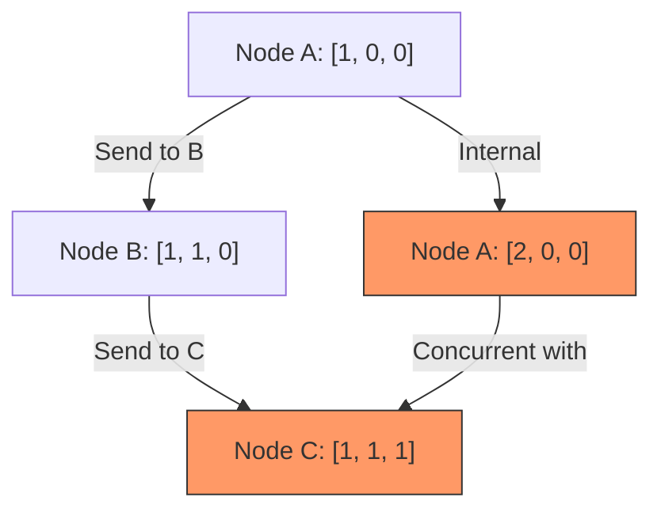

Wall clocks are a fundamental lie in distributed systems. If you have ever tried to debug a race condition across three different servers by looking at application logs, you have felt the pain of clock skew. Even with Network Time Protocol (NTP) syncing your nodes, you are looking at offsets that can range from milliseconds to seconds depending on network jitter and virtualization overhead. In a system processing thousands of requests per second, a five millisecond drift makes it impossible to determine which write actually happened last. If you rely on system time to resolve conflicts, you will eventually overwrite newer data with older data. You cannot trust the hardware quartz crystal to provide a total ordering of events across a cluster.

Leslie Lamport solved this by shifting the focus from physical time to logical causality. The core idea is that we do not actually care what time it was when an event happened. We only care if event A could have influenced event B. This happens in three ways. First, if two events occur on the same node, we know their order because the execution is sequential. Second, if node A sends a message and node B receives it, the send must have happened before the receive. Third, we apply transitivity. If A happened before B, and B happened before C, then A happened before C. This defines a partial order of events in the system.

The Lamport Timestamp algorithm is deceptively simple. Every process maintains a local counter. Before performing an internal event, the process increments its counter. When sending a message, the process includes its current counter value. When a process receives a message, it sets its local counter to the maximum of its current value and the received value, then increments it by one. This ensures that the receiver always has a timestamp greater than the sender. While Lamport timestamps give us a way to order events, they have a major limitation. If you look at two random timestamps, you cannot tell if the events were related or if they happened concurrently on different branches. You can say that if A happened before B, then the timestamp of A is less than B, but the reverse is not true.

To solve the concurrency detection problem, we use Vector Clocks. Instead of a single integer, every node maintains an array or a map of counters, one for every participating node in the system. When a node performs an internal event, it only increments its own slot in the vector. When sending a message, it sends the entire vector. Upon receiving a message, the receiver performs a pairwise maximum for every element in the two vectors and then increments its own specific index. This allows the system to detect if events are causally related or concurrent. If every element in vector A is less than or equal to the corresponding element in vector B, then A happened before B. If some elements are larger and some are smaller, the events happened concurrently and you have a conflict that needs resolution. This is exactly how DynamoDB-style databases handle multi-master writes, though it comes with the overhead of the vector growing as you add more nodes.

Vector clocks provide causality but they do not scale well in massive clusters where nodes join and leave frequently. Modern databases like CockroachDB and MongoDB often use Hybrid Logical Clocks (HLC) to get the best of both worlds. HLCs combine the physical wall clock with a logical counter. An HLC timestamp consists of a high-order bit representing the physical time and a low-order bit representing a logical counter that increments when multiple events happen within the same physical millisecond. When a node receives a message with a physical time in the future due to clock skew, the HLC catches up and keeps the logical part moving forward. This maintains the causality guarantees of Lamport clocks while keeping the timestamps close to real-world wall clock time, which is useful for human-readable logging and snapshot isolation. It prevents the system from drifting too far from reality while ensuring that we never violate the fundamental rule of distributed ordering. If you are building a system that requires strict consistency across regions, you have to stop trusting the system clock and start implementing these logical increments.
