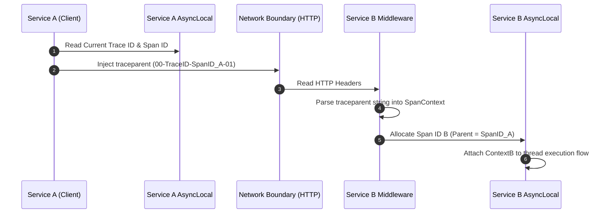

Distributed tracing relies on a simple assumption: as an execution path jumps across thread boundaries, asynchronous continuation queues, and network sockets, a unified telemetry identity must persist unbroken. When an incoming HTTP request hits an ingress gateway, transitions to a background processing queue, and queries a database, the underlying APM agent must attach every metric, log line, and span to the exact same trace ID.

Achieving this correlation without manually passing a context object through thousands of application method signatures requires deep runtime hooks. Understanding trace propagation requires examining the exact mechanics of execution context preservation within runtimes like .NET and Go, alongside wire-level serialization specifications like W3C Trace Context.

### The Anatomy of the Wire Protocol

To pass trace identity across network boundaries, observability systems rely on standardized HTTP and RPC header formats. The W3C Trace Context specification defines a uniform header layout called traceparent, accompanied by an vendor-specific state container called tracestate.

The traceparent header is an ASCII-encoded string structured as four hyphens-delimited fields:

1. Version: An 8-bit field, currently set to 00.
2. Trace ID: A 16-byte (128-bit) array formatted as 32 hexadecimal characters. This uniquely identifies the entire end-to-end distributed transaction.
3. Parent ID (or Span ID): An 8-byte (64-bit) array formatted as 16 hexadecimal characters. This represents the immediate upstream caller span that initiated the current request.
4. Trace Flags: An 8-bit bitmap field formatted as 2 hexadecimal characters. Bit 0 (0x01) dictates the sampled flag, indicating whether the trace was recorded to disk upstream.

Consider an HTTP header structured as follows:

traceparent: 00-4bf92f3577b34da6a3ce929d0e0e4736-00f067aa0ba902b7-01

When a downstream service extracts this string, it parses the byte sequence directly. The Trace ID remains identical throughout the entire call tree, while the Parent ID becomes the parent reference for the newly allocated downstream span.



### Runtime Context Management: ThreadLocal vs AsyncLocal

Before a context can be serialized onto the wire, it must live inside the runtime thread memory space. Historically, runtimes relied on ThreadLocal storage. However, in modern asynchronous architectures driven by non-blocking event loops, synchronous thread affinity breaks.

When C# executes an async/await keyword combination, or Node.js executes an await step, the runtime yields execution. The continuation callback may resume on an entirely different thread pooled from the OS thread pool. A simple ThreadLocal store loses track of the current active trace span as soon as the thread changes.

To solve this, managed runtimes implement context flow mechanisms. In .NET, this is managed by ExecutionContext and AsyncLocal<T>. In Go, it is handled via context.Context explicitly passed through call stacks. In Node.js, AsyncLocalStorage leverages V8 engine hooks.

In .NET, AsyncLocal<T> registers a location within the current ExecutionContext. When an asynchronous state machine yields, the runtime captures a reference to the active ExecutionContext. When the thread pool worker picks up the continuation task, it restores that captured ExecutionContext onto the executing thread.

```csharp
public class TraceContextAccessor
{
    private static readonly AsyncLocal<TraceContextHolder> _currentContext = new();

    public static TraceContext? Current
    {
        get => _currentContext.Value?.Context;
        set
    }
}
```

Under the hood, ExecutionContext is implemented as an immutable data structure. Mutating an AsyncLocal value does not write to a shared global memory location. Instead, it produces a shallow copy of the ExecutionContext map for the current logical branch of execution. This immutability ensures that child asynchronous tasks inherit context from their parent without contaminating sibling asynchronous operations executing concurrently on adjacent thread pool threads.

### The Inject and Extract Pipeline

Distributed tracing libraries abstract cross-process propagation through two primary operations: Inject and Extract.

The Inject operation takes the active context from memory, formats it according to protocol rules, and writes it into an outgoing carrier (such as HTTP request headers, Kafka record headers, or gRPC metadata buffers).

```csharp
public void Inject(TraceContext context, HttpRequestMessage request)
{
    var traceparentValue = $"00-{context.TraceId}-{context.SpanId}-{(context.IsSampled ? "01" : "00")}";
    request.Headers.TryAddWithoutValidation("traceparent", traceparentValue);
    
    if (!string.IsNullOrEmpty(context.TraceState))
    {
        request.Headers.TryAddWithoutValidation("tracestate", context.TraceState);
    }
}
```

The Extract operation occurs at ingress middleware. It inspects incoming metadata buffers, reconstructs a SpanContext struct, and binds it to the incoming thread execution context.

```csharp
public TraceContext Extract(HttpRequest request)
{
    if (!request.Headers.TryGetValue("traceparent", out var headerValues))
    {
        return TraceContext.CreateNew();
    }

    ReadOnlySpan<char> rawHeader = headerValues.ToString().AsSpan();
    
    // Validate length for W3C compliance (4 + 32 + 16 + 2 + 3 hyphens = 55 chars)
    if (rawHeader.Length != 55 || rawHeader[2] != '-')
    {
        return TraceContext.CreateNew();
    }

    var traceId = rawHeader.Slice(3, 32).ToString();
    var parentId = rawHeader.Slice(36, 16).ToString();
    var flags = rawHeader.Slice(53, 2).ToString();

    bool isSampled = (flags == "01");

    return new TraceContext(traceId, parentId, isSampled);
}
```

### Sampling Decision Propagation

Sampling decisions heavily dictate how trace contexts propagate across distributed topologies. A enterprise system processing millions of operations per second cannot afford the CPU, network, and storage overhead of serializing and recording every single span to disk.

Sampling strategies fall into two primary paradigms: Head-Based Sampling and Tail-Based Sampling.

Head-based sampling forces a decision at the root service of the trace. The root node evaluates a sampling probability rule or rate limiter. If the decision returns positive, bit 0 of the traceflags byte in the W3C header is set to 1. As downstream services receive this header via the Extract pipeline, they read bit 0. Downstream nodes enforce the upstream sampling decision blindly, maintaining transaction integrity across service dependencies. If bit 0 is 0, downstream agents skip span generation entirely or hold minimal volatile counters, avoiding payload allocation overhead.

Tail-based sampling defers the decision until the full transaction finishes. Incoming services sample 100% of telemetry traces locally into memory ring buffers. Once the trace completes or an unhandled exception occurs, an collector cluster evaluates whether to persist or drop the entire assembled trace tree. Tail-based sampling requires trace context propagation to remain enabled even when traces are not sampled at the root, ensuring all correlated spans arrive at the collector collector memory nodes with matching Trace IDs.

### Memory Optimization in Context Storage

At high throughput, generating string representations of Trace IDs and allocation objects for every method execution induces severe GC pressure. Telemetry collectors rely on struct-based memory layouts and zero-allocation parsing routines.

By representing 128-bit Trace IDs as custom fixed-size byte structs or using Int128 primitives directly in native runtimes, context wrappers avoid heap allocations entirely during context generation.

When parsing incoming headers, high-performance engines use ReadOnlySpan<char> or direct UTF-8 byte pointer offsets, parsing hex representations directly into stack-allocated memory. This prevents short-lived string allocations on every incoming HTTP request, ensuring observability infrastructure adds minimal latency to production application pipelines.