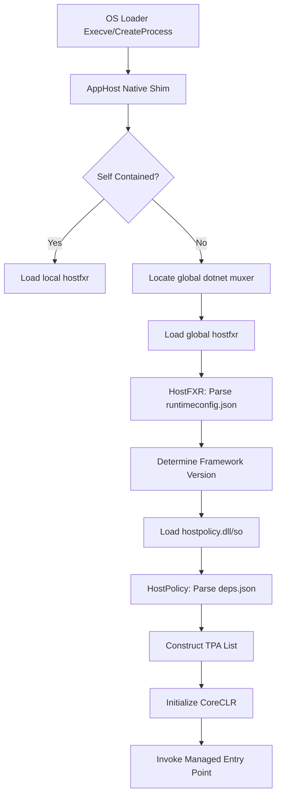

When you double click a .NET executable or run a DLL through the dotnet command, you are not actually executing managed code immediately. The operating system sees a standard PE or ELF binary, but that binary is just a hollow shell. It is a native C++ application known as the AppHost. Its only job is to find the real .NET runtime and get it to take over the process. This handoff is a complex sequence involving multiple native libraries that must locate the framework, resolve dependencies, and finally jump into the managed world. Most developers treat this as a black box, but understanding the hosting layers is vital when you are debugging startup crashes or trying to squeeze performance out of self-contained deployments.

The architecture is split into three main components that act like a relay race. First is the AppHost or the Muxer. If you run a standalone exe, that is the AppHost. If you run the dotnet command, that is the Muxer. Second is HostFXR, which stands for the Host Framework Resolver. This library is the brains of the operation. It knows how to look at your configuration files and decide which version of the runtime to load. Finally, there is HostPolicy. This is the engine that actually interprets your application's dependencies and prepares the environment for the Common Language Runtime to start.



The AppHost starts by looking for hostfxr. In a self contained application, this library sits right next to the executable. In a framework dependent app, the AppHost has to hunt for where .NET is installed on the machine. It usually checks the DOTNET_ROOT environment variable or looks in default system locations like Program Files or usr/share/dotnet. Once it finds hostfxr, it loads it into the process using standard OS calls like LoadLibrary or dlopen. This is the first critical transition. We are still in purely native code here, but we are moving from a generic loader to a .NET aware resolver.

HostFXR then opens your runtimeconfig.json file. This file contains the instructions for the runtime. It specifies whether the app needs the ASP.NET Core shared framework or just the base .NET runtime. It also handles the rollout policy. If your app asks for .NET 8.0.1 but only 8.0.5 is installed, HostFXR is the logic engine that decides that 8.0.5 is a compatible match. It calculates the paths to the actual runtime directory and loads the next runner in the chain which is hostpolicy.

HostPolicy handles the gritty details of assembly resolution. It reads the deps.json file to understand every single NuGet package your app depends on. It does not just load them though. It constructs what is called the Trusted Platform Assemblies list. This is a massive string of absolute file paths separated by semicolons. The CLR uses this list to know exactly where to find every system assembly without having to search the disk every time a class is referenced. If a DLL is not in this list, the runtime will not find it by default. HostPolicy is essentially the gatekeeper of the application's surface area.

```ascii
+---------------------------------------+
|             AppHost.exe               |
| (Native Entry Point / PE Header)      |
+---------------------------------------+
        |  loads via dlopen/LoadLib
+-------v-------------------------------+
|           hostfxr.dll/so              |
| (Logic: Versioning, Framework Search) |
+-------+-------------------------------+
        |  loads via LoadLibrary
+-------v-------------------------------+
|          hostpolicy.dll/so            |
| (Logic: deps.json, TPA list, probing) |
+-------+-------------------------------+
        |  calls coreclr_initialize
+-------v-------------------------------+
|           coreclr.dll/so              |
| (The JIT, GC, and Type System)        |
+---------------------------------------+
```

Once the TPA list is ready and the environment variables are set, HostPolicy calls coreclr_initialize inside the actual runtime library. This is the moment the garbage collector spins up and the JIT compiler readies itself. The native host passes a pointer to the managed entry point to the runtime. The runtime then transitions the execution thread from native C++ code into the managed IL of your Program.Main. This transition involves setting up the managed stack and ensuring that the ExecutionContext is properly initialized. If anything goes wrong before this point, you will not get a nice C# exception. You will get a cryptic native return code or a silent process exit because the managed exception handling infrastructure does not even exist yet. This is why checking the host's trace output by setting COREHOST_TRACE=1 is the only way to see the internal dialogue of these libraries as they struggle to find your files.
