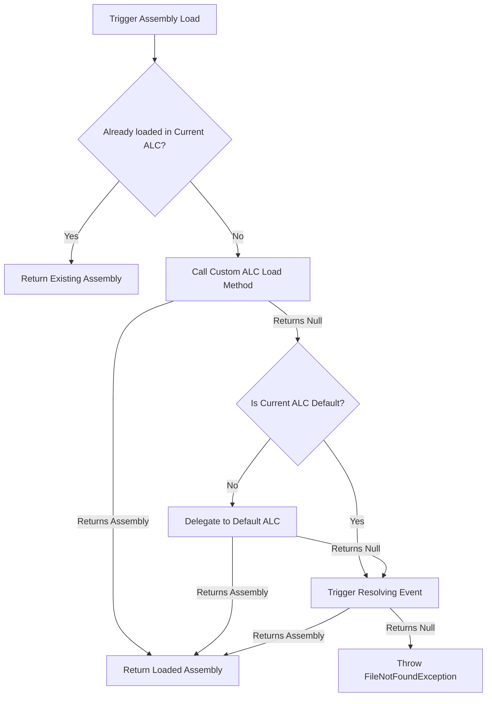

Back in the days of .NET Framework, developers relied on AppDomains to isolate code, run plugins, and unload assemblies. They acted as lightweight process boundaries within a single OS process. But AppDomains were heavy, required complex serialization protocols to pass data across boundaries, and introduced severe runtime overhead. When .NET Core was designed, AppDomains were stripped out and replaced with a much leaner mechanism called AssemblyLoadContext. Understanding how this system works under the hood is critical for building extensible systems, hot-reload engines, or plugin architectures.

At its core, AssemblyLoadContext is a runtime-managed boundary that governs how assemblies are located, loaded, and isolated. Unlike AppDomains, which simulated separate runtimes within the same process, AssemblyLoadContext instances operate on the same managed heap and share the same thread pool. This drastically reduces the overhead of passing data between contexts, but it introduces subtle complexities regarding type identity and lifetime management.

To understand how the runtime resolves a dependency, we have to look at the execution pipeline of the assembly loading engine. When a running application encounters a reference to a type that has not been loaded yet, or when code explicitly requests an assembly load, the runtime initiates a structured resolution sequence. This sequence follows a strict priority chain to prevent duplicate loading and runtime conflicts.

The resolution process begins by checking if the requested assembly is already loaded in the initiating AssemblyLoadContext. If it is, the runtime returns that instance immediately. If it is not found, the runtime invokes the overridden Load method of the current custom AssemblyLoadContext. This is where developers can inject custom file-system probing, remote network fetching, or in-memory compilation.

If the custom Load method returns null, the runtime evaluates whether the initiating context is the Default context. For custom contexts, the runtime delegates the lookup to the Default context. This delegation ensures that shared framework libraries, like System.Runtime or System.Console, are not loaded multiple times in separate contexts. If the default context locates the assembly, it returns it to the custom context. If both the custom context and the default context fail to resolve the assembly, the runtime triggers the Resolving event on the specific AssemblyLoadContext, followed by the Resolving event of the Default context. If all of these fallback mechanisms return null, the runtime throws a FileNotFoundException.

This behavior exposes a fundamental design rule of the .NET runtime. Type identity is bound to assembly identity. In .NET, a type is not merely identified by its namespace and class name. Its identity is a composite of the class name and the specific assembly instance that loaded it. If you load the exact same assembly bytes of a shared library into both the Default context and a custom context, the runtime treats them as completely distinct types.

This creates what is known as the casting trap. If you instantiate an object from the assembly loaded in your custom context, you cannot cast it to the matching class from the assembly loaded in the default context. The runtime will throw an InvalidCastException, complaining that it cannot cast Type A to Type A. To safely pass data across these boundaries without casting exceptions, you must define common interfaces in a shared contract assembly. This contract assembly must be loaded exclusively in the Default context. When the custom context loads the plugin assembly, it must delegate the resolution of the contract assembly to the Default context. This ensures that both the host and the plugin reference the exact same type metadata.

Managing the lifetime of these isolated contexts is where developers encounter the most significant bugs, particularly when dealing with collectible contexts. When you instantiate an AssemblyLoadContext with the collectible flag set to true, you gain the ability to unload the entire context and all of its loaded assemblies from memory by calling the Unload method. This is essential for features like live plugin reloading, where you want to reclaim memory after unloading an old version of a module.

However, unloading is cooperative and asynchronous. The runtime does not forcefully terminate threads running code inside the target context, nor does it violently clear pointers. Instead, calling the Unload method simply marks the context as unloading and severs the runtime-internal roots. The actual reclamation of memory is deferred until the next garbage collection cycle, and it will only succeed if there are absolutely zero references keeping the context alive.

Tracking down leaks in collectible contexts is famously difficult because of how easily references can escape. A single strong reference from the host application to an object instantiated within the collectible context is enough to pin the entire context in memory. This pinning effect cascades because the object references its type, the type references its assembly, the assembly references its AssemblyLoadContext, and the context references every other assembly loaded inside it. 

Common leaks are caused by registering event handlers. If a class inside the collectible context subscribes to a static event defined in the host application, the host retains a strong reference to the subscriber. This keeps the subscriber and its entire loading context alive indefinitely. To prevent this, developers must use weak references or implement strict cleanup routines that unsubscribe all events before unloading. JIT compiled state machines, such as those generated by async tasks or enumerators, can also pin the context if they are still scheduled on the ThreadPool or referenced by an active call stack when the unload operation is triggered.

To diagnose these leaks, you can use diagnostic tools like dotnet-dump to analyze process memory. By tracking the AssemblyLoadContext instance and evaluating its garbage collection root path, you can pinpoint the exact reference chain keeping the context alive. In a healthy system, the AssemblyLoadContext instance should have no root paths once the garbage collector has run after an unload request.

Aside from managed code isolation, custom AssemblyLoadContext instances are highly effective for managing native library dependencies. When managed code uses P/Invoke to call a function in a native dynamic library, the runtime relies on the AssemblyLoadContext of the calling assembly to locate and load the binary. By overriding the LoadUnmanagedDll method in a custom context, you can dynamically resolve platform-specific paths for native files.

This is incredibly useful for deploying multi-platform plugins that rely on native C or C++ binaries. In your custom context, you can inspect the current operating system and architecture, compute the correct file extension, and load the dynamic library from a targeted subdirectory. The custom context handles the OS-level library loading handles, ensuring that native dependencies are isolated to the lifetime of the managed plugin that requires them.
