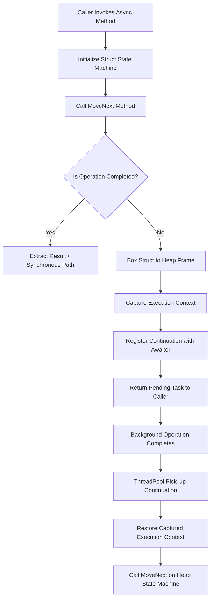

# Under the Hood of C# Async/Await: Compiler State Machines, ExecutionContext Flow, and TaskScheduler Mechanics

When you attach the async modifier to a C# method and await a pending operation, the C# compiler performs a massive structural rewrite. Synchronous execution flows straight through a thread stack, but asynchronous execution requires stack frames to be suspended, detached from physical OS threads, and later restored on entirely different threads. The illusion of continuous execution is maintained through a combination of compiler code lowering, runtime primitives, ambient context flows, and thread pool scheduling.

To understand how async and await operate under the hood, we must look beyond high-level syntax and inspect the generated code structures. The Roslyn compiler rewrites your linear code into an explicit state machine struct, delegates suspension management to AsyncTaskMethodBuilder, propagates ambient execution context across thread switches, and uses TaskScheduler to schedule continuations back onto the thread pool.



## Compiler Lowering: The Anatomy of IAsyncStateMachine

When Roslyn encounters a method declared with async Task<T>, it erases the original method body and replaces it with a stub that initializes a generated value type implementing the IAsyncStateMachine interface. The compiler creates a struct specifically designed to represent the frame state of the suspended execution.

This generated struct contains several critical fields. A state field, typically named state with an initial value of minus one, tracks the execution progress. Local variables from the original method are promoted to fields on this struct so their values survive across thread context switches. The compiler also places an instance of AsyncTaskMethodBuilder<T> into the struct to orchestrate the return task and manage state transitions. Finally, specialized awaiter fields store the awaiter objects for pending operations.

Consider a simple async method that reads data from a socket and processes it. In its uncompiled form, code appears as sequential lines inside a single scope. Once lowered, Roslyn creates a MoveNext method containing a large switch statement keyed off the state field. Each await boundary splits the original method into discrete executable chunks. Before suspending execution at an incomplete awaiter, the state variable is updated to point to the next code segment, and the awaiter is stored inside the struct field.

The choice to make the state machine a struct rather than a class is a deliberate performance optimization. If an async method completes synchronously, which occurs frequently in high-throughput network and file I/O operations, the state machine remains on the stack. No heap allocation occurs, avoiding garbage collection pressure entirely. A heap allocation only occurs when an operation cannot complete immediately and execution must suspend.

## The Awaiter Pattern and Task Completion Protocol

C# does not hardcode the await keyword to work exclusively with System.Threading.Tasks.Task. Instead, the language uses pattern matching known as the awaiter pattern. Any type that exposes a GetAwaiter method returning an object that implements the INotifyCompletion or ICriticalNotifyCompletion interface can be awaited.

The awaiter object must satisfy three structural requirements. It must implement a boolean property called IsCompleted. It must provide a method called OnCompleted or UnsafeOnCompleted that accepts an Action continuation. Lastly, it must provide a GetResult method that returns the operational result or rethrows exceptions.

When execution hits an await expression, the state machine calls GetAwaiter on the target object and evaluates IsCompleted. If IsCompleted returns true, execution continues synchronously through the current MoveNext block without pausing. The thread remains on the fast path, avoiding context capturing and scheduling overhead.

If IsCompleted returns false, the slow path is triggered. The state machine transitions from stack execution to heap allocation. The AsyncTaskMethodBuilder invokes AwaitUnsafeOnCompleted, passing references to the awaiter and the state machine. Because the state machine is a value type on the stack, passing it to the builder causes Roslyn to box the struct onto the heap. This boxed instance preserves the promoted local variables and execution state across async jumps.

```
+-------------------------------------------------------+
| Stack Execution Frame (Synchronous Path)              |
|                                                       |
| [ Caller Frame ] ---> [ Generated StateMachine Struct]|
|                                   |                   |
|                        IsCompleted == true?           |
|                                   |                   |
|                            (Yes: No Heap Alloc)       |
+-------------------------------------------------------+
                                    | (No: Suspends)
                                    v
+-------------------------------------------------------+
| Heap Execution Frame (Asynchronous Continuation Path) |
|                                                       |
| [ Boxed StateMachine Object ]                         |
|   ├── int <>1__state = 0                              |
|   ├── AsyncTaskMethodBuilder <>t__builder             |
|   ├── Local Variables (Promoted Fields)               |
|   └── Captured ExecutionContext                       |
+-------------------------------------------------------+
```

When an exception occurs within an async method, it is caught inside the MoveNext method wrapper and passed to AsyncTaskMethodBuilder.SetException. The builder stores the exception on the returned Task object. When the caller awaits that Task, the awaiter's GetResult method is called, which calls ExceptionDispatchInfo.Throw. This mechanism preserves the original stack trace across asynchronous boundaries without resetting the call stack.

## Ambient Context Flow: ExecutionContext vs SynchronizationContext

One of the most complex aspects of asynchronous execution in .NET is propagating contextual state across thread switches. The execution environment must track security identities, ambient data, and thread synchronization rules as processing moves from thread to thread. Two primary primitives govern this behavior: ExecutionContext and SynchronizationContext.

ExecutionContext acts as a container for ambient state that belongs to a logical thread of execution rather than a physical OS thread. Objects like AsyncLocal<T> store data inside the ExecutionContext. When execution pauses at an await boundary, the runtime captures the current ExecutionContext via ExecutionContext.Capture. Once the asynchronous operation completes and a thread pool worker picks up the continuation, ExecutionContext.Run restores the captured context onto the new worker thread before MoveNext executes. This guarantees that logical context flows seamlessly across disparate thread pool threads.

SynchronizationContext serves a different purpose. It controls where work is executed, abstractions useful for UI frameworks like WinForms, WPF, or MAUI, and legacy ASP.NET runtime engines. In these environments, UI elements can only be modified on a single dedicated UI thread. When an async operation completes on a background thread pool thread, SynchronizationContext.Post marshals the continuation delegate back to the UI message loop.

In modern backend services like ASP.NET Core, SynchronizationContext has been completely removed to boost throughput. Every continuation runs on a standard ThreadPool thread without thread-affinity dispatching.

Developers control this context capturing behavior using ConfigureAwait. Calling ConfigureAwait(false) returns a ConfiguredTaskAwaitable struct whose awaiter skips capturing the current SynchronizationContext. This prevents unnecessary thread marshaling and avoids potential deadlocks when blocking on asynchronous code in thread-affinitized environments. However, ConfigureAwait(false) does not disable ExecutionContext flow. AsyncLocal<T> data continues to flow across await points regardless of the ConfigureAwait setting.

## ThreadPool Scheduling and Continuation Dispatch Mechanics

When a background I/O operation completes, such as a socket receive completed via Linux epoll or Windows IOCP, the operating system notifies the runtime thread pool. At this point, the registered continuation delegate must be scheduled for execution.

The AsyncTaskMethodBuilder uses ICriticalNotifyCompletion.UnsafeOnCompleted when available instead of INotifyCompletion.OnCompleted. The prefix unsafe indicates that the method skips security identity checks, which prevents duplicating execution context capturing operations that the builder has already handled internally.

The continuation is packaged as a work item and queued to the .NET ThreadPool. The thread pool uses a two-level work queue architecture. A global queue receives work items submitted by external threads, while each worker thread maintains its own local work-stealing queue. When a thread pool worker executes an async continuation, it pushes newly scheduled continuations onto its local queue. This design maximizes L1/L2 cache locality by executing related continuations on the same thread sequentially.

If a worker thread exhausts its local queue, it attempts to steal work from the local queues of other worker threads before falling back to checking the global queue. Once a worker thread dequeues the continuation work item, it invokes ExecutionContext.Run using the captured context, restoring AsyncLocal<T> values. Finally, it invokes the state machine's MoveNext method, advancing the state variable and executing the next code block until the next await statement or method completion.

By combining Roslyn lowering, value type state machines, execution context capturing, and thread pool work-stealing queues, .NET achieves a highly optimized asynchronous execution engine that balances developer ergonomics with extreme hardware efficiency.
