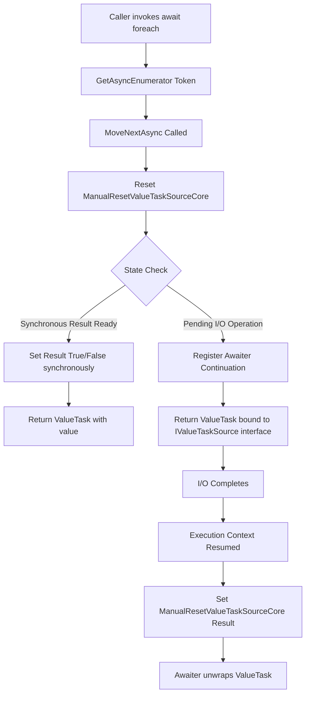
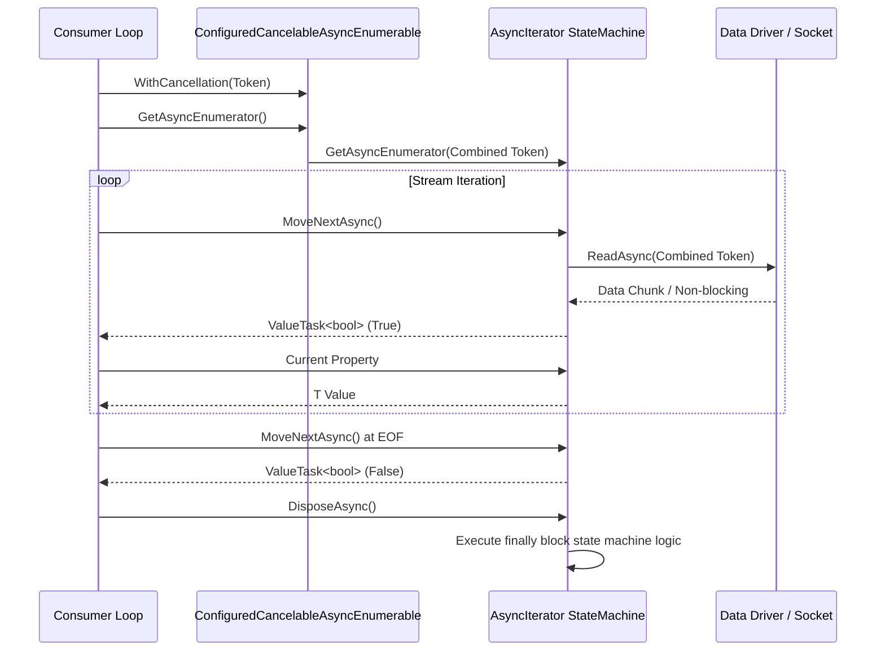

Asynchronous data streams in modern .NET backends rely heavily on `IAsyncEnumerable<T>`. Before its introduction in C# 8, developers forced to stream asynchronous data batches had to choose between returning full in-memory arrays via `Task<IEnumerable<T>>`, wrapping reactive primitives like `IObservable<T>`, or manually constructing thread-safe queue channels. `IAsyncEnumerable<T>` unified pull-based iterator semantics with non-blocking asynchronous execution.

While the surface syntax looks like simple syntactic sugar combining `yield return` with `await`, the code emitted by the Roslyn compiler under the hood is fundamentally different from standard synchronous iterators and traditional `async Task` methods. Understanding how the CLR executes these structures requires analyzing state machine lowering, `ValueTask` backing sources, and cancellation token injection pipelines.

### The Interface Contract

To understand what the compiler generates, first examine the foundational runtime interfaces in the `System.Collections.Generic` namespace:

```csharp
public interface IAsyncEnumerable<out T>
{
    IAsyncEnumerator<T> GetAsyncEnumerator(CancellationToken cancellationToken = default);
}

public interface IAsyncEnumerator<out T> : IAsyncDisposable
{
    ValueTask<bool> MoveNextAsync();
    T Current { get; }
}
```

Unlike synchronous `IEnumerator<T>` where `MoveNext()` returns a boolean directly, `IAsyncEnumerator<T>` returns a `ValueTask<bool>`. The decision to use `ValueTask<bool>` rather than `Task<bool>` is pivotal. In a stream yielding millions of items, allocating a standard `Task` heap object for every yield iteration would trigger immense garbage collection pressure. `ValueTask<bool>` allows synchronous completions to execute entirely allocation-free while delegating asynchronous completions to reusable backing sources.

### Roslyn State Machine Lowering

When writing an asynchronous iterator method, Roslyn transforms the method body into a hidden compiler-generated struct or class that implements both `IAsyncEnumerable<T>` and `IAsyncEnumerator<T>`, as well as `IAsyncStateMachine` and `IValueTaskSource<bool>`.

Consider a typical async stream provider:

```csharp
public async IAsyncEnumerable<int> GenerateSequenceAsync([EnumeratorCancellation] CancellationToken ct = default)
{
    for (int i = 0; i < 3; i++)
    {  
        await Task.Delay(100, ct);
        yield return i;
    }
}
```

Roslyn lowers this logic into a state machine struct layout roughly equivalent to this pseudo-C# transformation:

```csharp
[CompilerGenerated]
private sealed class <GenerateSequenceAsync>d__0 : IAsyncEnumerable<int>, IAsyncEnumerator<int>, IAsyncStateMachine, IValueTaskSource<bool>, IValueTaskSource
{
    public int <>1__state;
    public AsyncIteratorMethodBuilder <>v__promiseOfValueOrEnd;
    public int <>w__disposeMode;
    
    // Parameter captures
    public CancellationToken ct;
    public CancellationToken <>3__ct;
    
    // Local variables
    private int <i>5__1;
    private int <>4__this;
    private int <>2__current;
    
    // Internal ValueTask orchestration source
    private ManualResetValueTaskSourceCore<bool> _valueTaskSource;

    public ValueTask<bool> MoveNextAsync()
    {
        _valueTaskSource.Reset();
        var stateMachine = this;
        <>v__promiseOfValueOrEnd.MoveNext(ref stateMachine);
        return new ValueTask<bool>(this, _valueTaskSource.Version);
    }

    public int Current => <>2__current;
    
    // State machine execution loop
    void IAsyncStateMachine.MoveNext()
    {
        // Compiler generated state transitions
    }
}
```



### Allocation Avoidance Mechanics

The fundamental goal of the `IAsyncEnumerable<T>` infrastructure is to allow infinite streaming without continuously allocating object headers on the Managed Heap. Roslyn achieves this by merging the Enumerable, the Enumerator, and the `IValueTaskSource` into a single state machine object.

When `MoveNextAsync()` is invoked, if the operation completes synchronously (for instance, reading from an internal socket buffer that already contains data), no task object is created. The method populates its internal current field, sets the result state in its `ManualResetValueTaskSourceCore<bool>` instance, and returns a struct `ValueTask<bool>` carrying a plain integer token version.

When the operation must truly wait asynchronously for I/O:

1. The state machine captures its current execution state into its internal integer state field.
2. It registers its own continuation with the underlying asynchronous primitive (such as `Socket.ReceiveAsync` or `Task.Delay`).
3. It returns a `ValueTask<bool>` wrapping a reference to `this` cast to `IValueTaskSource<bool>`.
4. Once the I/O completes, the system calls `SetResult()` on the internal `ManualResetValueTaskSourceCore<bool>` instance.
5. The caller's continuation wakes up, reads `Current`, and processes the item.
6. The next call to `MoveNextAsync()` invokes `Reset()` on the `ManualResetValueTaskSourceCore<bool>` instance, recycling the exact same state machine object for the next yield cycle.

Because the state machine instance recycles itself across iterations, the entire life cycle of an `await foreach` loop streaming millions of records can result in exactly one single heap allocation: the initial state machine class object allocated when calling `GetAsyncEnumerator()`.

### State Machine Execution Loop Demystified

Inside the lowered `IAsyncStateMachine.MoveNext()` method, Roslyn constructs a jump table using a switch statement over the state field. Below is a simplified look at how states transition across yield boundaries:

```csharp
void IAsyncStateMachine.MoveNext()
{
    int num = this.<>1__state;
    try
    {
        TaskAwaiter awaiter;
        if (num != 0)
        {
            if (num == -2) return;	// Already completed
            this.<i>5__1 = 0;
            goto IL_LOOP_CHECK;
        }
        else
        {
            // Resume from await Task.Delay
            awaiter = this.<>u__1;
            this.<>u__1 = default;
            this.<>1__state = -1;
        }

        // Complete the awaiter
        awaiter.GetResult();
        
        // yield return i;
        this.<>2__current = this.<i>5__1;
        this.<>1__state = 1;	// Next state checkpoint
        this._valueTaskSource.SetResult(true);
        return;

        IL_STEP_INCREMENT:
        this.<i>5__1++;
        
        IL_LOOP_CHECK:
        if (this.<i>5__1 < 3)
        {
            // await Task.Delay(100, ct);
            awaiter = Task.Delay(100, this.ct).GetAwaiter();
            if (!awaiter.IsCompleted)
            {
                this.<>1__state = 0;
                this.<>u__1 = awaiter;
                this.<>v__promiseOfValueOrEnd.AwaitUnsafeOnCompleted(ref awaiter, ref this);
                return;
            }
            // If completed synchronously, skip yield suspension overhead
            goto IL_RESUME_SYNC;
        }
        
        // Reached end of iteration
        this.<>1__state = -2;
        this._valueTaskSource.SetResult(false);
    }
    catch (Exception ex)
    {  
        this.<>1__state = -2;
        this._valueTaskSource.SetException(ex);
    }
}
```

### Cancellation Token Injection Mechanics

Passing cancellation tokens into deep asynchronous streams presents a distinct problem. The stream consumer dictates the lifetime of the iteration loop, but the stream producer defines the method signature.

To decouple these concerns, C# provides the `[EnumeratorCancellation]` attribute in combination with the `.WithCancellation()` extension method.

```csharp
public async IAsyncEnumerable<DataRecord> ReadDbStreamAsync([EnumeratorCancellation] CancellationToken token = default)
{
    while (await _reader.ReadAsync(token))
    {
        yield return ExtractRecord(_reader);
    }
}
```

When a consumer writes:

```csharp
await foreach (var item in service.ReadDbStreamAsync().WithCancellation(userCancellationToken))
{
    // Process record
}
```

The compiler performs parameter mapping inside the lowered wrapper:

1. The method `.WithCancellation(userCancellationToken)` returns a `ConfiguredCancelableAsyncEnumerable<T>` struct wrapper.
2. Calling `GetAsyncEnumerator()` on this wrapper extracts the token provided to `WithCancellation` and passes it into `ReadDbStreamAsync(userCancellationToken)`.
3. If a token was already passed directly into the method call originally, Roslyn's generated state machine logic combines both tokens into a combined source if necessary, ensuring cancellation signals trigger immediate state machine cleanup.



### Proper Resource Disposal via IAsyncDisposable

Streams frequently encapsulate unmanaged handles, database cursors, or network sockets. Standard synchronous iterators handle resource disposal via `IDisposable` generated inside `try...finally` blocks. For asynchronous streams, resource teardown itself requires asynchronous execution.

Roslyn handles asynchronous disposal inside `IAsyncDisposable.DisposeAsync()` by executing state machine logic with a special disposal mode flag (`<>w__disposeMode`).

When `DisposeAsync()` is called:

1. The state machine checks if it is currently suspended at an `await` or `yield` state.
2. It transitions the internal state variable to run the `finally` handlers associated with the current yield state index.
3. Any `await using` or `await` statements located within `finally` blocks are executed asynchronously.
4. The method returns a `ValueTask` that completes once all enclosing cleanups finalize.

This guarantees that network connections and database transactions are gracefully closed, even if the consumer breaks out of an `await foreach` loop early via a `break` or thrown exception.

### Benchmark and Performance Considerations

When writing high-performance stream handlers, minor structural choices impact the GC collector profile:

1. Always return `IAsyncEnumerable<T>` directly from method signatures instead of wrapping streams inside `Task<IAsyncEnumerable<T>>`.
2. Prefer passing `CancellationToken` using `WithCancellation()` at the consumption site rather than hardcoding tokens inside internal loop bodies.
3. Avoid converting `IAsyncEnumerable<T>` to `IEnumerable<Task<T>>` or invoking `.ToList()` methods across network boundaries, as this immediately forces whole-dataset heap allocation and negates the memory benefits of stream processing.

By leveraging Roslyn's state machine lowering techniques, single-allocation recycled structures, and `ManualResetValueTaskSourceCore<bool>` backing primitives, `IAsyncEnumerable<T>` provides high-throughput streaming capabilities across modern .NET application architectures.