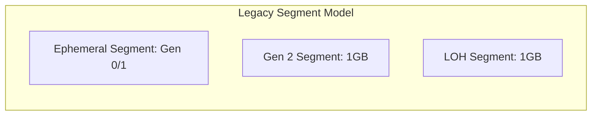
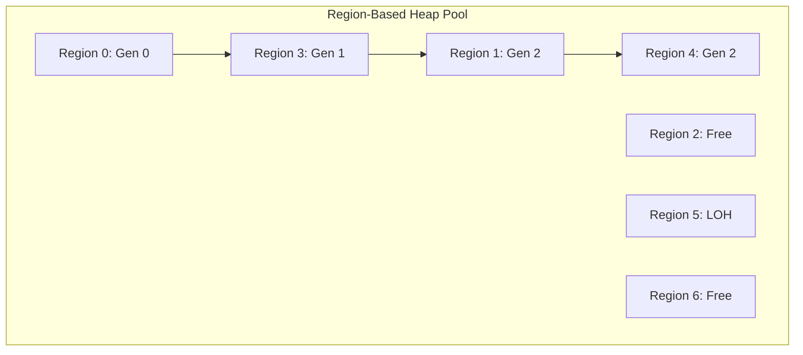
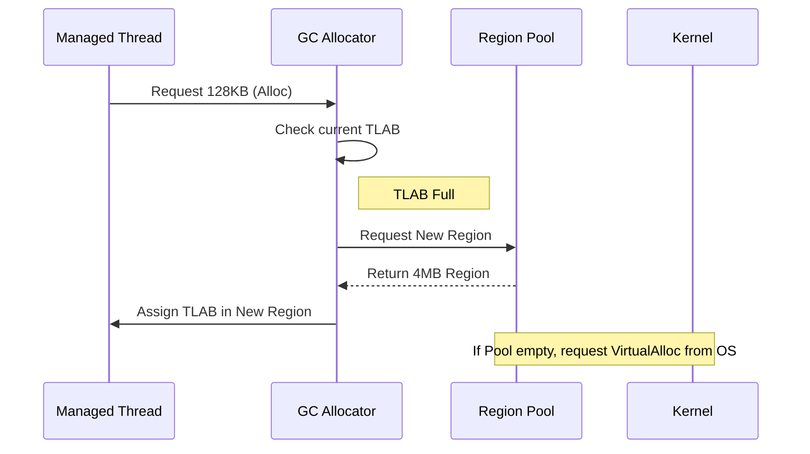

For decades, the .NET Garbage Collector operated on a concept of segments. If you were running a 64-bit process, the GC would go to the OS and grab a massive 1GB chunk of memory for the second generation and the Large Object Heap. These segments were monolithic and rigid. When the GC needed more space, it committed another huge segment. This worked for simple apps, but it created a massive headache for modern, containerized environments where memory efficiency is the difference between a stable service and an OOM-killed process. Starting with .NET 7, the runtime team flipped the script by moving to a Region-based heap. This was not a minor tweak. It was a fundamental re-architecture of how the engine perceives and manages the address space.

In the old world, the heap looked like a series of long, continuous strips. Generation 0 and Generation 1 were packed into an ephemeral segment, while Generation 2 and the LOH occupied their own dedicated segments. This created a structural problem because you could have a 1GB segment that was 90 percent empty, yet the GC couldn't easily give that memory back to the OS or use it for a different generation. The segment was the unit of ownership, and it was too large to be flexible.

The Region-based approach breaks this down into smaller, uniform blocks. In current implementations, these regions are typically 4MB in size. Instead of thinking about the heap as three or four giant strips, the GC now sees a vast pool of these 4MB regions. When a generation needs more space, it just claims an empty region from the pool. This means the physical layout of the heap is no longer tied to the logical age of the objects. You might have a Gen 2 region sitting right next to a Gen 0 region in memory. This granularity allows the GC to be much more aggressive about returning memory to the operating system. If a region is empty, it is gone. There is no need to wait for an entire 1GB segment to clear out.

Managing these regions requires a sophisticated tracking system. The GC maintains a global list of all regions and their current state. A region can be in several states: it can be free, it can be in use by a specific generation, or it can be in a 'decommitted' state where the address space is reserved but the physical RAM is returned to the kernel. This state machine is the core of the new allocator. When you allocate an object, the thread-local allocation buffer (TLAB) pulls from the current region assigned to Gen 0. Once that 4MB region is full, the GC doesn't necessarily trigger a full collection. It can just go to the free list and grab another region.

One of the biggest wins here is how the Large Object Heap is handled. Historically, the LOH was a source of constant fragmentation because objects there are rarely moved. In the segment model, a single long-lived large object could pin an entire segment open forever. With regions, the LOH is just another set of regions. If you allocate a massive array that spans three regions, those three regions are marked as LOH. When that array is eventually collected, those three 4MB regions return to the pool. They don't leave a 1GB hole in your address space. They just become free regions that can now be used for Gen 0 or Gen 2.

Internal record keeping also changed. In the segment model, the GC used boundaries (start and end addresses) to determine which generation an object belonged to. With regions, every region has a header that explicitly states its generation. When the GC is traversing the heap during the mark phase, it can quickly identify the generation of any object by looking at the region metadata associated with its memory address. This makes the write barrier slightly more complex but significantly more flexible. The GC uses a bitmask or a lookup table to map memory addresses to region structures, which provides O(1) access to region metadata.

Performance implications are subtle but profound. There is a slight overhead in managing the region list and the increased number of metadata lookups, but this is offset by the reduction in pause times for certain scenarios. Because the GC can now 'decommit' memory at a 4MB granularity, the working set of the application stays much tighter. This is particularly noticeable in cloud environments like AWS Lambda or Azure Functions where you are billed for your memory footprint or where tight memory limits lead to aggressive swapping. The new system handles 'memory spikes' much better because it can release the spike's memory almost immediately after the collection, rather than holding onto a massive segment because a single object survived at the very end of it.

There is also the benefit of better concurrency. In the segment model, adding a new segment was a heavyweight operation that often required global locks. With regions, the pool management can be made more granular. Multiple heaps (in Server GC mode) can trade regions more efficiently. If one processor is under heavy allocation pressure and another is idle, the GC can rebalance the regions between the heaps with much less contention than trying to split a segment. It turns the memory of your process into a fluid marketplace of blocks rather than a set of rigid, immovable territories.
