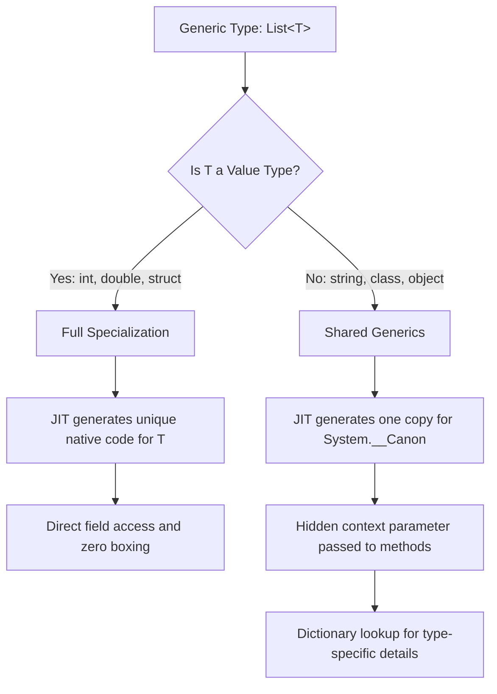

Java developers often complain about type erasure, and they should. In the Java world, generics are basically a polite fiction. The compiler checks your types, then immediately rips that information away and replaces everything with Object. You lose type information at runtime, and you certainly don't get any performance wins from specialized code. .NET took a completely different path. When you write a generic class in C#, the runtime actually knows what those types are. This isn't just about avoiding casts. It is a fundamental architecture choice that dictates how the JIT compiler generates machine code, how memory is laid out, and why your code runs faster than the equivalent Java bytecode.

When you compile a C# assembly, the Intermediate Language (IL) preserves the generic placeholders. It is not until the JIT compiler gets its hands on the code at runtime that the real magic happens. The JIT looks at the type argument you provided and asks a critical question: is this a value type or a reference type? The answer to that question triggers two entirely different code generation strategies. One leads to specialized copies of machine code, while the other leads to a clever form of code sharing that balances memory usage with execution speed.

If you provide a value type like an int or a double, the JIT performs full specialization. Because value types have different sizes (an int is 4 bytes, a double is 8), the JIT cannot reuse the same machine code. The assembly instructions for moving 4 bytes into a register are literally different from those moving 8 bytes. More importantly, value types in generics avoid boxing. If you have a List of int, the underlying array is a contiguous block of integers. There are no pointers to objects on the heap and no pressure on the garbage collector. Each unique value type gets its own dedicated version of the machine code, optimized specifically for that type's memory layout and alignment.

Reference types work differently because they are all the same size on the wire. Whether it is a String, a Customer object, or a FileStream, they are all just 64-bit pointers on a modern machine. The JIT exploits this symmetry through a mechanism called Shared Generics. Instead of generating a new copy of the code for every class in your system, which would cause massive code bloat and blow out the instruction cache, the JIT compiles one version of the code that works for all reference types. Internally, .NET calls this canonical representation System.__Canon. Every List of reference types shares the same executable instructions. 

Sharing code among reference types creates a problem though. How does the shared code know which specific type it is dealing with? If you have a static field on a generic class or you need to instantiate a new T, the shared code can't just guess. The runtime solves this by injecting a hidden parameter into the method call. This parameter points to a runtime dictionary. This dictionary is a lookup table that contains the specific MethodTable pointers, constructor addresses, and static field locations for the actual type being used. When you call a method on List of string, the caller silently passes a pointer to the string-specific generic dictionary so the shared code can do the right thing.

This architecture is why .NET generics feel so much more powerful than their counterparts in other managed languages. You get the best of both worlds. For performance-critical math and data structures using structs, you get raw, specialized machine code that rivals C++. For broad application logic using classes, you get memory-efficient shared code that keeps your binary footprint small. It is a complex dance involving the JIT, the loader, and the type system, but it is the reason why a List of int in C# is so much more efficient than an ArrayList of Integer in Java. You aren't just saving a few bytes. You are avoiding the indirection and metadata stripping that plagues other runtimes.
