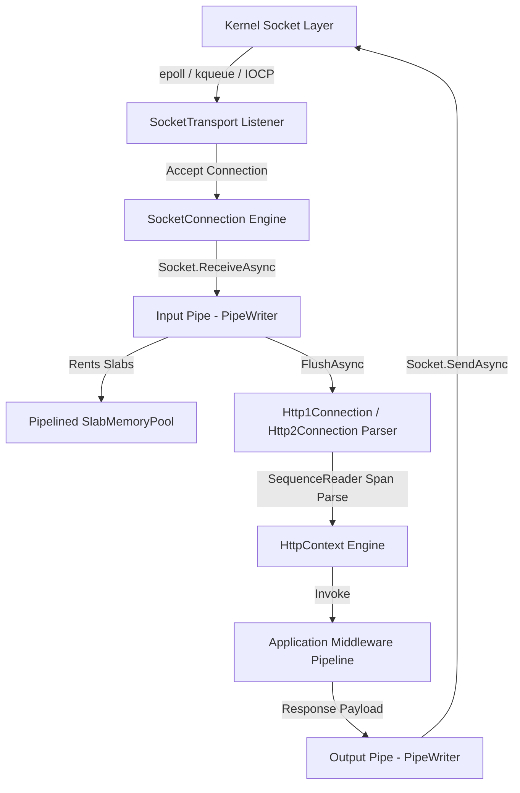
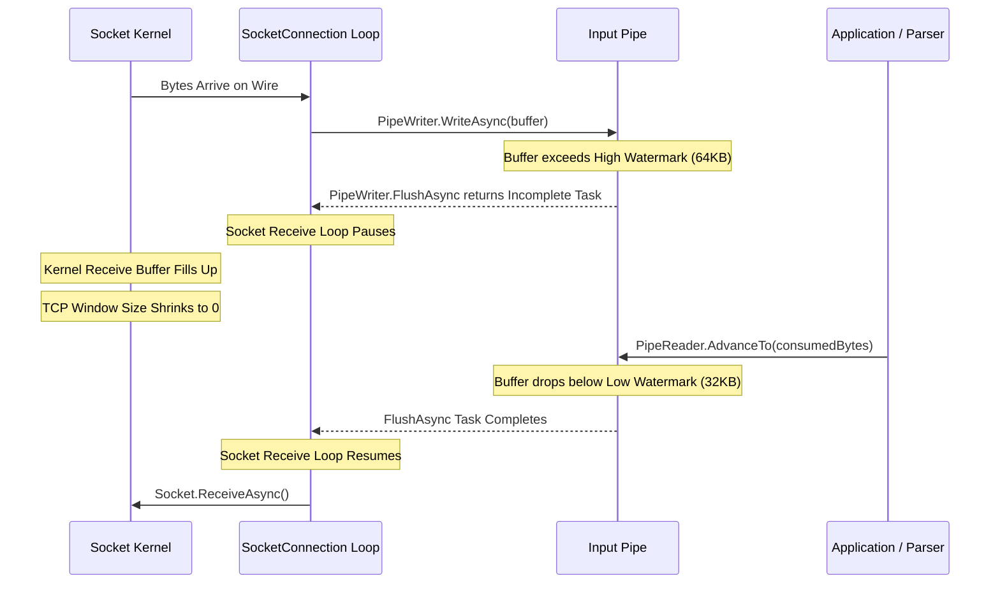

Early ASP.NET applications ran on IIS using host adapters like System.Web, dragging decades of Windows web server legacy along for the ride. When Microsoft built ASP.NET Core from scratch, they needed a web server that could match the raw throughput of Node.js, Go, or Netty. The result was Kestrel, a cross-platform, asynchronous, non-blocking web server written entirely in C#. 

Modern Kestrel processes millions of HTTP requests per second per core. It achieves this level of performance by eliminating managed allocations on every request pathway. Instead of allocating C# strings for HTTP headers and byte array buffers for socket payloads, Kestrel coordinates low-level socket abstractions, lock-free memory pools, and state machine byte parsing.



### The Decoupled Architecture

Kestrel architecture divides responsibility cleanly into three independent tiers. At the bottom layer sits the transport layer, responsible for binding to network interfaces, accepting TCP connections, and driving raw byte streams in and out of the operating system socket layer. Above the transport layer sits the protocol engine, which processes stream frames, parses HTTP request headers, manages HTTP/2 multiplexing, and constructs response frames. The top layer is the hosting engine, which builds the standard HttpContext instance and hands it over to the ASP.NET Core middleware pipeline.

This separation means Kestrel can swap out transport mechanisms without touching protocol parsing logic. In early versions, Kestrel relied on libuv to provide cross-platform asynchronous I/O. As .NET performance matured, the team rewrote the default transport to use managed sockets backed by System.Net.Sockets directly. The modern socket transport leverages native OS mechanisms like epoll on Linux, kqueue on macOS, and I/O Completion Ports (IOCP) on Windows through zero-overhead runtime abstractions.

### SocketTransport Engine and Async Socket Execution

When Kestrel boots, SocketTransport creates a listener socket bound to the designated IP endpoint. Incoming connections hit a dedicated accept loop running on the .NET ThreadPool. When a client initiates a TCP handshake, the OS kernel completes the connection and places it in the socket queue. Kestrel accepts the socket using Socket.AcceptAsync, which returns an active Socket object.

For every established socket, Kestrel instantiates a SocketConnection object. This object acts as the bridge between raw network I/O and application-level memory streams. SocketConnection creates two System.IO.Pipelines instances. The Input pipe handles raw data read off the socket to be parsed by the server. The Output pipe handles response bytes generated by the application to be written back across the wire.

```
+-----------------------------------------------------------------------------+
|                           Kernel Socket Layer                               |
+-----------------------------------------------------------------------------+
                                       |
                   Socket.ReceiveAsync() / Socket.SendAsync()
                                       v
+-----------------------------------------------------------------------------+
|                          Kestrel SocketTransport                            |
|  +---------------------------------+   +---------------------------------+  |
|  | SocketConnection Read Loop      |   | SocketConnection Write Loop     |  |
|  +---------------------------------+   +---------------------------------+  |
+-----------------------------------------------------------------------------+
               | PipeWriter.Flush()                   ^ PipeReader.ReadAsync()
               v                                      |
+-----------------------------------------------------------------------------+
|                            System.IO.Pipelines                              |
|  +---------------------------------+   +---------------------------------+  |
|  |  Input Pipe (Network -> Parser) |   |  Output Pipe (Parser -> Network) |  |
|  |  Allocated from SlabMemoryPool  |   |  Allocated from SlabMemoryPool  |  |
|  +---------------------------------+   +---------------------------------+  |
+-----------------------------------------------------------------------------+
               | PipeReader.ReadAsync()               ^ PipeWriter.Flush()
               v                                      |
+-----------------------------------------------------------------------------+
|                       Http1Connection / Http2Connection                     |
|  +-----------------------------------------------------------------------+  |
|  | Zero-Allocation SequenceReader Span Parser & Header Dictionary Table  |  |
|  +-----------------------------------------------------------------------+  |
+-----------------------------------------------------------------------------+
                                       |
                              Creates HttpContext
                                       v
+-----------------------------------------------------------------------------+
|                     ASP.NET Core Application Middleware Pipeline            |
+-----------------------------------------------------------------------------+
```

To drive high-throughput I/O without lock contention, SocketConnection spins up two separate asynchronous loops. The receive loop continuously calls Socket.ReceiveAsync to poll the network socket for data. The send loop awaits PipeReader.ReadAsync on the Output pipe and calls Socket.SendAsync whenever response data becomes ready.

These socket calls utilize internal runtime structures like SocketAwaitableEventArgs to minimize allocation overhead. Rather than allocating Task objects on every read or write, the transport reuses awaitable events attached directly to the connection context. The thread executing the receive loop never blocks. If data is available on the kernel socket buffer, the runtime fills the pipeline buffer immediately. If no data is available, the loop registers an asynchronous callback with the OS event notifications and yields its thread back to the runtime pool.

### Memory Management with SlabMemoryPool

Traditional web frameworks allocate byte arrays to read incoming network data. Under heavy traffic, creating thousands of temporary 4KB byte arrays per second destroys performance by triggering constant Garbage Collection cycles. Garbage collection pauses destroy system latency predictability.

Kestrel avoids this by relying on SlabMemoryPool, a specialized implementation of System.Buffers.MemoryPool. Instead of allocating small arrays on demand, SlabMemoryPool allocates huge contiguous memory blocks called slabs, typically 128KB in size. These slabs are allocated as pinned arrays or unmanaged memory, preventing the GC from reallocating or moving them during compaction phases.

```
+-----------------------------------------------------------------------------+
|                   Pinned Memory Slab (128 KB Array)                         |
| +------------------+------------------+------------------+----------------+ |
| | Block 0 (4 KB)   | Block 1 (4 KB)   | Block 2 (4 KB)   | ... Block 31   | |
| +------------------+------------------+------------------+----------------+ |
+-----------------------------------------------------------------------------+
         |                          |                          |
   Rented by PipeWriter       Rented by PipeWriter       Available in Stack
         |                          |                          |
         v                          v                          v
  [MemoryPoolBlock 0]        [MemoryPoolBlock 1]        [Free Memory Queue]
   Ref Count: 1               Ref Count: 2               (Unused Slabs)
```

Each slab is partitioned into uniform memory blocks, typically 4KB each. Every block is managed by a MemoryPoolBlock wrapper implementing IMemoryOwner. When the SocketConnection receive loop needs to read incoming network bytes, it requests buffer space from the input pipe writer by calling PipeWriter.GetMemory. 

The input pipe internally rents a MemoryPoolBlock from SlabMemoryPool. The raw memory address is passed directly to the kernel socket receive buffer via Socket.ReceiveAsync. Data travels straight from kernel network queues into Kestrel slab memory without intermediate host copies. 

Memory lifecycle management relies on atomic reference counting. When Kestrel protocol handlers finish parsing a section of bytes, they call PipeReader.AdvanceTo with the consumed position. This decrements the reference counter on the underlying MemoryPoolBlock instance. Once all readers release their slice of memory, the block returns to the pooled free list. The managed Garbage Collector never sees these short-lived read buffers.

### Zero-Allocation HTTP/1.1 Parsing

Once raw bytes enter the Input pipe, Kestrel protocol engines must parse HTTP request lines and headers. Historically, HTTP parsers scanned bytes to locate line breaks, instantiated strings for header names, and created key-value dictionary entries. This pattern causes immense memory churn. Kestrel solves this by using C# ref struct primitives like ReadOnlySpan and SequenceReader over the pipeline buffers.

The Http1Connection engine receives a ReadOnlySequence of bytes directly from PipeReader.ReadAsync. It constructs a SequenceReader over the sequence. This reader navigates across contiguous block boundaries without triggering data normalization copies.

Parsing works through byte scanning algorithms that search for CR (0x0D) and LF (0x0A) byte markers. When parsing request lines, Kestrel matches HTTP verbs by casting raw byte spans to vector types or comparing 64-bit integer masks directly. For example, checking if four bytes match GET or POST is evaluated through direct uint integer comparison rather than string parsing.

```csharp
// Conceptual simplification of Kestrel fast-path verb matching
public bool TryParseVerb(ReadOnlySpan<byte> span, out HttpMethod method)
{
    if (span.Length >= 4)
    {
        uint value = MemoryMarshal.Read<uint>(span);
        if (value == 0x20544547) // ASCII 'G' 'E' 'T' ' '
        {
            method = HttpMethod.Get;
            return true;
        }
    }
    method = default;
    return false;
}
```

Header parsing follows a similar fast-path routing architecture. Kestrel maintains pre-calculated header tables and interned string references for standard HTTP headers like Host, User-Agent, Accept, and Authorization. When the parser encounters a header name, it computes a hash value or performs span comparisons directly against known header byte sequences. If a match occurs, Kestrel assigns a pre-allocated header enum key and stores the raw byte span representation of the header value. 

String allocations are postponed as long as possible. If an application controller reads a request header using UTF-8 byte spans, zero string allocations occur across the request pipeline.

### Pipeline Backpressure and Watermarking

High-throughput network engines must manage backpressure carefully. If a remote client writes payload bytes faster than the server application can process them, server memory can explode trying to queue data. Conversely, if the server writes responses faster than a slow client network can consume, unsent output buffers consume host memory.

System.IO.Pipelines handles backpressure natively through watermarks defined on PipeOptions. Kestrel configures specific threshold values for high and low watermarks on both input and output pipes.



When incoming network traffic fills the input pipe past the high watermark limit, typically 64KB, the call to PipeWriter.FlushAsync inside the SocketConnection receive loop returns an incomplete task. The receive loop awaits this task before reading additional bytes off the socket.

Pausing the receive loop stops Kestrel from issuing Socket.ReceiveAsync calls. The OS kernel TCP receive buffer fills up. Once full, the TCP window size advertised to the client drops to zero. The client TCP stack must stop transmitting data. 

Once the application middleware processes the pending payload and calls PipeReader.AdvanceTo, consumed memory blocks are returned to SlabMemoryPool. When buffered byte counts fall below the low watermark, usually 32KB, the incomplete FlushAsync task resolves. This signals the transport loop to resume polling the socket.

### Application Execution and Middleware Dispatching

After parsing the request line and headers, the protocol handler requests a HttpContext instance from the application hosting pool. Rather than allocating fresh HttpContext objects for every request, Kestrel recycles DefaultHttpContext instances using internal pooling mechanism strategies.

The Http1Connection populates DefaultHttpContext features directly. The request target, headers, query strings, and body streams are exposed as abstraction implementations backed by internal pipeline state. For instance, HttpRequest.Body wraps the input pipe's PipeReader inside a specialized Stream class, exposing asynchronous read interfaces without creating extra buffers.

```csharp
// Simplified representation of Kestrel feature binding
public class Http1Connection : IHttpRequestFeature, IHttpResponseBodyFeature
{
    public PipeReader RequestBodyReader { get; me; }
    public PipeWriter ResponseBodyWriter { get; me; }

    public async Task ProcessRequestsAsync()
    {
        while (TryParseRequest())
        {
            var context = _contextFactory.Create(this);
            await _application.ProcessContextAsync(context);
            await ResponseBodyWriter.FlushAsync();
            _contextFactory.Dispose(context);
        }
    }
}
```

When execution enters the application middleware pipeline, reading from HttpRequest.Body streams data straight out of SlabMemoryPool. Writing to HttpResponse.Body pushes bytes straight into the Output pipe's PipeWriter.

When the request pipeline completes execution, Kestrel completes the response output stream, flushes pending response bytes across the network transport, resets feature references on DefaultHttpContext, and returns the instance to the host pool. The entire life cycle completes with near-zero GC pressure, driving predictable low latency under high load.
