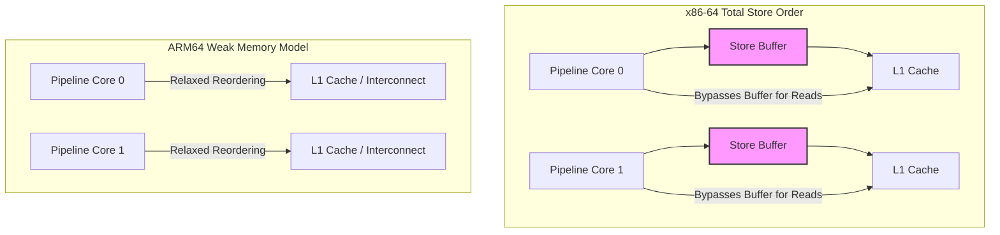

Write code for long enough and you will eventually build a lock-free queue, a custom state machine, or a double-checked lazy initialization pattern. You write the C# code, it passes your unit tests on your local Intel machine, and it runs flawlessly in production for months. Then your organization decides to migrate its microservices to ARM64-based AWS Graviton instances or modern Apple Silicon containers. Suddenly, your high-throughput lock-free structures begin throwing rare, impossible-to-reproduce NullReferenceExceptions or corrupting state. 

This is not a bug in the physical ARM64 CPU. It is the direct consequence of a fundamental mismatch between what you wrote, what the JIT compiler optimized, and what the hardware executed. The .NET memory model defines the boundaries of these transformations. It dictates how the RyujIT compiler and the underlying processor can reorder memory reads and writes, and how you must use volatile operations and memory barriers to maintain correctness across multi-threaded applications.

### The Spectrum of Memory Consistency

To understand why lock-free code fails when transitioning between hardware architectures, we must examine how modern CPUs handle memory access. The abstract machine described by the ECMA-335 specification does not run on raw silicon, it runs on a virtual execution system that maps to a physical processor. Memory operations are not instantaneous. They propagate through store buffers, invalidate queues, and multiple levels of cache before reaching main memory.

Different processor designs make different trade-offs between execution speed and programming simplicity. Intel and AMD x86-64 processors implement a strong memory model known as Total Store Order, or TSO. In TSO, the hardware guarantees that write operations from a single CPU core are seen by all other cores in the exact order they were issued. The only hardware reordering allowed on x86-64 is a store followed by a load to a different address. This occurs because of local hardware store buffers, which allow a CPU core to write to its local buffer and read that write back immediately, while other cores do not see the write until the buffer drains to the L1 cache.

ARM64 processors utilize a weak memory model to achieve superior power efficiency and silicon scaling. On ARM64, the hardware can reorder loads with other loads, stores with other stores, loads with stores, and stores with loads. The CPU only respects data dependency. If register X depends on the result of register Y, the CPU will not execute those operations out of order. If there is no explicit data dependency, the CPU assumes the operations are independent and can execute them in whatever order maximizes pipeline throughput.



Memory reorderings generally fall into four distinct categories. First, load-load reordering occurs when a processor reads data from a second location before a prior read from a first location is complete. Second, load-store reordering happens when a write operation is executed ahead of an earlier read operation. Third, store-store reordering describes when writes to different memory locations are completed out of order, meaning other cores see the second write before the first. Fourth, store-load reordering allows a read to execute before a prior write has fully propagated to the shared cache.

While x86-64 only permits store-load reordering in hardware, ARM64 allows all four types of reordering. If your code assumes that writing value A then writing value B means another thread will see A before B, your code will fail on ARM64 unless you explicitly force the processor to preserve that order.

### The JIT Compiler License to Reorder

Before your instructions ever reach physical CPU execution pipelines, the RyujIT compiler performs its own optimizations. Developers often assume that the compiler emits machine code that matches the sequence of their C# statements. The ECMA-335 specification explicitly allows the compiler to rearrange operations as long as the single-threaded execution behavior remains identical. This is the as-if rule. The runtime guarantees that a single thread of execution behaves as if it executed in order, but it makes no such guarantees about how other threads observe those operations.

If you write a loop that repeatedly reads a field, the JIT compiler can hoist that read out of the loop and store it in a CPU register. If another thread updates that field in memory, the looping thread will never observe the change because it continues to read the stale register value. The JIT compiler can also eliminate redundant writes, reorder independent assignments to adjacent fields, and inline methods in a way that mixes up the original sequence of memory accesses.

The CLI specification establishes a highly relaxed default memory model. Under this default model, memory reads and writes do not require any barriers unless explicitly annotated. The runtime only guarantees that memory operations inside a single thread appear to execute in order to that thread. Other threads observing those operations can see them in completely different sequences. This is a deliberate design decision to allow the JIT compiler to generate highly optimized machine code by leveraging register allocation, loop invariant code motion, and instruction scheduling.

### Volatile Operations and Acquire-Release Semantics

In C#, declaring a field with the volatile modifier tells the JIT compiler and the underlying hardware to restrict their reordering behaviors. Specifically, the runtime applies acquire-release semantics to these operations. This contract governs both compiler optimizations and hardware instruction scheduling.

Acquire semantics apply to volatile reads. When a volatile read occurs, the JIT compiler and the CPU are forbidden from moving any memory operations that appear after the volatile read in the source code before it. It sets a barrier that prevents subsequent reads or writes from leaking upward. This is crucial for lock-free patterns where you must read a state flag before reading the data protected by that flag.

Release semantics apply to volatile writes. When a volatile write occurs, the JIT compiler and the CPU are forbidden from moving any memory operations that appear before the volatile write in the source code after it. It sets a barrier that prevents preceding reads or writes from leaking downward. This ensures that any data initialization you perform is fully visible in memory before the flag indicating completion is published.

It is vital to understand that volatile operations do not introduce a full memory fence. The ECMA-335 model still allows a volatile write to be reordered with a subsequent volatile read. This specific gap is why classic synchronization algorithms like Peterson's or Decker's do not work with plain volatile variables alone. They require a full memory barrier to prevent the store from crossing the load. Volatile does not make operations atomic, nor does it prevent all forms of reordering, it only guarantees that reads have acquire semantics and writes have release semantics.

### JIT Compilation of Volatile on x86-64 vs ARM64

The RyujIT compiler must map these abstract acquire-release semantics to physical machine instructions. The implementation details differ wildly depending on the target architecture's native memory model.

Because x86-64 hardware already enforces a strong memory model where loads cannot pass older loads and stores cannot pass older stores, the JIT compiler does not need to emit any heavy hardware barriers for volatile reads or writes. A volatile read on x86-64 compiles to a standard mov instruction. The JIT compiler simply restrains its own internal optimization engine, preventing it from caching the value in a register or moving other instructions around the read. Similarly, a volatile write compiles to a standard mov instruction, accompanied only by compiler-level ordering constraints.

On ARM64, the story is entirely different. Because the hardware is weak, standard load and store instructions can be reordered freely. The RyujIT compiler must use specific instructions that enforce the acquire-release semantics at the hardware level. For a volatile read, RyujIT emits the ldar instruction, which stands for Load Acquire Register. For a volatile write, it emits the stlr instruction, which stands for Store Release Register. These instructions force the ARM64 processor's interconnect and caches to maintain the relative ordering of those operations, preventing the CPU from executing them out of sequence.

```mermaid
graph TD
    CSharp[C# Volatile Write: x = 1] --> JIT[RyujIT Compiler]
    JIT -->|Target: x86-64| X86[mov [rcx], 1]
    JIT -->|Target: ARM64| ARM[stlr w0, [x1]]
    X86 --> X86_Prop[Hardware guarantees no Store-Store reordering]
    ARM --> ARM_Prop[Hardware enforces Release semantic via stlr]
```

This architectural difference explains why code that violates the memory model can run without issue on x86-64 but breaks on ARM64. On x86-64, the hardware is silently saving you from your missing volatile declarations because its natural TSO model prevents store-store reordering. On ARM64, the hardware exposes those omissions immediately unless the compiler specifically emits the ldar and stlr instructions.

### Full Fences and Atomic Interlocked Operations

When acquire-release semantics are not strong enough to guarantee correctness, you must use a full memory barrier. In .NET, this is exposed via Thread.MemoryBarrier. A full memory barrier is bidirectional. It prevents any memory operations, whether reads or writes, from crossing the barrier in either direction.

On x86-64, the JIT compiler implements Thread.MemoryBarrier by emitting a dummy lock-prefixed instruction, typically lock or dword ptr [rsp], 0, or an instruction like mfence. The lock prefix on x86-64 acts as a complete drain of the local store buffer, forcing the CPU to wait until all pending writes are visible in the global cache hierarchy before proceeding with any subsequent loads. This prevents the store-load reordering that is otherwise permitted on TSO hardware.

On ARM64, a full memory barrier translates to the dmb ish instruction, which stands for Data Memory Barrier, Inner Shareable. This instruction halts the execution pipeline until all preceding memory accesses have completed and propagates those changes across all cores in the shareable domain. This is an expensive operation because it stalls the pipeline and flushes pending memory queues.

Methods on the Interlocked class, such as Interlocked.Increment, Interlocked.Decrement, and Interlocked.CompareExchange, implicitly generate full memory barriers. On x86-64, these compile to instructions prefixed with lock, such as lock xadd or lock cmpxchg. On ARM64, they traditionally compile to load-linked and store-conditional loops using the ldrex and strex instruction pairs. On newer ARM v8.1 and higher hardware, RyujIT can emit atomic instructions like ldaddal or casal, which perform the complete operation atomically with acquire-release barriers applied to both sides of the transaction.

### A Concrete Lock-Free Race Condition

To see how these concepts manifest in actual execution, let us look at a simple double-checked publishing pattern that lacks correct volatile or barrier usage. Imagine a class that initializes a state object lazily.

```csharp
public class StatePublisher
{ 
    private DataPayload _payload;
    private bool _initialized;

    public void Initialize()
    {
        _payload = new DataPayload(42);
        _initialized = true;
    }

    public DataPayload GetPayload()
    {
        if (_initialized)
        {
            return _payload;
        }
        return null;
    }
}
```

If Thread A calls Initialize while Thread B calls GetPayload, this code can fail catastrophically under weak memory models. Because neither _payload nor _initialized are marked as volatile, both the JIT compiler and the CPU are free to reorder the operations. 

In the Initialize method, the assignment to _payload involves allocating memory and setting its fields, followed by setting _initialized to true. Since there is no data dependency between _payload and _initialized, RyujIT or an ARM64 CPU can reorder the writes. The CPU can write the value true to _initialized before the fields of the DataPayload object are fully written to cache. 

If Thread B reads _initialized as true, it immediately returns _payload. Because of the store-store reordering, Thread B can access the fields of DataPayload before they have actually propagated to the shared cache. Thread B will read uninitialized or corrupt data, even though _initialized was clearly observed as true.

To fix this on ARM64, you must ensure that the write to _initialized has release semantics and the read of _initialized has acquire semantics. Marking both fields as volatile achieves this. When _initialized is volatile, the stlr instruction on ARM64 ensures that the write to _payload must complete and propagate before the write to _initialized occurs. The ldar instruction ensures that the read of _initialized completes before the read of _payload begins. Alternatively, you can use explicit memory barriers or the Volatile.Write and Volatile.Read helper methods to achieve the same hardware guarantees without modifying the field declarations.
