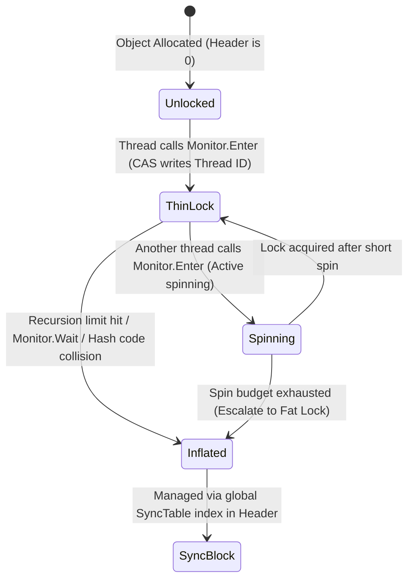

Every time you write a lock statement in C#, you are relying on a highly optimized runtime dance that changes its strategy based on contention. The compiler translates the lock keyword into calls to Monitor.Enter and Monitor.Exit. Under the hood, the Common Language Runtime (CLR) must solve a difficult engineering problem. It must provide synchronization capabilities for every single object instance on the managed heap without bloat. If the runtime pre-allocated a full operating system synchronization primitive for every object, the memory overhead would destroy application performance. 

Instead, the CLR uses a lazy, multi-tiered lock allocation strategy. It leverages the layout of the managed object header to run incredibly fast under light contention, only escalating to heavy, kernel-supported locks when threads begin to fight for the same resource. To understand this design, we have to look directly at the memory layout of a .NET object and the C++ implementation inside the CoreCLR source code.

### Memory Anatomy of a Managed Object

When a managed object is allocated on the garbage-collected heap, it does not start at the address pointed to by your C# object reference. The reference actually points to the MethodTable pointer, which the runtime uses for virtual method dispatch and type identification. Immediately preceding the MethodTable pointer, at a negative offset of four bytes on both thirty-two bit and sixty-four bit systems, lies the Object Header.

```
+---------------------------------------------+
|         Object Header (4-byte DWORD)        |  <-- Reference - 4 bytes
+---------------------------------------------+
|         MethodTable Pointer (8 bytes)       |  <-- Reference Points Here (x64)
+---------------------------------------------+
|         Instance Fields / Payload           |  <-- Reference + 8 bytes
+---------------------------------------------+
```

The Object Header is a single thirty-two bit unsigned integer. It is a highly contested piece of real estate. The CLR uses this single DWORD to store the object's hash code, app domain information, garbage collection status, and synchronization state. Because thirty-two bits are not enough to store a full mutex handle, a thirty-two bit thread ID, a recursion count, and a hash code simultaneously, the CLR interprets the bits of this header dynamically based on state flags.

### The Bitwise State Machine of the Object Header

The CLR manages the transition of this header using specific bitmasks. The most critical bit is the SyncBlock index indicator, which is defined in the CoreCLR source code as BIT_SBLK_IS_SYNCBLKINDEX, occupying the highest active bit. If this bit is zero, the header is interpreted as either an unallocated state, a hash code, or a thin lock. If this bit is set to one, the remaining bits are interpreted as an integer index pointing to a structure inside a global runtime table known as the SyncTable.



When an object is newly created, its header is initialized to zero. This represents the unlocked, pristine state. No synchronization structures exist, and no memory has been wasted on locking mechanics.

### The Thin Lock Phase

When a thread attempts to acquire a lock on a pristine object via Monitor.Enter, the CLR avoids allocating any external objects. Instead, it attempts to establish a thin lock. The runtime assigns a short, managed thread ID to every thread it spawns. This short ID is different from the operating system's thread ID and is designed to fit into a small bit field.

During a thin lock transition, the CLR attempts to write this short thread ID directly into the object header using an atomic compare-and-swap operation, implemented as a LOCK CMPXCHG instruction on x86 and x64 architectures. If the header is zero, the CPU atomically swaps the zero with a bit pattern containing the short thread ID and a recursion count of zero. This operation is extremely cheap, executing entirely within the CPU L1/L2 cache lines without invoking any system calls or kernel transitions.

Because .NET locks are reentrant, the same thread can acquire the same lock multiple times. The thin lock format reserves a small chunk of bits, typically six bits, to keep track of this recursion count. Every time the owning thread enters the lock recursively, the CLR increments this count directly in the header. If the recursion count fits within these six bits and no other thread tries to acquire the lock, the lock remains thin.

### Contention and the Spin Phase

If Thread B attempts to acquire a lock that is currently held as a thin lock by Thread A, the atomic compare-and-swap operation fails. At this point, the runtime must decide how to handle the contention. It does not immediately yield its CPU time slice, because context switches to the operating system kernel are incredibly expensive, costing thousands of CPU cycles.

Instead, Thread B enters a spin phase. It executes a tight loop in user space, executing PAUSE instructions to notify the CPU pipeline that it is waiting on a lock. This prevents the CPU from mispredicting branches and wasting energy. The thread repeatedly inspects the object header to see if Thread A has released the thin lock.

This spinning is not indefinite. The runtime calculates a spin budget based on the number of available CPU cores and historical contention. If Thread A releases the lock during this spin window, Thread B can acquire it atomically, remaining in user space the entire time. If the spin budget is exhausted and the lock is still held, the thin lock is no longer sufficient. The lock must inflate.

### Lock Inflation and the SyncBlock

Lock inflation is the process of transitioning an object from a thin lock to a fat lock. This transition is managed by the CLR execution engine and requires the allocation of a SyncBlock. The SyncBlock is a rich C++ structure allocated from a private heap managed by the runtime.

To coordinate these blocks, the CLR maintains a global, dynamically resizing array called the SyncTable. The SyncTable holds pointers to all active SyncBlocks in the application. When a lock inflates, the runtime claims a free SyncBlock, configures its internal state, and writes the index of this SyncBlock into the target object's header, setting the BIT_SBLK_IS_SYNCBLKINDEX bit.

```
Object Header
+--------------------------------------------------------+
| 1 |  Padding/Flags (3 bits) |  SyncBlock Index (28 bits) |
+--------------------------------------------------------+
  | 
  +---> Points to SyncTable[Index]

SyncTable (Global Array)
+-------+-----------------------------+
| Index | Pointer to SyncBlock        |
+-------+-----------------------------+
|   0   | NULL                        |
|   1   | 0x00007F901C04A020 --------+---> SyncBlock Structure
|   2   | NULL                        |     |-- AwareLock (Kernel Event)
+-------+-----------------------------+     |-- Thread Wait List (SList)
                                            |-- Object Hash Code Cache
```

The SyncBlock contains several critical fields. It holds a pointer back to the managed object, a wait list of threads that are currently blocked on the lock, and a structure called an AwareLock. The AwareLock is the engine of the fat lock. It encapsulates the system-level synchronization primitives, holding an operating system auto-reset event or manual-reset event depending on the platform.

When Thread B fails to acquire the lock after spinning, it inflates the lock. It creates this SyncBlock, copies the original owning thread's ID and recursion count from the thin lock into the SyncBlock, and updates the object's header to point to the SyncBlock's index. Thread B then registers its own thread handle in the SyncBlock's wait list and calls the operating system's thread blocking API, putting itself to sleep. The operating system kernel takes over, suspending Thread B until Thread A releases the lock and signals the event handle.

### The Hash Code Collision

The dual-use nature of the object header introduces a fascinating engineering conflict when dealing with object hash codes. In .NET, if you do not override System.Object.GetHashCode, the runtime generates a pseudo-random hash code for the object. This hash code must remain stable for the entire lifetime of the object, even if the garbage collector moves the object to a different memory address.

Because the hash code must be stable, the runtime must store it somewhere. The natural place is the object header. However, if the object header is already storing a thin lock, there are not enough bits to store both a twenty-six bit hash code and a thin lock's thread ID and recursion count.

To resolve this collision, the CLR uses lock inflation as a fallback mechanism for storage. If you request the default hash code of an object that is currently thin-locked, the runtime immediately inflates the thin lock to a full SyncBlock. The SyncBlock structure has dedicated fields to store both the synchronization state and the stable hash code. Conversely, if an object already has a hash code stored in its header and a thread subsequently tries to lock it, the runtime cannot use a thin lock. It must immediately create a SyncBlock, copy the existing hash code into the SyncBlock's hash cache, and write the SyncBlock index into the object header. Calling GetHashCode on unlocked, non-hash-allocated objects is therefore a common, silent trigger for lock inflation.

### Lock Deflation and Garbage Collection

Once a lock is inflated to a SyncBlock, it does not stay there forever. Leaving thousands of SyncBlocks allocated would leak system handles and exhaust runtime memory. The CLR must deflate locks and reclaim SyncBlocks when they are no longer needed.

Lock deflation is not done eagerly when Monitor.Exit is called because allocating and deallocating SyncBlocks on every lock cycle would introduce severe jitter. Instead, lock deflation is deferred to the Garbage Collector. During the mark phase of a garbage collection cycle, the GC traverses the global SyncTable. It inspects each SyncBlock to see if its associated managed object is still alive and whether any threads are actively waiting on or holding the lock.

If the associated object has been collected, the GC frees the SyncBlock and returns its index to the free list. If the object is still alive but the lock is currently unowned and has no waiting threads, the GC can deflate the lock. It copies any cached hash code back into the object's header, clears the SyncBlock index bit, and returns the SyncBlock to the runtime's pool. This lazy reclamation ensures that high-contention phases only pay the allocation penalty once, while long-term idle objects do not permanently hog kernel resources.
