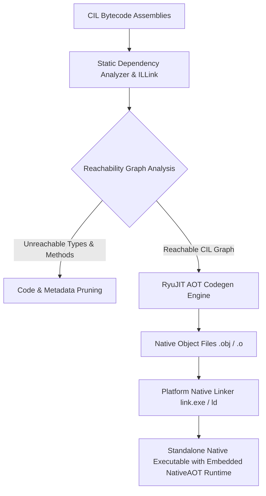
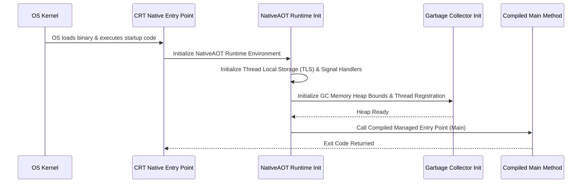

Standard .NET relies on dynamic execution via RyuJIT and coreclr.dll. The host process loads managed CIL assemblies, parses metadata streams, constructs runtime MethodTables, and lazily compiles CIL instructions into native machine code on first invocation. This design maximizes runtime flexibility, supporting dynamic code loading, Reflection.Emit, and tiering optimizations. It comes at the cost of warm-up latency, high RSS memory consumption, and a large execution engine footprint.

Native AOT flips this paradigm by shifting the execution model from dynamic jittering to closed-world ahead-of-time compilation. The ILCompiler (ILC) ingests CIL bytecode alongside its dependencies, performs aggressive whole-program static analysis, strips away unused types and methods, and compiles the surviving CIL directly into target machine code. The resulting binary is a standard OS-native executable containing machine code, statically linked runtime support routines from the NativeAOT runtime library, and minimal compressed metadata streams. There is no hostfxr.dll, no coreclr.dll, and no JIT compiler present at execution time.



The compile-time pipeline relies on a closed-world assumption. The compiler assumes that all code that will ever run in the application is visible during compilation. This assumption enables whole-program dependency analysis using the IL Linker (ILLink) and ILC static analysis passes.

Static analysis starts at the program entry point, typically the Main method. The analyzer builds a reachability graph by scanning CIL instructions for call sites, type instantiations, field accesses, and virtual dispatch targets. When a method is marked as reachable, its body is parsed to uncover additional dependencies. This process continues recursively until the reachability graph stabilizes.

Trimming occurs concurrently with reachability analysis. Any type, method, field, or metadata token not included in the reachability graph gets purged. If an assembly contains 10,000 methods but the application reachable closure only touches 400 of them, the remaining 9,600 methods are completely discarded. Their CIL bytecodes never enter the code generation phase, and their associated metadata tokens are excluded from the output binary.

Dynamic features like reflection break this closed-world analysis because target types are specified as runtime strings or computed programmatically. To bridge this gap without keeping the entire universe of application metadata, Native AOT uses dataflow analysis paired with explicit annotations. Attributes like DynamicallyAccessedMembers tell the static analyzer which reflection primitives a given code path requires, forcing the compiler to preserve specified constructors, properties, or methods in the reachability graph. When dynamic reflection cannot be resolved through static analysis and lacks annotations, trimming warnings are generated, and unannotated targets run the risk of being trimmed out, leading to dynamic execution exceptions.

In the standard CLR execution engine, every heap object instance contains an Object Header followed by a pointer to its MethodTable. The CLR MethodTable is a sprawling data structure containing pointers to runtime interface maps, GC layout descriptors, module identifiers, EEClass structures, and full runtime type reflection metadata. This rich metadata allows arbitrary type inspection at any point during runtime, but it consumes significant memory and prevents code stripping.

Native AOT replaces the standard MethodTable with a stripped-down structure called EEType (Execution Engine Type). An EEType retains only the bare minimum memory layout specifications required for execution, virtual method dispatch, and garbage collection.

```
Standard CLR Object Layout:
+-------------------+-------------------+------------------------------+
| Object Header     | MethodTable Ptr   | Field Data ...               |
+-------------------+-------------------+------------------------------+
                            |
                            v
                    +--------------------------------------------------+
                    | Full EEClass, Module Handle, RTTI, VTable,       |
                    | Dynamic Interface Maps, Full Reflection Metadata |
                    +--------------------------------------------------+

Native AOT Object Layout:
+-------------------+-------------------+------------------------------+
| Object Header     | EEType Pointer    | Field Data ...               |
+-------------------+-------------------+------------------------------+
                            |
                            v
                    +--------------------------------------------------+
                    | Flags | Component Size | GC Layout Bitmap        |
                    | Base VTable | Minimal Interface Map (if reachable)|
                    +--------------------------------------------------+
```

The EEType data structure is compact. Flags encode whether the type is a value type, array, string, or interface, along with flags for GC layout formats. Component size records element sizes for arrays and string types. The GC layout bitmap dictates which object fields contain reference pointers, allowing the garbage collector to trace object references without querying dynamic metadata. Base vtable entries contain direct native code pointers for virtual methods.

If an application never calls Type.GetType() or Object.GetType().Name on a specific type, the Native AOT compiler strips the type name and metadata entirely. The EEType remains strictly as a layout and dispatch descriptor. Dynamic type checks like castclass or isinst do not rely on string comparisons or complex type hierarchy searches. Instead, the compiler assigns compile-time numerical IDs or offsets to types, reducing cast operations to fast pointer range checks or direct array index lookups against the EEType interface map.

Native AOT transforms CIL call instructions into optimized platform native call sequences. CIL call instructions targeting static or non-virtual instance methods bypass runtime lookups entirely. The compiler generates relative 32-bit direct calls (call rel32 in x86-64 assembly) pointing directly to the compiled target native code symbol.

Virtual method dispatch for class hierarchies uses static VTable offset positioning. During whole-program compilation, ILC assigns explicit slot indices in the EEType VTable for all virtual methods. A virtual call instruction lowers into an indirect machine code call through the target instance EEType pointer plus the hardcoded slot offset.

Interface dispatch presents a tougher challenge because a single interface method can be implemented by hundreds of unrelated types, each storing the method at a different VTable slot. Standard CLR uses Virtual Method Interleaved Tables or dynamic interface dispatch stubs created at runtime. Native AOT cannot build dynamic stubs at runtime because code memory is mapped non-writable and non-executable under standard W^X security constraints.

Native AOT solves interface dispatch using compile-time generated dispatch stubs combined with global interface dispatch tables. For high-frequency interface calls, the compiler generates specialized stub functions that perform indirect branch lookups. The stub reads the target object EEType pointer, calculates a hash or offset into a global read-only dispatch table generated during compilation, and jumps straight to the target method. If the call site exhibits monomorphism where only one concrete implementation passes through the call site, the RyuJIT AOT backend devirtualizes the call into a direct native jump or inlines the target body completely.

While Reflection.Emit is entirely removed because no JIT engine exists to write executable bytes into memory at runtime, standard read-only reflection is still supported for types marked during dependency analysis.

To support reflection without embedding bloated CLR metadata tables, Native AOT writes compressed metadata blobs into a dedicated read-only binary section (.dotnet_metadata). Metadata tokens are compressed using variable-length integer encodings and string deduplication tables.

Instead of parsing string names to discover methods, reflection lookups in Native AOT query compile-time generated mapping tables. These tables map compressed metadata handles directly to compiled native function pointers and field offset markers. When code invokes MethodInfo.Invoke(), the runtime does not construct a dynamic call frame on the fly. It invokes an AOT-generated reflection stub that unboxes parameters from an array and performs a native call to the target function using standard ABI calling conventions.

A Native AOT binary boots instantly because it eliminates host initialization, assembly loading, CIL verification, and JIT compilation. The resulting executable is structured like a pure C or C++ executable binary.



When the OS kernel loads the native binary into virtual address space via execve or CreateProcess, execution jumps straight to the native entry point defined in the executable header. This entry point points to a small bootstrapper embedded from the NativeAOT runtime static library.

The bootstrapper performs basic initialization steps in precise sequence. First, it initializes OS-level synchronization primitives, signal handlers, and Thread Local Storage (TLS) data structures needed by the execution engine. Second, it initializes the Garbage Collector, allocating initial heap segments, setting up card tables, and registering GC helper routines. Third, it invokes initializers for statically allocated object instances and thread-static variables. Finally, it executes a direct native jump into the compiled entry point of the C# program.

Because type definitions are pre-baked into EETypes and method bodies are already compiled into executable native instructions, the executable reaches application code in single-digit milliseconds. Memory consumption stays low because the process loads only the physical memory pages required for active code execution, avoiding the memory overhead of JIT code caches, CIL assembly buffers, and execution engine data structures.
