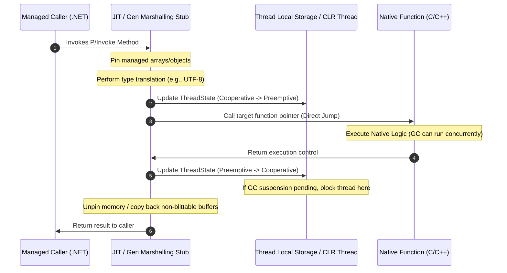

Managed runtime systems offer safety, garbage collection, and type guarantees, but they do not exist in a vacuum. Underneath the .NET Virtual Machine lies the operating system, native drivers, and C/C++ or Rust libraries that perform high-performance tasks. The mechanism that bridges this divide is Platform Invoke, or P/Invoke. To the casual developer, a P/Invoke call looks like a simple extern method decorated with a DllImport attribute. To the runtime, it is a complex choreographed operation involving thread state transitions, register preservation, security checks, and memory management adjustments.

### The Native Stack Frame and Register Setup

When a managed method invokes a native function, the CPU cannot simply jump to the target instruction address. The managed environment organizes stack frames and registers in a way that supports garbage collection, exceptions, and stack walking. Native code, written under the System V AMD64 ABI or the Windows x64 calling convention, expects a totally different layout. The registers containing parameters must be shuffled, stack space must be reserved for scratch registers, and a new unmanaged stack frame must be pushed.

Instead of hardcoding these transitions inside the execution engine, the JIT compiler generates a specialized marshalling stub. This stub is a dynamically compiled piece of intermediate machine code that sits between the managed caller and the unmanaged target. When using the modern LibraryImport source generator, this stub is partially emitted as C# code at compile time, which avoids the dynamic JIT generation cost and reveals the precise mechanical operations that keep the runtime safe during the transition.

### Thread State Transitions and the Cooperative Model

The most crucial operation within the transition stub is the modification of the thread state. The .NET garbage collector operates on two basic execution modes, namely cooperative and preemptive. In cooperative mode, the execution engine assumes that the thread is running managed code that can be safely suspended at known safe points. If the garbage collector needs to trigger a collection, it requests a suspension, and the thread yields when it hits the next checkpoint.

Native code does not cooperate. An external library might block on a socket, run an infinite loop, or allocate memory outside the control of the runtime. If a thread stays in cooperative mode while running native code, a garbage collection request would freeze the entire application because the GC would wait forever for the thread to reach a managed checkpoint.

To prevent this, the marshalling stub transitions the thread into preemptive mode before invoking the native function. Preemptive mode tells the garbage collector that the thread is currently out of bounds and will not touch the managed heap. If a GC run occurs, the garbage collector can proceed immediately, ignoring this thread. When the native function completes and returns to the stub, the stub attempts to transition back to cooperative mode. If a GC run is currently active, the stub blocks the returning thread until the garbage collection cycle finishes.

### Memory Pinning and the Heap Fragmentation Tax

Passing complex objects or arrays across the boundary introduces the pinning problem. The .NET garbage collector is a compacting collector, meaning it moves objects around in memory to eliminate fragmentation. If you pass a pointer to a managed byte array to a native function, and a GC occurs while that native function is running, the GC might relocate the array, leaving the native pointer pointing to garbage memory.

To prevent this catastrophe, the runtime pins the object. Pinning writes a flag in the object's header or adds an entry to the GC handle table, instructing the allocator not to move this object during compaction. While this ensures safety, pinning comes with a heavy architectural cost. Pinned objects create obstacles on the heap. During compaction, the GC must work around these immovable objects, which can lead to severe memory fragmentation and prevent the allocation of large contiguous blocks of memory.

This tax varies based on whether types are blittable or non-blittable. Blittable types share the exact same memory representation in both managed and unmanaged environments. For these types, the runtime can pass a direct pointer with simple pinning. Non-blittable types, such as managed strings or arrays of complex objects, must be copied entirely. The marshalling stub allocates unmanaged memory via native allocators, copies the data, performs character set conversions, passes the native pointer, and finally deallocates the native buffer upon return. This copying completely bypasses the pinning problem but introduces a massive performance penalty.

### The Secrets of SuppressGCTransition

For scenarios where performance is the absolute priority and the native function is guaranteed to run instantly, .NET provides an optimization flag called SuppressGCTransition. This attribute tells the JIT compiler to omit the thread state change code entirely.

Without this transition, the managed thread stays in cooperative mode while executing the native code. The assembly code generated for the transition is incredibly lean, reducing the invocation overhead to almost zero, making it comparable to a standard virtual method call.

However, this performance boost carries a massive architectural risk. Because the thread remains in cooperative mode, it cannot be suspended by the garbage collector. If the native function takes a long time to run, or if it blocks on I/O, it will hold the entire garbage collection engine hostage. Every other thread in the application that is waiting for a GC to complete will freeze, leading to latency spikes and potential process starvation. Therefore, SuppressGCTransition must only be applied to deterministic, non-blocking native functions that execute in a handful of CPU cycles.
