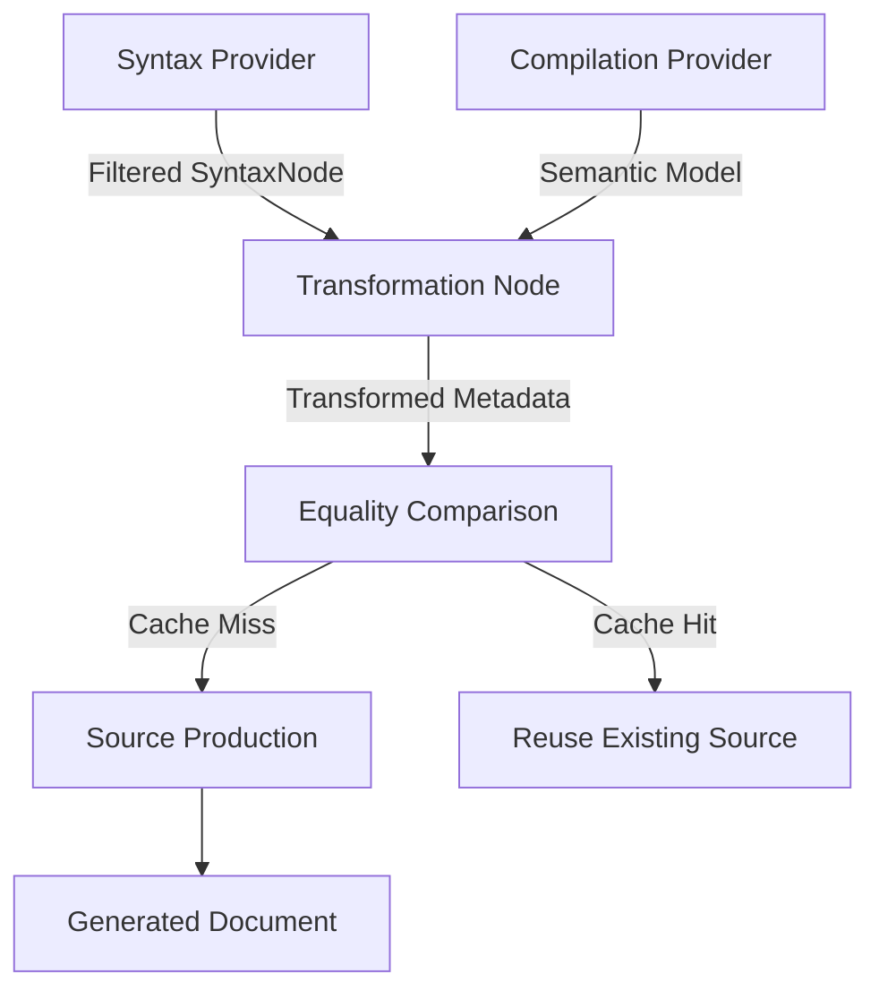

Source Generators represent a fundamental shift in how we handle metaprogramming in .NET. Before their arrival, we were stuck between the slow, runtime-heavy world of Reflection and the brittle, build-time world of MSBuild task hacks or T4 templates. Reflection is the easiest way to write generic code, but it carries a heavy tax. You pay it in startup time and memory overhead because the runtime has to scan assemblies and build metadata tables. Source Generators move that cost to the compiler. They allow you to inspect the syntax and semantics of the code being compiled and emit brand new C# files that get added to the compilation on the fly. This isn't just about saving keystrokes. It is about moving logic from the runtime to the compile-time, which is essential for things like Native AOT where traditional Reflection is essentially dead.

Early versions of these generators used the ISourceGenerator interface. It was a simple model where the compiler would just call your code and give you the entire syntax tree. The problem was performance. If you have a thousand files in your project and you type a single character, the compiler might trigger the generator again. If your generator is doing heavy lifting like looking up every class that implements an interface, it's going to choke the IDE. Visual Studio would lag because the generator was effectively an O(n) or O(n^2) operation on every keystroke. This led to the creation of IIncrementalGenerator. This new model is built around a Data Flow Graph. Instead of a single execution block, you build a pipeline of transformations. Roslyn tracks the inputs and outputs of every node in that pipeline. If an input hasn't changed, Roslyn just reuses the cached output from the previous run. It is a memoization engine disguised as a compiler feature.



The magic happens in the IncrementalGeneratorInitializationContext. When you initialize your generator, you are not executing code. You are defining a directed acyclic graph (DAG). You start with a provider, like the SyntaxValueProvider, which allows you to filter the entire syntax tree down to specific nodes you care about, like classes with a specific attribute. This is the first gate. If the developer is typing in a method body and your generator only cares about class declarations, the pipeline stops right here. The SyntaxValueProvider is smart enough to know that changes inside a method don't affect the identity of the class declaration node.

Once you have your nodes, you typically transform them into a model. This is where most people get it wrong. The model should be a simple record or a POCO that represents only the data you need to generate code. It must implement equality correctly because this is how the caching engine works. After your transformation, Roslyn compares the new model to the old one using the Equals method. If they are identical, the pipeline for that specific branch is killed. No further work is done. No code is generated. This is why you should never pass a Symbol or a SyntaxNode directly into the source production phase. Symbols and SyntaxNodes are tied to a specific compilation instance. Even if the code looks the same, the object reference will change on every compilation cycle, which breaks the cache and forces a full regeneration.

```text
[Node 1: Filter] -> { ClassDeclaration: 'UserDTO' }
                       |
                       v
[Node 2: Transform] -> { Name: 'UserDTO', Properties: ['Id', 'Name'] }
                       |
                       v
[Node 3: Compare]   -> Compare with Previous State { Name: 'UserDTO', Properties: ['Id', 'Name'] }
                       |
                       +--> Identical? [YES] -> STOP (Pipeline Short-Circuited)
                       |
                       +--> Identical? [NO]  -> [Node 4: Emit Source]
```

The Incremental Driver is the component within Roslyn that manages this state. It keeps a table of all the intermediate values for every node in your graph. When a new compilation starts, it doesn't just rerun everything. It does a topological sort of your graph and starts feeding the changed inputs through. If you have multiple generators, they all share this environment, but their states are isolated. The driver is also responsible for the 'Host' interaction. In Visual Studio, the driver stays alive as long as the solution is open. This persistent state is what makes the IDE feel snappy even when you're generating thousands of lines of code based on complex domain models.

Debugging these things is notoriously painful because you can't just attach a debugger to a running compiler easily. Most developers end up using the 'GeneratorDriver' in unit tests to verify their logic. This driver allows you to simulate the incremental nature of the pipeline. You can run it once, get the results, then modify a single file and run it again. You can then inspect the 'RunResult' to see exactly which steps were cached and which ones were executed. If you see that your 'SourceProduction' step is running on every single execution, you know your equality logic is broken. It usually means you're accidentally capturing something like a timestamp or a volatile compiler object in your state model. Fixing that is the difference between a tool that helps developers and one that makes them want to disable the plugin entirely.
