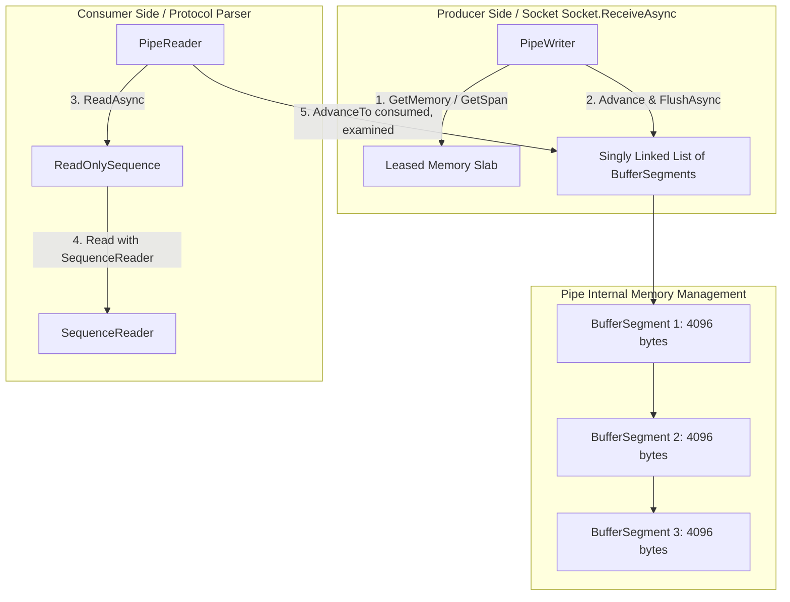

High-throughput server architectures require fast byte processing with zero garbage collection overhead. Traditional stream abstractions in .NET, such as `System.IO.Stream`, rely on intermediate buffer allocations and explicit array copying when parsing network protocols. Reading a variable-length binary packet or HTTP/2 frame using `Stream.ReadAsync` often forces developers to allocate byte arrays, manage offset boundaries manually, and reallocate contiguous memory when frames cross chunk boundaries. These operations generate significant Gen 0 garbage collection pressure, cause cache misses, and lock CPU cores in memory-copy loops.

To solve this, the .NET team introduced `System.IO.Pipelines` alongside the rewritten Kestrel web server. Pipelines provide an asynchronous, zero-copy, push-pull memory model built specifically for parsing high-rate network traffic directly from kernel buffers into application memory without intermediate copies.

### The Architecture of System.IO.Pipelines

At its core, a pipeline manages two distinct operational sides: a producer (`PipeWriter`) and a consumer (`PipeReader`). These components communicate through a thread-safe shared state object named `Pipe` that owns a linked list of unmanaged or pooled memory slabs.



The producer requests write space by calling `PipeWriter.GetMemory()` or `PipeWriter.GetSpan()`. It receives a slice of pre-allocated slab memory leased directly from an underlying `MemoryPool<byte>`. After writing socket data into this slab, the writer calls `PipeWriter.Advance(bytesWritten)`, updating internal write offsets. Finally, calling `PipeWriter.FlushAsync()` publishes these bytes to the reader.

The consumer executes `PipeReader.ReadAsync()`, obtaining a `ReadResult`. This struct exposes a `ReadOnlySequence<byte>` representing all unconsumed data across the entire pipeline. The power of `ReadOnlySequence<byte>` lies in its ability to abstract multiple non-contiguous memory segments into a single logical sequence. A parser can evaluate bytes spanning multiple distinct 4KB memory blocks without merging them into a newly allocated byte array.

### Segment Internals and Memory Pool Leasing

Underneath `ReadOnlySequence<byte>`, the pipeline maintains a chain of `BufferSegment` instances, each inheriting from `ReadOnlySequenceSegment<byte>`. When a `Pipe` is instantiated, it binds to a `MemoryPool<byte>`, typically the default `ArrayMemoryPool<byte>` or a custom native slab allocator.

Each `BufferSegment` maintains a reference to an underlying memory owner lease alongside integer tracking offsets for `RunningIndex`, `Start`, and `End`. `RunningIndex` stores the cumulative count of bytes in all preceding segments in the list. This metadata allows fast index translation across segment boundaries without walking the linked list recursively.

When `PipeWriter.GetMemory(sizeHint)` is invoked, the internal allocator evaluates whether the active trailing `BufferSegment` has sufficient unwritten capacity matching `sizeHint`. If the remaining space in the current slab is lower than requested, the pipe leases a new `IMemoryOwner<byte>` slab from the pool, appends a new `BufferSegment` node to the tail of the linked list, and updates internal pointer allocations. Because memory slabs are recycled back to `MemoryPool<byte>` when consumed, allocation velocity stays flat even under continuous multi-gigabit throughput.

### Backpressure and Watermark Mechanics

Without backpressure, a fast network socket or pipeline producer can overflow system memory if the consumer thread lags behind during heavy protocol execution. `System.IO.Pipelines` implements non-blocking asynchronous backpressure control using configurable threshold watermarks inside `PipeOptions`.

`PipeOptions` accepts two critical threshold limits, `PauseWriterThreshold` and `ResumeWriterThreshold`. The default `PauseWriterThreshold` is 65,536 bytes (64 KB), and `ResumeWriterThreshold` is 32,768 bytes (32 KB).

When `PipeWriter.FlushAsync()` runs, the pipe calculates unconsumed byte counts by taking the total written bytes minus the consumer's total processed bytes. If unconsumed memory exceeds `PauseWriterThreshold`, `FlushAsync()` returns an incomplete `ValueTask`. Awaiting this task yields control back to the thread pool runtime without blocking the thread, effectively pausing socket reads or producer execution.

As the consumer reads frames and calls `PipeReader.AdvanceTo`, consumed segments are freed back to the slab pool. When unconsumed memory drops below `ResumeWriterThreshold`, the pipe transitions the pending write `ValueTask` to a completed state, resuming the paused producer. This double-threshold hysteresis prevents rapid toggling between paused and active states.

### Zero-Copy Protocol Parsing and Advance Mechanics

Parsing binary protocols requires finding packet boundaries, extracting headers, and handling partial frames across network buffers. The `SequenceReader<byte>` ref struct works directly against `ReadOnlySequence<byte>` to parse primitive data types without memory allocations.

Once a parser evaluates bytes yielded by `PipeReader.ReadAsync()`, it must explicitly inform the pipeline how much memory was processed by calling `PipeReader.AdvanceTo(SequencePosition consumed, SequencePosition examined)`.

The separation between `consumed` and `examined` positions represents one of the most critical design details in high-performance socket parsing.

The `consumed` position marks memory that the parser has completely finished processing. All memory segments up to `consumed` are immediately unlinked from the internal segment chain and returned to `MemoryPool<byte>`. The consumer will never see these bytes again.

The `examined` position marks how far into the buffer the parser scanned while looking for framing delimiters. This parameter tells the pipeline whether `PipeReader.ReadAsync()` should pause future execution. If `examined` does not reach the end of the current buffer, it indicates that the parser found a complete frame and has not yet looked at the remaining tail bytes. In this case, the next call to `ReadAsync()` returns instantly with the existing unconsumed buffer slice.

Conversely, if the parser scans the entire sequence, fails to find a terminating frame delimiter, and sets `examined` to `sequence.End`, the pipeline marks all current data as fully evaluated but incomplete. The next call to `ReadAsync()` will asynchronously suspend until new bytes arrive over the wire, preventing CPU spin loops.

### Real-World High-Performance Parser Implementation

The following implementation demonstrates a zero-copy line-based protocol parser using `System.IO.Pipelines` and `SequenceReader<byte>`. It efficiently handles partial frame arrivals and manages segment lifecycle boundaries.

```csharp
using System;
using System.Buffers;
using System.IO.Pipelines;
using System.Text;
using System.Threading;
using System.Threading.Tasks;

public class ZeroCopyProtocolParser
{
    private readonly byte _delimiter = (byte)'\n';

    public async Task ProcessIncomingDataAsync(PipeReader reader, CancellationToken cancellationToken)
    {
        while (!cancellationToken.IsCancellationRequested)
        {
            ReadResult result = await reader.ReadAsync(cancellationToken);
            ReadOnlySequence<byte> buffer = result.Buffer;

            SequencePosition consumed = buffer.Start;
            SequencePosition examined = buffer.End;

            try
            {
                if (TryParseFrames(ref buffer, out consumed, out examined))
                {
                    // Successfully parsed frames up to 'consumed'
                }

                if (result.IsCompleted)
                {
                    // End of stream reached, handle trailing data if any
                    break;
                }
            }
            finally
            {
                // Advance the reader state to free memory and prevent CPU spinning
                reader.AdvanceTo(consumed, examined);
            }
        }

        await reader.CompleteAsync();
    }

    private bool TryParseFrames(
        ref ReadOnlySequence<byte> buffer, 
        out SequencePosition consumed, 
        out SequencePosition examined)
    {
        var reader = new SequenceReader<byte>(buffer);
        consumed = buffer.Start;
        examined = buffer.End;

        while (!reader.End)
        {
            if (reader.TryReadTo(out ReadOnlySequence<byte> frame, _delimiter, advancePastDelimiter: true))
            {
                // Frame successfully read without copying byte arrays
                ProcessParsedFrame(frame);
                
                // Move consumed pointer forward past parsed frame
                consumed = reader.Position;
            }
            else
            {
                // Delimiter not found; examined must mark the end of scanned buffer
                examined = buffer.End;
                return false;
            }
        }

        return true;
    }

    private void ProcessParsedFrame(ReadOnlySequence<byte> frame)
    {
        // Work directly on contiguous or non-contiguous span representation
        if (frame.IsSingleSegment)
        {
            ReadOnlySpan<byte> span = frame.FirstSpan;
            // Process contiguous memory span directly
        }
        else
        {
            // Process discontiguous memory using SequenceReader or local copying if required
            foreach (ReadOnlyMemory<byte> segment in frame)
            {
                ReadOnlySpan<byte> span = segment.Span;
                // Process segment slice
            }
        }
    }
}
```

### Threading Constraints and Performance Profiles

While `System.IO.Pipelines` delivers unmatched parsing speed, it imposes strict concurrency contracts. A `PipeWriter` and a `PipeReader` can operate concurrently on separate threads, but multiple concurrent readers or multiple concurrent writers on the same `Pipe` instance are not supported without explicit locking synchronization.

By leveraging `System.IO.Pipelines`, network services bypass L1/L2 cache invalidation caused by frequent memory allocations, reduce garbage collection pauses under high concurrency, and establish clear memory ownership boundaries across socket layers.