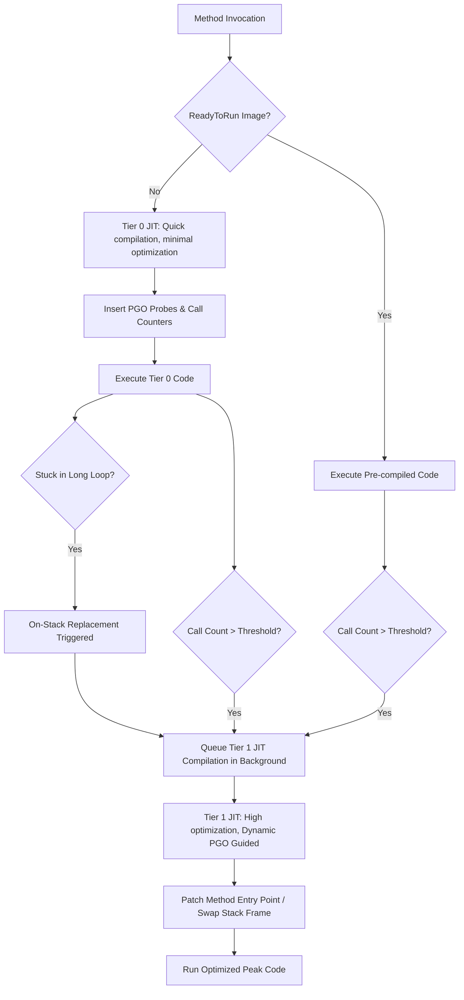

A naive Just-In-Time JIT compiler faces a painful engineering trade-off. It can spend significant CPU cycles optimizing machine code to achieve maximum execution throughput, which delays application startup. Alternatively, it can compile code as fast as possible with minimal optimization, which hurts the long-term performance of the application. For years, runtimes had to choose a side or rely on complex interpreter-to-compiler handoff mechanisms.

The .NET Core runtime solved this dilemma by introducing Tiered Compilation. The execution engine starts by compiling methods with cheap, low-overhead JIT strategies to get the application up and running instantly. As the application runs, the runtime monitors execution patterns, identifies hot paths, gathers execution statistics, and eventually recompiles critical methods using the full suite of optimization passes. 

This system is not just a simple dual-state switch. It relies on a coordinated dance of call counters, bytecode instrumentation, dynamic profiling, and on-stack frame reconstruction. Let's look at how the common language runtime CLR transitions code from unoptimized stubs to highly tuned, profile-guided machine instructions.



## The Architecture of Tiered Compilation

The compilation engine divides execution into distinct tiers. Under default behavior, a method first enters Tier 0. The JIT compiler compiles Tier 0 code using a strategy called QuickJIT. QuickJIT disables loop optimizations, copy propagation, inlining, and aggressive register allocation. The goal is to generate native instructions in the shortest time possible. ReadyToRun precompiled images also participate in this ecosystem. ReadyToRun images contain machine code compiled during the build process. The runtime treats ReadyToRun methods as a variation of Tier 0, allowing the application to skip JIT compilation entirely during startup while still remaining eligible for future optimization.

Once a method executes frequently enough, it qualifies for Tier 1. The runtime queues the method for compilation on a dedicated background JIT thread. The JIT compiler compiles Tier 1 code with all optimizations enabled, including loop unrolling, vectorization, devirtualization, and aggressive inlining. This compilation runs concurrently with application execution, preventing JIT pauses from blocking active application threads.

## Call Counting and Stub Patching

To determine when a method should transition from Tier 0 to Tier 1, the runtime must track invocation frequency. The CLR manages this through call counting stubs and runtime-allocated metadata structures. 

Every managed method is represented in memory by a `MethodDesc` structure, which contains metadata about the method and a pointer to its current entry point. When a method is compiled at Tier 0, the runtime does not point the `MethodDesc` directly to the compiled Tier 0 code. Instead, it points it to a call-counting stub. 

This call-counting stub is a highly optimized piece of assembly code. When invoked, the stub decrements a counter allocated in a stub-specific block of memory. In modern .NET versions, this counter typically starts at thirty. If the counter is greater than zero, the stub jumps directly to the Tier 0 compiled code. The overhead is minimal: a memory decrement, a conditional jump, and a direct branch.

When the counter decrements to zero, the stub triggers a transition. The calling thread invokes a runtime helper function, which requests a background compilation of the method at Tier 1. Crucially, the helper function immediately patches the method entry point in the `MethodDesc` to bypass the call-counting stub and point directly to the Tier 0 code. This prevents subsequent invocations of the method from wasting time on stub execution or triggering duplicate compilation requests while the background JIT thread does its work.

Once the background JIT thread finishes compiling the Tier 1 version, the runtime performs another atomic pointer swap. It updates the entry point in the `MethodDesc` to point directly to the new, fully optimized Tier 1 machine code. Any subsequent call to the method instantly executes at peak performance.

## Dynamic Profile-Guided Optimization

Simply recompiling hot methods with standard optimization passes is not enough to achieve maximum execution speed. Modern object-oriented code relies heavily on interfaces, virtual methods, and conditional branching. Standard ahead-of-time compilers must generate code that handles every theoretical path, which limits performance. 

Dynamic Profile-Guided Optimization, or Dynamic PGO, solves this by turning Tier 0 execution into an instrumentation phase. When Dynamic PGO is enabled, the Tier 0 JIT compiler injects tracking probes directly into the generated machine code. These probes gather physical metrics about how the application actually behaves. 

One critical probe type is the type profiling probe. If a method accepts an interface parameter and calls a method on it, the Tier 0 code inserts a probe that records the concrete type of the object passing through that call site. This type feedback is incredibly valuable. If the probe observes that ninety-nine percent of the calls use a specific concrete class, the Tier 1 JIT compiler can perform devirtualization. Instead of executing an expensive virtual table lookup, the Tier 1 compiler emits a cheap type check followed by a direct, inlineable call to the concrete method. If the type check fails, the code falls back to the slow virtual path, but the fast path runs at raw hardware speed.

Dynamic PGO also tracks branch execution. The JIT inserts probes along conditional branches to count how often a branch is taken versus how often it is ignored. The Tier 1 JIT compiler uses this branch feedback to reorganize the generated machine code. It places the hot code path sequentially in memory to maximize CPU instruction cache locality and branches the cold, exceptional code paths to distant memory locations.

## On-Stack Replacement

Traditional tiered compilation works perfectly for methods that are called thousands of times. However, it fails when a method contains a long-running loop that executes millions of iterations within a single invocation. If a method is called once at startup, enters an infinite loop, and never exits, it will remain trapped in Tier 0 forever. The call counter will never decrement to zero because the method was only invoked once.

To solve this, .NET utilizes On-Stack Replacement, or OSR. OSR allows the runtime to transition an active execution frame from a Tier 0 compilation to a Tier 1 compilation mid-execution, right in the middle of a running loop.

To support OSR, the JIT compiler inserts loop counters at backward branches inside Tier 0 loops. When a loop completes a set number of iterations, the loop counter decrements to zero and calls into a runtime helper. The runtime triggers a background JIT compilation of the method specifically optimized for OSR.

This OSR-compiled Tier 1 method is unique. It contains an alternative entry point designed to be entered at the exact loop header where the OSR transition was requested. It also knows how to map local variables and temporary register values from the old Tier 0 stack frame structure to the new Tier 1 stack frame structure.

```text
TIER 0 ACTIVE STACK FRAME                    OSR TRANSITION STATE                       TIER 1 ACTIVE STACK FRAME
+---------------------------+                +---------------------------+              +---------------------------+
|  Caller Frame             |                |  Caller Frame             |              |  Caller Frame             |
+---------------------------+                +---------------------------+              +---------------------------+
|  Tier 0 Frame             |                |  Tier 0 Frame             |              |  OSR Tier 1 Frame         |
|  - Locals: x, y           |  ==[Extract]==>|  - State: x=10, y=20      | ==[Rebuild]=>|  - Locals: x, y (reg-mapped)
|  - Inst Pointer: Loop RIP |                |  - Local array allocation |              |  - Inst Pointer: Tier 1   |
+---------------------------+                +---------------------------+              +---------------------------+
|  Exec Stack / Evaluator   |                |  OSR Transition Stub      |              |  Register state mapped    |
+---------------------------+                +---------------------------+              +---------------------------+
```

When the OSR Tier 1 compilation is ready, the running Tier 0 loop hits the helper call again. The helper suspends the thread and analyzes the stack. It reads the local variables and registers from the Tier 0 stack frame, constructs a state transition block, unwinds the Tier 0 frame from the execution stack, allocates and populates the new Tier 1 stack frame, and rewrites the thread instruction pointer to point directly to the OSR entry point in the Tier 1 code. Execution resumes instantly within the optimized loop.

## The Real-World Impact

Tiered Compilation, Dynamic PGO, and On-Stack Replacement work together to solve the startup versus throughput problem. Micro-benchmarks and web application servers alike benefit from this tiered model. Code that only runs once during initialization is JIT-compiled in microseconds without complex optimizations. Loop-heavy, high-throughput request paths are rapidly identified, instrumented, optimized, and swapped on the fly. The runtime continuously refines its own native code based on live telemetry, ensuring the application runs as fast as the physical hardware allows without requiring manual optimization profiles from developers.
