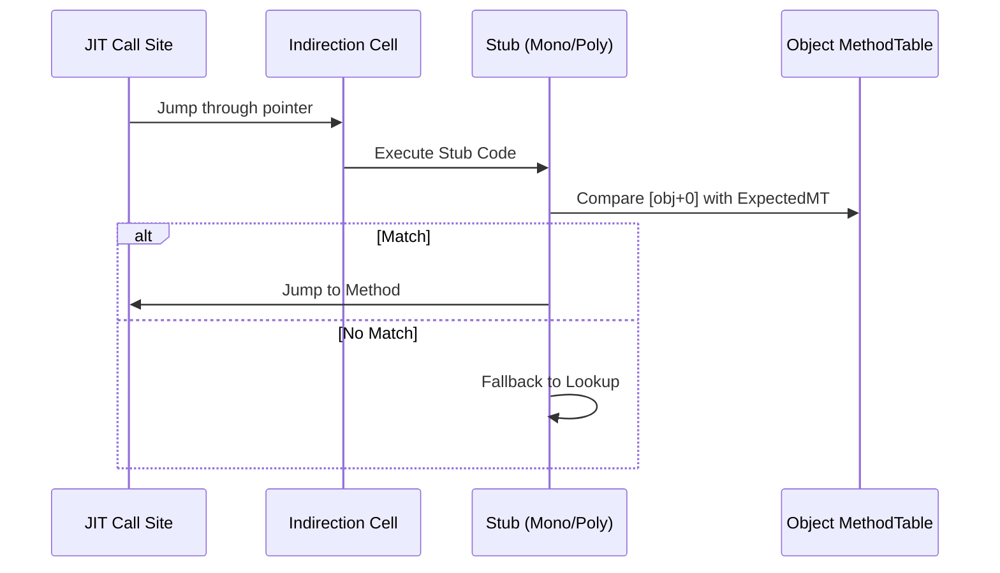

Interfaces are the bread and butter of .NET development. They let us decouple logic and write testable code, but from a runtime perspective, they are a massive pain in the neck. If you look at a standard virtual method call, the performance overhead is almost zero. The compiler knows exactly where the vtable is, and that vtable has a fixed layout. If you call a virtual method at slot 4, it is always at slot 4 for every subclass. Interfaces break this entirely because a class can implement dozens of interfaces. There is no way to assign a fixed slot for an interface method across every class in the system without creating massive, sparse tables that would eat up all your RAM.

The .NET team solved this with a trick called Virtual Stub Dispatch. It is a multi-stage mechanism that starts slow and gets faster as the runtime learns more about your code's behavior. Instead of the JIT emitting a direct jump to a method address, it emits a call to a tiny piece of memory called an indirection cell. This cell holds a pointer to a stub. Depending on how many different types are flowing through that specific call site, the runtime will swap that stub out for something more efficient. It is essentially an implementation of Polymorphic Inline Caching right in the heart of the CLR.

```mermaid
graph TD
    A[JIT'd Code] -->|call [IndirectionCell]| B(Current Stub)
    B -->|Initial Stage| C[Lookup Stub: Slow Resolution]
    B -->|Optimized Stage| D[Monomorphic Stub: Fast Path for One Type]
    B -->|Scaled Stage| E[Polymorphic Stub: Hash Table for Many Types]
    C --> F[Native Method Entry]
    D --> F
    E --> F
```

## Starting from Zero with Lookup Stubs

When an interface call is first encountered, the indirection cell points to a Lookup Stub. This is the slowest path possible. The Lookup Stub calls back into the core of the CLR to do a full resolution. It looks at the object's MethodTable, finds the interface map, finds the right interface, and finally finds the target method. This is a lot of work for a single call. However, the runtime assumes that most call sites aren't actually that diverse. In many cases, a specific call site only ever sees one type of object. This is where the runtime decides it is time to optimize the pipeline.

After the first successful resolution, the runtime performs a technique called back-patching. It generates a new piece of machine code called a Monomorphic Stub and updates the indirection cell to point to it. This stub is incredibly lean. It contains a hard-coded check that compares the MethodTable pointer of the current object to the MethodTable pointer of the type that was just resolved. If they match, the stub simply jumps to the resolved method address. This is nearly as fast as a direct call because the CPU can easily predict the branch. If the types don't match, the stub falls back to the Lookup Stub to resolve the new type and potentially upgrade the call site again.

## Handling the Crowd with Polymorphic Stubs

Things get a bit more complex when a call site is truly polymorphic. If the Monomorphic Stub fails because a second or third type starts showing up, the runtime realizes that a simple equality check is not enough. It does not go back to the slow Lookup Stub permanently. Instead, it generates a Polymorphic Stub. This is a small, specialized hash table or a linear search of recently seen types. It tries to find a match for the current object's type among a small set of known targets. If it finds one, it jumps. If not, it falls back to the lookup logic once more.



The genius of this system is that it is entirely dynamic. The JIT does not need to know every possible implementation of an interface at compile time. By using these indirection cells and stubs, the CLR can adapt to the actual usage patterns of your application. Most interface calls stay in the monomorphic state for the entire life of the process. This means you get the benefits of clean abstractions without the heavy cost of constant runtime lookups. The runtime is effectively rewriting its own execution path based on the data it sees.

## The Cost of Megamorphism

There is a limit to this magic. If you have a call site that is extremely megamorphic, meaning it sees dozens or hundreds of different types, even the polymorphic stub starts to struggle. At that point, the overhead of searching the stub's internal table can become significant. This is why you occasionally see performance-critical libraries avoiding interfaces in tight loops or using generic constraints with structs to force the JIT to generate specialized, direct calls. When you use a struct as a generic parameter with an interface constraint, the JIT creates a specialized version of the method where the call is devirtualized and inlined. 

For the vast majority of application code, though, Virtual Stub Dispatch is a silent hero. It bridges the gap between the high-level, object-oriented world of C# and the low-level reality of modern CPUs. It is a reminder that the .NET runtime is not just a passive executor. It is an active participant in your program's performance, constantly tweaking stubs and patching pointers to make sure your abstractions don't slow you down more than they have to.
