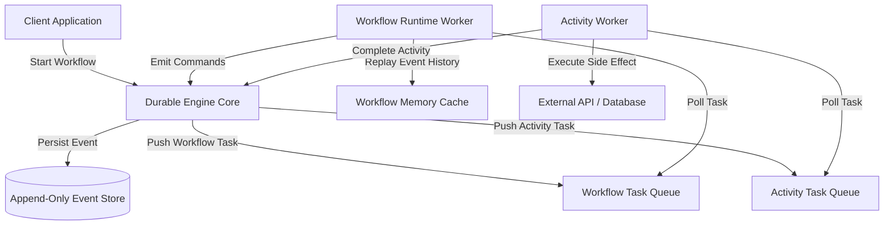
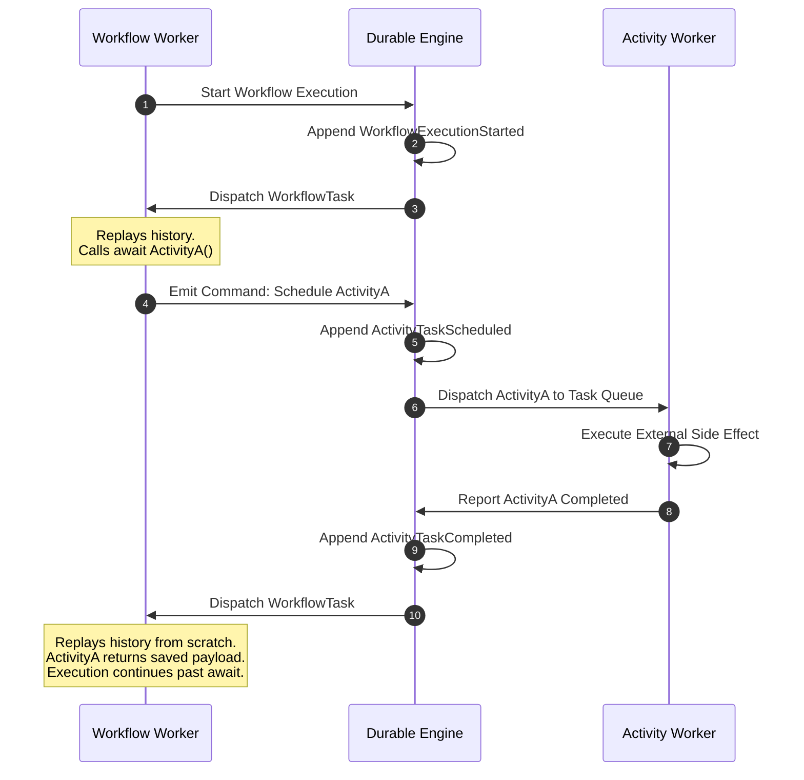
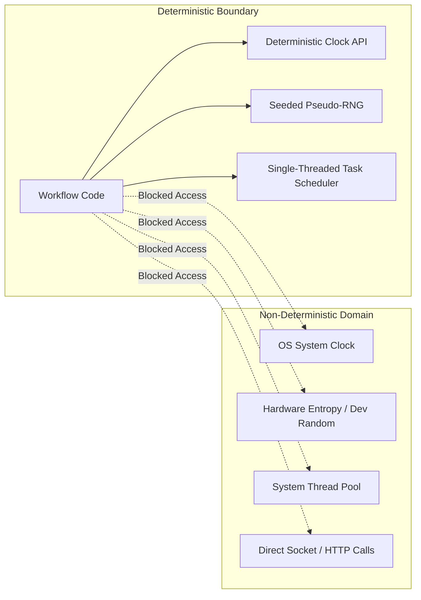

Traditional backend architectures rely heavily on stateless application workers backed by relational databases or document stores to manage business state. When a process needs to coordinate an operation that takes hours, days, or weeks, developers typically string together a web of distributed queues, database polling routines, scheduled cron jobs, and complex status flags. If a worker process crashes halfway through a multi-step financial transfer or supply chain pipeline, the state stored on that specific machine dies with it. The system must then rely on defensive database checks or manual recovery procedures to reconstruct where the workflow failed.

Durable execution engines take a fundamental shift in how we approach state management for distributed systems. Instead of storing explicit state models inside application tables, frameworks like Temporal, Cadence, and Azure Durable Functions turn standard imperative code into persistent, crash-resistant state machines. They achieve this magic without requiring specialized hardware or non-volatile RAM. The secret lies in a tightly coupled design pattern composed of append-only event histories, deterministic execution constraints, and replay mechanics that rebuild stack frames on demand.



### The Architecture of Durable Execution

A durable execution engine breaks application architecture into three clean, separate layers. These consist of the durable persistence engine, deterministic workflow orchestrators, and non-deterministic activity executors.

The persistence engine acts as the central coordinator and single source of truth. It manages task queues, tracks worker health, and enforces state consistency using an append-only event log. Crucially, the engine core never executes application code directly. It simply routes work, manages timer triggers, and saves event records sent back by workers.

Workflow workers house the actual code that defines business logic. Workflow code must be strictly deterministic. It cannot perform side effects directly. It cannot call HTTP endpoints, read from local disks, generate random numbers, or sample system clocks. Instead of making external network requests, workflow code emits declarative commands to the engine, telling it what side effects to execute on its behalf.

Activity workers execute those side effects. An activity is an ordinary, non-deterministic piece of code. Activities make API calls, query databases, send emails, and process images. When an activity finishes, it returns its result payload back to the core engine, which appends an event to the log and schedules a new workflow task to resume the orchestrator.



### The Replay State Machine

The defining magic of durable execution is that workflow code runs as if local volatile memory never vanishes. If a container running a workflow crashes mid-execution, another worker picks up the job and seamlessly picks up where the old process left off. The engine achieves this without saving heap snapshots or serializing OS thread stacks to disk.

Instead, durable engines rely on deterministic history replay. Every time a workflow encounters an asynchronous boundary, like waiting for an activity to complete or waiting for a timer to fire, the workflow process returns a command list to the engine and suspends execution. When the engine notifies the worker that the pending event has completed, the worker starts a fresh instance of the workflow function from the very beginning.

During this fresh execution, the engine feeds the worker the stored append-only history log. As the workflow code executes, every yield or await point checks against the historical log. When the workflow code calls an activity that previously finished, the worker intercepts that call, looks up the corresponding `ActivityTaskCompleted` event in the log, and returns the persisted result immediately without re-executing the underlying logic.

Consider this conceptual execution flow written in C#:

```csharp
public async Task ProcessOrderWorkflow(WorkflowContext ctx, OrderRequest request)
{
    // Step 1: Reserve Inventory
    var inventoryResult = await ctx.CallActivityAsync<bool>("ReserveInventory", request.ItemId);
    if (!inventoryResult)
    {
        await ctx.CallActivityAsync("NotifyCustomer", request.UserId, "Out of stock");
        return;
    }

    // Step 2: Charge Payment
    var paymentId = await ctx.CallActivityAsync<string>("ChargePayment", request.Amount);

    // Step 3: Wait for Fulfillment
    await ctx.CreateTimer(TimeSpan.FromHours(24));

    // Step 4: Ship Order
    await ctx.CallActivityAsync("ShipOrder", paymentId);
}
```

When `ProcessOrderWorkflow` executes for the first time, it runs up to line 4. `ctx.CallActivityAsync` does not execute the inventory logic directly. Instead, it registers a `ScheduleActivity` command in its local thread context and yields control. The worker sends this command to the engine, which appends `ActivityTaskScheduled` to the event log.

When the activity worker finishes `ReserveInventory`, the engine records `ActivityTaskCompleted` with a value of `true` in the event store. The engine then dispatches a new workflow task to a workflow worker. The worker starts `ProcessOrderWorkflow` from line 1. Line 4 executes again. However, this time `ctx.CallActivityAsync` sees that `ActivityTaskCompleted` exists in the history log. It skips scheduling network tasks, returns `true` instantly, and lets the code advance to line 11 to charge payment.

### Enforcing Workflow Determinism

Because the entire replay engine depends on re-executing code paths to reconstruct local variable state, workflow code must produce the exact same sequence of commands every time it processes the exact same history log. Any variation in code execution order corrupts the engine state machine.

To prevent state drift, durable engines enforce strict isolation rules inside workflow contexts. Developers cannot call standard system functions that sample environmental non-determinism. System clocks must be accessed through context abstractions like `ctx.CurrentUtcDateTime` rather than `DateTime.UtcNow`. Under replay, `ctx.CurrentUtcDateTime` returns the static timestamp recorded when the original workflow task was scheduled, keeping execution consistent across multiple runs.

Random number generators are another source of state drift. Calling `new Random().Next()` produces different values during replay, causing logical branches to diverge from historical records. Durable frameworks solve this by supplying deterministic pseudo-random generators seeded by the unique workflow execution ID.

Thread scheduling and asynchronous concurrency must also be constrained. Multi-threaded operations that execute tasks in non-deterministic order violate replay guarantees. Most durable execution frameworks run workflow logic within a customized single-threaded synchronization context or isolation sandbox. This interceptor catches attempt to spawn unmanaged background tasks, blocking non-deterministic execution paths before they corrupt the history store.



### Code Evolution and Version Management

Because event histories are append-only and persisted for long periods, changing workflow code in production introduces severe challenges. If a developer deploys a code patch that adds a new `await` call in the middle of a workflow, any active workflow instance attempting to replay existing history will mismatch its execution trace against stored history records.

If history shows `ActivityTaskCompleted` for step two, but the new code inserts step `1.5` before step two, the replay engine detects a sequence mismatch. It throws a non-deterministic execution error, halting workflow execution to protect data integrity.

To safely update workflow logic, durable systems use explicit versioning APIs within the workflow code itself. Instead of altering code directly, developers wrap structural modifications inside version checks.

```csharp
public async Task ProcessOrderWorkflow(WorkflowContext ctx, OrderRequest request)
{
    var inventoryResult = await ctx.CallActivityAsync<bool>("ReserveInventory", request.ItemId);
    
    // Safe code modification using engine versioning
    int version = await ctx.GetVersionAsync("AddFraudCheck", WorkflowNoVersion, 1);
    if (version == 1)
    {
        await ctx.CallActivityAsync("PerformFraudCheck", request.UserId);
    }

    var paymentId = await ctx.CallActivityAsync<string>("ChargePayment", request.Amount);
}
```

When `ctx.GetVersionAsync` runs for an old workflow instance, the engine notices that no version marker exists in the event history. It returns `WorkflowNoVersion`, causing the workflow to bypass the new fraud check and replay safely. For newly initiated workflows, the engine records version `1` in the history log, executing the fraud check path consistently.

### Performance Optimizations: Sticky Execution and History Compaction

Replaying long history logs from scratch on every single workflow task quickly creates performance bottlenecks as event histories grow into thousands of records. Durable execution engines employ two primary techniques to maintain high throughput: sticky workflow queues and history compaction.

Sticky workflow execution optimizes memory usage by keeping the workflow thread state cached in a worker process's RAM after completing a task. The worker notifies the engine core that it holds the active in-memory thread context for that workflow. If another event occurs shortly after, the engine routes the workflow task directly to that specific worker.

Because the worker process still has the paused stack frame in memory, it skips the replay phase entirely. It simply unblocks the waiting async task and continues execution immediately. If the worker runs out of memory or crashes, the engine gracefully falls back to sending the workflow task to another worker, which reboots state using full history replay.

History compaction, often called Continue-As-New, solves the problem of infinite log growth in perpetual workflows, such as IoT device monitoring loops or subscription billing listeners. A workflow history cannot grow indefinitely without degrading database query times and memory footprint.

When a workflow completes a logical loop, it checks its historical event count or total payload size. If the history exceeds configured thresholds, the workflow calls `ContinueAsNew`. This command atomically terminates the current workflow execution history, creates a clean event log with a fresh workflow ID, and passes current state vectors forward as input arguments to the new execution instance.

By unifying append-only event logs, strict determinism guards, and replay state machines, durable execution engines abstract away the distributed systems complexities of state persistence and crash recovery. Developers can build multi-step, failure-tolerant orchestration logic using straightforward, imperative code patterns without fear of intermediate process loss.
