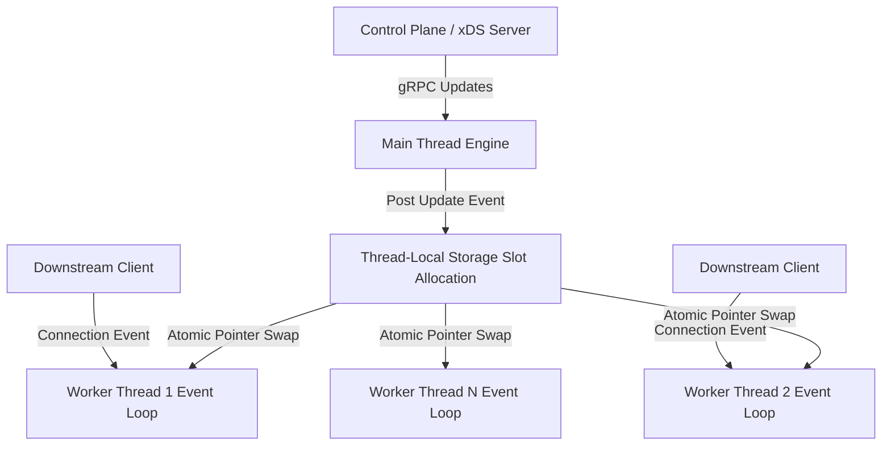
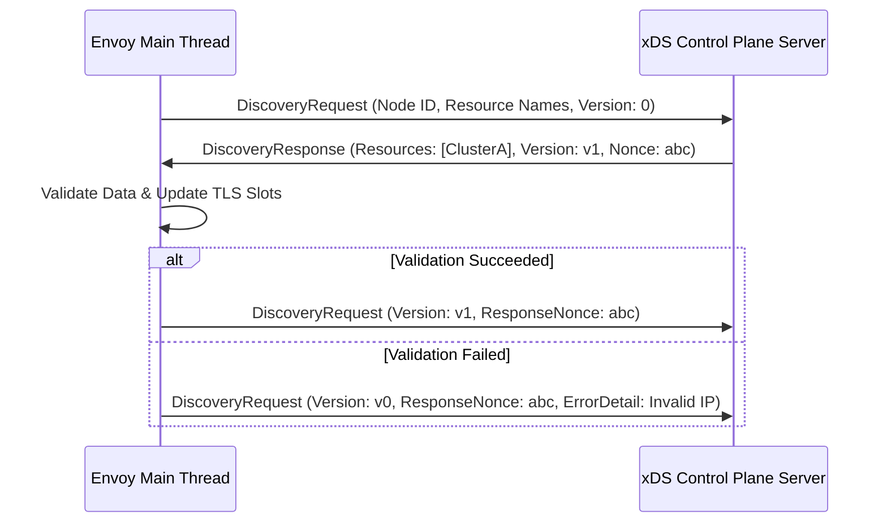
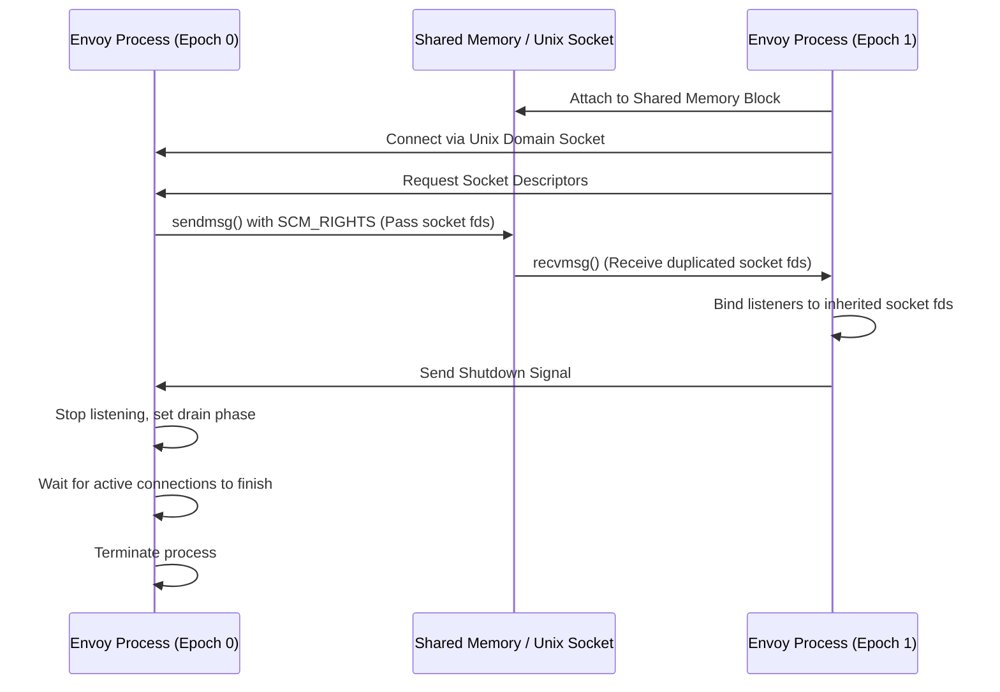

Most high-performance layer seven proxies fall into one of two design categories. They either run a process per core with shared state managed through kernel primitives, or they execute a multi-threaded event loop where threads contend over shared data structures using mutexes. Nginx mastered the multi-process model, but dynamic reconfiguration historically required re-parsing configuration files on disk and spawning new worker processes. In cloud-native microservice architectures where routing rules, TLS certificates, and host clusters shift hundreds of times a minute, process spawning and disk reads are non-starters. Envoy proxy solved this by combining an asynchronous thread-local storage engine with a dynamic, gRPC-driven control plane protocol known as xDS.

### Thread Isolation and Non-Blocking Event Loops

Envoy relies on a main thread alongside a user-configurable number of dedicated worker threads. The main thread handles administrative tasks, stats aggregation, process lifecycle signals, and control plane gRPC stream connections. Worker threads perform all heavy data plane operations. Each worker executes a non-blocking libevent loop tied directly to Linux epoll notifications.

When a network socket becomes readable, epoll triggers an event callback on the designated worker thread. The worker handles socket reads, TLS termination, protocol parsing, filter chain execution, and upstream socket writes without passing context to other threads. Locks on the data path do not exist. If worker threads shared mutable routing tables or cluster membership lists directly through shared pointers, cache line bouncing and lock contention would cripple CPU throughput under high request rates.

To update configuration state across workers without locks, Envoy implements a Thread-Local Storage mechanism. When the main thread receives a new cluster definition or routing table over the xDS control plane stream, it instantiates the new object hierarchy in main memory. It allocates a slot index in a central registry and posts a message to every worker thread's event loop via an inter-thread event notification queue. When each worker thread processes this event, it atomically swaps its local pointer array slot to reference the newly allocated state object. Active HTTP requests running on a worker thread continue reading the old configuration pointer until their request lifecycle finishes, at which point the old configuration reference count hits zero and clean up occurs asynchronously.

### Downstream to Upstream Filter Pipeline Mechanics

Connection handling begins at the listener interface. Envoy workers can either use the Linux kernel's SO_REUSEPORT flag to let the kernel distribute incoming TCP SYN packets across multiple worker listener sockets, or a single worker can accept connections and dispatch raw file descriptors to peer worker event loops over internal queues. Once a connection lands on a worker, it passes through a pipeline of stackable filter engines.

Filter chains are split into network filters and Layer 7 filters. Network filters operate on raw byte streams and perform tasks like TLS handshake termination, TCP proxying, and rate-limiting connection checks. The final network filter in a standard web request chain is the HTTP Connection Manager. This component parses raw bytes into HTTP requests, manages stream framing for HTTP/2 or HTTP/3, and instantiates Layer 7 HTTP filters.

The HTTP routing filter acts as the boundary between downstream clients and upstream target clusters. It queries the worker thread's local storage slot to evaluate path matching, header routing rules, and weighted backend cluster selections. After selecting an upstream endpoint, the router filter acquires an active stream from an upstream connection pool owned entirely by that specific worker thread. Connection pooling is completely thread-isolated, which prevents worker threads from fighting over multiplexed HTTP/2 streams or TCP socket writes.

### The xDS Dynamic Control Plane State Engine

Envoy achieves dynamic behavior through the xDS API family. The letter x serves as a wildcard representing distinct dynamic resource types. LDS handles Listener Discovery Service, RDS manages Route Discovery Service, CDS delivers Cluster Discovery Service, and EDS populates Endpoint Discovery Service. These services form a strict dependency hierarchy.

Endpoints belong to Clusters, Clusters are referenced by Routes, and Routes are attached to Listeners. When Envoy bootstraps, it establishes a long-lived bidirectional gRPC stream to the control plane using the Aggregated Discovery Service variant. ADS ensures updates arrive in a deterministic order, eliminating race conditions such as a router attempting to select a cluster before the cluster endpoints exist in memory.

The protocol utilizes an explicit State Acknowledgment mechanism. When the control plane streams a DiscoveryResponse payload containing new routing tables or cluster endpoints, Envoy parses and validates the data structures. Validation checks ensure structural correctness, IP address validity, and filter chain sanity. If validation succeeds, Envoy updates its internal state pointer, applies the changes to its thread-local slots, and returns a DiscoveryRequest acknowledging the new version string. If validation fails, Envoy sends an acknowledgment message containing an explicit error detail string while continuing to run the existing valid configuration. Traffic never breaks due to a malformed control plane payload.

### Zero-Downtime Hot Restarts and Socket Transfer

Software updates, memory leaks, or binary rebuilds require restarting the proxy process. Traditional proxy restarts drop active TCP connections or rely on external load balancers to reroute traffic away during binary termination. Envoy avoids connection disruption through a native hot restart system that allows a new Envoy process to launch, take over listening file descriptors, and drain the old process without losing a single packet.

Hot restart relies on two Unix operating system features: shared memory segments created via shm_open and file descriptor passing over Unix domain sockets using sendmsg with SCM_RIGHTS ancillary data. The running Envoy instance acts as the parent epoch, while the new Envoy binary launches as the child epoch.

Upon boot, the new process attaches to the shared memory region where epoch counter state, lockless stats counters, and memory alignment flags reside. The child connects to the parent process over a predefined Unix domain socket and sends a control message requesting active socket descriptors. The parent process processes this message and calls sendmsg, populating the control message buffer with SCM_RIGHTS payload data containing its active listening file descriptors.

The Linux kernel handles duplicating the underlying socket table entries into the child process file descriptor table. The child executes recvmsg, extracts the duplicated socket file descriptors, and immediately registers them into its libevent epoll loops. The child can now accept new incoming TCP connections on the exact same ports without issuing a new bind or listen system call.

Once socket transfer completes, the child signals the parent to enter the draining state. The parent process stops accepting new connections on its epoll loops, but existing downstream HTTP requests and open long-lived TCP streams remain active. The parent sets a configurable drain timer and tracks open connection counts inside the shared memory block. As active connections complete their responses, they close down naturally. When the active connection count hits zero or the drain timeout expires, the old process terminates cleanly, leaving the child in full control of data plane traffic.
