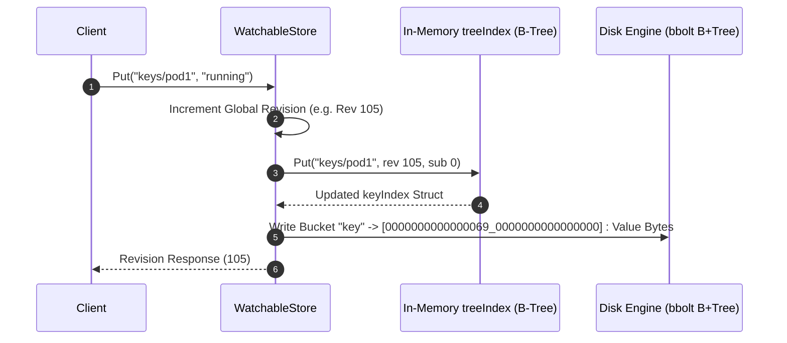
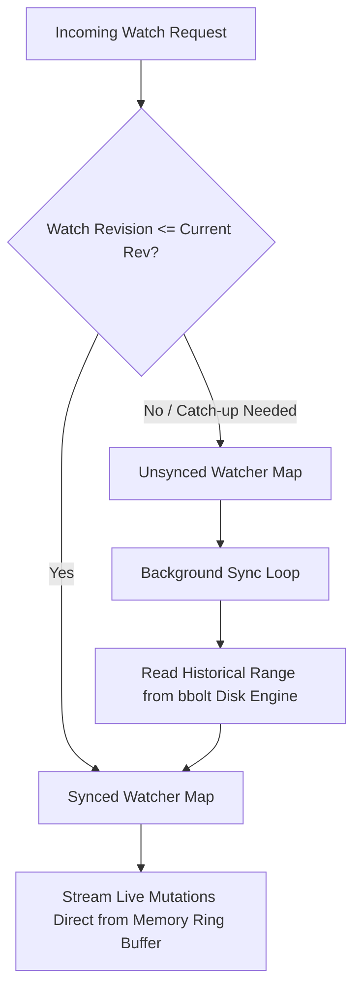

# Inside etcd MVCC: How Revisions, Bbolt B+Trees, and Watch Hubs Engine Kubernetes

Most developers view etcd as a simple distributed key-value store that Kubernetes happens to use for cluster coordination. If you query a key like `/registry/pods/default/nginx`, you get back a payload, and if you update it, you get a new value. Under the surface, etcd does not behave like Redis or Postgres. It is an append-only, multi-version concurrency control storage engine designed around global, monotonically increasing 64-bit revision numbers.

When you overwrite a key in etcd, the database does not modify the existing record in place. It increments a cluster-wide counter and appends a brand new record indexed by that revision. Keys in etcd are logical pointers to generations of revisions, and old data stays on disk until a explicit compaction pass prunes it. This underlying design is what enables Kubernetes controllers to watch cluster state continuously without holding long database locks or missing state transitions.

To achieve point-in-time snapshot isolation, range scans, and real-time event streaming simultaneously, etcd splits its storage architecture into two distinct subsystems. Memory holds a secondary index called `treeIndex`, while disk persistence is backed by `bbolt`, an embedded copy-on-write B+tree database. Connecting these two layers is `WatchableStore`, an event notification engine that streams mutations to subscribers.



## The Dual-Index Architecture

The fundamental challenge of building a multi-version key-value store on disk is key layout. If you organize disk records by user key names, finding historical versions of a key requires seeking across sparse disk regions or keeping expensive linked lists inside database pages. If you organize disk records strictly by revision counter, range queries for key prefixes like `/registry/pods/` require scanning the entire disk history, which destroys read performance.

etcd solves this with a dual-index architecture. The on-disk engine stores data sorted purely by revision tuples, while an in-memory Google btree data structure maps human-readable user keys to those internal revision numbers.

When a client issues a `GET /registry/pods/pod-a` query, etcd executes a two-phase lookup pipeline. First, it hits the in-memory `treeIndex`. The `treeIndex` locates the `keyIndex` structure corresponding to `/registry/pods/pod-a`. This structure holds the revision metadata for all active generations of that key. The index selects the exact revision number matching the request, defaulting to the latest modified revision.

Once the revision tuple is resolved, say revision 402 with sub-index 0, etcd constructs an 16-byte big-endian key containing `revision` and `sub`. It queries the `bbolt` storage engine, which quickly finds the exact binary key inside its B+tree page structure and returns the Protobuf-encoded `KeyValue` struct containing the value, lease ID, creation revision, and version counter.

Because the disk layer sorts keys by big-endian revision bytes, reads for specific revisions are single logarithmic point lookups inside `bbolt`. Range scans over key prefixes happen entirely inside the fast in-memory `treeIndex` B-tree, gathering a batch of target revision numbers before fetching them from disk.

## The Anatomy of `keyIndex` and Generations

Inside the Go memory space of an etcd process, the `treeIndex` manages a tree of `keyIndex` pointers. A single `keyIndex` represents the complete lifecycle of one user key, including all of its creations, modifications, and deletions over time.

```
keyIndex struct:
  key: []byte ("/registry/pods/pod-a")
  modified: revision { main: 105, sub: 0 }
  generations: [
    {
      created:  revision { main: 12, sub: 0 },
      ver:      3,
      revs:     [ {12, 0}, {45, 0}, {105, 0} ]
    }
  ]
```

A key lifecycle is divided into generations. A generation begins when a key is created and stays open through subsequent update operations. Every update appends a new revision tuple to the active generation's `revs` slice and increments the generation's version count.

When a key is deleted, etcd writes a tombstone record to `bbolt` at the current global revision. In memory, `keyIndex` appends the tombstone revision to the active generation and closes it. The closed generation becomes immutable. If a client subsequently writes to the same key path again, `keyIndex` appends a brand new, empty generation to its internal slice and sets its `created` revision to the new operation's revision number.

This abstraction makes historical queries trivially fast. If a Kubernetes API server requests a key at revision 50, `keyIndex` searches its generation history, identifies which generation covered revision 50, and performs a binary search over the revision slice for that generation. If revision 50 fell between a tombstone revision and a new creation revision, `treeIndex` instantly returns a key not found error without making a single disk read to `bbolt`.

## Deep Inside `bbolt`: Mmap and Page Allocation Mechanics

The persistent backend backing etcd is `bbolt`, a fork of LMDB written in pure Go. `bbolt` is a single-file, copy-on-write B+tree implementation designed for heavy read workloads. It avoids network RPCs, complex caching daemons, or custom buffer pools by memory-mapping the entire database file into the process virtual address space using the `mmap` system call.

When `bbolt` opens `db.etcd`, it calls `mmap()` on the file descriptor, mapping disk blocks directly to OS page cache memory. Read operations bypass user-space buffering entirely. Finding a key inside `bbolt` involves traversing pointer offsets inside byte slices mapped straight from memory. The operating system handles paging blocks in from disk when page faults occur.

```
+-------------------------------------------------------------------------+
| bbolt File Layout                                                       |
+-------------------+-------------------+---------------------------------+
| Page 0 (Meta)     | Page 1 (Meta)     | Page 2 (Freelist)               |
| TxID: 100         | TxID: 101         | Unused Page IDs: [5, 8, 9]      |
+-------------------+-------------------+---------------------------------+
| Page 3 (B+Tree Root Node)                                               |
| Branch Page: Key Ranges -> Target Page IDs                              |
+-------------------------------------------------------------------------+
| Page 4 (Leaf Page: Bucket 'key')                                        |
| [0000000000000069_0000000000000000] -> Protobuf Payload Byte Stream     |
+-------------------------------------------------------------------------+
```

`bbolt` structures its database file using 4KB pages. Page 0 and Page 1 are reserved as metadata headers containing the root node page ID, global transaction ID, and freelist page location. `bbolt` alternates writes between these two metadata pages to guarantee atomic commits. Page 2 typically holds the freelist, which tracks available page IDs that were freed by past transactions and are ready for reuse.

Transactions in `bbolt` adhere to strict single-writer, concurrent-reader semantics. Writes acquire a mutex, construct a read-only snapshot of current metadata, allocate new pages from the freelist for modified nodes, and execute a copy-on-write mutation of the B+tree paths leading down to affected leaves.

Because modified nodes are written to newly allocated pages rather than overwritten in place, concurrent read transactions continue reading old, unmodified page pointer chains safely without holding locks. Once new pages are flushed to disk using `fsync`, `bbolt` updates one of the header metadata pages atomically. Old pages are not returned to the freelist until all active read transactions referencing them have completed.

Within `bbolt`, etcd uses specific bucket namespaces. The primary bucket is `key`. The keys stored inside the `key` bucket are 16-byte fixed-size binary arrays. The first 8 bytes store the 64-bit `main` revision encoded in big-endian byte order, followed by an 8-byte `sub` revision counter. The `sub` counter distinguishes multiple mutations occurring within a single Raft transaction step. Big-endian byte order ensures that standard binary string comparisons mirror numeric comparisons, allowing `bbolt` to keep leaf nodes sorted chronologically on disk automatically.

## Event Streaming via `WatchableStore`

The capability that makes etcd essential for cloud-native orchestration is watching. Controllers do not poll the database. Instead, they open long-lived watch streams that emit events whenever keys matching a prefix change.

Handling thousands of continuous watchers without running out of memory or thrashing disk requires an architecture built specifically for event multiplexing. etcd handles this through `WatchableStore`, an event routing layer wrapped around the core MVCC store.



`WatchableStore` maintains two primary groupings of watchers: `synced` and `unsynced`. A watcher is `synced` when it has caught up with the current global revision of the database. When a write operation completes, etcd pushes the resulting mutation directly from memory to all `synced` watchers listening to matching keys or prefix ranges. This push path operates with near-zero delay and does not hit `bbolt`.

An `unsynced` watcher is a stream that requested event history starting from an older revision in the past, or a watcher that fell behind because its network buffer stalled. `WatchableStore` assigns `unsynced` watchers to a background synchronization loop.

The sync loop runs periodically, fetching historical key events directly from `bbolt` in batches. It iterates through the `key` bucket starting at the watcher's requested historical revision up to the current revision, emits those events over the watcher's gRPC stream, and eventually transfers the watcher into the `synced` watcher set once its progress catches up to the current revision head.

To match keys against watchers efficiently, `WatchableStore` uses an interval tree data structure. Watching a single key is treated as listening to a point interval, while watching a prefix like `/registry/services/` corresponds to watching a range interval. When a write hits key `/registry/services/endpoints/service-a`, etcd queries the interval tree in logarithmic time to locate every watcher whose interval encompasses that path.

## Compaction and Defragmentation Mechanics

Since etcd appends new revisions for every mutation, an unmanaged instance would eventually exhaust available disk space and corrupt its performance as `bbolt` trees grow wide. To prevent this, etcd requires periodic revision compaction.

Compaction is initiated either manually or through automatic compaction policies. When you call compact at revision 1000, etcd updates its internal metadata and begins purging operational history before that threshold.

Compaction proceeds in two distinct phases across memory and disk. First, `treeIndex` iterates through its B-tree of `keyIndex` structs. For every key, it removes generation entries that ended prior to revision 1000. If a key was deleted and its tombstone revision is less than 1000, the entire `keyIndex` struct is purged from memory.

Second, an asynchronous background task scans `bbolt` page ranges. It deletes binary revision keys lower than 1000 from the `key` bucket, unless a record represents the latest version of a key that remains active after revision 1000.

Calling compact does not instantly reduce the physical size of the `db.etcd` file on the filesystem. When `bbolt` marks leaf pages as deleted during a compaction run, it appends those page IDs to its freelist. Future write operations reclaim and overwrite those free pages before growing the underlying file size.

If massive bulk operations cause the `db.etcd` file to expand to several gigabytes before a compaction occurs, that space remains allocated inside the database file as free pages. Returning that physical storage back to the operating system filesystem requires issuing an explicit defragmentation command. Defragmentation reads the existing database line by line, creates a completely new binary `bbolt` file containing only live, active pages packed sequentially, and atomically swaps the fresh file into place.

## Write Path End-to-End Execution Flow

Tracing a single write request through the codebase consolidates these distinct components into a cohesive system pipeline.

A write begins when a gRPC `PutRequest` arrives at the active Raft cluster leader. The request passes through authentication and quota check layers before entering the consensus engine. Raft packages the command into a log entry, replicates it across a majority of quorum nodes, and commits the entry.

Once committed, the state machine applies the entry to the store. The store calls `WatchableStore.Put()`, acquiring a lock on the storage engine.

The global revision counter is incremented by one. The key name is evaluated against the `treeIndex`. The B-tree locates or creates the corresponding `keyIndex` entry, appending the new revision ID alongside sub-index zero.

Next, the engine serializes the value and key metadata into a Protobuf payload. It starts a write transaction against `bbolt`, writing the byte key `[main_revision][sub_revision]` into the `key` bucket along with the payload.

`WatchableStore` then notifies the watch hub. It queries its internal interval tree for any `synced` watchers listening to the exact key path or prefix interval. Matched watchers receive the new event payload immediately over their HTTP/2 gRPC channels.

Finally, the `bbolt` transaction commits, flushing dirty pages to disk if configured for immediate sync, and the gRPC service returns a successful `PutResponse` containing the new revision number back to the client application.
