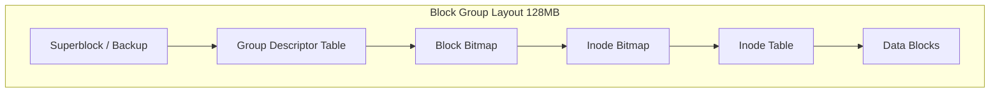
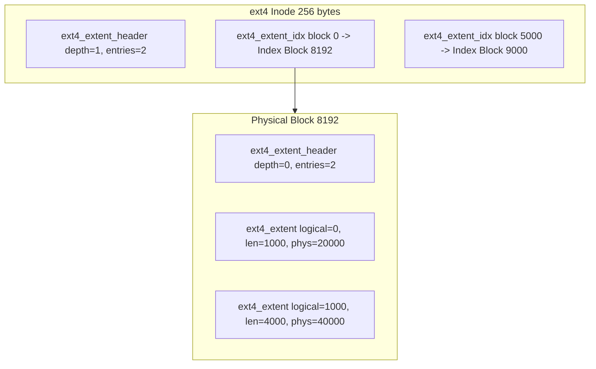
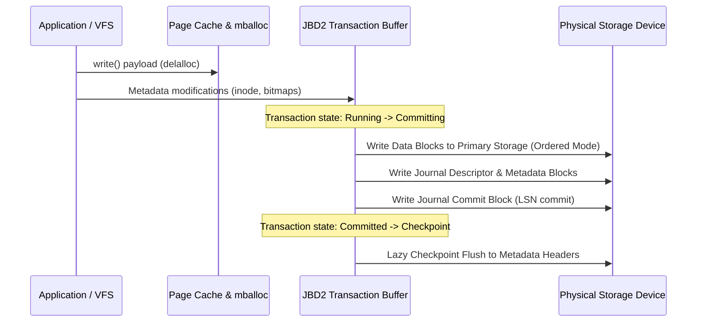

When formatting a disk with ext4, the file system divides continuous physical block space into discrete chunks called block groups. Standard block sizes default to 4096 bytes, and a single block group typically spans 32,768 blocks, yielding a 128 Megabyte allocation window per group. This spatial segmentation limits allocation fragmentation by forcing related inodes and data blocks into adjacent physical disk locations, keeping disk arm movement predictable on mechanical drives and preserving CPU cache locality on flash storage.

Inside every block group, ext4 organizes layout components in a deterministic order. Group zero starts with a 1024-byte padding offset reserved for x86 bootloaders, followed immediately by the 1024-byte Superblock structure. The Superblock records global parameters like total block count, free block counts, inode allocations, feature flags, and mount counts. To defend against storage hardware corruption, ext4 duplicates backup copies of the Superblock across sparse block groups, specifically group 0, group 1, and groups that are powers of 3, 5, and 7.

Directly behind the Superblock lies the Group Descriptor Table. This table contains an array of 64-byte descriptors, one for each block group in the file system. Each group descriptor records physical block pointers pointing to that group's block allocation bitmap, inode allocation bitmap, inode table start block, and free space counters. The remaining space inside the group holds the Inode Table array and the actual raw data payload blocks.

An inode in ext4 is a fixed 256-byte structure that holds file metadata, access control lists, execution permission bits, timestamps, and physical data block mapping pointers. Older Linux file systems like ext2 and ext3 used indirect block pointers. An inode stored twelve direct block pointers, one singly-indirect pointer, one doubly-indirect pointer, and one triply-indirect pointer. Reading a multi-gigabyte file required traversing multiple tree layers of indirect pointer blocks, generating massive I/O overhead and severe fragmentation.

ext4 replaced indirect block maps with extent trees. An extent is a contiguous range of physical blocks represented by a single compact descriptor. Instead of storing ten thousand individual block pointers for a forty megabyte file, ext4 stores a single extent mapping logical block offset zero to a contiguous run of ten thousand physical blocks.

Every ext4 inode allocates 60 bytes within its structure body inside the i_block array. This payload space hosts the root node of an extent tree. The root header structure ext4_extent_header defines node depth, current entry count, and maximum entry capacity. If a file fits within four extents, all four ext4_extent entries sit directly inside the inode's i_block space, requiring zero external metadata block allocations to locate physical file data.

When a file fragments across multiple locations, the depth field inside the root header increments beyond zero, transforming the embedded payload into an index node holding ext4_extent_idx entries. Index entries point down to dedicated external physical blocks containing leaf nodes filled with physical extent entries.

Each leaf ext4_extent structure occupies 12 bytes. It records a 32-bit logical block offset, a 16-bit block length, a 16-bit high physical block address, and a 32-bit low physical block address. Combining the high and low physical bits gives ext4 a 48-bit physical block address space, accommodating total volume storage limits up to 1 Exabyte.

Allocating blocks one at a time during user space write syscalls creates unnecessary fragmentation. When an application calls write() in ext4, the kernel does not instantly allocate physical disk space. It engages delayed allocation, or delalloc.

Under delalloc, file writes dirty Linux page cache memory blocks and register unmapped page reservations. The kernel increments internal pending allocation accounting counters but avoids touching physical block bitmap structures on disk. Physical space allocation defers until the Linux page flusher daemon flushes dirty pages down to block storage, or an explicit fsync() syscall executes.

Deferring physical block mapping allows ext4 to inspect the entire dirty write payload in page cache at once. If an application writes a 50 Megabyte stream in tiny 4 Kilobyte buffer fragments, delalloc accumulates all 12,800 pages into contiguous memory first. When flushing finally begins, ext4 passes the entire range to the Multiblock Allocator, or mballoc.

The mballoc subsystem evaluates allocation goals using buddy bitmaps maintained in CPU memory. It searches for free physical extents matching the total contiguous file length. mballoc uses localized preallocation windows, reserving block groups for specific thread process groups to prevent concurrent threads from interleaving allocations into the same physical disk region. By calculating contiguous physical block ranges in a single invocation, mballoc transforms thousands of potential metadata block update operations into a single extent update.

File system operations like moving a file or writing data require multiple distinct metadata updates. Adding a file to a folder involves marking a bit in the inode bitmap, initializing an inode structure in the inode table, updating the parent directory data block, and marking physical data blocks as used in the block bitmap. If power cuts out midway through these modifications, the file system leaves orphan descriptors and corrupted pointers on disk.

ext4 delegates crash resilience to JBD2, the Journaling Block Device 2 engine. JBD2 maintains a dedicated hidden system inode file, usually visible as block journal file .journal at the root of the file system. Rather than mutating main disk metadata structures live during operations, metadata changes pass into active memory transactions tracked by JBD2.

JBD2 supports three main journaling operational modes. In journal mode, both file data updates and metadata updates write to the JBD2 journal before committing to the main block layout. In ordered mode, which is the default setting on Linux, file data blocks write directly to their final disk destination before the associated metadata transaction commits to the journal. In writeback mode, metadata is journaled, but data updates can write to disk before or after journal commits without synchronization ordering constraints, maximizing write throughput at the cost of potential stale data leakage after hard crashes.

Every metadata update operates within a JBD2 transaction state machine. First, the transaction enters the Running state. File system syscalls call jbd2_journal_start(), obtaining a transaction handle. All metadata buffers modified during this window attach to this active running transaction.

Next, after a time threshold (defaulting to 5 seconds) or when explicit sync requests occur, the running transaction transitions to the Committing state. JBD2 blocks new modification handles from joining this transaction, opening a fresh running transaction for concurrent system tasks.

During committing, JBD2 writes a Journal Descriptor Block to the journal log on disk. This descriptor block lists magic signature headers and an inventory array mapping each logged journal buffer block to its ultimate target sector address on primary storage.

Next, JBD2 writes all modified metadata blocks into contiguous journal log blocks on disk. If a modified block matches a physical commit signature magic byte, JBD2 applies bit escaping to prevent false recovery markers.

In ordered mode, JBD2 issues write barrier commands ensuring all raw data pages in primary disk locations finish writing to physical flash or platter media before writing the transaction Commit Block.

Finally, JBD2 writes a Journal Commit Block to the log. This commit block contains a monotonically increasing Log Sequence Number and a CRC32 checksum over all transaction blocks. The instant the Commit Block hits non-volatile flash or platter surface, the transaction is legally committed. If power fails a microsecond later, crash recovery reads the journal, validates the CRC32 checksum, and replays metadata blocks onto primary disk locations.

Once committed, the transaction moves into the Checkpoint phase. JBD2 lazily writes updated metadata blocks from primary RAM page cache out to their main physical locations on disk. After dirty blocks settle into their final block group locations, JBD2 frees journal log space, advancing the journal log ring buffer head pointer.

When mounting an uncleaned ext4 volume after an abrupt system reset, the kernel triggers JBD2 recovery routines inside ext4_fill_super. JBD2 scans the log ring buffer, identifying valid journal sequence blocks starting from the last logged superblock transaction head.

Recovery reads each descriptor block, parses target destination physical block addresses, and computes CRC32 checksums over subsequent transaction payload blocks up to the matching commit block. If a transaction lacks a valid commit block or fails checksum validation due to incomplete disk writes, recovery halts processing at that boundary, discarding incomplete tail transactions.

Valid completed transactions replay in strict Log Sequence Number order. JBD2 copies metadata blocks directly from the journal file out to target block locations within individual block groups, restoring bitmap allocations, directory entries, and inode structure layouts to a fully consistent point in time.
