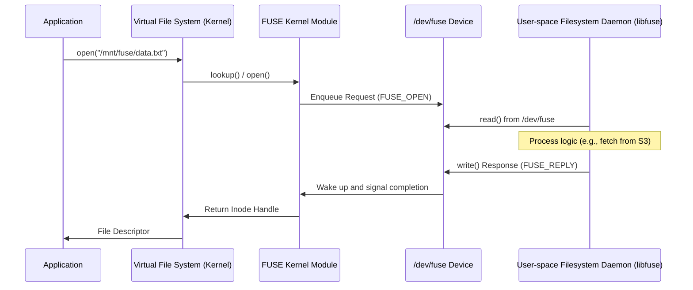

Writing code for the Linux kernel is a miserable experience for most developers. You deal with restrictive APIs, the constant threat of a kernel panic, and a debugging cycle that feels like it belongs in the early days of computing. Filesystem in Userspace, or FUSE, changed that by moving the actual filesystem logic out of the kernel and into a standard process. This isn't just a simple wrapper. It is a sophisticated bridge that turns high-level system calls into messages sent over a character device. It allows a C# or Go developer to mount an S3 bucket or a database table as a local folder without ever writing a line of C or touching a kernel header.

The architecture starts with the Virtual File System (VFS). When an application calls open() on a file sitting in a FUSE mount, the VFS doesn't know the difference between it and a native ext4 file. It passes the request to the FUSE kernel module. Instead of looking at a local disk or a network block device, the FUSE module creates a request object and shoves it into a queue. This queue is the point where the kernel hands off control to user space.

The user-space daemon is the heart of the system. This process is usually linked against libfuse, which simplifies the heavy lifting of parsing the protocol. The daemon performs a read() call on the /dev/fuse character device. This is a blocking call that hangs until the kernel module has something to say. Once a request arrives, the daemon parses the FUSE opcode, which might be a lookup, a read, or a mkdir. It does whatever it needs to do and then sends the result back with a write() to the same device. The kernel then picks up that result and passes it back up the stack to the original application.

Performance is where the idealism of FUSE hits a wall. Every operation requires a context switch from the application to the kernel, and then another from the kernel to the user-space daemon. If you are doing an ls command on a directory with thousands of files, you are triggering thousands of these round trips. Each one involves copying data across the kernel-user boundary. The kernel tries to mitigate this with a massive page cache. If the FUSE module can satisfy a read from the cache, it won't bother the daemon. But for writes or for filesystems where the cache is hard to keep consistent, the overhead is brutal. You are effectively paying a massive CPU tax to avoid writing kernel code.

The protocol handles metadata and data through distinct opcodes. For metadata, the lookup opcode is the most critical. It turns a filename into an inode. Once the kernel has an inode, it can cache it. This reduces the number of times it has to ask the daemon for the same file. However, the daemon must be careful about how it manages its own state. The kernel module uses a forget message to tell the user-space daemon when it no longer needs an inode in its cache. Without this, the daemon would keep every file it ever looked up in memory forever, leading to a slow death by memory exhaustion.

Memory management in FUSE is equally clever. The splice() system call allows FUSE to move data between the kernel's pipe buffers and the user-space daemon's buffers without an intermediate copy. This is the only reason FUSE is viable for high-bandwidth data transfers. Without splice, you'd be copying the same block of data multiple times between buffers, which would destroy the throughput of even the fastest NVMe drives. Developers also have to choose between write-through and write-back caching. Write-through is safer but slower because every write waits for the daemon to confirm. Write-back allows the kernel to buffer writes and send them in chunks, which is faster but risks data loss if the daemon crashes.

Despite the performance hits, FUSE is why we have modern cloud-native storage. It powers SSHFS, GlusterFS, and the mounting of blob storage as local drives. It is a masterclass in architectural trade-offs. You trade raw IOPS for the ability to write a filesystem in a high-level language and crash your daemon without taking the whole server down with it. It proves that for many use cases, developer productivity and system stability are more valuable than a few extra cycles spent on context switching.
