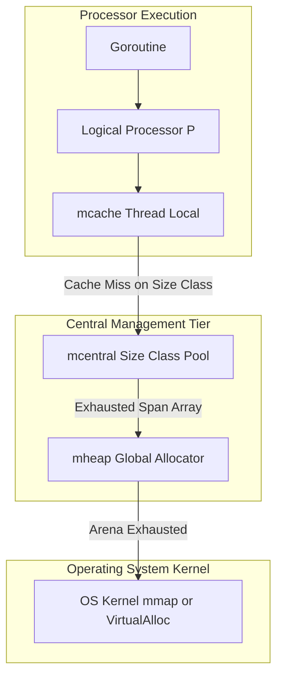
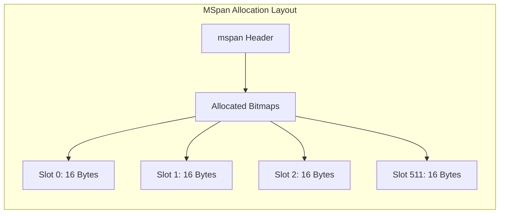
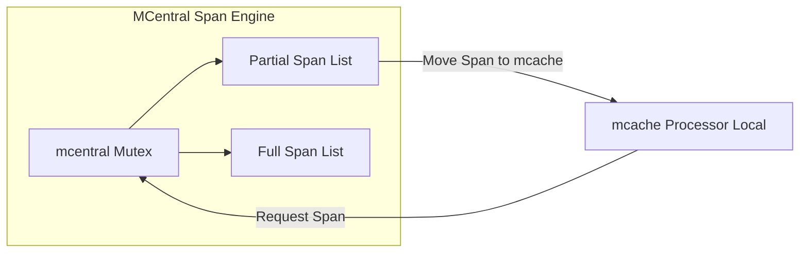
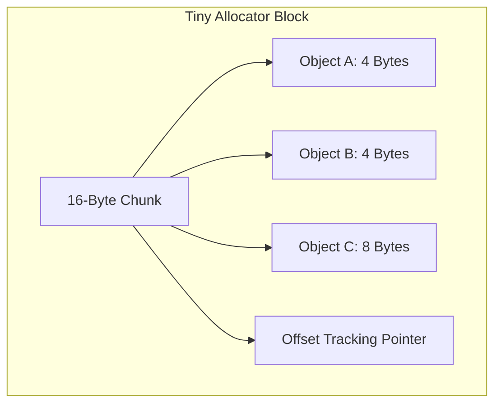

High-throughput concurrent runtimes cannot afford to lock a global heap allocator on every object instantiation. When hundreds of thousands of goroutines make millions of short-lived allocations per second, centralized mutex contention degrades throughput instantly. To prevent this, Go built its memory allocation engine around the design concepts of TCMalloc, which stands for Thread-Caching Malloc. The engine partitions memory into layered ownership structures, turning memory allocation into a lock-free thread-local array lookup for almost all small object creations.

The runtime separates heap management into three distinct tiers. At the execution tier, logical processors hold a localized memory cache. Above that sits a shared central repository split into specific size bins. At the bottom lies the global heap manager that requests raw page blocks directly from the operating system kernel. Understanding how data travels through these tiers explains why Go achieves fast allocation speeds without resorting to heavy kernel syscalls or mutex locks for every pointer initialization.

## Size Classes and the MSpan Unit

To eliminate external memory fragmentation, Go does not allocate arbitrary byte counts. Instead, the runtime categorizes objects into 67 distinct size classes ranging from 8 bytes up to 32,768 bytes. Any allocation under 32KB is mapped directly to one of these fixed size classes. Objects larger than 32KB skip the fast caching tiers entirely and are allocated directly from the global heap in continuous page blocks.

The base physical unit of memory managed by the Go runtime is an mspan. An mspan represents a set of contiguous 8KB pages managed as a cohesive block. A span assigned to a specific size class is sliced up into fixed-size element slots. For example, a span configured for size class 3 handles 16-byte objects. An 8KB span allocated to size class 3 contains exactly 512 distinct 16-byte object slots.

Every mspan maintains an allocation bitmap alongside its element slots. The runtime uses bitwise operations to scan the bitmap for free slots when allocating memory. A scan index field tracks where the last free slot search terminated, allowing the allocator to find open slots in a handful of assembly instructions without iterating through memory sequentially.

## The MCache Thread Local Allocation Fast Path

Every logical processor, represented by the P structure in Go's scheduler model, owns an mcache structure. Because a processor executes exactly one goroutine at a time on an OS thread, the currently executing goroutine accesses its processor mcache without acquiring any mutex locks. This is the ultimate fast path of Go memory allocation.

The mcache holds an array of active mspan pointers indexed by size class. To prevent pointer scanning overhead during garbage collection, Go doubles the size class arrays inside mcache. One array stores spans containing objects with pointers, which must be scanned during GC marking phases. The second array stores scanless spans containing pure scalar data or byte arrays, which the GC worker can safely skip entirely.

When a goroutine requests a 24-byte allocation, the runtime rounds the request up to the 32-byte size class. The runtime checks the active span for class 4 inside the processor local mcache. If the span has an open slot registered in its bitmap, the runtime marks the bit as used, calculates the memory offset inside the span, and returns the pointer directly. The operation completes in nanoseconds without kernel interrupts or contention with other threads.

## The MCentral Synchronization Tier

When an mcache runs out of available slots in a given span class, it cannot service allocations for that size class locally. The mcache must fetch a fresh, fully available mspan from the central tier, known as mcentral.

The mcentral structure manages spans for a single specific size class across the entire application runtime. Go maintains two distinct central lists per size class. The partial list contains spans that have at least one free object slot available for allocation. The full list contains spans that have zero free slots available because all slots are actively used by live heap objects or held inside another processor mcache.

When mcache experiences a cache miss, it locks the target mcentral instance. It extracts a populated span from the partial list, attaches that span to the mcache array, and returns the old, exhausted span back to mcentral full list. Although mcentral uses mutex locking, contention remains low because threads only hit mcentral when an entire 8KB span is completely filled, which might only happen once every few hundred or thousand allocations depending on the size class.

## Global Page Arena Management with MHeap

If mcentral has no available spans in its partial list, it delegates the request down to the global heap manager, the mheap structure. The mheap manages physical page allocation across the entire virtual address space of the Go process.

Historically, Go allocated memory using continuous arena blocks bounded by virtual memory maps. Modern Go runtimes use a dynamic page allocator built on page maps and summary trees. The mheap breaks virtual memory down into 64MB arena chunks. Each arena contains a metadata bitmap that tracks page allocations, mark state for garbage collection, and span boundaries.

When mheap needs to fulfill a page allocation for mcentral, it uses a page allocator search engine. The page allocator relies on a radix tree structure that summarizes continuous free page ranges across memory arenas. This structure allows the runtime to locate contiguous 8KB page groups in logarithmic time relative to the heap size.

If the radix search finds no free continuous page regions in existing arenas, mheap calls kernel system functions such as mmap on Linux or VirtualAlloc on Windows to map new 64MB memory chunks into the process address space. Once mapped, mheap slices the new pages into an mspan, registers the span metadata, and passes it back up to mcentral, which then supplies it to the requesting mcache.

## Small Object Optimization with the Tiny Allocator

Allocating 8-byte or 4-byte objects directly into standard size classes can introduce internal fragmentation if every object gets its own full size slot header. To solve this, Go includes a specialized sub-allocator inside mcache called the tiny allocator.

The tiny allocator handles non-pointer allocations smaller than 16 bytes, such as small string headers, short numeric structs, or closure variables. It requests a single 16-byte memory block from size class 2. When tiny allocations arrive, the runtime packs multiple tiny objects into this single 16-byte block by tracking an internal byte offset pointer.

If a goroutine requests a 4-byte allocation and the tiny allocator block has 8 bytes remaining, the object is placed inside the existing block at the current offset, and the offset increments by 4. The 16-byte block is only released for garbage collection when every tiny object packed inside it becomes unreachable.

## Garbage Collection Sweeping and Span Reclamation

Allocation is only half the life cycle of memory management. Go uses a concurrent mark and sweep garbage collector. When the mark phase completes, all unreachable memory objects are identified, but spans are not immediately erased or zeroed out in a single pause. Instead, memory reclamation happens concurrently during the sweep phase.

Sweeping operates directly on mspan structures. When a span is swept, the GC compares the allocation bitmap against the mark bitmap produced by the concurrent collector. Unmarked bits indicate objects that are dead and can be reclaimed. The runtime resets the alloc bitmap, making those slots available for future allocations without zeroing out the underlying physical RAM until the slot is reallocated.

Go uses both background sweeping goroutines and allocation-driven sweeping. When a logical processor attempts to fetch a new span from mcentral, it is forced to sweep dirty spans first. This design distributes the computational overhead of memory reclamation directly to allocation calls, maintaining smooth runtime latency profiles under continuous throughput.

When an mspan becomes completely free, meaning zero of its slots contain live objects, it is returned from mcentral back to mheap. The mheap attempts to merge adjacent free spans into larger contiguous page blocks. If free page regions remain unused over time, a background runtime process called sysmon triggers kernel memory advice calls like madvise with the MADV_DONTNEED flag on Linux. This informs the operating system kernel that the physical RAM underlying those virtual pages can be reclaimed, keeping the physical RSS footprint of the Go process minimal while retaining the virtual address space layout for future expansion.
