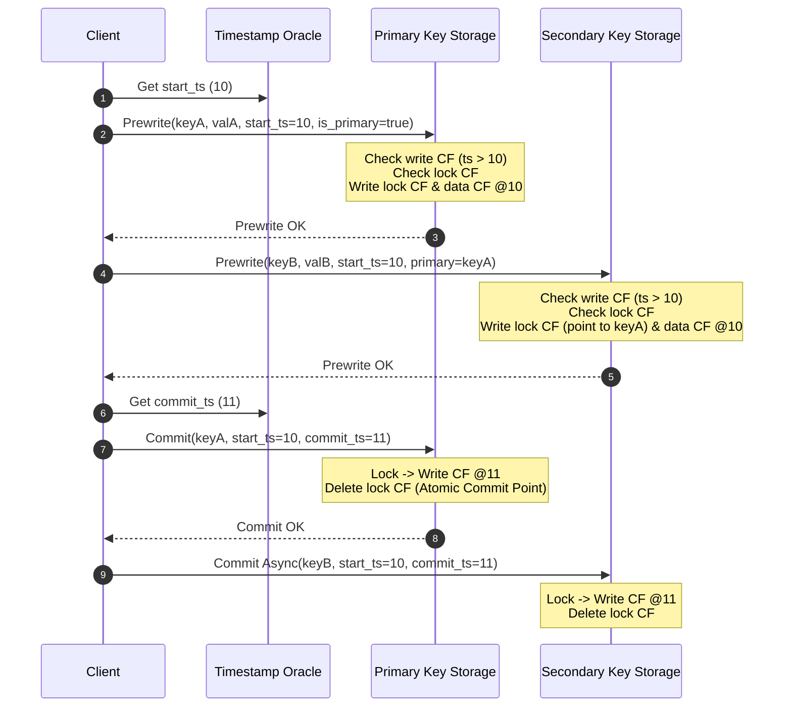
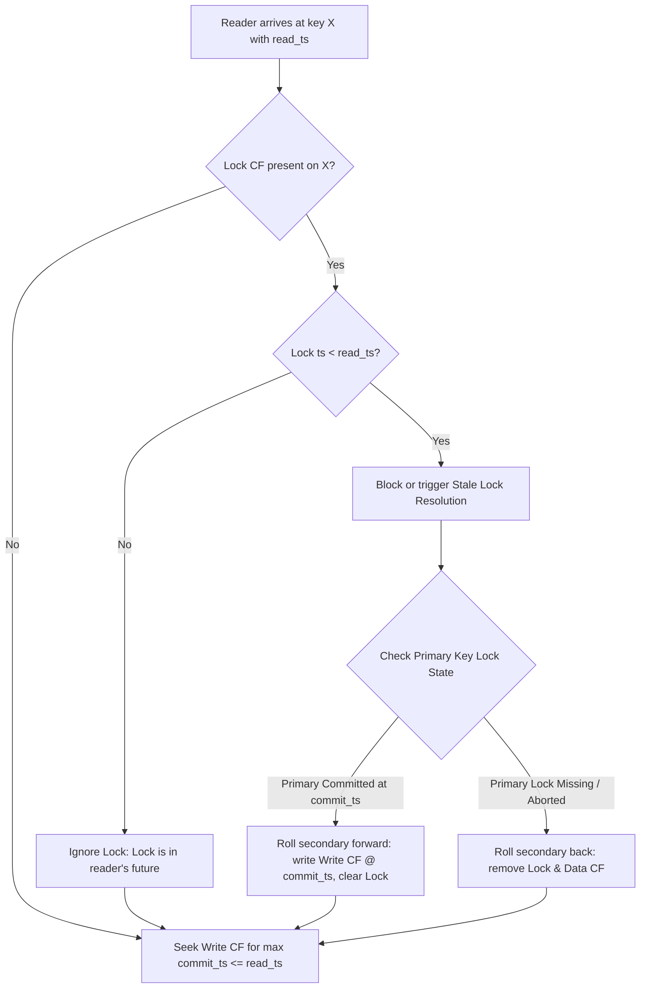

Traditional distributed databases used central transaction managers and heavy two-phase commit locks across network boundaries. When Google designed Percolator to incrementally index the web on top of Bigtable, centralized lock tables immediately proved to be an impossible bottleneck. The system needed snapshot isolation and ACID semantics across billions of keys without keeping persistent locks in a central coordinator's memory. Percolator solved this by storing transaction metadata directly inside the underlying key-value store using explicit column families, paired with a lightweight, centralized Timestamp Oracle.

Understanding how Percolator achieves multi-row transactions requires stripping away high-level database abstractions and inspecting the physical layout of keys on disk. Percolator builds distributed ACID guarantees on top of an eventual, single-row atomic key-value system. Modern engines like TiDB's underlying TiKV storage layer inherit this exact blueprint today.

## The Three Column Families Layout

To manage concurrent mutations without central lock tables, Percolator structures every user table into three logical column families inside the underlying storage system. These are the Data column family, the Lock column family, and the Write column family. Every transaction reads and writes timestamps rather than mutating raw values in place.

The Data column family stores the actual serialized value keyed by the user's logical key along with the transaction start timestamp. A write to key `user123` at start timestamp 100 appears physically as `user123@100` pointing to the byte array payload.

The Lock column family holds active, uncommitted write locks. If a transaction is actively modifying `user123`, a record appears in the Lock column family at `user123`. This lock entry contains the start timestamp of the transaction modifying the key, along with a pointer to a designated primary lock key. If this key itself happens to be the primary lock, it marks itself as primary. If it is a secondary key in a multi-key write, it stores the exact row key of the primary lock. It also includes a time-to-live parameter used for crash detection.

The Write column family records committed data pointers. When a transaction successfully commits at commit timestamp 105, a record is inserted into the Write column family at `user123@105`. The value stored inside this record is the start timestamp when the data was originally written, which is 100 in this example. The presence of an entry in the Write column family makes a historical mutation visible to future readers.

## The Timestamp Oracle Architecture

Snapshot isolation relies on total order guarantees for transaction state. Percolator assigns two monotonically increasing logical timestamps to every transaction. The first is `start_ts`, which defines the point-in-time snapshot the transaction reads from. The second is `commit_ts`, which determines the logical instant the transaction's changes become visible across the entire cluster.

Generating strictly increasing 64-bit integers across a distributed network often introduces extreme latency if every request requires a network hop to a single thread. The Timestamp Oracle (TSO) avoids this bottleneck by allocating logical timestamp ranges in batch memory blocks. The TSO service periodically writes a high-water mark timestamp to persistent storage, such as a consensus log. It then dispenses timestamps directly out of local RAM up to that persistent threshold. If the TSO process crashes, the backup node simply reads the persistent high-water mark, advances it by a batch safety buffer, writes the new threshold to disk, and resumes serving requests without risking duplicate timestamps.

Clients fetch timestamps from the TSO in pipeline batches. The client library bundles hundreds of concurrent local thread requests into a single network invocation to the TSO, amortizing network context switches. This allows a single TSO node to serve tens of millions of strictly ordered timestamps per second.

## The Prewrite Phase Execution

Writing data in Percolator involves two distinct protocol phases driven directly by the client coordinator library. The database storage nodes do not orchestrate the transaction. The client application acts as the transaction driver, executing reads, tracking writes in an in-memory buffer, and submitting RPCs to storage region servers.

When a client calls commit, it first requests a `start_ts` from the TSO. Suppose it receives timestamp 10. The client then selects one arbitrary key from its mutation buffer to serve as the Primary Key for the entire transaction. All remaining modified keys in the buffer become Secondary Keys. The primary lock acts as the single source of truth for whether the distributed transaction succeeds or fails.

During Prewrite, the client sends RPCs to the storage nodes hosting each key, starting with the primary key. For every key being prewritten at timestamp 10, the target storage node executes a local atomic transaction that performs two critical sanity checks.

First, the storage node inspects the Write column family for the target key to verify if any write has committed at a timestamp greater than or equal to `start_ts` (timestamp 10 or higher). If a newer write entry exists, it means another transaction modified and committed this exact row after our transaction began. This constitutes a write-write conflict. The node aborts the prewrite and the client rolls back the transaction.

Second, the storage node checks the Lock column family to see if any lock currently exists on the key at any timestamp. If a lock is present, regardless of its start timestamp, another transaction is currently writing to this row. The node returns a lock conflict error to the client, forcing the client to back off and retry or abort.

If both checks pass, the storage node performs two atomic writes. It writes the uncommitted raw payload into the Data column family at `key@10`. It also inserts a lock entry into the Lock column family at `key`. If the key is the primary key, the lock metadata indicates it is primary. If it is a secondary key, the lock entry stores an explicit reference string pointing back to `primary_key`.

## The Commit Phase and Atomic Mutation Point

Once every key in the write set has successfully passed the Prewrite phase and written its uncommitted data and lock entries, the client fetches a `commit_ts` from the TSO. Suppose the returned `commit_ts` is 11.

The transaction now arrives at its point of no return. The client issues a Commit RPC to the storage node hosting the designated Primary Key. The primary node executes a local atomic batch operation. It checks that the lock at `primary_key` still exists and belongs to timestamp 10. If valid, the node creates a new entry in the Write column family at `primary_key@11` containing the value 10, pointing to the original `start_ts`. Simultaneously, it deletes the lock from the Lock column family.

The precise moment the primary key lock is removed and replaced by the Write column family entry at `commit_ts` 11, the entire multi-key transaction is logically committed. Even if the client crashes immediately after this single RPC completes, the transaction is non-volatile and fully durable.

After committing the primary key, the client asynchronously issues Commit RPCs for all secondary keys. For each secondary key, the storage node removes the lock entry in the Lock column family and writes an entry into the Write column family at `secondary_key@11` pointing to `start_ts` 10. If secondary commits fail due to network drops or client crashes, the cluster remains completely consistent because the state of secondary keys can be lazily determined by querying the primary key.

## Read Execution and Snapshot Isolation

To perform a read at `read_ts`, a client does not acquire any locks. Snapshot isolation ensures reads proceed without blocking writers, provided no uncommitted write conflicts exist in the read frame.

When reading a key at timestamp 15, the storage engine first scans the Lock column family for that key. If a lock exists with a timestamp less than or equal to 15, the reader cannot be certain whether the pending transaction will commit at a timestamp earlier than 15 or later than 15. Because reading uncommitted data would cause dirty reads or non-repeatable reads, the client must resolve the lock or wait for it to clear.

If no lock exists, or if locks present have timestamps strictly greater than 15, the reader ignores them. A lock at timestamp 20 represents a transaction that started after the reader's snapshot, meaning its eventual output can never be visible to this reader.

The reader then navigates to the Write column family and seeks to the largest `commit_ts` that is less than or equal to `read_ts` 15. If it finds a record at `key@11` pointing to `start_ts` 10, it uses that pointer to fetch the actual payload stored at `key@10` in the Data column family.

## Resolving Stale Locks and Crash Recovery

In a distributed network, clients crash, experience long garbage collection pauses, or lose connectivity midway through two-phase commit. Because lock metadata resides directly in the storage engine rather than a central server's volatile memory, an abandoned lock will block subsequent readers and writers indefinitely if not explicitly cleaned up.

Percolator delegates crash recovery directly to concurrent readers and writers that encounter orphaned locks during normal operations. There are no background sweeping coordinator threads required for correctness.

When a client reading at timestamp 15 encounters a lock at timestamp 8, it cannot proceed until the status of that lock is resolved. The client inspects the lock record in the Lock column family to locate the Primary Key reference. It then issues a status query to the storage node holding that primary key.

If the primary key record shows an entry in its Write column family at `primary_key@commit_ts` (for instance, `commit_ts` 9), the primary transaction committed successfully. The reading client performs a roll-forward on the secondary key it was trying to read. It writes a Write column family entry for the secondary key at timestamp 9 and deletes the stale lock. The reader then reads the newly committed value.

If the primary key still has an active lock in its Lock column family, the reading client must check whether the transaction coordinator is dead or simply running slowly. The lock entry contains a wall-clock TTL timestamp set when the lock was acquired or updated. If the TTL has expired, the reader attempts to forcibly roll back the primary transaction.

To roll back the primary transaction, the reading client atomically deletes the primary key's lock and writes a rollback marker into the Write column family at the primary key's `start_ts`. If the original client attempts to wake up later and commit the primary key, its local atomic commit check will fail because the lock has been cleared and replaced by the rollback marker. Once the primary key is successfully rolled back, the reading client clears the secondary lock that blocked its progress and purges the uncommitted value from the Data column family.

By routing lock resolution through primary keys, Percolator enforces strict linearizability. A multi-key transaction is single-point atomic at the exact microsecond its primary lock transforms into a Write column family record, making distributed state coordination completely decentralized and crash-resilient.
