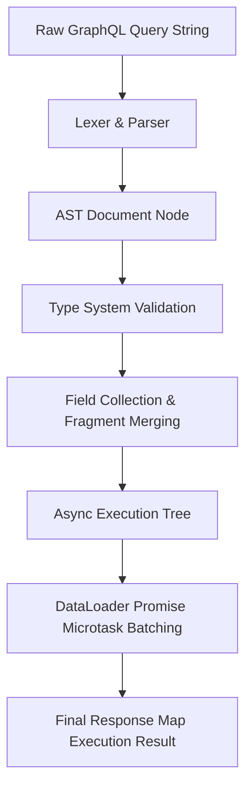
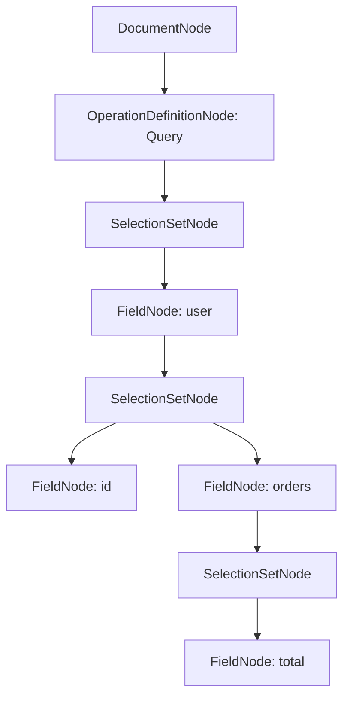

Most developers treat a GraphQL engine as a black box that transforms string queries into JSON responses. You hand it an incoming HTTP payload, it runs some resolver functions, and returns a document matching the exact shape of your request. Underneath that clean surface lies a complex execution runtime that balances dynamic schema resolution, recursive AST traversal, field deduplication, and async I/O batching.

To understand how a GraphQL execution engine handles high-throughput traffic, you have to look past schema definition syntax and analyze the actual lifecycle of a query. The engine must turn an unparsed query string into an Abstract Syntax Tree, validate that tree against the schema type system, collect and merge overlapping fields, execute resolver trees without drowning the database in N+1 queries, and enforce security limits before a single row is fetched.



### Parsing and AST Generation

The execution pipeline begins with lexical analysis and parsing. The lexer breaks the raw query string into distinct lexical tokens such as punctuators like open braces, names, variable definitions, and scalar values. The parser consumes these tokens to produce a GraphQL Document AST root.

A GraphQL AST is a deeply nested object hierarchy composed of specialized AST nodes. The top level node is a DocumentNode, which contains an array of definitions. These definitions are typically OperationDefinitionNodes representing query, mutation, or subscription operations, alongside FragmentDefinitionNodes.

When the parser builds an OperationDefinitionNode, it converts nested fields into SelectionSetNodes. Each selection inside a selection set can be a FieldNode, FragmentSpreadNode, or InlineFragmentNode. At this point, the AST has no knowledge of your underlying data types or business logic. It is merely a structural representation of the query syntax.



### Field Collection and Fragment Merging

Once the engine validates the AST against the schema, it does not immediately traverse the raw AST during execution. Executing raw AST selection sets directly leads to duplicate field evaluations, especially when queries use multiple inline fragments or fragment spreads requesting the same field with different directives.

Instead, the engine executes an operation using an internal step called Field Collection. The field collector transforms a selection set into an ordered map of execution fields. When the collector encounters a fragment spread or an inline fragment, it evaluates conditional directives like `@skip` and `@include` on the spot. If the condition evaluates to true, it drills down into the fragment selection set and merges those fields directly into the parent selection map.

If a query requests the same field name twice under the same response key, the collector merges their sub-selection sets together. This guarantees that field resolvers run once per distinct response key per parent object, producing a deterministic execution plan.

### The Recursive Execution Algorithm

With the collected fields prepared, the execution engine enters its core runtime loop. Execution in GraphQL is fundamentally recursive and type-driven. The engine takes a parent execution context, a object type definition, a source object value, and the map of collected fields.

For every field in the collected fields map, the engine resolves the field synchronously or asynchronously. It looks up the corresponding FieldDefinition on the parent GraphQLObjectType, extracts any arguments defined in the query AST, and passes them to the field's resolver function alongside the current object source value, context object, and execution info.

```
ExecuteSelectionSet(fieldsMap, parentType, objectValue):
    responseMap = empty ordered map
    for each (responseKey, fieldGroup) in fieldsMap:
        fieldType = GetFieldType(parentType, fieldGroup)
        resolvedValue = ResolveFieldValue(parentType, objectValue, fieldGroup)
        completedValue = CompleteValue(fieldType, fieldGroup, resolvedValue)
        responseMap[responseKey] = completedValue
    return responseMap
```

Value completion is where type safety is enforced at runtime. If the resolved value is a scalar, the engine serializes it. If it is an enum, it validates that the value matches a defined enum member. If it is a GraphQLList, the engine iterates over the list items and recursively completes each element. If it is a GraphQLObjectType, the engine evaluates the sub-selection set for that object, invoking `ExecuteSelectionSet` recursively.

Nullability propagation occurs during value completion. If a resolver for a non-null field yields null or throws an unhandled exception, the engine catches the error, appends it to the global response errors array, and nullifies the parent field. If that parent field is also typed as non-null, the nullability bubbles up the execution tree until it hits a nullable boundary or reaches the document root, returning null for the entire response data payload.

### DataLoader Mechanics and Microtask Queue Coalescing

Because field resolvers execute independently across the selection tree, querying related entities naturally triggers the N+1 database call problem. If a query requests 100 orders and their corresponding user profiles, naive resolver execution will fire 1 query for the orders followed by 100 individual database queries for each user profile.

The standard solution is DataLoader, a utility that leverages event loop scheduling to batch and cache I/O requests. DataLoader relies on execution ticks. In Node.js environments, this is powered by `process.nextTick()` or promise microtasks. In .NET runtimes, DataLoader relies on task execution schedulers and batch dispatching windows.

When a resolver needs to fetch a user by ID, it does not execute a database fetch directly. It calls `dataloader.load(userId)`. This method returns an unfulfilled promise and pushes the requested ID into an internal keys array for the current batch.

```mermaid
sequenceDiagram
    participant Resolver1 as Resolver (User 1)
    participant Resolver2 as Resolver (User 2)
    participant DL as DataLoader Instance
    participant Loop as Event Loop Microtask
    participant DB as Database Engine

    Resolver1->>DL: load(101)
    DL-->>Resolver1: Return Pending Promise A
    Resolver2->>DL: load(102)
    DL-->>Resolver2: Return Pending Promise B
    Note over DL,Loop: Microtask tick runs after sync execution completes
    Loop->>DL: Trigger dispatch()
    DL->>DB: SELECT * WHERE id IN (101, 102)
    DB-->>DL: Return [User101, User102]
    DL-->>Resolver1: Resolve Promise A
    DL-->>Resolver2: Resolve Promise B
```

While the execution engine is synchronously traversing the AST and calling resolvers, DataLoader accumulates keys. As soon as the engine exhausts its current synchronous execution stack, the microtask queue fires before the next event loop iteration. DataLoader's scheduled batch function executes, reading all collected keys, running a single SQL query like `SELECT * FROM users WHERE id IN (...)`, and resolving each pending promise with its corresponding result.

DataLoader also maintains a local memoization cache. If two separate nodes in the AST request `dataloader.load(101)` within the same request lifecycle, DataLoader immediately returns the existing promise without appending the key to the batch array again. This provides both batching and request-scoped deduplication without coupling resolvers to one another.

### Query Complexity Analysis and Security Mitigation

Because GraphQL grants client applications the power to request arbitrary nested graphs, exposed endpoints are exposed to recursive depth attacks and resource exhaustion. A client can send a query with nested relationships thirty levels deep, causing the engine to execute millions of resolver calls from a payload only a few kilobytes in size.

To prevent resource exhaustion, advanced GraphQL engines perform static query complexity and depth analysis before execution ever begins.

Depth analysis walks the AST document recursively and calculates the maximum depth level of selection sets. If the computed depth exceeds a configured threshold, the engine aborts execution immediately during the validation phase.

Complexity analysis assigns a numerical cost to fields and directives. Simple scalar fields like `id` or `name` carry a baseline cost of 1. Complex relations or fields returning lists multiply the cost of their child fields by an estimated limit argument.

```
CalculateComplexity(selectionSet, currentMultiplier):
    cost = 0
    for each selection in selectionSet:
        if selection is FieldNode:
            fieldCost = GetConfiguredCost(selection)
            if FieldReturnsList(selection):
                limit = ExtractLimitArg(selection) or DefaultLimit
                childCost = CalculateComplexity(selection.selectionSet, currentMultiplier * limit)
                cost += fieldCost + childCost
            else:
                cost += fieldCost + CalculateComplexity(selection.selectionSet, currentMultiplier)
    return cost
```

By evaluating query cost against static AST properties before invoking resolvers, the engine blocks malicious queries at zero CPU cost to downstream databases. High-throughput GraphQL gateways combine static complexity scores with token bucket rate limiters, tracking consumed complexity points per API client over dynamic time windows.
