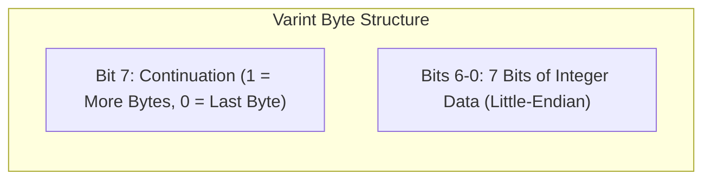
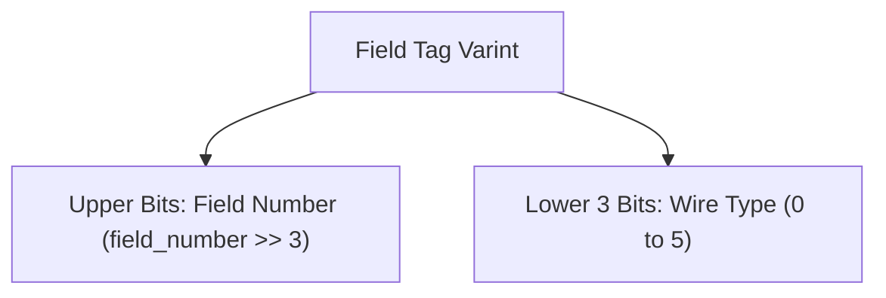
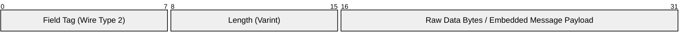
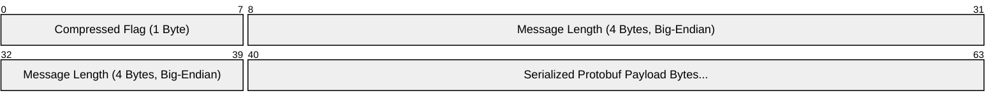
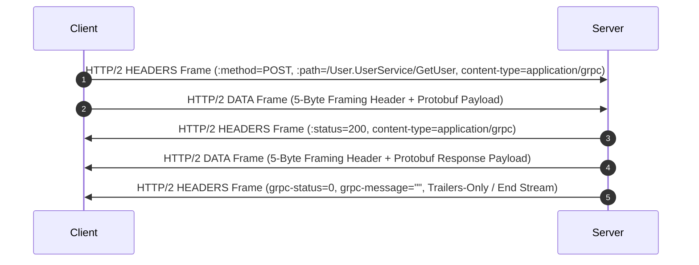

When developers compare gRPC to traditional REST over JSON, they usually talk about performance in broad strokes. They mention HTTP/2 multiplexing, smaller payload sizes, and code generation. However, the real engineering marvel lies in the byte-level wire format of Protocol Buffers and how gRPC encapsulates those bytes into stream frames. Understanding this mechanics requires getting down into bitwise operators, variable-length integer encodings, and HTTP/2 frame layouts.

JSON forces serialization engines to deal with text parsing, escaping, string allocations, and field name redundancy. Every single request transmits the key names over the wire as ASCII or UTF-8 characters. In contrast, Protocol Buffers discards field names entirely at runtime, relying on integer field tags and compact binary encoding rules to yield payloads that are often an order of magnitude smaller and vastly cheaper to CPU-parse.

### Variable-Length Integer Encoding Mechanics

At the foundation of Protocol Buffers wire efficiency is Variable-Length Quantity (VLQ) encoding, specifically Base 128 Varints. Standard integer types in languages like C# or Rust occupy fixed byte widths, such as 32 bits (4 bytes) or 64 bits (8 bytes), regardless of whether the contained value is 1 or 4,000,000,000. Varints solve this waste by encoding arbitrary-precision integers using a variable number of bytes based on the actual numeric magnitude.

In a Varint, every byte uses its Most Significant Bit (MSB), known as the continuation bit, to signal whether more bytes follow. If the MSB is set to 1, the parser knows the next byte is part of the current integer. If the MSB is 0, this byte terminates the integer sequence. The remaining 7 bits of each byte store the lower payload bits of the number in little-endian order.

Consider the number 300. In standard 32-bit binary representation, 300 is expressed as 00000000 00000000 00000001 00101100. To represent 300 as a Varint, we split its binary representation into 7-bit groups from right to left. The lowest 7 bits are 0101100 (which is 44 decimal), and the next group is 0000010 (which is 2 decimal).

Because a second byte is required to complete the number 300, the first byte sets its continuation bit to 1, turning 0101100 into 10101100 (0xAC). The second byte is the final byte, so its continuation bit remains 0, producing 00000010 (0x02). The final two-byte Varint sequence on the wire is 0xAC 0x02. The decoder reads 0xAC, sees the MSB set, drops the MSB to get 0101100, reads 0x02, sees the MSB cleared, drops the MSB to get 0000010, shifts the second group left by 7 bits, and bitwise ORs them together to reconstruct 300.

Standard Varints present a critical flaw when encoding negative numbers. In two's complement arithmetic, a negative integer like -1 has its highest bit set to 1. Encoded as a raw 64-bit Varint, -1 requires all 10 bytes because the continuation bit remains set across all 64 bits. Protocol Buffers resolves this using ZigZag encoding for signed integer types like sint32 and sint64.

ZigZag encoding maps signed integers to unsigned integers so that numbers with small absolute values, whether positive or negative, yield small Varint values. It maps 0 to 0, -1 to 1, 1 to 2, -2 to 3, and so on. Mathematically, for a 32-bit integer n, the ZigZag mapping is computed using bitwise operators as (n << 1) ^ (n >> 31), where the right shift is an arithmetic shift that replicates the sign bit across all positions. This trick ensures that negative numbers do not blow up payload sizes.

### Field Tags and Wire Types

Because Protobuf messages strip out field names, the wire format must transmit enough structural information for the decoder to map binary segments to schema fields or skip unrecognized fields safely. This is accomplished using a combined key called the Field Tag.

Every field in a serialized Protobuf payload is preceded by a Varint key that combines the field number declared in the .proto definition with a 3-bit wire type identifier. The field key calculation packs these two pieces of data into a single byte or Varint using the formula (field_number << 3) | wire_type.

The lower 3 bits dictate how the parser must calculate the byte length of the incoming field payload. Wire Type 0 represents Varints, handling int32, int64, uint32, uint64, sint32, sint64, bool, and enum. Wire Type 1 represents fixed 64-bit values like double, sfixed64, and fixed64. Wire Type 2 represents length-delimited payloads, including string, bytes, embedded messages, and packed repeated fields. Wire Type 5 represents fixed 32-bit values like float, sfixed32, and fixed32. Wire types 3 and 4 were historically used for start and end groups, but are now deprecated.

When a Protobuf decoder encounters a key byte like 0x08, it extracts the wire type by performing 0x08 & 0x07, which yields 0 (Varint). It gets the field number by executing 0x08 >> 3, which yields 1. The decoder now knows field number 1 is an integer encoded as a Varint immediately following this key. If the decoder encounters a field tag number that does not exist in its generated C# or Go class schema (for instance, if a newer service added a field), the decoder uses the wire type to determine how many bytes to skip without crashing or aborting the parse loop. Wire Type 0 reads until the continuation bit is 0, Wire Type 1 skips 8 bytes, Wire Type 5 skips 4 bytes, and Wire Type 2 reads a Varint length prefix and skips that exact number of bytes.

### Length-Delimited Payloads and Nested Messages

Wire Type 2 is the workhorse for variable-length data structures. The layout for a length-delimited field consists of the field tag, followed by a Varint specifying the byte length of the data, followed directly by the raw payload bytes.

When a string like "Hello" is serialized for field number 2, the field tag is (2 << 3) | 2, which equals 18 (0x12 in hex). The length of "Hello" is 5, encoded as Varint 0x05. The payload bytes are the ASCII representations 0x48 0x65 0x6C 0x6C 0x6F. The full on-the-wire payload for this string field is 0x12 0x05 0x48 0x65 0x6C 0x6C 0x6F.

Nested Protobuf messages do not require custom framing constructs or delimiter tags. They are written as Wire Type 2 length-delimited byte arrays. The encoder serializes the child message into a temporary memory buffer or calculates its size recursively, writes the field tag for the parent's child field, writes the calculated byte length as a Varint, and streams the child message's serialized bytes inline. The decoder processes the child payload by spawning a recursive decoding loop bounded strictly by the specified byte length. This recursive design makes Protobuf serialization blazingly fast because allocation sizes can be pre-calculated in a single forward pass over the object graph.

### gRPC Framing Over HTTP/2 Streams

While Protocol Buffers defines how individual objects are turned into bytes, gRPC defines how those bytes are encapsulated into discrete RPC requests and responses. A raw Protobuf payload does not contain message boundaries suitable for long-lived multiplexed streams. gRPC addresses this by applying a lightweight 5-byte length-prefix framing layer on top of serialized Protobuf payloads.

Every gRPC message transmitted over the wire is wrapped in a 5-byte frame header before being handed to the HTTP/2 transport engine. Byte 0 is a compressed flag byte where 0 indicates uncompressed payload and 1 indicates compressed payload (using algorithms like gzip or snappy). Bytes 1 through 4 represent a 32-bit unsigned integer in big-endian network byte order specifying the length of the serialized Protobuf payload.

If a service sends a Protobuf message that serializes down to 200 bytes without compression, the gRPC frame header starts with 0x00 for the compression flag. The length 200 is represented in 4 bytes big-endian as 0x00 0x00 0x00 0xC8. The framing layer appends the 200 serialized Protobuf bytes directly after these 5 bytes, resulting in a 205-byte frame.

This 5-byte framing allows gRPC receivers to stream multiple messages over a single HTTP/2 stream effortlessly. A client or server can read the first 5 bytes from the stream, extract the big-endian length integer N, read N bytes from the socket buffer into a pooled memory buffer, pass those N bytes to the Protobuf deserializer, and instantly loop back to read the next 5-byte frame header.

### HTTP/2 Protocol Mapping Mechanics

Once framed, gRPC maps these binary frames directly onto standard HTTP/2 streams using HTTP/2 HEADERS and DATA frames. This mapping is where gRPC enforces its strict semantic contract.

A gRPC request begins with an HTTP/2 HEADERS frame sent by the client to open a new logical stream. The request path maps directly to the service package, service name, and RPC method name using the format /package.ServiceName/MethodName. The content-type header must strictly be application/grpc, application/grpc+proto, or a custom subtype. The TE header must be set to trailers to inform intermediate proxies that HTTP/2 trailing headers will be delivered at the end of the invocation.

The body of the HTTP/2 stream consists of zero or more HTTP/2 DATA frames containing the 5-byte framed Protobuf messages. Because HTTP/2 handles flow control using WINDOW_UPDATE frames and allows interleaving of DATA frames across multiple stream IDs, gRPC gets multiplexing, streaming, and backpressure out of the box without reinventing transport protocols.

When the server completes an RPC, it returns an HTTP/2 HEADERS frame with status 200 OK, streams its response DATA frames, and closes the stream with a final HTTP/2 HEADERS frame containing trailing headers (trailers). These trailers carry the definitive gRPC execution outcome using the grpc-status and optional grpc-message headers. Status 0 indicates success (OK), 5 indicates NOT_FOUND, 16 indicates UNAUTHENTICATED, and so forth.

In scenarios where a call fails instantly before payload processing (for example, missing authorization credentials), gRPC optimizes network roundtrips using a Trailers-Only response. The server sends a single HTTP/2 HEADERS frame containing both the standard HTTP status 200, content-type, and the final grpc-status and grpc-message, setting the END_STREAM flag immediately on that header block to bypass data frame processing entirely.

### Zero-Copy Mechanics and High-Throughput Buffering

When performance matters, the integration between language runtimes and gRPC framing determines throughput limitations. In ecosystems like .NET and Rust, modern gRPC implementations like gRPC-Web and gRPC-dotnet leverage zero-copy buffer abstractions to handle this framing without heap allocations.

In .NET, System.IO.Pipelines and ReadOnlySequence<byte> allow the HTTP/2 stack (Kestrel) to parse incoming TCP packets directly into memory blocks allocated from an ArrayPool. The gRPC server frame parser receives a slice of this memory, reads the 5-byte header to identify the payload boundaries, and passes a ReadOnlySpan<byte> pointing directly into the socket's network buffer directly to Google.Protobuf deserializers.

By avoiding allocations for intermediate byte arrays or string conversions, CPU cache locality is preserved and Garbage Collector overhead is reduced to near zero. A high-throughput gRPC service spending its lifecycle parsing varints and unrolling field tags operates almost entirely inside L1/L2 CPU caches, processing millions of messages per second on modest hardware.
