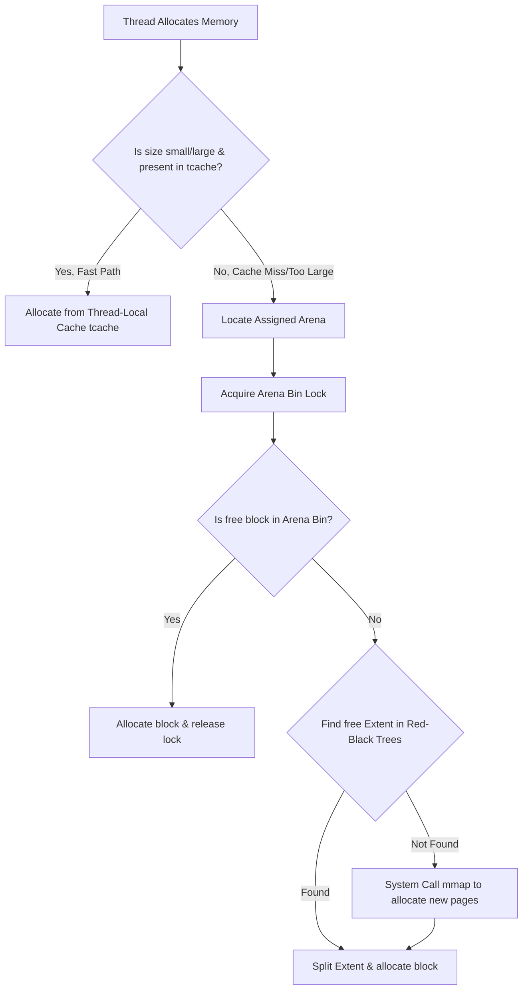

When you write high-throughput multithreaded systems, your application is only as fast as its memory allocator. If you run a high-concurrency server using the default glibc allocator, ptmalloc, you will likely watch your CPU cycles vanish into lock contention. This bottleneck happens because threads must coordinate with a central allocator to claim or release virtual memory. To bypass this performance wall, Jason Evans designed jemalloc. Now the backing allocator for Redis, the Rust language runtime, and FreeBSD, jemalloc solves the scalability nightmare by isolating allocations and managing virtual memory with clinical precision.

The core problem jemalloc targets is thread scalability. Instead of forcing threads to negotiate with a global heap, jemalloc divides memory into a multi-tiered system. This design shifts the majority of memory operations into lock-free, thread-local routines. When a thread-local cache runs dry, the thread falls back to a CPU-assigned arena. If the arena needs more pages, it coordinates with the virtual memory system using highly optimized structures called extents. Understanding this pipeline reveals how modern runtimes achieve incredible parallel throughput without drowning in allocation overhead.

### Thread Caches and Lockless Fast Paths

The absolute fastest lock is the one you do not acquire. Jemalloc achieves lock-free allocations for small objects by using thread-local caches, commonly referred to as tcache. Each thread maintains its own private tcache instance stored in thread-local storage. When an application requests an allocation that falls under the small size category, jemalloc checks the calling thread's local tcache.

Inside the tcache, memory is pre-divided into bins corresponding to specific size classes. If the requested size class has a free slot available, the allocator simply pops the address off the tcache stack and returns it to the application. This entire sequence completes in constant time O(1) and runs entirely within the thread's local memory space. Because there are no atomic operations or lock acquisitions in this path, cache-line bouncing is eliminated and CPU caches remain hot.

Of course, a thread-local cache cannot grow indefinitely without causing massive memory bloat. Jemalloc manages this with a strict garbage collection protocol. Every time a thread allocates or deallocates memory, jemalloc increments an internal counter. Once a specific tcache bin surpasses its high-water mark, a flush operation is triggered. The allocator returns a portion of the cached blocks back to the backing arena, maintaining a tight memory footprint across the application.

### Arenas and Lock Contention Mitigation

When a thread's local cache runs out of memory blocks, or when the requested allocation size exceeds the threshold of the tcache, the allocator must fall back to the next tier of the hierarchy. This tier is the arena. Arenas are independent heaps that manage their own distinct pools of virtual memory.

To prevent threads from fighting over a single arena lock, jemalloc creates multiple arenas. By default, the allocator instantiates four times as many arenas as there are logical CPU cores on the machine. When a thread is spawned, jemalloc assigns it to a specific arena using a hash of its thread identifier. This dynamic binding distributes the allocation load evenly across the available arenas. The chance of two threads simultaneously attempting to allocate from the same arena is low, which reduces mutex wait times to nearly zero.

When a thread requests memory from an arena, it must acquire that arena's internal locks, but the locks are highly granular. Arenas do not lock their entire address space. Instead, they lock individual bins that correspond to different size classes. If thread A and thread B are assigned to the same arena, but thread A requests a sixteen-byte block while thread B requests a sixty-four-byte block, they lock different bins and run completely in parallel.

### Extents, Red-Black Trees, and Page Runs

When an arena's bins are empty, it must allocate fresh virtual memory. Jemalloc does not issue a system call for every tiny allocation. Instead, it manages memory in large, contiguous blocks of virtual pages called extents. An extent represents a range of virtual memory pages that the allocator can split, merge, or carve up into smaller pieces.

To manage these extents efficiently, each arena maintains two red-black trees. One tree tracks active extents that are currently in use, while the other tracks dirty and clean unused extents. These trees are ordered by both address and size. When an arena needs to satisfy a large memory request or refill an empty bin, it queries the unused extent tree using a best-fit search. By keeping the tree sorted, jemalloc can locate the smallest extent that can satisfy the request in logarithmic time O(log n), reducing waste.

If a suitable extent is found but is larger than needed, the allocator splits it. The required portion is allocated, and the remaining portion is inserted back into the unused extent tree. If no matching extent is found, the arena falls back to the slowest path, issuing an mmap system call to request fresh virtual pages from the operating system kernel. These new pages are wrapped in a new extent structure and integrated into the arena's tracking systems.

### Size Classes and Fragmentation Control

Memory fragmentation is the silent killer of long-running, high-throughput systems. Internal fragmentation occurs when an allocator rounds up a request to a size class that is significantly larger than what was requested, wasting the difference. External fragmentation happens when free memory is scattered in tiny pockets across the heap, making it impossible to satisfy a large contiguous allocation request despite having enough total free memory.

Jemalloc attacks internal fragmentation by using extremely fine-grained size classes. While traditional allocators might round allocations up to the nearest power of two, jemalloc uses a combination of logarithmic and linear spacing. For very small allocations, sizes are spaced by eight or sixteen bytes. For larger allocations, the step size increases but remains a small fraction of the requested size. Because the allocation steps are tightly packed, the average internal fragmentation is kept below a few percent.

To prevent external fragmentation, jemalloc ensures that memory is allocated and freed in uniform blocks. When small objects are freed, they are returned to their specific bin inside the arena. Because these bins only contain objects of identical sizes, any freed slot can be immediately reused by any future allocation of that same size class. This layout prevents a mixture of different sized allocations from turning the virtual address space into a useless, checkerboard pattern.

### The Decay Engine and Purging

Returning virtual memory to the operating system is a double-edged sword. On one hand, keeping unused physical pages allocated to a process is wasteful and can trigger the system out-of-memory killer under heavy load. On the other hand, invoking madvise or munmap to release pages requires expensive kernel context switches and page table invalidations, which can cripple application throughput.

Jemalloc solves this dilemma with a time-based decay engine. When an extent is freed and no longer needed by an arena, it is not immediately returned to the kernel. Instead, it enters a dirty pool. The decay engine monitors these dirty pages and schedules them for purging based on a configurable decay time. This decay curve is continuous, meaning that pages are gradually purged over time rather than all at once.

If the application experiences a sudden spike in memory usage followed by a quiet period, the dirty pages will remain cached for a short time. If another spike occurs during this window, jemalloc reuses the dirty pages immediately, avoiding the overhead of a system call to map new memory. If the application remains quiet, the decay engine eventually triggers and purges the dirty extents, returning the physical pages to the operating system while keeping the virtual address space reserved. This smoothing effect ensures that the cost of memory reclamation is distributed over time, protecting the application from sudden latency spikes.
