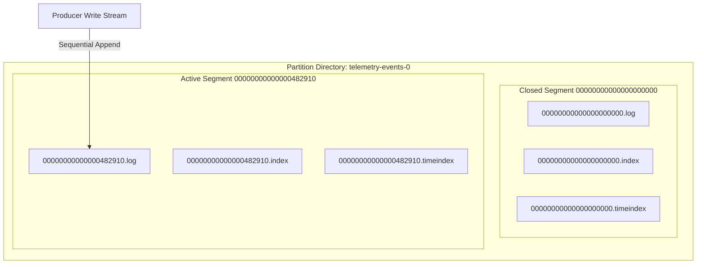
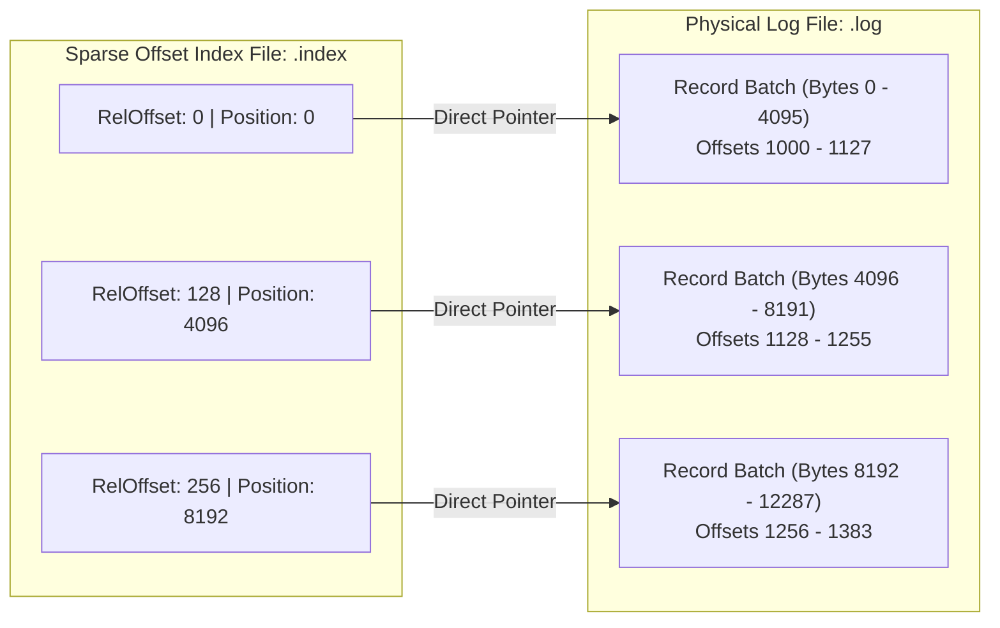
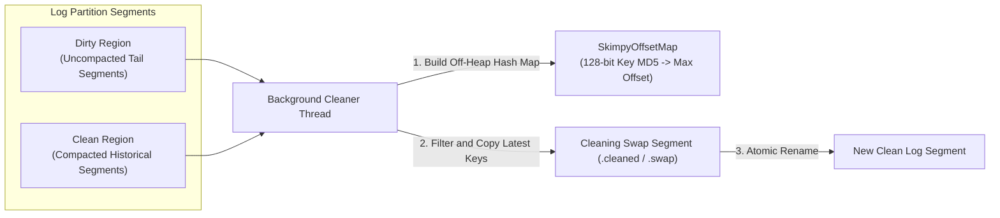

When you write data to Apache Kafka, you do not write to a relational table or a document store. You append bytes to an immutable, ordered sequence of records called a partition log. While high-level documentation often describes Kafka partitions as infinite streams of messages, local disks do not have infinite capacity. Underneath the abstractions, Kafka maps every partition directly to a directory on the local filesystem, dividing the stream into physical segment files.

Understanding how Kafka structures these files on disk reveals why it handles massive write throughput while maintaining low tail latencies. The storage engine relies on binary append formats, memory-mapped sparse offset indexes, timestamp indexes, and background cleaner state machines that execute record deduplication without locking active partition write paths.

### Partition Directories and Binary Segment Formats

If you inspect a Kafka broker storage path like `/var/lib/kafka/data`, you will find folders named according to the topic and partition index, such as `telemetry-events-0`. Inside that partition directory, you will not find a single monolithic file. Instead, Kafka splits the partition into several distinct files that share identical base names with different extensions, including `.log`, `.index`, `.timeindex`, and `.snapshot`.

Every partition directory contains one active segment and zero or more closed segments. Incoming write requests from producers land exclusively in the active segment file ending in `.log`. Closed segments represent historical immutable slices of the log stream that are read by lagging consumers, scanned by compaction threads, or scheduled for retention purging.

Inside the `.log` file, records are structured as sequential byte arrays grouped into Record Batches. A Record Batch is the atomic unit of serialization, wire transport, and storage in modern Kafka protocol versions. Instead of appending single records individually, producers aggregate messages into batches before transmitting them across the network. The broker validates the batch header and writes the raw byte payload directly to the active segment log file.

The Record Batch header contains essential structural metadata layout including a 64-bit base offset, a 32-bit batch length, a 32-bit partition leader epoch, a magic byte specifying format versioning, a CRC32C checksum, compression attributes, a 32-bit delta offset count, a 64-bit max timestamp, and producer state fields used for exact-once idempotent deduplication. Following the batch header are individual records. Each record stores its key length, raw key bytes, value length, raw value bytes, headers, and relative offset delta from the batch base offset.

Grouping individual records inside a batch allows Kafka to compress payload data across multiple records using algorithms like Zstd, Snappy, or LZ4. The compression occurs at the record batch level rather than the partition log level. When consumers request data, Kafka can serve the exact byte representation straight out of OS page cache directly to the network socket using system calls like sendfile, avoiding payload decompression on the broker altogether.

### Active Segment Rolling Mechanics

An active segment does not remain open forever. Kafka automatically closes the active segment and opens a new one through a process called segment rolling. The filename assigned to every segment represents the absolute 64-bit logical offset of the first record contained inside that segment, padded with leading zeroes up to twenty digits.

Segment rolling is governed by three configurable limits. The primary driver is `log.segment.bytes`, which defaults to 1 GB. Once an active `.log` file exceeds this byte count, Kafka closes the active segment, marks it immutable, and instantiates a new active segment whose base filename equals the next offset in the partition sequence.

Time duration acts as a secondary trigger controlled by `log.segment.ms`. If a topic receives low throughput, an active segment might take days to hit the 1 GB boundary. If retention policies dictate deleting data older than seven days, a non-rolled segment containing data spanning two weeks cannot be deleted safely. Forcing a segment roll based on time bounds ensures that closed segments fit cleanly within time-based retention processing windows.

Index capacity is the final rolling trigger. Both `.index` and `.timeindex` files have an upper memory mapping boundary defined by `log.index.size.max.bytes`. If either index file approaches its allocated addressable region size limit, Kafka triggers a segment roll preemptively to avoid memory corruption or pointer overflow during offset indexing.

### Memory-Mapped Sparse Offset Indexes

When a consumer asks to read records starting at offset 500,000, scanning a multi-gigabyte `.log` file sequentially from byte position zero would introduce severe latency spikes. Storing a disk pointer for every single record in an index file would consume massive amounts of RAM and disk overhead. Kafka addresses this tradeoff by maintaining sparse offset indexes.

Sparse indexing means Kafka writes an entry to the `.index` file only after a configurable byte threshold has been appended to the `.log` file. This boundary is controlled by `index.interval.bytes`, which defaults to 4096 bytes. Every time Kafka appends 4 KB of record batch payload to the `.log` file, it writes a single 8-byte index entry to the `.index` file.

Each entry in the `.index` file is strictly 8 bytes long, split into two 4-byte integers. The first integer is the relative offset from the segment base offset. The second integer is the absolute physical file position inside the `.log` file where that record batch begins.

Using relative offsets instead of full 64-bit absolute offsets is an intentional optimization. Because a relative offset represents the difference between a record's global offset and the segment's base offset, its value fits easily within a signed 32-byte integer, provided segments roll before reaching two billion records. Cutting the index entry size from 12 bytes down to 8 bytes allows Kafka to fit 33 percent more index entries within the same CPU L1/L2 cache lines.

To look up an offset, Kafka uses memory mapping via `mmap` to load the `.index` file directly into virtual address space. When a lookup request for absolute offset N arrives, the broker subtracts the segment base offset to produce relative offset R. Because each index entry is exactly 8 bytes, the broker executes a fast binary search on the mmapped buffer array without needing complex structural parsing.

The binary search locates the entry with the largest relative offset less than or equal to R, returning its corresponding physical byte position. Kafka seeks directly to that physical byte offset in the `.log` file and performs a short sequential read through contiguous record batches until it lands on the target offset. This hybrid pattern merges logarithmic array lookup efficiency with high-speed sequential disk I/O.

### Time-Based Indexing and Retention Engines

Applications frequently need to reset consumer group positions to specific wall-clock timestamps or run point-in-time state recoveries. To support timestamp lookups without reading every message, Kafka builds a secondary `.timeindex` file alongside every segment.

Entries in `.timeindex` are 12 bytes wide, comprising an 8-byte timestamp integer and a 4-byte relative offset integer. Similar to offset indexes, time indexes are written sparsely according to `index.interval.bytes`. Timestamps placed in the index depend on topic configuration, taking either the `CreateTime` set by the producer client or the `LogAppendTime` set by the broker when the record batch lands on disk.

When a time-based offset lookup occurs, Kafka uses mmap to binary search the `.timeindex` file for the requested timestamp, obtaining a relative offset. It then takes that relative offset and passes it through the `.index` binary search pipeline to determine the target physical byte position inside the `.log` file.

Time indexes also drive Kafka's deletion retention engine. Closed segments are evaluated continuously by background retention threads. Under time retention (`log.retention.hours`), the retention manager checks the largest timestamp stored in a segment's `.timeindex` file. If the difference between current epoch time and that maximum segment timestamp exceeds the threshold, the segment qualifies for purging.

Under size retention (`log.retention.bytes`), the broker sums up the physical file sizes across all partition segments starting from the newest active segment and working backward. Once the total byte count exceeds the configured retention limit, all older segments falling outside the allowed limit are marked for deletion.

Deletion does not occur message by message. Deletion happens strictly at complete segment file boundaries. When a segment is marked for purging, Kafka renames the files with a `.deleted` extension. A asynchronous background task unlinks the file descriptors from the operating system, allowing the underlying file system to reclaim blocks without blocking incoming active log writes.

### Log Compaction State Machines and Cleaner Thread Internals

For event streams representing state transitions, such as user profile updates or database changelogs, holding historical sequence logs indefinitely wastes disk space. Kafka provides log compaction through `cleanup.policy=compact` to keep only the latest value for every record key within a partition.

Compaction splits a partition log into two distinct operational regions: the Clean region and the Dirty region.

The Clean region consists of historical segments that have already been compacted by background threads. The Dirty region contains uncompacted segments where duplicate key writes may exist. The point separating these regions is called the log cleaner offset. A background pool of cleaner threads evaluates partition dirty ratios using `min.cleanable.dirty.ratio` (defaulting to 0.5). Once dirty segment byte volume reaches 50 percent of the total log size, the cleaner thread initiates a compaction cycle.

To compact dirty segments without crashing JVM memory limits or triggering stop-the-world garbage collection pauses, Kafka uses an off-heap hash map called `SkimpyOffsetMap`.

`SkimpyOffsetMap` uses open addressing with linear probing directly inside a raw C-style byte buffer allocated off-heap. The map does not store full variable-length key byte strings. Instead, it computes a 128-bit MD5 hash of each key, storing an 8-byte key hash slice alongside an 8-byte record offset. Each hash map slot consumes exactly 16 bytes.

Compaction executes in three coordinated passes across selected log segments.

In the first pass, the cleaner thread reads the Dirty region sequentially, extracting record keys, hashing them, and storing the key hash alongside its global offset in `SkimpyOffsetMap`. If duplicate keys exist within the dirty tail, the map updates the entry to hold the highest offset seen so far.

In the second pass, the cleaner thread reads both clean and dirty segments starting from the oldest segment in the partition log. For every record, it hashes the key and checks `SkimpyOffsetMap`. If the key exists in the map and the current record's offset is strictly lower than the offset stored in the map, a newer record with that same key exists further along in the log. The cleaner thread skips this record, dropping it from output.

If the record offset matches or exceeds the offset stored in `SkimpyOffsetMap`, or if the key does not exist in the map, the cleaner copies the record into a temporary swap file suffix labeled `.cleaned`.

In the third pass, once all non-duplicate records are written to the swap file, Kafka flushes the new `.cleaned` segment file to physical disk using fsync, rebuilds its corresponding `.index` and `.timeindex` sparse index files, and renames the swap file using a `.swap` extension. Through an atomic filesystem operation, the broker replaces the old uncompacted segments with the newly compacted segment and deletes the legacy files from disk.

### Tombstone Lifecycles and Deletion Retention

When an application using log compaction needs to delete a key entirely from state stores, simply removing the key from Kafka would cause downstream consumers to retain stale state. Kafka resolves this by supporting tombstone records.

A tombstone is a record sent with a valid non-null key paired with a null byte payload. When the cleaner thread encounters a tombstone during compaction pass two, it copies the tombstone record directly into the compacted swap segment just as it would a valid value record.

When consumers read the compacted segment, they process the tombstone, observe the null payload, and delete the key from their local state stores. However, if tombstones remained in log segments forever, deleted keys would leak disk space across historical files indefinitely.

Kafka uses `delete.retention.ms` (defaulting to 24 hours) to govern tombstone garbage collection. During compaction passes, the cleaner checks the timestamp of every tombstone record. If the tombstone timestamp is older than `delete.retention.ms` and the tombstone sits completely within the Clean region of the log, the cleaner drops the tombstone record entirely from the generated cleaned segment.

Delaying tombstone garbage collection through time bounds ensures that slow or offline consumers have a minimum execution window to read the tombstone event before the storage engine reclaims disk space completely.
