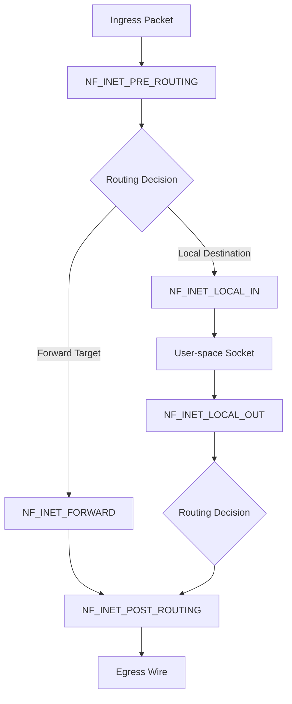
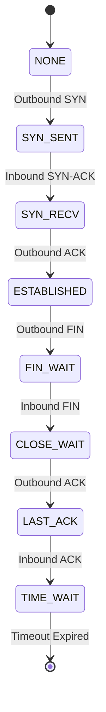

Every stateful firewall, NAT gateway, and Kubernetes network plugin relies on a single subsystem inside the Linux kernel to track network flows: connection tracking, or conntrack. When iptables rules evaluate a state like ESTABLISHED, or when kube-proxy routes a packet to a Pod backed by a Service IP, the kernel is not parsing application protocols. It is querying the conntrack table. Without conntrack, Linux would treat every packet as an isolated IP datagram, making stateful firewalling and dynamic Network Address Translation impossible.

Understanding conntrack requires peeling back the netfilter subsystem, examining how packets traverse kernel hook points, how bidirectional connection states are maintained in lock-free hash tables, and how tuple collision resolution works under massive connection rates.

### The Netfilter Hook Engine

Conntrack does not operate in a vacuum. It installs callback functions into the netfilter framework, which acts as a set of hook points embedded directly in the IP stack packet processing pipeline. Netfilter defines five hook points for IPv4 and IPv6 packet traversal.



`NF_INET_PRE_ROUTING` executes immediately after initial IP header validation and checksum verification, before any routing decision occurs. This hook is where conntrack first inspects incoming packets and where Destination NAT (DNAT) takes place.

`NF_INET_LOCAL_IN` triggers after the routing decision determines that the packet is destined for the local host. Local firewall rules and input filters hook into this stage.

`NF_INET_FORWARD` executes if the routing decision determines the packet is meant for another network interface, routing through the machine rather than terminating locally.

`NF_INET_LOCAL_OUT` catches packets generated by local processes on the host prior to any egress routing lookup.

`NF_INET_POST_ROUTING` executes after egress routing decisions are made, right before the packet is passed to the neighbor subsystem and network device queue. Source NAT (SNAT) and masquerading take place here.

Netfilter allows multiple modules to register callbacks at each hook point. Callbacks are ordered by signed integer priorities. Conntrack registers its primary lookup engine at `NF_INET_PRE_ROUTING` with priority `NF_IP_PRI_CONNTRACK` (-200). This ensures conntrack inspects the packet and assigns it a tracking structure before any downstream NAT or filtering rules run.

### Anatomy of a Connection Tuple

To track connections across a stateless protocol like IP, conntrack breaks flows down into tuples. A tuple (`struct nf_conntrack_tuple`) is an immutable, five-element key that uniquely identifies a single direction of a network flow. It consists of the source IP address, destination IP address, source port or protocol-specific identifier, destination port or protocol-specific identifier, and protocol number.

Because network communications are bidirectional, every connection managed by conntrack consists of two tuples wrapped inside a single tracking structure called `struct nf_conn`:

```
+-------------------------------------------------------------------------+
|                             struct nf_conn                              |
|                                                                         |
|  +-------------------------------------------------------------------+  |
|  | tuplehash[IP_CT_DIR_ORIGINAL]                                      |  |
|  |   src: 192.168.1.50:48291 -> dst: 10.0.0.1:80 (proto: TCP)        |  |
|  +-------------------------------------------------------------------+  |
|  +-------------------------------------------------------------------+  |
|  | tuplehash[IP_CT_DIR_REPLY]                                         |  |
|  |   src: 10.0.0.1:80 -> dst: 192.168.1.50:48291 (proto: TCP)        |  |
|  +-------------------------------------------------------------------+  |
|                                                                         |
|  State: IPS_CONFIRMED | IPS_SEEN_REPLY                                  |
|  Timer: Expires in 431998s (TCP ESTABLISHED)                            |
+-------------------------------------------------------------------------+
```

The original tuple represents the direction of the packet that initiated the connection. The reply tuple represents the expected response flow. For a standard connection without NAT, the reply tuple is simply the inverted original tuple where source and destination fields are swapped. When NAT is active, the kernel manipulates the reply tuple to reflect rewritten addresses and ports. This allows fast lookup of returning packets without requiring additional rule parsing.

### Hash Table Internals and Lockless Lookups

Conntrack stores all active flows in a central hash table allocation inside kernel memory. In modern kernels, this is structured as an array of `hlist_nulls_head` chains, exposed to the system via the `net->ct.hash` structure per network namespace.

Finding or creating a connection during packet traversal occurs in two stages. First, the kernel extracts protocol headers and computes a Jenkins hash across the tuple fields to determine the target hash bucket index. It then walks the singly-linked `hlist_nulls` chain in that bucket to match the extracted tuple against existing `struct nf_conntrack_tuple_hash` entries.

To achieve extreme packet throughput, conntrack avoids coarse-grained locks on hash table lookups. The kernel uses Read-Copy-Update (RCU) mechanisms during table traversal. Read lock operations invoke `rcu_read_lock()`, allowing CPU cores to iterate over hash buckets concurrently without acquiring spinlocks or blocking interrupt handlers.

Lock-free lookups introduce potential race conditions. A connection entry might be moved between hash chains or freed while an RCU reader is traversing the list. Conntrack mitigates this using `hlist_nulls` markers. Each bucket's null terminating pointer encodes the bucket index itself. If an RCU reader reaches the end of a chain and discovers the null marker index does not match the bucket index where the search started, it detects that a concurrent rehash or movement occurred. The reader safely restarts the lookup from the beginning of the bucket.

Modifications to the hash table, such as inserting new connections or deleting expired entries, acquire per-bucket spinlocks (`spin_lock_bh`). This fine-grained locking prevents write-side lock contention across unrelated network flows.

### The Stateful Tracking Engine

Once a packet matches a connection entry, conntrack passes the packet to a protocol-specific state engine. For TCP, this logic lives inside `nf_conntrack_proto_tcp.c`.

TCP tracking operates as a deterministic finite-state machine. Conntrack inspects TCP header flags including SYN, ACK, FIN, and RST, tracking state transitions across standard TCP phases.



When an initial TCP SYN packet hits `NF_INET_PRE_ROUTING`, conntrack creates an unconfirmed connection object, populates the original tuple, sets the state to `TCP_CONNTRACK_SYN_SENT`, and starts a short timeout clock. If a corresponding SYN-ACK response arrives, the state transitions to `TCP_CONNTRACK_SYN_RECV`. Upon receiving the final ACK of the three-way handshake, the state shifts to `TCP_CONNTRACK_ESTABLISHED` and the connection timeout extends to its maximum value, which defaults to 5 days on standard Linux distributions.

Beyond basic flag monitoring, conntrack implements TCP sequence number validation. It tracks sequence and acknowledgment boundaries to detect out-of-window packets, forged ACK attacks, and invalid packet retransmissions. If a packet falls outside the expected sequence window derived from negotiated TCP window scaling parameters, conntrack tags the packet status as `IP_CT_DIR_INVALID`. Downstream firewall rules can then drop these invalid packets immediately.

### Unconfirmed vs Confirmed Connections

To prevent resource exhaustion attacks, conntrack does not insert new flow entries into the global hash table immediately upon packet arrival. A malicious actor could flood the system with forged TCP SYN packets, forcing the host to acquire bucket locks and allocate hash table nodes at line rate.

Instead, conntrack places new tracking structures onto a per-CPU unconfirmed list stored in local per-CPU memory (`netns_ct->unconfirmed`). The packet continues through subsequent Netfilter hooks while attached to this unconfirmed `struct nf_conn` via skb extensions (`skb->_nfct`).

Only if the packet successfully traverses all hook points and survives local firewall evaluation does conntrack execute `nf_conntrack_confirm()`. This function moves the entry from the per-CPU unconfirmed list into the shared global hash table under the protection of the target bucket spinlock. If the packet is dropped anywhere along the pipeline by iptables, nftables, or routing logic, the unconfirmed connection memory is reclaimed without touching global hash table locks.

### NAT Engine and Port Allocation

Network Address Translation (NAT) relies heavily on conntrack to alter packet headers while maintaining protocol integrity.

When a Source NAT (SNAT) or Destination NAT (DNAT) rule executes, netfilter modifies the original packet headers and updates the reply tuple inside the associated `struct nf_conn` entry. This dynamic alteration ensures return packets land on the reply tuple during reverse hash lookups, allowing the NAT engine to seamlessly rewrite returning packet fields back to their original state.

SNAT port allocation can hit severe limits under heavy workload conditions. Consider an outbound NAT gateway mapping thousands of internal pods to a single public IP address. If multiple pods connect to the same external target IP and port, conntrack must allocate unique source ports on the public IP to prevent reply tuple collisions in the central hash table.

```
Pod A (10.240.0.12:51000) ---+ 
                              |--> SNAT Gateway (198.51.100.5) --> Target (203.0.113.10:443)
Pod B (10.240.0.19:51000) ---+

Conntrack Tuple Map:
Pod A Flow:
  Original: 10.240.0.12:51000  -> 203.0.113.10:443
  Reply:    203.0.113.10:443   -> 198.51.100.5:1025  <-- SNAT Port 1025 Allocated

Pod B Flow:
  Original: 10.240.0.19:51000  -> 203.0.113.10:443
  Reply:    203.0.113.10:443   -> 198.51.100.5:1026  <-- SNAT Port 1026 Allocated (Collision Avoided)
```

When allocating source ports, the NAT module checks for collisions against existing entries in the conntrack hash table. If the requested port is already in use for that target combination, the kernel iterates through candidate ephemeral port ranges using a deterministic algorithm. If the entire ephemeral port range is exhausted for a target IP, port allocation fails and the kernel drops the packet while emitting error metrics.

### Saturation Bottlenecks and Failure Modes

Conntrack is constrained by fixed memory bounds defined by two kernel parameters: `net.netfilter.nf_conntrack_max` and `net.netfilter.nf_conntrack_buckets`.

`nf_conntrack_max` specifies the maximum number of concurrent flows allowed in the tracking system. `nf_conntrack_buckets` defines the size of the underlying hash table array. Ideal system configurations set `nf_conntrack_max` to an integer multiple of `nf_conntrack_buckets`, typically 4 to 8 flows per bucket, ensuring average hash chain lengths remain short.

When network traffic drives active connection counts above `nf_conntrack_max`, conntrack drops incoming packets for unconfirmed connections. The kernel logs a distinct warning to the system log: `nf_conntrack: table full, dropping packet`. This issue often strikes Kubernetes clusters undergoing sudden traffic spikes or experiencing DNS resolution floods, as UDP flows create short-lived conntrack entries that rapidly exhaust table capacity.

High connection creation rates also trigger bucket lock contention. While lookups run locklessly over RCU, inserting new connections requires acquiring exclusive spinlocks on target hash buckets. If incoming flows hash heavily into identical bucket indexes, CPU cores spend significant execution time spinning on `spin_lock_bh`, causing latency spikes and degraded packet processing throughput.

Properly tuning systems for high connection rates involves expanding the bucket count to minimize chain lengths, raising table limits to accommodate memory growth, and ensuring unneeded protocols skip tracking entirely using iptables `NOTRACK` targets.
