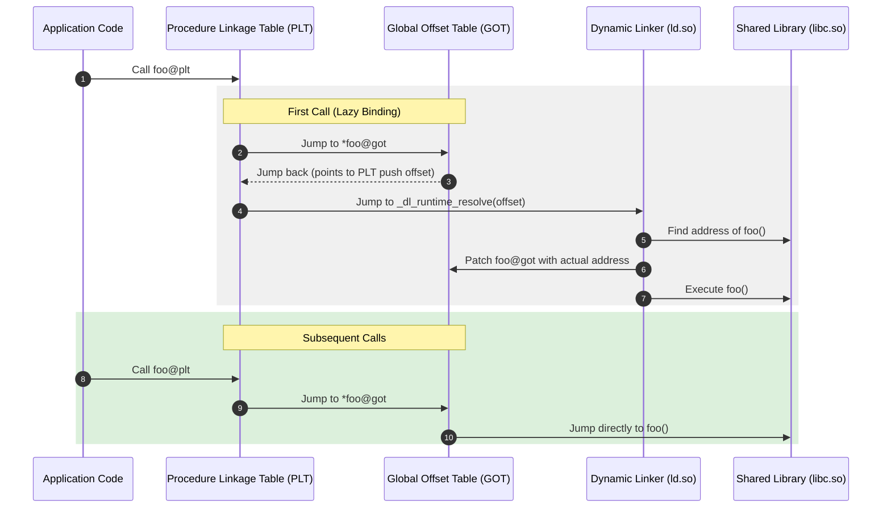

Dynamic linking is one of those systems abstractions we take completely for granted. We write a program, import a shared library, call a function, and everything just works. But under the hood, the compiler has no idea where that shared library function will live in memory at runtime. It cannot hardcode a target address. It cannot even assume a fixed memory offset because security mechanisms like Address Space Layout Randomization shuffle memory mappings around on every process startup.

To make this dynamic environment work, the system relies on the dynamic linker, typically ld.so on Linux systems. This engine acts as a runtime patcher. It is responsible for locating shared libraries, parsing their exported interfaces, mapping them into the address space of our process, and rewriting memory locations so that calls resolve to the correct machine code. This dance depends on two vital structures in the Executable and Linkable Format, or ELF binary, which are the Procedure Linkage Table and the Global Offset Table.

To understand how these pieces cooperate, we have to look at the conflict between sharing memory and updating references. In modern operating systems, we want to share the code segment of shared libraries like libc across multiple processes to conserve physical RAM. If ten running processes use the exact same shared library, the operating system maps a single copy of that library's executable code pages into physical memory, while giving each process its own virtual mapping.

This memory efficiency creates a strict requirement. The executable code pages must be Position Independent Code. They cannot contain any absolute memory references that change depending on where the library is loaded, and they must remain strictly read-only. If the code pages are read-only, we cannot have the dynamic linker update a call instruction to point to the resolved address of a function. The solution is to separate the immutable code from the mutable data. The immutable code resides in the text segment, while the dynamic references reside in a writable data segment that is private to each process.

The Global Offset Table lives in the writable data segment of the ELF binary. It acts as a table of absolute pointers. Every time our code needs to call an external function or access an external global variable, it does not do so directly. Instead, it queries the Global Offset Table for the absolute address of that asset. Since the table resides in a writable data segment, the dynamic linker can safely overwrite these pointers at runtime without violating memory protections or breaking page sharing across processes.

But lookups are slow if we resolve every single dependency at startup. A complex application might link against dozens of libraries, importing thousands of symbols that might never be called during a particular run. For example, an error handling function might only be executed once in a rare edge case. Resolving that symbol on startup is a waste of CPU cycles. To optimize startup latency, the dynamic linker defaults to lazy binding. It delays the resolution of any function address until the exact moment that function is executed for the very first time.

This lazy resolution mechanism is driven by the Procedure Linkage Table. The table resides in the read-only text segment and contains small stubs of executable code for every dynamic function we call. When we compile a program that calls an external function named write, the compiler generates a call instruction targeting write@plt in our text segment.

When we execute that call instruction for the first time, execution jumps to the PLT stub for write. The first instruction inside write@plt is an indirect jump to the address stored in the corresponding slot of the Global Offset Table, which we call write@got.

If the function has never been called before, the value stored in write@got does not point to the real write function. It actually points directly back to the very next instruction inside the write@plt stub. By jumping back to the PLT stub, the CPU executes the instruction immediately following the initial jump. This instruction pushes a relocation offset onto the stack, which uniquely identifies the write symbol within the relocation tables of the ELF binary.

Directly after pushing this offset, the PLT stub jumps to a special common entry point at index zero of the Procedure Linkage Table. This common PLT code pushes a pointer to a data structure called the link map onto the stack. The link map is a linked list managed by the dynamic linker that describes every shared object loaded into the process address space. Finally, the common PLT code jumps to the dynamic linker's symbol resolver function, which is named _dl_runtime_resolve.

This resolver function acts as the runtime system assembler. It pulls the relocation offset and the link map pointer off the stack. It uses the relocation offset to index into the relocation table, finding the name of the symbol we want to resolve. It then iterates through the link map list, searching the symbol tables of the loaded libraries until it finds a matching symbol with the name write.

Once the resolver finds the target symbol, it calculates its absolute virtual address in memory. It then performs the runtime patch by writing this absolute address directly into the write@got slot in our Global Offset Table. To finish the operation, the resolver jumps directly to the newly resolved write function, passing along whatever arguments were originally placed in the registers by the caller.

When the program subsequently calls write again, the flow changes. The call jumps to write@plt, which executes the indirect jump to the address stored in write@got. Because the dynamic linker patched write@got during the first invocation, the jump immediately transfers control to the actual write function in libc. The dynamic linker is completely bypassed on all future calls, reducing the overhead of dynamic calling to a single indirect jump instruction.

This lazy resolution mechanism is highly efficient but introduces a severe security vulnerability. Because the Global Offset Table must remain writable during program execution to allow the dynamic linker to write resolved addresses, it becomes a prime target for exploits. An attacker who exploits a memory safety vulnerability, like a buffer overflow, can overwrite entries in the Global Offset Table. By swapping out the address of a standard library function like printf with the address of system or a custom shellcode buffer, the attacker can hijack the entire execution flow of the process.

To mitigate this threat, modern systems implement a security feature known as Relocation Read-Only, or RELRO. There are two levels of RELRO protection. Partial RELRO rearranges the internal structure of the ELF binary so that the Global Offset Table is placed before other writable program data, preventing simple buffer overflows from reaching it. However, the table itself must still remain writable for lazy binding to function.

Full RELRO completely eliminates the security risk of writable pointer tables by forcing the dynamic linker to resolve all symbols immediately at startup. This means the linker bypasses lazy binding entirely, traversing the entire list of imported symbols and patching every single entry in the Global Offset Table before the main function of the application even begins. Once this initialization phase is complete, the dynamic linker calls the mprotect system call to mark the entire Global Offset Table as read-only. Any subsequent attempt to write to the table will trigger a segmentation fault, rendering the GOT injection attack vector useless.

This security trade-off is clear. Full RELRO protects the binary against GOT overwrite attacks, but it shifts the performance penalty of symbol resolution to the startup phase of the process. For short-lived CLI utilities, this startup latency can be noticeable. For long-running server daemons or containerized backend microservices, the security benefits of Full RELRO almost always outweigh the minor startup delay.

Beyond performance and security, the design of the dynamic linker provides immense flexibility for system administration and debugging through environment variables. The most powerful of these is LD_PRELOAD. This variable tells the dynamic linker to load a specified list of shared libraries before any other libraries in the dependency tree are processed.

When the dynamic linker resolves a symbol, it searches the loaded libraries sequentially in the order they appear in the link map. If a symbol is found in an earlier library, the search stops. By injecting a custom library at the absolute front of this chain, we can intercept and override standard system functions. If we write a shared library that implements our own version of malloc and load it via LD_PRELOAD, any allocation call made by the application will run our custom allocator instead of the standard implementation in libc. This capability is used extensively by memory debuggers, performance profilers, and sandboxing runtimes to instrument application behavior without recompiling the binary.
