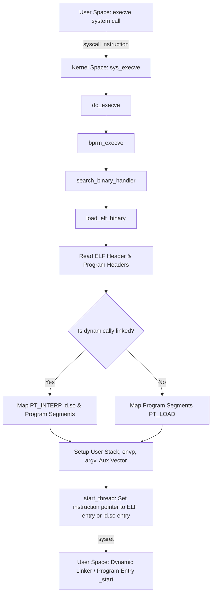

You type a command into your shell and press enter. In less than a millisecond, a new process starts, executes, and returns a result. Most software engineers know this involves the fork and execve system calls. But if you look under the hood of the Linux kernel, this transition is a complex dance of binary structure parsing, virtual memory mapping, security boundaries, and instruction pointer swapping. 

When a program executes, it does not just magically load into memory. The kernel must parse a structured file, establish a memory layout, spin up a dynamic runtime linker, and jump from kernel mode back to user mode at the exact starting instruction. Understanding this process exposes how the operating system bridges the gap between static binaries on a disk and running instructions in a CPU.

### The Entry Point: Triggering sys_execve

The entire process begins when user space calls the execve system call, passing the file path, argument vectors, and environment variables. This traps the CPU into kernel mode via an interrupt handler. Inside the kernel, the execution routes to the sys_execve function, which quickly delegates to the core helper function do_execve.



The kernel allocates a critical workspace structure called linux_binprm. This structure acts as a temporary scratchpad. It stores the path of the file, the first hundred or so bytes of the binary, pointer tracks for command line arguments, and the environment variables. The kernel must read these initial bytes from the file because it needs to determine the executable format. Linux supports multiple binary formats, not just ELF files. It can run interpreted scripts starting with shebangs, legacy formats, or specialized environments. The kernel determines the binary type by running through a registered list of binary format handlers until one claims the file.

### Formats and the ELF Blueprint

The handler for standard compiled binaries is the Executable and Linkable Format, or ELF loader, defined in fs/binfmt_elf.c. The ELF format is highly structured. It contains an ELF header followed by program headers and section headers. Section headers are for linkers during compile time, while program headers are what the kernel loader actually cares about.

```
+-----------------------------------------------+
|                  ELF Header                   |
|  - Magic number (0x7F 'E' 'L' 'F')            |
|  - Entry Point Address                        |
|  - Program Header Table Offset                |
+-----------------------------------------------+
|             Program Header Table              |
|  - Segment 1: PT_PHDR (Header metadata)        |
|  - Segment 2: PT_INTERP (Linker path)         |
|  - Segment 3: PT_LOAD (Read-only text/data)   |
|  - Segment 4: PT_LOAD (Read-write data)       |
|  - Segment 5: PT_GNU_STACK (Stack execution)  |
+-----------------------------------------------+
|               Segment Payload                 |
|  - Executable machine code (.text)            | 
|  - Read-only constants (.rodata)              |
|  - Initialized variables (.data)              |
+-----------------------------------------------+
```

The very first bytes of the file must match the ELF magic number, which is 0x7F followed by the letters E, L, and F. The binary handler reads this magic check first. If it matches, the handler casts the raw bytes to the elfhdr struct to read critical metadata. This metadata includes the target architecture, whether the binary is 32-bit or 64-bit, the location of the program header table, and the entry point address of the executable. 

Next, the loader parses the Program Header table. The program headers describe segments, which are the logical chunks of memory the process needs to run. The most important segment types are PT_LOAD and PT_INTERP.

A PT_LOAD segment defines an area of virtual memory that must be mapped from the binary file into the process's address space. It contains flags specifying read, write, and execute permissions. 

A PT_INTERP segment specifies the path to a program that acts as the dynamic linker, typically something like /lib64/ld-linux-x86-64.so.2. If this segment is present, the binary is dynamically linked and cannot run on its own. The kernel must load both the binary and the interpreter, handing control to the interpreter first.

### Mapping the Virtual Address Space

Once the ELF header is verified, the kernel decides it is time to throw away the state of the calling process. It clears out the old memory mappings, flushing the page tables and freeing physical memory pages. This is the point of no return. If the loader fails after this, the process is killed.

The kernel then maps the PT_LOAD segments using the vm_mmap function. Instead of reading the entire file into physical RAM, the kernel sets up virtual memory mappings that point to the file on disk. These mappings use the MAP_PRIVATE flag. Memory pages are only populated with actual data when the CPU attempts to execute code or read memory, triggering page faults that lazily read the physical sectors from the drive. 

The loader maps the text segment, which contains executable code, as read-only and executable. It maps the initialized data segment as read-write but not executable. Uninitialized data, known as the BSS segment, is mapped as zero-filled memory. The kernel allocates this block directly in RAM, satisfying the program's requirement for global variables that start at zero without wasting space in the physical file on disk.

At this point, the kernel also maps the vDSO, or virtual Dynamic Shared Object. This is a special shared library page provided by the kernel itself that is mapped into every user space process. It allows lightweight system calls, like getting the current time, to execute entirely in user space without incurring the performance penalty of a full transition into kernel mode.

### Crafting the Stack and the Auxiliary Vector

Before the process can run, the kernel must set up its initial stack. The loader allocates a new virtual memory region for the stack, usually at the top of the user address space. The stack grows downward, and the loader begins populating it from the bottom up.

The loader copies the command line arguments and environment variables onto the top of this newly allocated stack. It then pushes pointers to these values. But the most critical piece of data placed on the stack is the Auxiliary Vector, or auxv. This is an array of key-value pairs that the kernel uses to pass essential system information directly to the newly started user-space program. 

```
+-----------------------------------------------+
| High Memory Address (Top of Stack)            |
+-----------------------------------------------+
| Null terminator / Padding                     |
+-----------------------------------------------+
| Environment Strings (e.g., PATH=/usr/bin)     |
+-----------------------------------------------+
| Argument Strings (e.g., ./my_program)        |
+-----------------------------------------------+
| Auxiliary Vector (AT_PHDR, AT_ENTRY, etc.)    |
+-----------------------------------------------+
| Environment Pointers (envp array)             |
+-----------------------------------------------+
| Argument Pointers (argv array)                |
+-----------------------------------------------+
| Argument Count (argc)                         |
+-----------------------------------------------+ <--- RSP points here
| Low Memory Address                            |
+-----------------------------------------------+
```

The dynamic linker and the C library require this auxiliary vector to initialize themselves. The vector contains values like AT_PHDR, which points to the program headers in memory, AT_PAGESZ, which specifies the system page size, AT_ENTRY, which specifies the true entry point of the binary, and AT_RANDOM, which provides random bytes used to initialize stack protection values to prevent buffer overflow attacks.

### Dynamic Linking and Passing the Baton

If the binary is statically compiled, the loading process is nearly complete. The loader can jump straight to the entry point specified in the ELF header. But modern programs are almost always dynamically linked, relying on shared libraries like libc.so for core system calls.

For dynamically linked binaries, the kernel cannot jump directly to the program code because the external library functions are not loaded yet. The compiler leaves placeholders in the binary. When the kernel sees a PT_INTERP segment, it reads the path to the dynamic linker and loads that interpreter binary into the process's address space using the same mapping mechanisms. 

Instead of setting the CPU's instruction pointer to the program's entry point, the kernel sets it to the entry point of the dynamic linker. The dynamic linker is itself a special, self-contained ELF binary that can run without external dependencies. 

When the dynamic linker starts, it reads the auxiliary vector from the stack to find the program headers of the main binary. It parses these headers to find the list of shared libraries the program needs. It then loads these libraries into memory, resolving symbols and rewriting the binary's global offset table so that calls to functions like printf point to the correct locations in the newly mapped libc.so memory.

### The Final Leap: start_thread

With the address space mapped, the stack prepared, and the dynamic linker ready, the kernel must return the CPU to user mode. It does this by calling the start_thread function.

This function manipulates the registers of the current kernel task. It modifies the saved CPU state stored on the kernel stack during the system call entry. It sets the Instruction Pointer register (RIP on x86-64) to point to either the main program's entry point for static binaries, or the dynamic linker's entry point for dynamic binaries. It sets the Stack Pointer register (RSP) to point to the bottom of the user stack we just built. It also clears all other general-purpose registers to make sure no sensitive kernel data leaks into user space.

Once the registers are configured, the kernel executes a low-level return instruction, such as sysret or iret. This instruction drops the CPU privilege level from Ring 0 to Ring 3 and jumps to the address loaded into the instruction pointer register. The CPU begins executing instructions in user space, starting the process lifecycle.
