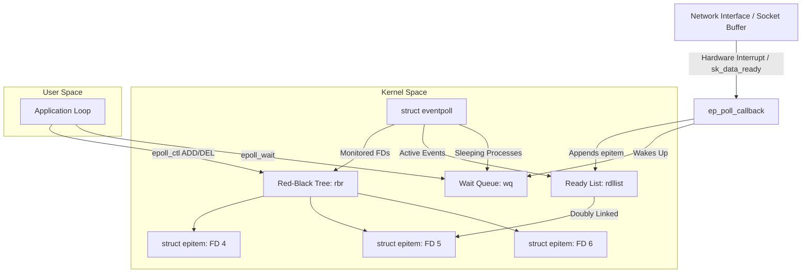
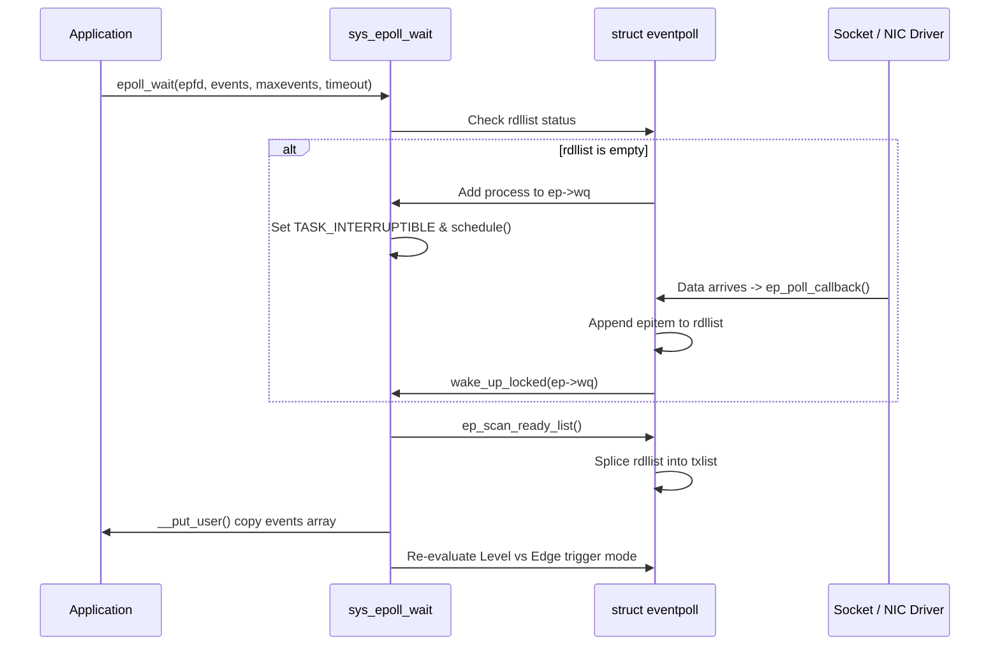

High-performance network servers in Linux rely on event-driven I/O multiplexing to handle hundreds of thousands of concurrent connections. Early abstractions like select and poll degraded significantly as file descriptor counts grew because their runtime complexity scaled linearly with the number of monitored files. The kernel had to iterate through every descriptor on every invocation, copying memory back and forth between user and kernel space. Epoll solved this scalability bottleneck by changing the algorithmic complexity of event notification from O(N) to O(1).

To understand why epoll achieves this efficiency, one must look directly at its implementation inside the Linux kernel source code. Instead of passing an entire array of file descriptors on every syscall, epoll maintains state inside the kernel. It decouples the state modification from event wait operations, backed by precise data structures that react directly to hardware interrupts and socket queue transitions.

### The Core Kernel Data Structure: struct eventpoll

When a process calls epoll_create, the kernel initializes a kernel-side object represented by struct eventpoll in fs/eventpoll.c. This structure acts as the container holding all monitoring contexts, locks, and queues needed for operation. Inside this structure, two main data structures govern performance.

The first structure is the Red-Black tree, stored in the rbr field. Every file descriptor added to the epoll instance is wrapped inside a struct epitem and inserted into this red-black tree. The search key for this self-balancing binary search tree is a combination of the file descriptor number and its underlying kernel file structure pointer. Using a red-black tree allows the kernel to perform lookup, insertion, and deletion of monitored file descriptors in O(log N) time, preventing duplicate registrations and enabling quick modifications during epoll_ctl calls.

The second structure is the Ready List, stored in the rdllist field. This is a doubly linked list containing references only to those struct epitem instances that have experienced active I/O events, such as incoming TCP data or write buffer availability. While the red-black tree tracks all registered descriptors regardless of state, the ready list contains exclusively the subset of descriptors ready for immediate processing.

### Registration and Callback Hooking via epoll_ctl

Adding a file descriptor using epoll_ctl with the EPOLL_CTL_ADD operation executes the kernel function ep_insert. During this execution, the kernel allocates a new struct epitem from a dedicated slab cache. This structure holds references to the target file pointer, the file descriptor integer, the requested event mask like EPOLLIN or EPOLLOUT, and link nodes for both the red-black tree and the ready list.

To detect state changes efficiently without polling, epoll attaches a custom wait callback mechanism to the target file. It calls the poll file operation of the underlying driver or socket subsystem, passing a custom poll table containing a function pointer to ep_ptable_queue_proc. This function installs ep_poll_callback as the primary event handler on the underlying device or socket wait queue.

By registering ep_poll_callback directly on the file descriptor's native kernel wait queue, epoll establishes an event-driven interrupt pathway. The kernel does not scan the file descriptors continuously. Instead, it registers an explicit reverse-dependency callback that executes automatically when the file's internal queue receives an update event.

### Processing Inbound Interrupts: ep_poll_callback

When network packets arrive at a network interface card, the hardware generates an interrupt. The NIC driver processes the ring buffer and pushes the data into the socket's receive queue. Upon queuing new sk_buff structures into the socket, the network stack invokes the socket data notification function, typically sk_data_ready.

This function wakes up elements on the socket's wait queue, triggering ep_poll_callback. The kernel passes the wait queue entry to this callback, which allows it to resolve the parent struct epitem using the container_of macro. Once ep_poll_callback obtains the epitem, it performs several atomic operations.

First, it acquires the internal spinlock protecting the eventpoll instance. Next, it checks if the epitem is already attached to the ready list by inspecting its list node status. If the epitem is not currently on the ready list, ep_poll_callback inserts it into the rdllist doubly linked list. Finally, it checks if any threads are currently blocked on the eventpoll wait queue, stored in ep->wq. If waiting threads exist, ep_poll_callback issues a wake-up signal to wake the sleeping tasks and move them to the CPU scheduler's runqueue.

### Event Extraction: epoll_wait Processing Mechanics

When an application calls epoll_wait, control transfers to the kernel function sys_epoll_wait, which delegates execution to ep_poll. The system call provides a pointer to a user-space buffer of struct epoll_event and a timeout value.

Inside ep_poll, the kernel acquires the eventpoll lock and checks whether the rdllist ready list is empty. If the list contains elements, epoll moves directly to event extraction. If the ready list is empty and the timeout is non-zero, the calling thread adds itself to the epoll wait queue ep->wq and updates its execution state to TASK_INTERRUPTIBLE.

The kernel then releases the lock and calls schedule to relinquish the CPU. The thread sleeps until either ep_poll_callback executes upon a driver interrupt or the specified timeout timer expires. Once awakened, the thread clears its wait state, reacquires the lock, and proceeds to clear the ready list.

To safely transfer events to user space, epoll uses ep_scan_ready_list. This function atomically detaches the entire ready list from ep->rdllist and moves its head to a temporary local list called txlist. Detaching the list under lock keeps the critical section extremely short, allowing fresh callbacks running concurrently on other CPU cores to continue appending new ready events to the primary rdllist without lock contention.

The kernel iterates through the temporary txlist, mapping each struct epitem back to a struct epoll_event. It uses __put_user or copy_to_user to copy the event bitmask and the user data payload directly into the memory buffer supplied by the application in user space.

### Edge-Triggered Versus Level-Triggered State Transitions

The behavior of epoll during event extraction depends heavily on whether descriptors are registered with Level-Triggered (default) or Edge-Triggered (EPOLLET) flag semantics.

In Level-Triggered mode, epoll behaves similarly to traditional poll. During ep_scan_ready_list, after an event is copied to user space, the kernel invokes the item's poll file operation once more to query the current hardware or socket buffer state. If the underlying resource still satisfies the event condition—for instance, if unread bytes remain in the socket receive buffer—the kernel immediately re-inserts the struct epitem back into the main rdllist ready list. Consequently, the subsequent call to epoll_wait will return immediately without blocking, notifying user space again that data remains available.

In Edge-Triggered mode, the kernel omits this re-query and re-insertion step. Once the item's event details are copied to user space, the struct epitem is completely removed from the ready list, regardless of whether unread data remains inside the socket buffer. The kernel will not place this epitem back onto the ready list until a brand-new state transition occurs at the driver level, such as the arrival of a new network packet. Applications using edge-triggered mode must perform non-blocking I/O reads or writes in a continuous loop until the system call returns EAGAIN or EWOULDBLOCK. Failing to drain the buffer completely results in stalled event processing, as the kernel will not generate another notification for data that was already enqueued.

### Scalability Characteristics and Memory Overhead

The performance advantage of epoll stems directly from this architectural divide between descriptor tracking and readiness tracking. In select and poll system calls, the kernel must parse user-supplied arrays on every invocation, leading to O(N) memory copying and scanning overhead.

In epoll, state registration occurs once via O(log N) red-black tree insertion. Subsequent wait operations execute in O(K) time, where K is the number of file descriptors that are actually active during that wake-up cycle. If a application monitors 500,000 connections and only 10 receive data, epoll processes exactly 10 epitem references, avoiding any iteration across the remaining 499,990 idle streams.

This architecture comes at the expense of kernel memory usage. Every monitored descriptor requires a persistent struct epitem allocation along with dynamic allocation of wait queue entries inside slab memory. For high-scale backend services, this memory footprint is a precise and worthwhile trade-off, enabling massive concurrency while keeping CPU utilization predictable and minimal.