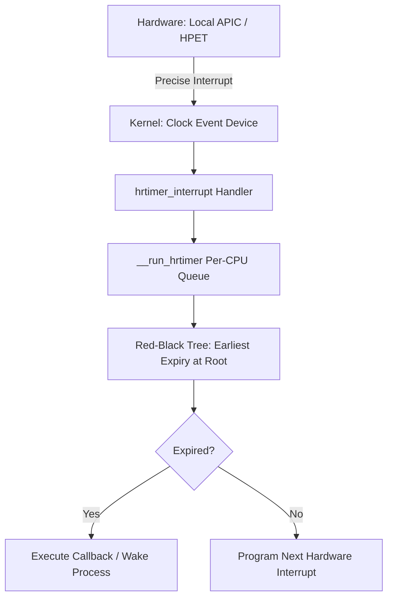

Most developers treat a sleep call like a simple delay. You tell the thread to wait for ten milliseconds, and you expect it to wake up exactly ten milliseconds later. In reality, you are at the mercy of the Linux kernel timing subsystem, which has undergone a massive architectural shift over the last decade. For years, the kernel relied on a periodic heartbeat known as the tick. This was a hardware interrupt fired by the Programmable Interval Timer at a fixed frequency, usually 100Hz or 1000Hz. If your kernel was compiled with HZ set to 100, the tick happened every 10ms. This was the fundamental unit of time, the jiffy. If you wanted to sleep for 1ms, you were out of luck. You would wait until the next jiffy, which could be up to 10ms away.

This legacy approach was simple but fundamentally broken for modern hardware. It forced the CPU to wake up constantly just to increment a counter, even if nothing was happening. This killed battery life and introduced massive jitter for real-time tasks. The solution was a two-pronged attack: the introduction of high-resolution timers, known as hrtimers, and the move toward a tickless kernel, or NO_HZ. Instead of the kernel asking the hardware to interrupt it every few milliseconds, the kernel now calculates exactly when the next event needs to happen and programs the hardware to interrupt it only at that precise moment.

At the core of the hrtimer subsystem is a shift in data structures. The old timer system used a timer wheel, which was essentially a set of linked lists that grouped timers by their expiry time. This worked well for coarse-grained timeouts but lacked the precision needed for nanosecond-level tracking. The hrtimer system replaces this with a per-CPU Red-Black tree. Every timer is a node in this tree, sorted by its absolute expiry time in nanoseconds. The kernel always knows that the leftmost node in the tree is the next one that needs to fire. This allows the kernel to achieve nanosecond resolution because it is no longer bound by the fixed frequency of the jiffy. It simply looks at the root of the tree, sees that the next timer expires in 42 microseconds, and sets the local APIC timer to fire in exactly 42 microseconds.

The transition to NO_HZ, or the tickless kernel, is what really changed the game for power consumption and virtualization. In a standard periodic kernel, the CPU is interrupted constantly even if it is idle. With NO_HZ_IDLE, the kernel stops the periodic tick as soon as the CPU goes idle. It calculates the next wake-up time for the nearest timer and goes to sleep until then. This is why your laptop doesn't melt while sitting on the desktop. The kernel takes it a step further with NO_HZ_FULL, which is often used in high-frequency trading or HPC workloads. In this mode, the tick is suppressed even when a single task is running on a core, which eliminates the jitter caused by the kernel interrupting the userspace process just to check if it's still there.

Management of these timers is handled through a hierarchy of abstractions. At the bottom, you have clocksource devices, which are hardware counters like the Time Stamp Counter or the High Precision Event Timer. These provide the raw time. Above them are clock_event_devices, which are the hardware components capable of generating interrupts at a specific time. The hrtimer code sits on top of these, providing a unified API for the rest of the kernel. When you call a nanosleep in C or use a Task.Delay in .NET, the syscall eventually lands in the hrtimer code. It allocates a timer, sets the expiry, and inserts it into the Red-Black tree. If the new timer is now the earliest one in the tree, the kernel immediately reprograms the hardware timer to ensure the wakeup happens on time.

Precision still isn't perfect because of the overhead of the interrupt handler and the scheduling latency. When the hardware interrupt fires, the kernel has to stop what it's doing, save state, run the handler, and then decide which process to run next. This is why even with hrtimers, a sleep of 10 microseconds might take 15. The kernel tries to mitigate this with a feature called timer slack. By allowing a small window of error, the kernel can group multiple timers that expire around the same time into a single hardware interrupt. This is a pragmatic trade-off. It reduces the total number of interrupts and saves power, while still providing much higher precision than the old 10ms jiffy ever could. If you are building low-latency systems, you have to understand this dance. You aren't just calling a function, you are interacting with a complex event-driven state machine that is constantly re-evaluating the timeline of the entire system.
