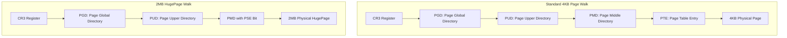
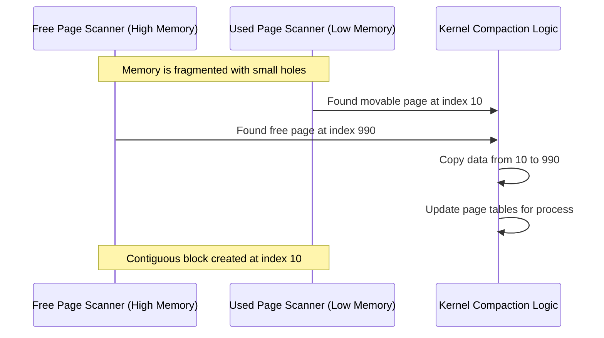

Your CPU is a speed freak, but it is constantly being tripped up by the very memory it is supposed to be processing. Every time your code touches a pointer, the hardware has to figure out where that virtual address actually lives in physical RAM. On a standard Linux setup, we do this using 4KB chunks. If you have a massive Postgres heap or a Java process eating 64GB of memory, you are looking at 16 million pages. The TLB, which is the tiny cache inside your CPU that remembers these mappings, is going to start sweating. This is why HugePages exist.

When we talk about HugePages, we are usually talking about 2MB or 1GB chunks of memory instead of the usual 4KB. By using larger pages, we reduce the number of entries the TLB needs to track. If you increase the page size from 4KB to 2MB, you are reducing the metadata overhead by a factor of 512. This does not just save a bit of RAM. It significantly cuts down on TLB misses. A TLB miss is a disaster for performance because it forces the CPU to perform a page table walk, which means hitting the main memory multiple times just to find the address of the data you actually wanted to read.

### The Anatomy of the Page Table Walk

To understand why HugePages help, you have to look at how the kernel finds an address. In a standard 64-bit system with 4KB pages, the kernel uses a four level page table. The CPU starts at the CR3 register and traverses the Page Global Directory, the Page Upper Directory, the Page Middle Directory, and finally the Page Table Entry. Each step is a memory lookup. When you use 2MB HugePages, the kernel stops at the Page Middle Directory. It sets a special bit called the Page Size Extension (PSE) which tells the hardware that this entry points directly to a 2MB block of physical memory rather than another table. This skips an entire level of the tree and reduces the pressure on the hardware caches.

There are two main ways the kernel handles this. The first is through explicit HugePages via the hugetlbfs. This is the manual way where you tell the kernel to reserve a specific number of pages at boot or runtime. Applications then have to specifically ask for this memory using mmap with the MAP_HUGETLB flag. This is what you see in high performance databases like Oracle or Postgres. The memory is pinned, it cannot be swapped out, and it is always available. The downside is that it is rigid. If your application does not use it, that memory is just sitting there, wasted and unavailable to the rest of the system.

### Transparent HugePages and the Khugepaged Daemon

Because manual configuration is a pain, the kernel introduced Transparent HugePages or THP. This is an attempt to make the performance benefits of HugePages available to every application without changing a single line of code. The kernel tries to allocate 2MB pages whenever possible behind the scenes. If a process asks for memory and a contiguous 2MB block is available, the kernel hands it over. If it cannot find a contiguous block immediately, it falls back to 4KB pages and lets a background thread called khugepaged fix things later.

Khugepaged is the unsung hero of the memory subsystem. It periodically scans the memory of running processes and looks for areas where 512 contiguous 4KB pages are being used. It then tries to collapse them into a single 2MB HugePage. This is a heavy operation. It requires grabbing locks on the memory management structures and potentially moving data around. If your system is under heavy memory pressure, THP can actually hurt performance because the kernel might stall your process while it tries to find or create a HugePage for you. This is why many database administrators tell you to disable THP. They prefer the predictable latency of 4KB pages over the occasional massive performance spikes caused by khugepaged trying to be clever.

### The Compaction Engine

One of the biggest hurdles for HugePages is fragmentation. Physical memory starts out clean, but as processes allocate and free small chunks, it ends up looking like a block of Swiss cheese. You might have 100MB of free RAM, but if there is not a single contiguous 2MB hole, you cannot have a HugePage. To solve this, the kernel runs a process called memory compaction. 

Compaction works by using two scanners that move towards each other from opposite ends of a memory zone. The first scanner looks for used pages at the bottom of the memory that can be migrated. The second scanner looks for free pages at the top of the memory. When they meet, the kernel tries to move the used pages into the free slots at the top, which creates large contiguous blocks at the bottom. It is essentially a defragmentation tool for your RAM.

This migration is only possible for pages that are not pinned. If the kernel has given a page to a device for a DMA transfer or if it is being used for kernel internal structures, it cannot be moved. This is why long running systems often struggle to allocate HugePages over time. The memory becomes permanently fragmented by unmovable pages. You can see this in action by looking at /proc/buddyinfo, which shows you the count of available blocks at different sizes. If you see high numbers in the lower orders but zeros in the higher orders, your memory is fragmented and your CPU is likely paying the TLB tax on every single instruction cycle.
