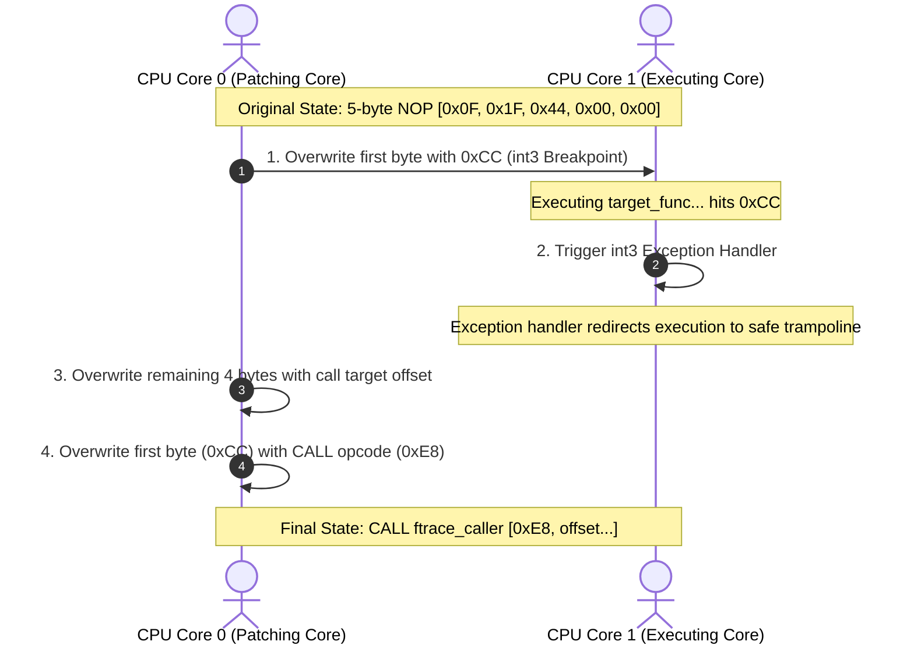
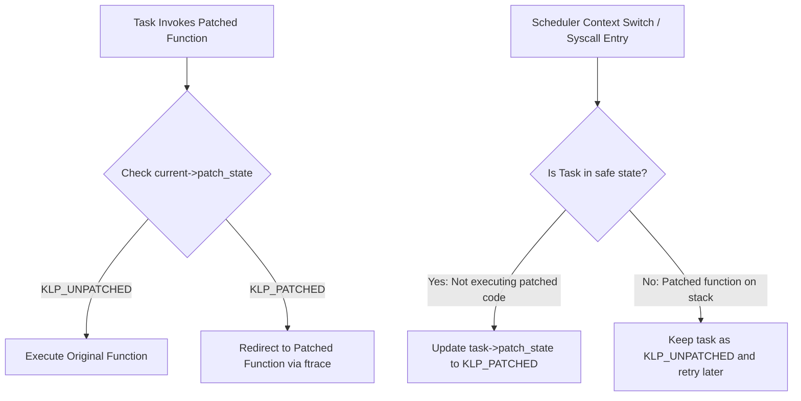

Rebooting a production server is an expensive operation. If you are running high-throughput web applications or databases with giant in-memory caches, dropping a node to apply a critical security patch degrades your capacity, flushes your CPU caches, and introduces latency spikes during warmup. For years, the Holy Grail of systems administration has been hot-patching. Applying security fixes to a running kernel without stopping a single process.

Linux achieves this feat through the kernel livepatch subsystem. This architecture combines compiler instrumentation, runtime machine-code rewriting, ftrace redirections, and stack state consistency machines. Underneath the clean API lies a raw, complex coordination between the CPU instruction cache and the scheduler.

### The Compiler Prep Work

You cannot patch a function at runtime if the compiler has not laid down the necessary hooks during the build phase. When you compile a modern Linux kernel, the build system passes specific flags to GCC or Clang. Most notably, it uses the options `-pg` and `-fentry`. 

Historically, the `-pg` flag was used for profiling, forcing the compiler to insert calls to a profiling routine at the entry of every function. Today, the kernel repurposes this mechanism for tracing and patching. When combined with the `-fentry` flag on architectures like x86-64, the compiler emits a five-byte call instruction pointing to a special hook named `__fentry__` before any local stack frame is set up or registers are pushed. 

If you inspect the disassembly of a standard kernel function, the very first instruction is not a push or a move. It is a direct call:

```assembly
callq <__fentry__>
```

A five-byte instruction is highly intentional. On x86-64, a direct call instruction consists of a single-byte opcode followed by a four-byte relative offset, totaling five bytes. This precise width is critical because it gives the kernel exactly enough contiguous bytes to overwrite the call with a relative jump or a native five-byte dummy instruction later on.

### Boot-Time Optimization

Leaving thousands of active call instructions to `__fentry__` scattered throughout the kernel would destroy performance. Every function execution would jump to a profiling stub, pollute the branch predictor, and add unnecessary memory references. 

To bypass this performance tax, the kernel performs a massive binary cleanup during early boot. The kernel build process uses a tool called `recordmcount` to parse all ELF object files, locate every single call to `__fentry__`, and compile their exact memory addresses into a dedicated table called `__mcount_loc`. 

During the early boot sequence, before the first user-space process starts, the kernel iterates through this table. It reaches into the raw machine code and overwrites every single five-byte `callq <__fentry__>` instruction with a native five-byte NOP instruction. On modern x86 processors, this is usually `0x0F, 0x1F, 0x44, 0x00, 0x00`, which the hardware decodes as a multi-byte NOP. The execution overhead drops to zero. The CPU decodes the NOP and executes it as a no-operation, keeping branch predictors and instruction pipelines happy. The hook remains dormant but perfectly preserved in memory, waiting to be activated.

### The SMP Safe Code Rewriting Problem

When you load a livepatch module, the kernel must replace those five-byte NOPs at the start of your target functions with a direct call to the livepatch engine. However, rewriting executable code on a live, multi-core system is a dangerous task. 

If CPU Core 0 is halfway through modifying a five-byte instruction while CPU Core 1 attempts to execute it, Core 1 will read a mixture of the old NOP bytes and the new call bytes. This torn write results in an invalid instruction, instantly triggering a General Protection Fault and causing a kernel panic.

To prevent this, the kernel uses a multi-step instruction-rewriting protocol involving breakpoint interrupts. This protocol is highly architecture-dependent, but on x86-64, it follows a strict sequence.



First, the patching thread replaces only the very first byte of the five-byte NOP with a single-byte breakpoint instruction, `0xCC`, which corresponds to the `int3` trap. Because it is only one byte, this write is guaranteed to be atomic. 

Second, if any other CPU core executes this function during the transition, it hits the `int3` breakpoint. The kernel's exception handler catches this trap, looks up the IP address, and immediately redirects the CPU's instruction pointer to a safe, pre-calculated emulation stub. 

Third, while execution is safely diverted via the breakpoint handler, the patching thread writes the remaining four bytes of the new instruction, representing the relative address offset of the target handler. 

Fourth, the patching thread overwrites the first byte, replacing the `0xCC` breakpoint with the actual `0xE8` call instruction opcode. The transition is complete. The kernel flushes the instruction caches across all online cores using an inter-processor interrupt (IPI). From this point on, any CPU executing the target function will hit the call instruction and jump directly into the ftrace subsystem.

### The Redirection Loop and ftrace Trampolines

The target of our newly patched call is not the new version of the function. Instead, it points to `ftrace_caller`, the entrypoint of the ftrace framework. The livepatch subsystem does not maintain its own parallel instruction routing engine, it builds directly on top of ftrace.

When a livepatch is registered, it defines a `klp_ops` structure associated with the target function and registers a custom ftrace callback called `klp_ftrace_handler`. When a thread invokes the patched function, execution flows through the modified hook, hits `ftrace_caller`, and is routed to our handler.

At this stage, the handler must redirect execution to the new patched function. Simply calling the new function from within the handler is not enough. That would push an extra frame onto the stack, and when the patched function returned, execution would fall back into the old function's body. We need a clean hijack of the execution context.

To achieve this, `klp_ftrace_handler` manipulates the saved CPU register state on the stack. The ftrace trampoline saves the caller's registers, including the Instruction Pointer (IP) and the return address. The livepatch handler locates this saved IP on the stack and overwrites it with the starting address of the patched function. 

When the ftrace trampoline executes its epilogue, restoring the register state and issuing a CPU return instruction, the CPU pops the modified IP off the stack. Instead of returning to the original function body, the execution flow is cleanly diverted directly to the first instruction of the new patched function. The old function is skipped entirely.

### The Consistency Model Battle

Redirecting execution is the easy part. The real engineering challenge of livepatching is consistency. If you change a function's behavior, you must ensure that the system does not enter a broken state where some threads are executing the old logic while others are executing the new logic.

Imagine a scenario where a kernel task is sleeping inside a function that is being patched. If that function calls a secondary helper function which is also part of the patch, and the kernel immediately swaps the code, the sleeping task could wake up, execute the new helper function, and return to the old parent function. This mix-and-match execution can lead to state corruption, deadlocks, or immediate crashes.

Historically, the kernel community split into two camps on how to solve this. The first approach, used by Ksplice, relies on a stop-machine model. It freezes all CPUs on the system, halting the scheduler. It then inspects the kernel call stack of every single task. If the target function is found on any stack, the patch is aborted, the CPUs are unfrozen, and the system tries again later. While safe, this introduces unpredictable latency spikes, which defeats the purpose of high-availability patching.

The second approach, pioneered by SUSE and Red Hat, is a lazy, per-task consistency model. This is the architecture currently merged into the mainline Linux kernel. Instead of forcing a global state transition, the kernel allows tasks to run in a split-brain state, but ensures that any individual task executes either entirely old code or entirely new code.

Every task struct in the kernel has a `patch_state` field. When a livepatch is loaded, the global transition state is set to active, but all tasks retain a state of `KLP_UNPATCHED`. The ftrace handler inspects the current task's `patch_state`. If the task is unpatched, the handler bypasses the redirection, running the old code. If the task is patched, it redirects execution to the new code.



The engine transitions tasks to the `KLP_PATCHED` state one by one, when they are in a safe state. A task is considered safe if it is not currently executing any of the functions targeted by the patch. The kernel detects these safe zones at key execution barriers. First, when a task returns from a system call to user space, its kernel stack is empty, making it completely safe to transition. Second, when a task is blocked and context-switches, the kernel inspects its stack. 

To perform this stack inspection efficiently without the overhead of heavy debugging formats, the kernel relies on the ORC (Oops Rollback Controller) unwinder. The ORC unwinder utilizes pre-compiled metadata tables generated at build time. These tables map every instruction address in the kernel to a simple set of lookup rules, allowing the livepatch system to walk active stack frames in microseconds. If the target function is not in the call stack, the task is marked as `KLP_PATCHED`.

Once every task on the system has transitioned to the new patch state, the transition is declared complete. The kernel writes a final state update, and the old functions are officially retired.

### Handling Data Layout Changes with Shadow Variables

What happens if your security patch requires changing a data structure? For example, adding a new flag to a structure to prevent a race condition. You cannot alter the memory layout of an allocated struct at runtime because every compiled instruction in the kernel expects specific member offsets.

To bypass this limitation, the livepatch subsystem implements a mechanism called shadow variables. Instead of modifying the physical structure in memory, the patch author allocates a parallel metadata structure in kernel space.

The livepatch API provides helper functions like `klp_shadow_get` and `klp_shadow_alloc`. These functions maintain an internal hash table, indexed by the memory address of the parent structure and a unique patch identifier. When the patched function needs to read or write the new member variable, it queries this hash table using the parent structure's pointer. 

This approach keeps the original structure's memory footprint completely untouched, preserving compatibility with any unpatched kernel code, while giving the patched functions a secure, isolated channel to store and retrieve runtime state.
