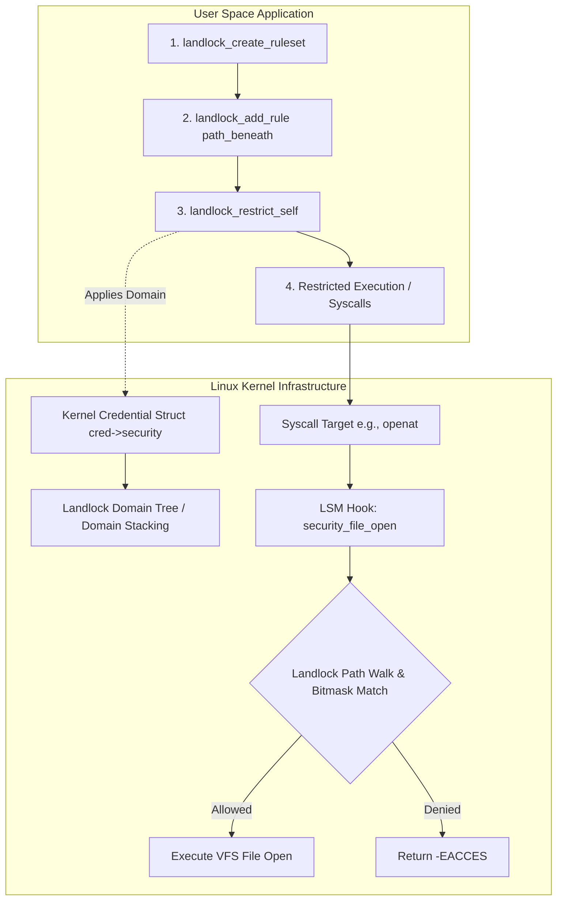
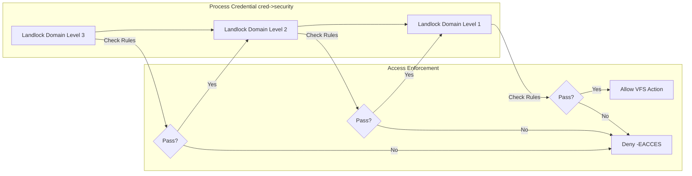

# Inside Linux Landlock LSM: Unprivileged Sandboxing, Ruleset Tree Evaluation, and Kernel Access Control

Securing applications on Linux has historically required making a difficult trade off. You either used process-level syscall filters like seccomp-bpf, which inspect raw system call arguments without understanding path semantics, or you relied on mandatory access control mechanisms like AppArmor and SELinux. The fundamental issue with traditional mandatory access control systems is privilege. Configuring AppArmor profiles or SELinux policies requires root access, administrator intervention, and out-of-band configuration files. If an unprivileged application wants to drop its own ambient authority at runtime, it simply cannot do so without external helpers or elevated capabilities.

Linux 5.13 introduced Landlock, a programmable Linux Security Module (LSM) designed specifically to fix this architectural gap. Landlock exposes a set of unprivileged system calls that allow any process, even one running without root capabilities or `CAP_SYS_ADMIN`, to construct a tailored access control ruleset and enforce it on itself and its future child processes. Landlock operates at the VFS and network layers, evaluating file system paths and network sockets directly within kernel security hooks.

Understanding how Landlock operates under the hood requires dissecting its kernel state management, how ruleset file descriptors translate into immutable domain structures attached to process credentials, and how path walks are evaluated against hierarchical bitmasks without crippling VFS performance.



## The Landlock Kernel State Pipeline

Landlock relies on three core system calls: `landlock_create_ruleset`, `landlock_add_rule`, and `landlock_restrict_self`. These system calls manage a lifecycle that transitions user space rules into immutable kernel structures.

When an application calls `landlock_create_ruleset`, the kernel allocates a `struct landlock_ruleset` object in kernel memory. This object acts as a staging area. The syscall takes a pointer to a `struct landlock_ruleset_attr`, which defines the masked access rights the ruleset intends to handle, such as `LANDLOCK_ACCESS_FS_READ_FILE` or `LANDLOCK_ACCESS_FS_WRITE_FILE`. The kernel returns a file descriptor pointing to an internal file struct whose private data holds the pending ruleset.

Populating the ruleset occurs through repeated invocations of `landlock_add_rule`. Userspace passes the ruleset file descriptor, a rule type identifier like `LANDLOCK_RULE_PATH_BENEATH`, and a attribute structure containing a file descriptor to a directory or file target along with allowed bitmasks. Inside the kernel, Landlock resolves the target file descriptor to a VFS path structure containing the specific `struct dentry` and `struct vfsmount`. It creates an internal rule node and inserts it into a Red-Black tree hanging off the ruleset. This structure allows the kernel to aggregate overlapping path definitions quickly before locking the policy down.

The final transition happens during `landlock_restrict_self`. This call transforms the staging ruleset into a domain. Landlock checks that the calling thread possesses the `NO_NEW_PRIVS` flag, set via `prctl(PR_SET_NO_NEW_PRIVS, 1)`. This check is critical. Without `NO_NEW_PRIVS`, a restricted process could execute a setuid binary to regain elevated credentials and bypass the sandbox. Once verified, Landlock compiles the ruleset into an immutable `struct landlock_domain`, increments its reference count, and attaches it directly to the process credentials structure via the `cred->security` pointer.

## Domain Stacking and Credential Management

Process credentials in the Linux kernel (`struct cred`) maintain pointers to security blobs used by LSMs. Landlock uses this pointer to store its current domain. A domain is an active, immutable set of rules governing a process.

One of the most powerful design choices in Landlock is domain stacking. Sandboxing is additive. A process can create a domain, apply it, run for a while, and later decide to further restrict itself by creating a second domain and applying that as well. Landlock does not overwrite the existing domain. Instead, it forms a linked chain of domains.



When `landlock_restrict_self` executes on a process that already has an active domain, Landlock creates a new domain struct whose parent pointer references the old domain. The new domain object inherits the hierarchy level count of its parent plus one. During any access check, Landlock traverses this stack from the most recent domain back to the root domain. To grant access to an action, every single domain in the stack must independently permit the operation. If a single layer in the stack denies access, the entire request fails immediately with `-EACCES`.

Inheritance across process clones and forks works automatically through kernel credential handling. When a process invokes `fork()`, the kernel duplicates the `struct cred`. Landlock increments the atomic reference counter (`refcount_t`) on the active `struct landlock_domain`. Child processes remain bound to the exact same security domain as their parent. Even if a process calls `execve()` to launch a completely new binary image, the credential structure and its associated Landlock domain stack persist across the execution boundary. The new binary runs inside the exact sandbox constructed by its parent.

## Kernel VFS Path Walking and Bitmask Evaluation Mechanics

Landlock's path evaluation logic triggers whenever a process executes a file system syscall, such as `openat`, `unlinkat`, or `renameat`. The VFS layer routes these requests through standard LSM hooks including `security_file_open`, `security_inode_unlink`, or `security_path_mkdir`.

When a hook fires, Landlock receives the target `struct path`, which consists of a `dentry` representing the directory entry and a `vfsmount` representing the mounted file system instance. Evaluating whether a process can access this path requires checking the target path against the rules embedded in the active domain stack.

Path evaluation in Landlock uses a bottom-up dentry traversal algorithm. File systems are hierarchical trees, but storing every accessible subpath in memory would consume massive amounts of RAM. Instead, Landlock stores rules only at the root dentry of the permitted path subtree. When an access check occurs on a file like `/var/log/app/output.log`, Landlock checks if there is a rule bound directly to that specific dentry. If no explicit rule matches, Landlock walks up the dentry parent pointers (`dentry->d_parent`), traversing upward toward the file system root.

During this upward walk, Landlock checks if the current dentry object matches any inode target indexed within the domain's rule tree. If a parent dentry matches an installed rule, Landlock extracts the allowed access bitmask for that node. It compares the requested access mask against the allowed access mask. If the requested access bits are fully satisfied by the allowed mask, evaluation for that domain layer succeeds.

```mermaid
graph BT
    File[Target File: /var/log/app/output.log] --> Parent1[Parent Dir: /var/log/app/]
    Parent1 --> Parent2[Rule Target: /var/log/ - Allowed: READ|WRITE]
    Parent2 --> Root[Root Dir: /]
    
    subgraph Traverser [Kernel Dentry Walk]
        File -- No Rule Matched --> Parent1
        Parent1 -- No Rule Matched --> Parent2
        Parent2 -- Rule Found! --> Check[Check Bitmask: Requested vs Allowed]
    end
```

To optimize performance and avoid infinite loops, Landlock terminates the parent traversal early under specific conditions. It stops if it reaches the root of the current mount point, if it hits a disconnect boundary, or if the requested access bitmask has been fully satisfied by accumulated layer permissions. Landlock caches security identification tags directly within file system inodes using kernel security blobs (`inode->i_security`), allowing fast-path lookups without repeatedly recalculating hash keys during high-frequency I/O operations.

## Hands-on C System Call Integration

To see how Landlock operates at the raw syscall level without external abstraction libraries, consider a C program that sandboxes itself. The program creates a ruleset, allows read and write operations strictly inside `/tmp`, applies the restriction, and verifies that accessing unauthorized paths like `/etc/shadow` fails.

```c
#define _GNU_SOURCE
#include <stdio.h>
#include <stdlib.h>
#include <fcntl.h>
#include <unistd.h>
#include <sys/syscall.h>
#include <sys/prctl.h>
#include <linux/landlock.h>
#include <linux/prctl.h>

#ifndef landlock_create_ruleset
static inline int landlock_create_ruleset(
    const struct landlock_ruleset_attr *const attr,
    const size_t size, const __u32 flags) {
    return syscall(__NR_landlock_create_ruleset, attr, size, flags);
}
#endif

#ifndef landlock_add_rule
static inline int landlock_add_rule(
    const int ruleset_fd, const enum landlock_rule_type rule_type,
    const void *const rule_attr, const __u32 flags) {
    return syscall(__NR_landlock_add_rule, ruleset_fd, rule_type, rule_attr, flags);
}
#endif

#ifndef landlock_restrict_self
static inline int landlock_restrict_self(const int ruleset_fd, const __u32 flags) {
    return syscall(__NR_landlock_restrict_self, ruleset_fd, flags);
}
#endif

int main(void) {
    struct landlock_ruleset_attr ruleset_attr = {
        .handled_access_fs = LANDLOCK_ACCESS_FS_READ_FILE |
                             LANDLOCK_ACCESS_FS_WRITE_FILE |
                             LANDLOCK_ACCESS_FS_READ_DIR
    };

    int ruleset_fd = landlock_create_ruleset(&ruleset_attr, sizeof(ruleset_attr), 0);
    if (ruleset_fd < 0) {
        perror("Failed to create landlock ruleset");
        return 1;
    }

    int target_fd = open("/tmp", O_PATH | O_CLOEXEC);
    if (target_fd < 0) {
        perror("Failed to open /tmp path");
        close(ruleset_fd);
        return 1;
    }

    struct landlock_path_beneath_attr path_beneath = {
        .allowed_access = LANDLOCK_ACCESS_FS_READ_FILE |
                          LANDLOCK_ACCESS_FS_WRITE_FILE |
                          LANDLOCK_ACCESS_FS_READ_DIR,
        .parent_fd = target_fd
    };

    if (landlock_add_rule(ruleset_fd, LANDLOCK_RULE_PATH_BENEATH, &path_beneath, 0) < 0) {
        perror("Failed to add path rule");
        close(target_fd);
        close(ruleset_fd);
        return 1;
    }
    close(target_fd);

    if (prctl(PR_SET_NO_NEW_PRIVS, 1, 0, 0, 0) < 0) {
        perror("Failed to set NO_NEW_PRIVS");
        close(ruleset_fd);
        return 1;
    }

    if (landlock_restrict_self(ruleset_fd, 0) < 0) {
        perror("Failed to restrict self");
        close(ruleset_fd);
        return 1;
    }
    close(ruleset_fd);

    int allowed_file = open("/tmp/test.txt", O_CREAT | O_RDWR, 0644);
    if (allowed_file >= 0) {
        printf("Successfully opened /tmp/test.txt\n");
        close(allowed_file);
    } else {
        perror("Unexpected failure opening /tmp/test.txt");
    }

    int denied_file = open("/etc/passwd", O_RDONLY);
    if (denied_file < 0) {
        perror("Successfully blocked access to /etc/passwd");
    } else {
        printf("Error: Accessed /etc/passwd despite sandbox!\n");
        close(denied_file);
    }

    return 0;
}
```

When this compiled binary executes, `landlock_create_ruleset` allocates the staging environment. Opening `/tmp` with `O_PATH` creates a file descriptor suitable for the path rule requirement without granting permission to modify directory contents prematurely. The `landlock_add_rule` call registers `/tmp` as a valid access root under `LANDLOCK_RULE_PATH_BENEATH`.

After invoking `prctl(PR_SET_NO_NEW_PRIVS)` and calling `landlock_restrict_self`, the kernel activates the domain. Any subsequent attempt to call `openat` on `/etc/passwd` causes the LSM hook `security_file_open` to traverse the dentry path of `/etc/passwd` back up to the root directory. Because `/etc/passwd` does not descend from `/tmp`, no matching rule is found. Landlock aborts the traversal and returns `-EACCES` to user space.

## Architectural Synergy: Landlock, Seccomp-BPF, and Namespaces

Landlock is not a replacement for seccomp-bpf or Linux namespaces. It is a complementary isolation layer designed to complete the defense-in-depth model for modern Linux applications.

Seccomp-bpf operates at the syscall entry point. It evaluates raw register values passed into system calls. Seccomp excels at reducing kernel attack surface by blocking entire syscall vectors, such as preventing a web server from calling `ptrace` or `kexec_load`. However, seccomp cannot safely inspect string pointers or file paths due to time-of-check to time-of-use (TOCTOU) race conditions. If a process passes a pointer to `/etc/shadow` in `O_RDONLY` mode, seccomp can only see the raw memory pointer address, not the path string it references inside user memory.

Landlock operates after the VFS layer resolves path pointers into verified kernel dentries. It eliminates TOCTOU races entirely because it evaluates security access directly on the resolved, pinned kernel dentries within LSM hooks.

Linux namespaces virtualize system resources like process IDs, network interfaces, and mount trees. Creating user or mount namespaces traditionally required complex setup, root privileges, or auxiliary setuid binary helpers like `newuidmap`. Landlock provides precise, programmable, unprivileged file system and network sandboxing directly inside application code without requiring ambient administrative tools or modified mount tables.

Combining these three mechanisms creates a robust sandboxing strategy. Applications use namespaces to isolate process visibility, seccomp-bpf to restrict raw syscall categories, and Landlock to enforce path-level and socket-level access rules directly from within the application entry point.
