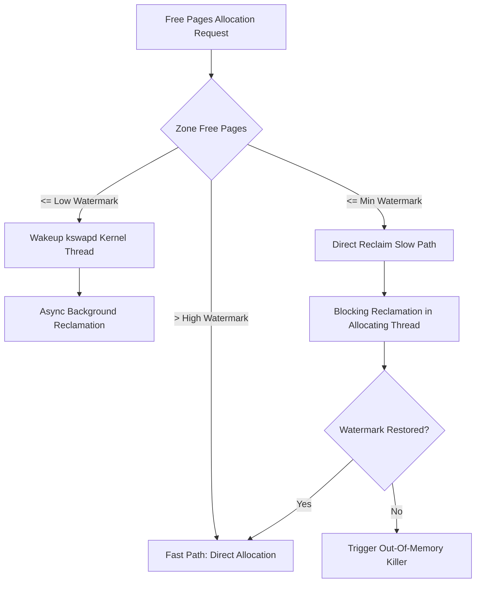
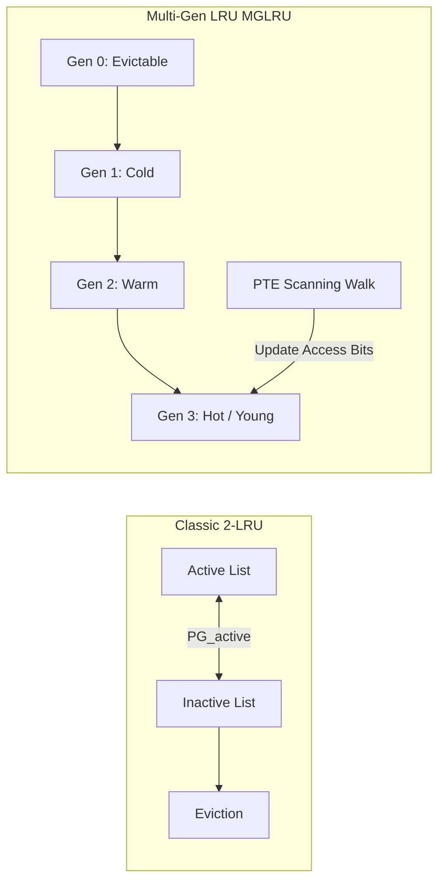
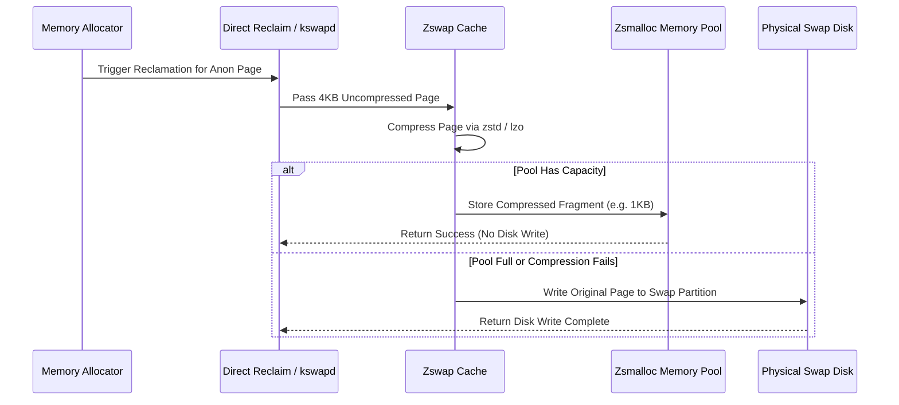

When an application requests physical memory on Linux, the kernel page allocator tries to satisfy the request immediately from free memory zones. Memory isn't infinite. As processes consume pages, free memory drifts down toward critical boundaries. Understanding how the Linux kernel reclaims memory requires peering into watermarks, scanning loops, compressed memory pools, and generational tracking algorithms.

### The Allocation Pressure Threshold: Watermarks and kswapd

The kernel organizes memory into zones like ZONE_DMA32 and ZONE_NORMAL. Each zone maintains three watermark thresholds known as min, low, and high. These values get calculated during boot based on system memory capacity and the vm.min_free_kbytes sysctl parameter. When allocation requests arrive, the kernel evaluates free pages against these boundaries. As long as free pages sit above the low watermark, allocations take the fast path without triggering background worker threads.

Once free memory dips below the low threshold, the kernel wakes up the kswapd thread for that zone. The kswapd thread runs asynchronously in the background, scanning page lists and freeing unreferenced memory to pull page counts back up to the high watermark. If memory consumption spikes faster than kswapd can reclaim, free pages drop past the min watermark. At this threshold, allocation requests stall inside the calling process. The kernel forces the allocating thread into direct reclaim mode, requiring it to synchronously execute page reclamation code before it can receive its requested memory. If direct reclaim fails to free enough contiguous pages, the system reaches allocation exhaustion and escalates to the kernel OOM killer.

### Classic Active/Inactive LRU Lists

For decades, the Linux kernel managed page eviction using two doubly-linked lists per zone: the active list and the inactive list. These lists exist separately for anonymous pages, which store process heap, stack, and anonymous mmap regions, and file-backed pages, which store cached file contents from disk. This separation yields four primary LRU lists per memory node, tracked as NR_ACTIVE_ANON, NR_INACTIVE_ANON, NR_ACTIVE_FILE, and NR_INACTIVE_FILE.

The kernel uses page frame flags PG_referenced and PG_active to track usage across these lists. Newly allocated file pages enter at the head of the inactive file list. When a process accesses a page in the inactive list a second time, the CPU sets the referenced bit or the kernel sets PG_referenced via software handlers. Upon observing a referenced page during a scan, the kernel sets PG_active and promotes the page to the head of the active list. Conversely, when the active list grows too large relative to the inactive list, the shrink_active_list function demotes colder active pages down to the inactive list, clearing PG_active.

Reclaiming pages from these lists follows distinct paths depending on whether the page is file-backed or anonymous. Reclaiming an inactive clean file page requires almost zero disk I/O because the kernel unmaps the page table entry and returns the physical page frame directly to the buddy allocator. Dirty file pages must first be written back to disk via writeback threads before reclamation. Anonymous pages lack underlying disk files, so reclaiming an anonymous page requires swapping. The kernel allocates a slot in a designated swap partition or swap file, writes the page memory to disk, updates the page table entry to a swap entry, and frees the physical page frame.

### The Flaws of Two-List LRU and the Birth of Multi-Gen LRU

While the classic two-list LRU served Linux well for years, modern workloads exposed fundamental architectural flaws. The traditional design relies on coarse access tracking where pages are either active or inactive. To determine if a page was recently used, the kernel relies on page faults or expensive reverse-mapping walks that scan every process page table pointing to that physical page frame. On systems with multi-terabyte RAM and thousands of containerized processes, reverse-mapping scans suffer severe lock contention on lruvec locks and generate massive CPU overhead. The heuristic that balances anonymous page swapping against file cache eviction frequently misjudges working sets, driving excessive swapping even when plenty of discardable file pages exist.

Multi-Gen LRU, or MGLRU, completely overhauls page reclamation by replacing binary active/inactive lists with an array of generational vectors. MGLRU organizes pages into multiple generation numbers, typically tracking four generations from youngest to oldest. Instead of acquiring global locks to move individual pages between two lists, MGLRU uses periodic page table entry scans to gather access bits directly from hardware page tables.

The MGLRU aging state machine uses PMD thread scanners alongside Bloom filters to optimize page table iterations. During an aging cycle, the kernel scans page table entries across active process address spaces, looking for entries with set access flags. Pages discovered with active hardware access flags get advanced to the youngest generation vector. Pages that receive no hardware hits naturally drift backward into older generations as time advances. When reclamation runs, the shrink_folio_list routine only scans pages in the oldest generation. This generation-based hierarchy eliminates lock contention on global LRU locks, avoids redundant reverse-mapping lookups, and provides precise working set estimation across mixed anonymous and file memory.

### Compressed Swap In-Memory: Zswap and Zram

Swapping anonymous pages directly to mechanical drives or flash storage incurs severe I/O latency spikes that destroy process throughput. To mitigate swap latency without sacrificing memory density, Linux provides compressed in-memory swap layers through zswap and zram.

Zswap operates as a transparent write-through compressed cache sitting between kernel page reclamation and physical swap devices. When the kernel decides to evict an anonymous page, it hands the page to the frontswap subsystem, which routes it into zswap. Zswap compresses the 4KB page using algorithms like zstd or lzo and stores the compressed payload in a dynamic RAM pool managed by allocators such as zsmalloc or z3fold. If the page is successfully compressed, the kernel skips physical disk I/O entirely.

The internal pool management of zswap relies on specialized memory allocators because standard kernel allocators struggle with variable-sized compressed fragments. Allocators like zsmalloc organize memory into size classes to minimize fragmentation and allow packing multiple compressed pages into a single physical page frame. If a process later faults on the swapped-out address, the kernel traps the page fault, retrieves the compressed payload from zswap, decompresses it back into a full 4KB page frame, and fulfills the request instantly without touching physical storage. When the zswap pool reaches its maximum configured capacity, it initiates writeback, decompressing the oldest cached entries and flushing them out to actual swap storage on disk.

### Direct Reclaim, Refault Detection, and OOM Escalation

When memory pressure escalates past kswapd background processing, threads executing direct reclaim enter do_try_to_free_pages. Direct reclaim forces user space allocation requests to pay the immediate performance cost of their own memory demands. The reclaiming thread steps through memory zones, attempting to balance page scanning across file and anonymous domains.

A critical challenge during heavy direct reclaim is thrashing, where pages are repeatedly reclaimed and immediately refaulted back into RAM from disk. To prevent thrashing, Linux implements working set protection using shadow entries stored inside page cache radix trees or XArrays. When a page gets evicted, the kernel stores an eviction timestamp inside the empty slot as a shadow entry.

If that page gets accessed again shortly after eviction, a page fault occurs and the kernel reads the shadow entry. By comparing the current time against the eviction timestamp stored in the shadow entry, the kernel calculates the precise duration the page spent evicted. If this eviction interval is shorter than the total size of the active working set, the kernel detects that the page was evicted prematurely due to excessive reclamation pressure. In response, the refault engine immediately promotes the re-faulted page directly to the active list or youngest generation, shielding active working sets from destructive eviction cycles.

If direct reclaim fails to free memory and free pages remain below the zone min watermark, the system can no longer allocate kernel data structures. At this critical breaking point, the page allocator invokes out_of_memory. The OOM killer computes score metrics based on process memory usage and badness heuristics, selecting and terminating a target process to release its physical pages back to the system.
